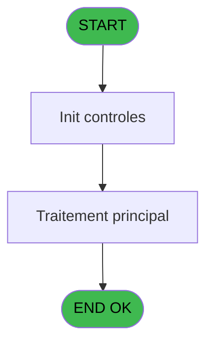

You are a software architect producing a design document for migrating a Magic Unipaas program to React/TypeScript.

Produce a JSON document following this EXACT structure:
```json
{
  "domain": "camelCaseDomainName",
  "domainPascal": "PascalCaseDomainName",
  "complexity": "LOW|MEDIUM|HIGH",
  "entities": [
    {
      "name": "EntityName",
      "fields": [
        {
          "name": "fieldName",
          "type": "string|number|boolean|Date",
          "source": "table.column",
          "nullable": false
        }
      ]
    }
  ],
  "stateFields": [
    {
      "name": "fieldName",
      "type": "TypeName[]",
      "default": "[]"
    }
  ],
  "actions": [
    {
      "name": "actionName",
      "params": [
        "param: type"
      ],
      "businessRules": [
        "Rule description"
      ],
      "returns": "Promise<void>"
    }
  ],
  "apiEndpoints": [
    {
      "method": "GET",
      "path": "/api/domain/resource",
      "queryParams": [
        "param?"
      ],
      "response": "ResponseType"
    }
  ],
  "uiLayout": {
    "type": "page-type",
    "sections": [
      {
        "name": "sectionName",
        "controls": [
          "control1"
        ]
      }
    ]
  },
  "mockData": {
    "count": 5,
    "description": "Description of mock data"
  },
  "dependencies": {
    "stores": [
      "useDataSourceStore"
    ],
    "sharedTypes": [],
    "externalApis": []
  }
}
```

IMPORTANT:
- Derive entity fields from actual DB column types when DB metadata is available
- Each business rule from the spec/contract MUST map to an action
- API endpoints should follow existing patterns: /api/{domain}/{resource}
- State fields must cover ALL data the UI needs to display
- Include isLoading, error, and filter states

PROGRAM SPEC:
# ADH IDE 152 - Recup Classe et Lib du MOP

> **Analyse**: Phases 1-4 2026-02-07 03:51 -> 03:36 (23h44min) | Assemblage 03:36
> **Pipeline**: V7.2 Enrichi
> **Structure**: 4 onglets (Resume | Ecrans | Donnees | Connexions)

<!-- TAB:Resume -->

## 1. FICHE D'IDENTITE

| Attribut | Valeur |
|----------|--------|
| Projet | ADH |
| IDE Position | 152 |
| Nom Programme | Recup Classe et Lib du MOP |
| Fichier source | `Prg_152.xml` |
| Dossier IDE | General |
| Taches | 3 (0 ecrans visibles) |
| Tables modifiees | 0 |
| Programmes appeles | 0 |
| Complexite | **BASSE** (score 0/100) |

## 2. DESCRIPTION FONCTIONNELLE

ADH IDE 152 - RECUP_CLASSE_MOP est un programme utilitaire critiquement utilisé dans la chaîne des ventes pour récupérer les informations de classification et de libellé d'un moyen de paiement (MOP) donné. Appelé par plus de 15 programmes différents (principalement des écrans de vente et d'impression), ce programme centralise la logique de lookup des MOP, évitant la duplication de code à travers les différents modules de transaction et d'édition. Il prend en entrée le code du MOP et retourne sa classification (UNI ou BI) ainsi que son libellé, informations essentielles pour le routage des transactions et l'affichage des reçus.

Le programme utilise deux tâches principales correspondant aux deux contextes d'utilisation : la tâche UNI pour les transactions en devise unique (opérations simples) et la tâche BI pour les transactions en devises multiples (change). Cette séparation permet une gestion différenciée des MOP selon que la transaction concerne une seule devise ou un échange. Les données proviennent de la table des moyens de paiement référencée (probablement dans REF.ecf), avec une architecture simple de type lookup sans calcul métier complexe, ce qui en fait un service de base robuste et performant pour toute la chaîne transactionnelle des ventes.

Son utilisation massive (15+ callers) souligne son rôle d'élément infrastructure fondamental : tout changement à sa logique ou à sa source de données affecte directement l'ensemble du processus de vente, des écrans de saisie aux éditions finales. Il est donc critique d'assurer sa stabilité et sa compatibilité avec les évolutions futures du référentiel MOP.

## 3. BLOCS FONCTIONNELS

### 3.1 Traitement (3 taches)

Traitements internes.

---

#### <a id="t1"></a>152 - (sans nom)

**Role** : Traitement interne.

---

#### <a id="t2"></a>152.1 - UNI

**Role** : Traitement interne.

---

#### <a id="t3"></a>152.2 - BI

**Role** : Traitement interne.


## 5. REGLES METIER

2 regles identifiees:

### Autres (2 regles)

#### <a id="rm-RM-001"></a>[RM-001] Condition: Param UNI/BI [D] different de 'B'

| Element | Detail |
|---------|--------|
| **Condition** | `Param UNI/BI [D]<>'B'` |
| **Si vrai** | Action si vrai |
| **Variables** | EQ (Param UNI/BI) |
| **Expression source** | Expression 1 : `Param UNI/BI [D]<>'B'` |
| **Exemple** | Si Param UNI/BI [D]<>'B' → Action si vrai |

#### <a id="rm-RM-002"></a>[RM-002] Condition: Param UNI/BI [D] egale 'B'

| Element | Detail |
|---------|--------|
| **Condition** | `Param UNI/BI [D]='B'` |
| **Si vrai** | Action si vrai |
| **Variables** | EQ (Param UNI/BI) |
| **Expression source** | Expression 2 : `Param UNI/BI [D]='B'` |
| **Exemple** | Si Param UNI/BI [D]='B' → Action si vrai |

## 6. CONTEXTE

- **Appele par**: [ Print ticket vente (IDE 234)](ADH-IDE-234.md), [ Print ticket vente LEX (IDE 235)](ADH-IDE-235.md), [ Print ticket vente PMS-584 (IDE 236)](ADH-IDE-236.md), [ Print ticket vente LEX (IDE 285)](ADH-IDE-285.md), [ Print ticket vente (IDE 323)](ADH-IDE-323.md), [Transaction Nouv vente avec GP (IDE 237)](ADH-IDE-237.md), [Transaction Nouv vente PMS-584 (IDE 238)](ADH-IDE-238.md), [Transaction Nouv vente PMS-721 (IDE 239)](ADH-IDE-239.md), [Transaction Nouv vente PMS-710 (IDE 240)](ADH-IDE-240.md), [Saisie transaction 154  N.U (IDE 307)](ADH-IDE-307.md), [Saisie transaction Nouv vente (IDE 310)](ADH-IDE-310.md), [Saisie transaction Nouv vente (IDE 316)](ADH-IDE-316.md), [Controle fermeture caisse WS (IDE 155)](ADH-IDE-155.md), [Saisie transaction 154 N.U (IDE 300)](ADH-IDE-300.md), [Print ticket vente/OD N.U (IDE 306)](ADH-IDE-306.md)
- **Appelle**: 0 programmes | **Tables**: 3 (W:0 R:2 L:1) | **Taches**: 3 | **Expressions**: 2

<!-- TAB:Ecrans -->

## 8. ECRANS

*(Programme sans ecran visible)*

## 9. NAVIGATION

### 9.3 Structure hierarchique (3 taches)

| Position | Tache | Type | Dimensions | Bloc |
|----------|-------|------|------------|------|
| **152.1** | [**(sans nom)** (152)](#t1) | MDI | - | Traitement |
| 152.1.1 | [UNI (152.1)](#t2) | MDI | - | |
| 152.1.2 | [BI (152.2)](#t3) | MDI | - | |

### 9.4 Algorigramme



> **Legende**: Vert = START/END OK | Rouge = END KO | Bleu = Decisions
> *Algorigramme auto-genere. Utiliser `/algorigramme` pour une synthese metier detaillee.*

<!-- TAB:Donnees -->

## 10. TABLES

### Tables utilisees (3)

| ID | Nom | Description | Type | R | W | L | Usages |
|----|-----|-------------|------|---|---|---|--------|
| 140 | moyen_paiement___mop |  | DB | R |   |   | 1 |
| 50 | moyens_reglement_mor | Reglements / paiements | DB | R |   |   | 1 |
| 89 | moyen_paiement___mop |  | DB |   |   | L | 1 |

### Colonnes par table (0 / 2 tables avec colonnes identifiees)

<details>
<summary>Table 140 - moyen_paiement___mop (R) - 1 usages</summary>

*Table utilisee uniquement en Link ou aucune colonne Real identifiee dans le DataView.*

</details>

<details>
<summary>Table 50 - moyens_reglement_mor (R) - 1 usages</summary>

*Table utilisee uniquement en Link ou aucune colonne Real identifiee dans le DataView.*

</details>

## 11. VARIABLES

### 11.1 Autres (6)

Variables diverses.

| Lettre | Nom | Type | Usage dans |
|--------|-----|------|-----------|
| EN | Param societe | Alpha | - |
| EO | Param MOP | Alpha | - |
| EP | Param Classe MOP | Alpha | - |
| EQ | Param UNI/BI | Alpha | 2x refs |
| ER | Param Libelle MOP | Alpha | - |
| ES | Param existence MOP | Logical | - |

## 12. EXPRESSIONS

**2 / 2 expressions decodees (100%)**

### 12.1 Repartition par type

| Type | Expressions | Regles |
|------|-------------|--------|
| CONDITION | 2 | 2 |

### 12.2 Expressions cles par type

#### CONDITION (2 expressions)

| Type | IDE | Expression | Regle |
|------|-----|------------|-------|
| CONDITION | 2 | `Param UNI/BI [D]='B'` | [RM-002](#rm-RM-002) |
| CONDITION | 1 | `Param UNI/BI [D]<>'B'` | [RM-001](#rm-RM-001) |

<!-- TAB:Connexions -->

## 13. GRAPHE D'APPELS

### 13.1 Chaine depuis Main (Callers)

Main -> ... -> [ Print ticket vente (IDE 234)](ADH-IDE-234.md) -> **Recup Classe et Lib du MOP (IDE 152)**

Main -> ... -> [ Print ticket vente LEX (IDE 235)](ADH-IDE-235.md) -> **Recup Classe et Lib du MOP (IDE 152)**

Main -> ... -> [ Print ticket vente PMS-584 (IDE 236)](ADH-IDE-236.md) -> **Recup Classe et Lib du MOP (IDE 152)**

Main -> ... -> [ Print ticket vente LEX (IDE 285)](ADH-IDE-285.md) -> **Recup Classe et Lib du MOP (IDE 152)**

Main -> ... -> [ Print ticket vente (IDE 323)](ADH-IDE-323.md) -> **Recup Classe et Lib du MOP (IDE 152)**

Main -> ... -> [Transaction Nouv vente avec GP (IDE 237)](ADH-IDE-237.md) -> **Recup Classe et Lib du MOP (IDE 152)**

Main -> ... -> [Transaction Nouv vente PMS-584 (IDE 238)](ADH-IDE-238.md) -> **Recup Classe et Lib du MOP (IDE 152)**

Main -> ... -> [Transaction Nouv vente PMS-721 (IDE 239)](ADH-IDE-239.md) -> **Recup Classe et Lib du MOP (IDE 152)**

Main -> ... -> [Transaction Nouv vente PMS-710 (IDE 240)](ADH-IDE-240.md) -> **Recup Classe et Lib du MOP (IDE 152)**

Main -> ... -> [Saisie transaction 154  N.U (IDE 307)](ADH-IDE-307.md) -> **Recup Classe et Lib du MOP (IDE 152)**

Main -> ... -> [Saisie t

CONTRACT:
{
  "program": {
    "id": 0,
    "name": "",
    "complexity": "MEDIUM",
    "callers": [],
    "callees": [],
    "tasksCount": 3,
    "tablesCount": 0,
    "expressionsCount": 2
  },
  "rules": [
    {
      "id": "RM-001",
      "description": "Condition: Param UNI/BI [D] different de 'B'",
      "condition": "Param UNI/BI [D]<>'B'",
      "variables": [
        "EQ"
      ],
      "status": "IMPL",
      "targetFile": "adh-web/src/stores/saisieContenuCaisseStore.ts",
      "gapNotes": ""
    },
    {
      "id": "RM-002",
      "description": "Condition: Param UNI/BI [D] egale 'B'",
      "condition": "Param UNI/BI [D]='B'",
      "variables": [
        "EQ"
      ],
      "status": "IMPL",
      "targetFile": "adh-web/src/services/printer/generators/ouvertureTicketGenerator.ts",
      "gapNotes": ""
    }
  ],
  "tables": [
    {
      "id": 140,
      "name": "moyen_paiement___mop",
      "mode": "R",
      "status": "IMPL",
      "targetFile": "adh-web/src/components/caisse/datacatch/DataCatchCompletion.tsx",
      "gapNotes": ""
    },
    {
      "id": 50,
      "name": "moyens_reglement_mor",
      "mode": "R",
      "status": "IMPL",
      "targetFile": "adh-web/src/pages/SoldeOuverturePage.tsx",
      "gapNotes": ""
    },
    {
      "id": 89,
      "name": "moyen_paiement___mop",
      "mode": "R",
      "status": "IMPL",
      "targetFile": "adh-web/src/components/caisse/datacatch/DataCatchCompletion.tsx",
      "gapNotes": ""
    }
  ],
  "callees": [],
  "variables": [
    {
      "localId": "EQ",
      "name": "Param UNI/BI",
      "type": "Real",
      "status": "MISSING",
      "targetFile": "",
      "gapNotes": ""
    }
  ]
}