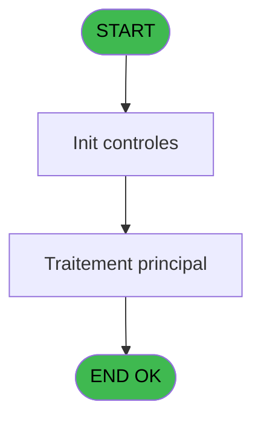

Generate a complete Zustand store for the "programDispatch" domain.

RULES (MANDATORY):
- Use import aliases: @/ for src root (e.g. @/stores/..., @/types/...)
- NEVER use `any` type - use `unknown` or precise types
- Tailwind v4 classes for styling (no tailwind.config.js)
- Arrow functions everywhere (no function declarations)
- `as const` instead of TypeScript enum
- verbatimModuleSyntax is enabled: use `import type { X }` ONLY for types/interfaces, use `import { X }` for values/consts
- File must be COMPLETE and ready to write - NO placeholders, NO TODOs, NO "// implement here"
- NO comments except for genuinely complex logic
- Output ONLY the code inside a single markdown code block (```typescript ... ``` or ```tsx ... ```)

SHARED INFRASTRUCTURE (use these exact imports):
- Data source toggle: `import { useDataSourceStore } from "@/stores/dataSourceStore"` (has .getState().isRealApi)
- API client: `import { apiClient } from "@/services/api/apiClient"` and `import type { ApiResponse } from "@/services/api/apiClient"`
- Screen layout: `import { ScreenLayout } from "@/components/layout"` (wrapper with sidebar, takes children + className)
- UI components: `import { Button, Dialog, Input } from "@/components/ui"`
- cn utility: `import { cn } from "@/lib/utils"`

STORE REQUIREMENTS:
- Use `create` from zustand (import { create } from "zustand")
- Import types from @/types/programDispatch
- Import useDataSourceStore from @/stores/dataSourceStore
- Mock/API branching via useDataSourceStore.getState().isRealApi
- try/catch with `e instanceof Error` for error handling
- Realistic mock data (not lorem ipsum)
- EVERY business rule from the analysis MUST be implemented
- Include reset() action to clear state

TYPES FILE (already generated):
export interface ProgramDispatchControl {
  controlId: string;
  targetProgram: string;
  programName: string;
}

export interface ProgramDispatchRoute {
  controlId: string;
  success: boolean;
  targetProgram?: string;
  error?: string;
}

export interface LastClickedResponse {
  controlId: string | null;
}

export interface ProgramDispatchState {
  lastClickedControl: string | null;
  isDispatching: boolean;
  error: string | null;
  dispatchToProgram: (controlId: string) => Promise<void>;
  getLastClickedControl: () => Promise<string | null>;
  clearDispatch: () => void;
}

export type ProgramDispatchAction =
  | { type: 'SET_LAST_CLICKED'; payload: string }
  | { type: 'SET_DISPATCHING'; payload: boolean }
  | { type: 'SET_ERROR'; payload: string | null }
  | { type: 'CLEAR_DISPATCH' };

ANALYSIS DOCUMENT:
{
  "domain": "programDispatch",
  "domainPascal": "ProgramDispatch",
  "complexity": "LOW",
  "entities": [],
  "stateFields": [
    {
      "name": "lastClickedControl",
      "type": "string | null",
      "default": "null"
    },
    {
      "name": "isDispatching",
      "type": "boolean",
      "default": "false"
    },
    {
      "name": "error",
      "type": "string | null",
      "default": "null"
    }
  ],
  "actions": [
    {
      "name": "dispatchToProgram",
      "params": [
        "controlId: string"
      ],
      "businessRules": [
        "Capture the last clicked control ID via LastClicked()",
        "Route to target program based on control key mapping",
        "Terminal program - no further downstream calls",
        "Single centralized dispatch logic for 21 callers"
      ],
      "returns": "Promise<void>"
    },
    {
      "name": "getLastClickedControl",
      "params": [],
      "businessRules": [
        "Retrieve the last clicked control identifier from UI context"
      ],
      "returns": "Promise<string | null>"
    },
    {
      "name": "clearDispatch",
      "params": [],
      "businessRules": [
        "Reset dispatch state after routing completes"
      ],
      "returns": "void"
    }
  ],
  "apiEndpoints": [
    {
      "method": "POST",
      "path": "/api/programDispatch/route",
      "queryParams": [
        "controlId"
      ],
      "response": "{ success: boolean, targetProgram?: string, error?: string }"
    },
    {
      "method": "GET",
      "path": "/api/programDispatch/lastClicked",
      "queryParams": [],
      "response": "{ controlId: string | null }"
    }
  ],
  "uiLayout": {
    "type": "headless",
    "sections": [],
    "description": "No visible UI - programmatic dispatch only"
  },
  "mockData": {
    "count": 0,
    "description": "No mock data required - routing logic is stateless"
  },
  "dependencies": {
    "stores": [],
    "sharedTypes": [],
    "externalApis": [],
    "notes": "Called by 21 programs (IDE 25, 40, 0, 111, 112, 168, 174, 217, 288, 317, 37, 69, 77, 86, 158, 163, 173, 190, 214, 242). Terminal program with no database access and no downstream calls."
  }
}

SPEC EXCERPT (business rules):
# ADH IDE 44 - Appel programme

> **Analyse**: Phases 1-4 2026-02-07 06:47 -> 01:42 (18h55min) | Assemblage 01:42
> **Pipeline**: V7.2 Enrichi
> **Structure**: 4 onglets (Resume | Ecrans | Donnees | Connexions)

<!-- TAB:Resume -->

## 1. FICHE D'IDENTITE

| Attribut | Valeur |
|----------|--------|
| Projet | ADH |
| IDE Position | 44 |
| Nom Programme | Appel programme |
| Fichier source | `Prg_44.xml` |
| Dossier IDE | General |
| Taches | 1 (0 ecrans visibles) |
| Tables modifiees | 0 |
| Programmes appeles | 0 |
| Complexite | **BASSE** (score 0/100) |

## 2. DESCRIPTION FONCTIONNELLE

ADH IDE 44 est un programme de **routage centralisé d'appels** sans interface visuelle. Il capture le dernier contrôle cliqué (via `LastClicked()`) et l'utilise comme clé de dispatch pour acheminer vers le bon programme cible. C'est un pattern de factorisation typique dans Magic Unipaas : au lieu que 21 menus différents gèrent individuellement le routage des clics, ils delegent tous à ce programme unique qui applique une logique uniforme.

Le programme ne lit ni n'écrit en base de données, n'accepte aucun paramètre formel, et termine sans appeler d'autres programmes—c'est un **point terminal** dans la chaîne d'appels. Sa structure est minimale (1 tâche, 1 handler, 1 expression) mais critique pour l'UX caisse, puisqu'il est appelé depuis 21 écrans différents (changement de compte, garanties, facturation, télephonie, etc.).

Ce pattern économise du code répétitif et garantit que la logique de routage reste cohérente sur toute l'application. Si le comportement du dispatch devait évoluer (par exemple, ajouter un log ou une validation avant appel), une seule modification suffirait.

## 3. BLOCS FONCTIONNELS

## 5. REGLES METIER

*(Aucune regle metier identifiee dans les expressions)*

## 6. CONTEXTE

- **Appele par**: [Change GM (IDE 25)](ADH-IDE-25.md), [Comptes de depôt (IDE 40)](ADH-IDE-40.md), [Garantie sur compte PMS-584 (IDE 0)](ADH-IDE-0.md), [Garantie sur compte (IDE 111)](ADH-IDE-111.md), [Garantie sur compte PMS-584 (IDE 112)](ADH-IDE-112.md), [Gratuités (IDE 168)](ADH-IDE-168.md), [Versement/Retrait (IDE 174)](ADH-IDE-174.md), [Menu telephone (IDE 217)](ADH-IDE-217.md), [Garantie sur compte (IDE 288)](ADH-IDE-288.md), [Gratuités P157 (IDE 317)](ADH-IDE-317.md), [Menu changement compte (IDE 37)](ADH-IDE-37.md), [Extrait de compte (IDE 69)](ADH-IDE-69.md), [Club Med Pass menu (IDE 77)](ADH-IDE-77.md), [Bar Limit (IDE 86)](ADH-IDE-86.md), [Menu Great Member (IDE 158)](ADH-IDE-158.md), [Menu caisse GM - scroll (IDE 163)](ADH-IDE-163.md), [Gestion forfait TAI LOCAL (IDE 173)](ADH-IDE-173.md), [Menu solde d'un compte (IDE 190)](ADH-IDE-190.md), [Menu impression des appels (IDE 214)](ADH-IDE-214.md), [Menu Choix Saisie/Annul vente (IDE 242)](ADH-IDE-242.md)
- **Appelle**: 0 programmes | **Tables**: 0 (W:0 R:0 L:0) | **Taches**: 1 | **Expressions**: 1

<!-- TAB:Ecrans -->

## 8. ECRANS

*(Programme sans ecran visible)*

## 9. NAVIGATION

### 9.3 Structure hierarchique (0 tache)

| Position | Tache | Type | Dimensions | Bloc |
|----------|-------|------|------------|------|

### 9.4 Algorigramme



> **Legende**: Vert = START/END OK | Rouge = END KO | Bleu = Decisions
> *Algorigramme auto-genere. Utiliser `/algorigramme` pour une synthese metier detaillee.*

<!-- TAB:Donnees -->

## 10. TABLES

### Tables utilisees (0)

| ID | Nom | Description | Type | R | W | L | Usages |
|----|-----|-------------|------|---|---|---|--------|

### Colonnes par table (0 / 0 tables avec colonnes identifiees)

## 11. VARIABLES

*(Programme sans variables locales mappees)*

## 12. EXPRESSIONS

**1 / 1 expressions decodees (100%)**

### 12.1 Repartition par type

| Type | Expressions | Regles |
|------|-------------|--------|
| OTHER | 1 | 0 |

### 12.2 Expressions cles par type

#### OTHER (1 expressions)

| Type | IDE | Expression | Regle |
|------|-----|------------|-------|
| OTHER | 1 | `LastClicked ()` | - |

<!-- TAB:Connexions -->

## 13. GRAPHE D'APPELS

### 13.1 Chaine depuis Main (Callers)

Main -> ... -> [Change GM (IDE 25)](ADH-IDE-25.md) -> **Appel programme (IDE 44)**

Main -> ... -> [Comptes de depôt (IDE 40)](ADH-IDE-40.md) -> **Appel programme (IDE 44)**

Main -> ... -> [Garantie sur compte PMS-584 (IDE 0)](ADH-IDE-0.md) -> **Appel programme (IDE 44)**

Main -> ... -> [Garantie sur compte (IDE 111)](ADH-IDE-111.md) -> **Appel programme (IDE 44)**

Main -> ... -> [Garantie sur compte PMS-584 (IDE 112)](ADH-IDE-112.md) -> **Appel programme (IDE 44)**

Main -> ... -> [Gratuités (IDE 168)](ADH-IDE-168.md) -> **Appel programme (IDE 44)**

Main -> ... -> [Versement/Retrait (IDE 174)](ADH-IDE-174.md) -> **Appel programme (IDE 44)**

Main -> ... -> [Menu telephone (IDE 217)](ADH-IDE-217.md) -> **Appel programme (IDE 44)**

Main -> ... -> [Garantie sur compte (IDE 288)](ADH-IDE-288.md) -> **Appel programme (IDE 44)**

Main -> ... -> [Gratuités P157 (IDE 317)](ADH-IDE-317.md) -> **Appel programme (IDE 44)**

Main -> ... -> [Menu changement compte (IDE 37)](ADH-IDE-37.md) -> **Appel programme (IDE 44)**

Main -> ... -> [Extrait de compte (IDE 69)](ADH-IDE-69.md) -> **Appel programme (IDE 44)**

Main -> ... -> [Club Med Pass menu (IDE 77)](ADH-IDE-77.md) -> **Appel programme (IDE 44)**

Main -> ... -> [Bar Limit (IDE 86)](ADH-IDE-86.md) -> **Appel programme (IDE 44)**

Main -> ... -> [Menu Great Member (IDE 158)](ADH-IDE-158.md) -> **Appel programme (IDE 44)**

Main -> ... -> [Menu caisse GM - scroll (IDE 163)](ADH-IDE-163.md) -> **Appel programme (IDE 44)**

Main -> ... -> [Gestion forfait TAI LOCAL (IDE 173)](ADH-IDE-173.md) -> **Appel programme (IDE 44)**

Main -> ... -> [Menu solde d'un compte (IDE 190)](ADH-IDE-190.md) -> **Appel programme (IDE 44)**

Main -> 

REFERENCE PATTERN (follow this exact structure):
```typescript
import { create } from 'zustand';
import type {
  ExtraitAccountInfo,
  ExtraitTransaction,
  ExtraitSummary,
  ExtraitPrintFormat,
} from '@/types/extrait';
import { extraitApi } from '@/services/api/endpoints-lot3';
import { useDataSourceStore } from './dataSourceStore';

interface ExtraitState {
  selectedAccount: ExtraitAccountInfo | null;
  transactions: ExtraitTransaction[];
  summary: ExtraitSummary | null;
  searchResults: ExtraitAccountInfo[];
  isSearching: boolean;
  isLoadingExtrait: boolean;
  isPrinting: boolean;
  error: string | null;
}

interface ExtraitActions {
  searchAccount: (societe: string, query: string) => Promise<void>;
  selectAccount: (account: ExtraitAccountInfo) => void;
  loadExtrait: (
    societe: string,
    codeAdherent: number,
    filiation: number,
    dateDebut?: string,
    dateFin?: string,
  ) => Promise<void>;
  printExtrait: (
    societe: string,
    codeAdherent: number,
    filiation: number,
    format: ExtraitPrintFormat,
  ) => Promise<void>;
  reset: () => void;
}

type ExtraitStore = ExtraitState & ExtraitActions;

const MOCK_ACCOUNTS: ExtraitAccountInfo[] = [
  { societe: 'SOC1', codeAdherent: 1001, filiation: 0, nom: 'DUPONT', prenom: 'Jean', statut: 'normal', hasGiftPass: false },
  { societe: 'SOC1', codeAdherent: 1002, filiation: 0, nom: 'MARTIN', prenom: 'Sophie', statut: 'normal', hasGiftPass: true },
  { societe: 'SOC1', codeAdherent: 1003, filiation: 1, nom: 'DURAND', prenom: 'Pierre', statut: 'bloque', hasGiftPass: false },
];

const MOCK_TRANSACTIONS: ExtraitTransaction[] = [
  { id: 1, date: '2026-02-10', heure: '09:15', libelle: 'Achat boutique', debit: 45.50, credit: 0, solde: -45.50, codeService: 'BTQ', codeImputation: 'IMP01', giftPassFlag: false, nbArticles: 3, status: 'debit', numeroPiece: 'VTE-001', modePaiement: 'CB', caissier: 'MARTIN S.' },
  { id: 2, date: '2026-02-10', heure: '14:30', libelle: 'Credit compte', debit: 0, credit: 200, solde: 154.50, codeService: 'CAI', codeImputation: 'IMP02', giftPassFlag: false, status: 'credit', numeroPiece: 'CRD-042', modePaiement: 'Especes', caissier: 'DUPONT J.' },
  { id: 3, date: '2026-02-09', heure: '12:45', libelle: 'Repas restaurant', libelleSupplementaire: 'Menu du jour', debit: 32.00, credit: 0, solde: 122.50, codeService: 'RST', codeImputation: 'IMP03', giftPassFlag: true, nbArticles: 1, status: 'debit', numeroPiece: 'RST-117', modePaiement: 'GiftPass', caissier: 'MARTIN S.' },
  { id: 4, date: '2026-02-08', heure: '16:00', libelle: 'Annulation vente', debit: 0, credit: 15.00, solde: 154.50, codeService: 'BTQ', codeImputation: 'IMP01', giftPassFlag: false, status: 'annule', numeroPiece: 'ANN-003', modePaiement: 'CB', caissier: 'DUPONT J.', commentaire: 'Erreur de saisie' },
  { id: 5, date: '2026-02-08', heure: '10:20', libelle: 'Regularisation solde', debit: 0, credit: 5.00, solde: 139.50, codeService: 'CAI', codeImputation: 'IMP02', giftPassFlag: false, status: 'regularise', numeroPiece: 'REG-007', modePaiement: 'Interne', caissier: 'ADMIN' },
];

const MOCK_SUMMARY: ExtraitSummary = {
  totalDebit: 77.50,
  totalCredit: 220,
  soldeActuel: 142.50,
  nbTransactions: 5,
};

const initialState: ExtraitState = {
  selectedAccount: null,
  transactions: [],
  summary: null,
  searchResults: [],
  isSearching: false,
  isLoadingExtrait: false,
  isPrinting: false,
  error: null,
};

export const useExtraitStore = create<ExtraitStore>()((set) => ({
  ...initialState,

  searchAccount: async (societe, query) => {
    const { isRealApi } = useDataSourceStore.getState();
    set({ isSearching: true, error: null });

    if (!isRealApi) {
      const filtered = MOCK_ACCOUNTS.filter(
        (a) =>
          a.nom.toLowerCase().includes(query.toLowerCase()) ||
          a.prenom.toLowerCase().includes(query.toLowerCase()) ||
          String(a.codeAdherent).includes(query),
      );
      set({ searchResults: filtered, isSearching: false });
      return;
    }

    try {
      const response = await extraitApi.searchAccount(societe, query);
      set({ searchResults: response.data.data ?? [] });
    } catch (e: unknown) {
      const message = e instanceof Error ? e.message : 'Erreur recherche compte';
      set({ searchResults: [], error: message });
    } finally {
      set({ isSearching: false });
    }
  },

  selectAccount: (account) => {
    set({ selectedAccount: account, transactions: [], summary: null, error: null });
  },

  loadExtrait: async (societe, codeAdherent, filiation, dateDebut, dateFin) => {
    const { isRealApi } = useDataSourceStore.getState();
    set({ isLoadingExtrait: true, error: null });

    if (!isRealApi) {
      set({
        transactions: MOCK_TRANSACTIONS,
        summary: MOCK_SUMMARY,
        isLoadingExtrait: false,
      });
      return;
    }

    try {
      const response = await extraitApi.getExtrait(
        societe,
        codeAdherent,
        filiation,
        dateDebut,
        dateFin,
      );
      const data = response.data.data;
      set({
        transactions: data?.transactions ?? [],
        summary: data?.summary ?? null,
      });
    } catch (e: unknown) {
      const message = e instanceof Error ? e.message : 'Erreur chargement extrait';
      set({ transactions: [], summary: null, error: message });
    } finally {
      set({ isLoadingExtrait: false });
    }
  },

  printExtrait: async (societe, codeAdherent, filiation, format) => {
    const { isRealApi } = useDataSourceStore.getState();
    set({ isPrinting: true, error: null });

    if (!isRealApi) {
      set({ isPrinting: false });
      return;
    }

    try {
      await extraitApi.printExtrait({
        societe,
        codeAdherent,
        filiation,
        format,
      });
    } catch (e: unknown) {
      const message = e instanceof Error ? e.message : 'Erreur impression';
      set({ error: message });
    } finally {
      set({ isPrinting: false });
    }
  },

  reset: () => set({ ...initialState }),
}));

```