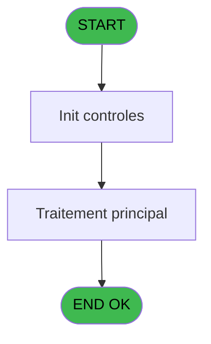

Generate a complete Zustand store for the "moyenPaiement" domain.

RULES (MANDATORY):
- Use import aliases: @/ for src root (e.g. @/stores/..., @/types/...)
- NEVER use `any` type - use `unknown` or precise types
- Tailwind v4 classes for styling (no tailwind.config.js)
- Arrow functions everywhere (no function declarations)
- `as const` instead of TypeScript enum
- verbatimModuleSyntax is enabled: use `import type { X }` ONLY for types/interfaces, use `import { X }` for values/consts
- File must be COMPLETE and ready to write - NO placeholders, NO TODOs, NO "// implement here"
- NO comments except for genuinely complex logic
- Output ONLY the code inside a single markdown code block (```typescript ... ``` or ```tsx ... ```)

SHARED INFRASTRUCTURE (use these exact imports):
- Data source toggle: `import { useDataSourceStore } from "@/stores/dataSourceStore"` (has .getState().isRealApi)
- API client: `import { apiClient } from "@/services/api/apiClient"` and `import type { ApiResponse } from "@/services/api/apiClient"`
- Screen layout: `import { ScreenLayout } from "@/components/layout"` (wrapper with sidebar, takes children + className)
- UI components: `import { Button, Dialog, Input } from "@/components/ui"`
- cn utility: `import { cn } from "@/lib/utils"`

STORE REQUIREMENTS:
- Use `create` from zustand (import { create } from "zustand")
- Import types from @/types/moyenPaiement
- Import useDataSourceStore from @/stores/dataSourceStore
- Mock/API branching via useDataSourceStore.getState().isRealApi
- try/catch with `e instanceof Error` for error handling
- Realistic mock data (not lorem ipsum)
- EVERY business rule from the analysis MUST be implemented
- Include reset() action to clear state

TYPES FILE (already generated):
import type { ApiResponse } from "@/services/api/apiClient";

export type TypeDevise = "UNI" | "BI";
export type ClasseMOP = "UNI" | "BI" | "TRANSF" | "CHQ";

export interface MoyenPaiement {
  code: string;
  libelle: string;
  classe: ClasseMOP;
  typeDevise: TypeDevise;
}

export interface MoyenReglement {
  code: string;
  libelle: string;
}

export interface MOPInfo {
  classe: ClasseMOP;
  libelle: string;
  existe: boolean;
}

export interface MOPExistsResponse {
  existe: boolean;
}

export interface GetMOPInfoRequest {
  code: string;
  typeDevise?: TypeDevise;
}

export interface GetMOPInfoResponse extends ApiResponse {
  data: MOPInfo;
}

export interface CheckMOPExistsRequest {
  code: string;
  societe: string;
}

export interface CheckMOPExistsResponse extends ApiResponse {
  data: MOPExistsResponse;
}

export interface GetMOPByCodeRequest {
  code: string;
}

export interface GetMOPByCodeResponse extends ApiResponse {
  data: MoyenPaiement | null;
}

export interface MoyenPaiementState {
  moyensPaiement: MoyenPaiement[];
  selectedMOP: MoyenPaiement | null;
  isLoading: boolean;
  error: string | null;
}

export interface MoyenPaiementActions {
  getMOPInfo: (
    codeMOP: string,
    typeDevise: TypeDevise
  ) => Promise<{ classe: ClasseMOP; libelle: string; existe: boolean }>;
  checkMOPExists: (codeMOP: string, societe: string) => Promise<boolean>;
  getMOPByCode: (codeMOP: string) => Promise<MoyenPaiement | null>;
  setMoyensPaiement: (moyens: MoyenPaiement[]) => void;
  setSelectedMOP: (mop: MoyenPaiement | null) => void;
  setIsLoading: (isLoading: boolean) => void;
  setError: (error: string | null) => void;
  reset: () => void;
}

export type MoyenPaiementStore = MoyenPaiementState & MoyenPaiementActions;

ANALYSIS DOCUMENT:
{
  "domain": "moyenPaiement",
  "domainPascal": "MoyenPaiement",
  "complexity": "LOW",
  "entities": [
    {
      "name": "MoyenPaiement",
      "fields": [
        {
          "name": "code",
          "type": "string",
          "source": "moyen_paiement___mop.code_mop",
          "nullable": false
        },
        {
          "name": "libelle",
          "type": "string",
          "source": "moyen_paiement___mop.libelle_mop",
          "nullable": false
        },
        {
          "name": "classe",
          "type": "string",
          "source": "moyen_paiement___mop.classe_mop",
          "nullable": false
        },
        {
          "name": "typeDevise",
          "type": "string",
          "source": "moyen_paiement___mop.type_devise",
          "nullable": false
        }
      ]
    },
    {
      "name": "MoyenReglement",
      "fields": [
        {
          "name": "code",
          "type": "string",
          "source": "moyens_reglement_mor.code_mor",
          "nullable": false
        },
        {
          "name": "libelle",
          "type": "string",
          "source": "moyens_reglement_mor.libelle_mor",
          "nullable": false
        }
      ]
    }
  ],
  "stateFields": [
    {
      "name": "moyensPaiement",
      "type": "MoyenPaiement[]",
      "default": "[]"
    },
    {
      "name": "selectedMOP",
      "type": "MoyenPaiement | null",
      "default": "null"
    },
    {
      "name": "isLoading",
      "type": "boolean",
      "default": "false"
    },
    {
      "name": "error",
      "type": "string | null",
      "default": "null"
    }
  ],
  "actions": [
    {
      "name": "getMOPInfo",
      "params": [
        "codeMOP: string",
        "typeDevise: 'UNI' | 'BI'"
      ],
      "businessRules": [
        "RM-001: Si typeDevise != 'B', récupérer infos MOP pour devise unique",
        "RM-002: Si typeDevise = 'B', récupérer infos MOP pour bi-devises"
      ],
      "returns": "Promise<{ classe: string; libelle: string; existe: boolean }>"
    },
    {
      "name": "checkMOPExists",
      "params": [
        "codeMOP: string",
        "societe: string"
      ],
      "businessRules": [
        "Vérifier l'existence du MOP dans la table pour la société donnée"
      ],
      "returns": "Promise<boolean>"
    },
    {
      "name": "getMOPByCode",
      "params": [
        "codeMOP: string"
      ],
      "businessRules": [
        "Récupérer les détails complets d'un MOP par son code"
      ],
      "returns": "Promise<MoyenPaiement | null>"
    }
  ],
  "apiEndpoints": [
    {
      "method": "GET",
      "path": "/api/moyenpaiement/info",
      "queryParams": [
        "code",
        "typeDevise?"
      ],
      "response": "{ classe: string; libelle: string; existe: boolean }"
    },
    {
      "method": "GET",
      "path": "/api/moyenpaiement/{code}",
      "queryParams": [],
      "response": "MoyenPaiement"
    },
    {
      "method": "GET",
      "path": "/api/moyenpaiement/exists",
      "queryParams": [
        "code",
        "societe"
      ],
      "response": "{ existe: boolean }"
    }
  ],
  "uiLayout": {
    "type": "utility-service",
    "sections": [
      {
        "name": "integration",
        "controls": [
          "Utilisé par les écrans de vente pour afficher le libellé du MOP",
          "Utilisé par les générateurs de tickets pour formatter les moyens de paiement",
          "Utilisé par les écrans de transaction pour valider les MOP saisis"
        ]
      }
    ]
  },
  "mockData": {
    "count": 10,
    "description": "Moyens de paiement typiques: CB (Carte Bancaire) classe UNI, ESPECES classe UNI, CHEQUE classe UNI, VIREMENT classe UNI, CHANGE classe BI, CB_ETRANGER classe BI, etc. avec libellés français et codes à 2-3 caractères"
  },
  "dependencies": {
    "stores": [
      "useTransactionStore",
      "useSaisieContenuCaisseStore"
    ],
    "sharedTypes": [
      "TypeDevise",
      "ClasseMOP"
    ],
    "externalApis": [
      "Table moyen_paiement___mop (DB ID 140, 89)",
      "Table moyens_reglement_mor (DB ID 50)"
    ]
  }
}

SPEC EXCERPT (business rules):
# ADH IDE 152 - Recup Classe et Lib du MOP

> **Analyse**: Phases 1-4 2026-02-07 03:51 -> 03:36 (23h44min) | Assemblage 03:36
> **Pipeline**: V7.2 Enrichi
> **Structure**: 4 onglets (Resume | Ecrans | Donnees | Connexions)

<!-- TAB:Resume -->

## 1. FICHE D'IDENTITE

| Attribut | Valeur |
|----------|--------|
| Projet | ADH |
| IDE Position | 152 |
| Nom Programme | Recup Classe et Lib du MOP |
| Fichier source | `Prg_152.xml` |
| Dossier IDE | General |
| Taches | 3 (0 ecrans visibles) |
| Tables modifiees | 0 |
| Programmes appeles | 0 |
| Complexite | **BASSE** (score 0/100) |

## 2. DESCRIPTION FONCTIONNELLE

ADH IDE 152 - RECUP_CLASSE_MOP est un programme utilitaire critiquement utilisé dans la chaîne des ventes pour récupérer les informations de classification et de libellé d'un moyen de paiement (MOP) donné. Appelé par plus de 15 programmes différents (principalement des écrans de vente et d'impression), ce programme centralise la logique de lookup des MOP, évitant la duplication de code à travers les différents modules de transaction et d'édition. Il prend en entrée le code du MOP et retourne sa classification (UNI ou BI) ainsi que son libellé, informations essentielles pour le routage des transactions et l'affichage des reçus.

Le programme utilise deux tâches principales correspondant aux deux contextes d'utilisation : la tâche UNI pour les transactions en devise unique (opérations simples) et la tâche BI pour les transactions en devises multiples (change). Cette séparation permet une gestion différenciée des MOP selon que la transaction concerne une seule devise ou un échange. Les données proviennent de la table des moyens de paiement référencée (probablement dans REF.ecf), avec une architecture simple de type lookup sans calcul métier complexe, ce qui en fait un service de base robuste et performant pour toute la chaîne transactionnelle des ventes.

Son utilisation massive (15+ callers) souligne son rôle d'élément infrastructure fondamental : tout changement à sa logique ou à sa source de données affecte directement l'ensemble du processus de vente, des écrans de saisie aux éditions finales. Il est donc critique d'assurer sa stabilité et sa compatibilité avec les évolutions futures du référentiel MOP.

## 3. BLOCS FONCTIONNELS

### 3.1 Traitement (3 taches)

Traitements internes.

---

#### <a id="t1"></a>152 - (sans nom)

**Role** : Traitement interne.

---

#### <a id="t2"></a>152.1 - UNI

**Role** : Traitement interne.

---

#### <a id="t3"></a>152.2 - BI

**Role** : Traitement interne.


## 5. REGLES METIER

2 regles identifiees:

### Autres (2 regles)

#### <a id="rm-RM-001"></a>[RM-001] Condition: Param UNI/BI [D] different de 'B'

| Element | Detail |
|---------|--------|
| **Condition** | `Param UNI/BI [D]<>'B'` |
| **Si vrai** | Action si vrai |
| **Variables** | EQ (Param UNI/BI) |
| **Expression source** | Expression 1 : `Param UNI/BI [D]<>'B'` |
| **Exemple** | Si Param UNI/BI [D]<>'B' → Action si vrai |

#### <a id="rm-RM-002"></a>[RM-002] Condition: Param UNI/BI [D] egale 'B'

| Element | Detail |
|---------|--------|
| **Condition** | `Param UNI/BI [D]='B'` |
| **Si vrai** | Action si vrai |
| **Variables** | EQ (Param UNI/BI) |
| **Expression source** | Expression 2 : `Param UNI/BI [D]='B'` |
| **Exemple** | Si Param UNI/BI [D]='B' → Action si vrai |

## 6. CONTEXTE

- **Appele par**: [ Print ticket vente (IDE 234)](ADH-IDE-234.md), [ Print ticket vente LEX (IDE 235)](ADH-IDE-235.md), [ Print ticket vente PMS-584 (IDE 236)](ADH-IDE-236.md), [ Print ticket vente LEX (IDE 285)](ADH-IDE-285.md), [ Print ticket vente (IDE 323)](ADH-IDE-323.md), [Transaction Nouv vente avec GP (IDE 237)](ADH-IDE-237.md), [Transaction Nouv vente PMS-584 (IDE 238)](ADH-IDE-238.md), [Transaction Nouv vente PMS-721 (IDE 239)](ADH-IDE-239.md), [Transaction Nouv vente PMS-710 (IDE 240)](ADH-IDE-240.md), [Saisie transaction 154  N.U (IDE 307)](ADH-IDE-307.md), [Saisie transaction Nouv vente (IDE 310)](ADH-IDE-310.md), [Saisie transaction Nouv vente (IDE 316)](ADH-IDE-316.md), [Controle fermeture caisse WS (IDE 155)](ADH-IDE-155.md), [Saisie transaction 154 N.U (IDE 300)](ADH-IDE-300.md), [Print ticket vente/OD N.U (IDE 306)](ADH-IDE-306.md)
- **Appelle**: 0 programmes | **Tables**: 3 (W:0 R:2 L:1) | **Taches**: 3 | **Expressions**: 2

<!-- TAB:Ecrans -->

## 8. ECRANS

*(Programme sans ecran visible)*

## 9. NAVIGATION

### 9.3 Structure hierarchique (3 taches)

| Position | Tache | Type | Dimensions | Bloc |
|----------|-------|------|------------|------|
| **152.1** | [**(sans nom)** (152)](#t1) | MDI | - | Traitement |
| 152.1.1 | [UNI (152.1)](#t2) | MDI | - | |
| 152.1.2 | [BI (152.2)](#t3) | MDI | - | |

### 9.4 Algorigramme



> **Legende**: Vert = START/END OK | Rouge = END KO | Bleu = Decisions
> *Algorigramme auto-genere. Utiliser `/algorigramme` pour une synthese metier detaillee.*

<!-- TAB:Donnees -->

## 10. TABLES

### Tables utilisees (3)

| ID | Nom | Description | Type | R | W | L | Usages |
|----|-----|-------------|------|---|---|---|--------|
| 140 | moyen_paiement___mop |  | DB | R |   |   | 1 |
| 50 | moyens_reglement_mor | Reglements / paiements | DB | R |   |   | 1 |
| 89 | moyen_paiement___mop |  | DB |   |   | L | 1 |

### Colonnes par table (0 / 2 tables avec colonnes identifiees)

<details>
<summary>Table 140 - moyen_paiement___mop (R) - 1 usages</summary>

*Table utilisee uniquement en Link ou aucune colonne Real identifiee dans le DataView.*

</details>

<details>
<summary>Table 50 - moyens_reglement_mor (R) - 1 usages</summary>

*Table utilisee uniquement en Link ou aucune colonne Real identifiee dans le DataView.*

</details>

## 11. VARIABLES

### 11.1 Autres (6)

Variables diverses.

| Lettre | 

REFERENCE PATTERN (follow this exact structure):
```typescript
import { create } from 'zustand';
import type {
  ExtraitAccountInfo,
  ExtraitTransaction,
  ExtraitSummary,
  ExtraitPrintFormat,
} from '@/types/extrait';
import { extraitApi } from '@/services/api/endpoints-lot3';
import { useDataSourceStore } from './dataSourceStore';

interface ExtraitState {
  selectedAccount: ExtraitAccountInfo | null;
  transactions: ExtraitTransaction[];
  summary: ExtraitSummary | null;
  searchResults: ExtraitAccountInfo[];
  isSearching: boolean;
  isLoadingExtrait: boolean;
  isPrinting: boolean;
  error: string | null;
}

interface ExtraitActions {
  searchAccount: (societe: string, query: string) => Promise<void>;
  selectAccount: (account: ExtraitAccountInfo) => void;
  loadExtrait: (
    societe: string,
    codeAdherent: number,
    filiation: number,
    dateDebut?: string,
    dateFin?: string,
  ) => Promise<void>;
  printExtrait: (
    societe: string,
    codeAdherent: number,
    filiation: number,
    format: ExtraitPrintFormat,
  ) => Promise<void>;
  reset: () => void;
}

type ExtraitStore = ExtraitState & ExtraitActions;

const MOCK_ACCOUNTS: ExtraitAccountInfo[] = [
  { societe: 'SOC1', codeAdherent: 1001, filiation: 0, nom: 'DUPONT', prenom: 'Jean', statut: 'normal', hasGiftPass: false },
  { societe: 'SOC1', codeAdherent: 1002, filiation: 0, nom: 'MARTIN', prenom: 'Sophie', statut: 'normal', hasGiftPass: true },
  { societe: 'SOC1', codeAdherent: 1003, filiation: 1, nom: 'DURAND', prenom: 'Pierre', statut: 'bloque', hasGiftPass: false },
];

const MOCK_TRANSACTIONS: ExtraitTransaction[] = [
  { id: 1, date: '2026-02-10', heure: '09:15', libelle: 'Achat boutique', debit: 45.50, credit: 0, solde: -45.50, codeService: 'BTQ', codeImputation: 'IMP01', giftPassFlag: false, nbArticles: 3, status: 'debit', numeroPiece: 'VTE-001', modePaiement: 'CB', caissier: 'MARTIN S.' },
  { id: 2, date: '2026-02-10', heure: '14:30', libelle: 'Credit compte', debit: 0, credit: 200, solde: 154.50, codeService: 'CAI', codeImputation: 'IMP02', giftPassFlag: false, status: 'credit', numeroPiece: 'CRD-042', modePaiement: 'Especes', caissier: 'DUPONT J.' },
  { id: 3, date: '2026-02-09', heure: '12:45', libelle: 'Repas restaurant', libelleSupplementaire: 'Menu du jour', debit: 32.00, credit: 0, solde: 122.50, codeService: 'RST', codeImputation: 'IMP03', giftPassFlag: true, nbArticles: 1, status: 'debit', numeroPiece: 'RST-117', modePaiement: 'GiftPass', caissier: 'MARTIN S.' },
  { id: 4, date: '2026-02-08', heure: '16:00', libelle: 'Annulation vente', debit: 0, credit: 15.00, solde: 154.50, codeService: 'BTQ', codeImputation: 'IMP01', giftPassFlag: false, status: 'annule', numeroPiece: 'ANN-003', modePaiement: 'CB', caissier: 'DUPONT J.', commentaire: 'Erreur de saisie' },
  { id: 5, date: '2026-02-08', heure: '10:20', libelle: 'Regularisation solde', debit: 0, credit: 5.00, solde: 139.50, codeService: 'CAI', codeImputation: 'IMP02', giftPassFlag: false, status: 'regularise', numeroPiece: 'REG-007', modePaiement: 'Interne', caissier: 'ADMIN' },
];

const MOCK_SUMMARY: ExtraitSummary = {
  totalDebit: 77.50,
  totalCredit: 220,
  soldeActuel: 142.50,
  nbTransactions: 5,
};

const initialState: ExtraitState = {
  selectedAccount: null,
  transactions: [],
  summary: null,
  searchResults: [],
  isSearching: false,
  isLoadingExtrait: false,
  isPrinting: false,
  error: null,
};

export const useExtraitStore = create<ExtraitStore>()((set) => ({
  ...initialState,

  searchAccount: async (societe, query) => {
    const { isRealApi } = useDataSourceStore.getState();
    set({ isSearching: true, error: null });

    if (!isRealApi) {
      const filtered = MOCK_ACCOUNTS.filter(
        (a) =>
          a.nom.toLowerCase().includes(query.toLowerCase()) ||
          a.prenom.toLowerCase().includes(query.toLowerCase()) ||
          String(a.codeAdherent).includes(query),
      );
      set({ searchResults: filtered, isSearching: false });
      return;
    }

    try {
      const response = await extraitApi.searchAccount(societe, query);
      set({ searchResults: response.data.data ?? [] });
    } catch (e: unknown) {
      const message = e instanceof Error ? e.message : 'Erreur recherche compte';
      set({ searchResults: [], error: message });
    } finally {
      set({ isSearching: false });
    }
  },

  selectAccount: (account) => {
    set({ selectedAccount: account, transactions: [], summary: null, error: null });
  },

  loadExtrait: async (societe, codeAdherent, filiation, dateDebut, dateFin) => {
    const { isRealApi } = useDataSourceStore.getState();
    set({ isLoadingExtrait: true, error: null });

    if (!isRealApi) {
      set({
        transactions: MOCK_TRANSACTIONS,
        summary: MOCK_SUMMARY,
        isLoadingExtrait: false,
      });
      return;
    }

    try {
      const response = await extraitApi.getExtrait(
        societe,
        codeAdherent,
        filiation,
        dateDebut,
        dateFin,
      );
      const data = response.data.data;
      set({
        transactions: data?.transactions ?? [],
        summary: data?.summary ?? null,
      });
    } catch (e: unknown) {
      const message = e instanceof Error ? e.message : 'Erreur chargement extrait';
      set({ transactions: [], summary: null, error: message });
    } finally {
      set({ isLoadingExtrait: false });
    }
  },

  printExtrait: async (societe, codeAdherent, filiation, format) => {
    const { isRealApi } = useDataSourceStore.getState();
    set({ isPrinting: true, error: null });

    if (!isRealApi) {
      set({ isPrinting: false });
      return;
    }

    try {
      await extraitApi.printExtrait({
        societe,
        codeAdherent,
        filiation,
        format,
      });
    } catch (e: unknown) {
      const message = e instanceof Error ? e.message : 'Erreur impression';
      set({ error: message });
    } finally {
      set({ isPrinting: false });
    }
  },

  reset: () => set({ ...initialState }),
}));

```