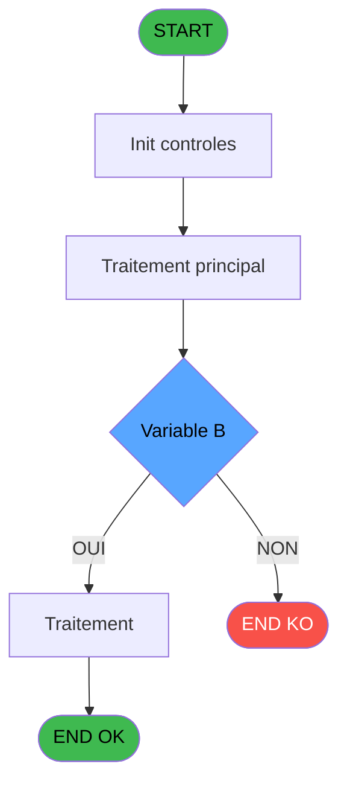

Generate a complete Zustand store for the "calculEquivalent" domain.

RULES (MANDATORY):
- Use import aliases: @/ for src root (e.g. @/stores/..., @/types/...)
- NEVER use `any` type - use `unknown` or precise types
- Tailwind v4 classes for styling (no tailwind.config.js)
- Arrow functions everywhere (no function declarations)
- `as const` instead of TypeScript enum
- verbatimModuleSyntax is enabled: use `import type { X }` ONLY for types/interfaces, use `import { X }` for values/consts
- File must be COMPLETE and ready to write - NO placeholders, NO TODOs, NO "// implement here"
- NO comments except for genuinely complex logic
- Output ONLY the code inside a single markdown code block (```typescript ... ``` or ```tsx ... ```)

SHARED INFRASTRUCTURE (use these exact imports):
- Data source toggle: `import { useDataSourceStore } from "@/stores/dataSourceStore"` (has .getState().isRealApi)
- API client: `import { apiClient } from "@/services/api/apiClient"` and `import type { ApiResponse } from "@/services/api/apiClient"`
- Screen layout: `import { ScreenLayout } from "@/components/layout"` (wrapper with sidebar, takes children + className)
- UI components: `import { Button, Dialog, Input } from "@/components/ui"`
- cn utility: `import { cn } from "@/lib/utils"`

STORE REQUIREMENTS:
- Use `create` from zustand (import { create } from "zustand")
- Import types from @/types/calculEquivalent
- Import useDataSourceStore from @/stores/dataSourceStore
- Mock/API branching via useDataSourceStore.getState().isRealApi
- try/catch with `e instanceof Error` for error handling
- Realistic mock data (not lorem ipsum)
- EVERY business rule from the analysis MUST be implemented
- Include reset() action to clear state

TYPES FILE (already generated):
import type { ApiResponse } from '@/services/api/apiClient';

// ============================================================================
// DOMAIN TYPES - calculEquivalent (Change Devises - ADH IDE 25)
// ============================================================================

export type OperationType = 'A' | 'V';
export type DirectionalType = 'U' | 'B';

export interface TauxChange {
  societe: string;
  devise: string;
  tauxAchat: number;
  tauxVente: number;
  typeDevise: number;
  dateValidite: string;
  nbDecimales: number;
}

export interface MoyenReglement {
  code: string;
  libelle: string;
  cdrtDeviseIn: boolean;
  ordreAffichage: number;
}

// ============================================================================
// CONVERSION REQUEST/RESPONSE
// ============================================================================

export interface ConversionParams {
  societe: string;
  uniBi: DirectionalType;
  deviseLocale: string;
  nombreDecimal: number;
  devise: string;
  modePaiement: string;
  quantite: number;
  typeOperation: OperationType;
  typeDevise: number;
}

export interface ConversionResult {
  equivalent: number;
  cdrtDeviseIn: boolean;
  taux?: number;
  quantiteOriginale?: number;
  deviseOriginale?: string;
  deviseLocale?: string;
}

export interface ConversionError {
  field: keyof ConversionParams;
  message: string;
}

// ============================================================================
// API REQUEST/RESPONSE TYPES
// ============================================================================

export interface CalculerEquivalentRequest {
  params: ConversionParams;
}

export interface CalculerEquivalentResponse extends ApiResponse<ConversionResult> {}

export interface GetTauxChangeRequest {
  societe: string;
  devise: string;
  typeOperation: OperationType;
  uniBi: DirectionalType;
}

export interface GetTauxChangeResponse extends ApiResponse<TauxChange> {}

// ============================================================================
// VALIDATION TYPES
// ============================================================================

export interface ValidationResult {
  isValid: boolean;
  errors: ConversionError[];
}

// ============================================================================
// STORE STATE
// ============================================================================

export interface CalculEquivalentState {
  isCalculating: boolean;
  isValidating: boolean;
  error: string | null;
  validationErrors: ConversionError[];
  lastConversion: ConversionResult | null;
  conversionHistory: ConversionResult[];
  maxHistorySize: number;

  // Actions
  calculerEquivalent: (params: ConversionParams) => Promise<ConversionResult>;
  validateConversionParams: (params: ConversionParams) => Promise<ValidationResult>;
  getTauxChange: (request: GetTauxChangeRequest) => Promise<TauxChange>;
  clearError: () => void;
  clearHistory: () => void;
  resetState: () => void;
}

// ============================================================================
// UI COMPONENT PROPS
// ============================================================================

export interface ConversionFormProps {
  onSuccess?: (result: ConversionResult) => void;
  onError?: (error: string) => void;
  initialParams?: Partial<ConversionParams>;
  readonly?: boolean;
  className?: string;
}

export interface ConversionResultDisplayProps {
  result: ConversionResult | null;
  isLoading?: boolean;
  error?: string | null;
  className?: string;
}

export interface ConversionHistoryProps {
  items: ConversionResult[];
  onSelectItem?: (item: ConversionResult) => void;
  maxItems?: number;
  className?: string;
}

// ============================================================================
// BUSINESS RULES CONSTANTS
// ============================================================================

export const CONVERSION_RULES = {
  RM001: '[RM-001] Si typeOperation=A ET uniBi<>B: Appliquer taux achat unidirectionnel',
  RM002: '[RM-002] Si typeOperation=A ET uniBi=B: Appliquer taux achat bilateral (inverse du taux vente)',
  RM003: '[RM-003] Si uniBi<>B: Utiliser calcul unidirectionnel standard',
  RM004: '[RM-004] Si uniBi=B: Utiliser calcul bilateral (division par taux vente)',
  RM005: '[RM-005] Si typeOperation<>A: Appliquer logique vente (division par taux)',
} as const;

export const OPERATION_TYPES = {
  ACHAT: 'A' as const,
  VENTE: 'V' as const,
} as const;

export const DIRECTIONAL_TYPES = {
  UNIDIRECTIONNEL: 'U' as const,
  BILATERAL: 'B' as const,
} as const;

// ============================================================================
// MOCK DATA
// ============================================================================

export const MOCK_CONVERSION_SCENARIOS = [
  {
    name: 'Achat USD unidirectionnel',
    params: {
      societe: '1',
      uniBi: 'U',
      deviseLocale: 'EUR',
      nombreDecimal: 2,
      devise: 'USD',
      modePaiement: 'ESP',
      quantite: 100,
      typeOperation: 'A',
      typeDevise: 1,
    },
    expectedEquivalent: 92.5,
  },
  {
    name: 'Achat EUR bilateral',
    params: {
      societe: '1',
      uniBi: 'B',
      deviseLocale: 'EUR',
      nombreDecimal: 2,
      devise: 'EUR',
      modePaiement: 'CB',
      quantite: 100,
      typeOperation: 'A',
      typeDevise: 0,
    },
    expectedEquivalent: 100,
  },
  {
    name: 'Vente GBP unidirectionnel',
    params: {
      societe: '1',
      uniBi: 'U',
      deviseLocale: 'EUR',
      nombreDecimal: 2,
      devise: 'GBP',
      modePaiement: 'ESP',
      quantite: 50,
      typeOperation: 'V',
      typeDevise: 1,
    },
    expectedEquivalent: 58.75,
  },
  {
    name: 'Vente JPY bilateral',
    params: {
      societe: '1',
      uniBi: 'B',
      deviseLocale: 'EUR',
      nombreDecimal: 0,
      devise: 'JPY',
      modePaiement: 'CB',
      quantite: 10000,
      typeOperation: 'V',
      typeDevise: 2,
    },
    expectedEquivalent: 68.6,
  },
  {
    name: 'Espèces vs CB - USD',
    params: {
      societe: '1',
      uniBi: 'U',
      deviseLocale: 'EUR',
      nombreDecimal: 2,
      devise: 'USD',
      modePaiement: 'ESP',
      quantite: 200,
      typeOperation: 'A',
      typeDevise: 1,
    },
    expectedEquivalent: 185,
  },
] as const;

export const MOCK_TAUX_CHANGES: TauxChange[] = [
  {
    societe: '1',
    devise: 'USD',
    tauxAchat: 0.925,
    tauxVente: 1.08,
    typeDevise: 1,
    dateValidite: '2026-02-22',
    nbDecimales: 2,
  },
  {
    societe: '1',
    devise: 'EUR',
    tauxAchat: 1,
    tauxVente: 1,
    typeDevise: 0,
    dateValidite: '2026-02-22',
    nbDecimales: 2,
  },
  {
    societe: '1',
    devise: 'GBP',
    tauxAchat: 1.175,
    tauxVente: 1.29,
    typeDevise: 1,
    dateValidite: '2026-02-22',
    nbDecimales: 2,
  },
  {
    societe: '1',
    devise: 'JPY',
    tauxAchat: 145.2,
    tauxVente: 145.8,
    typeDevise: 2,
    dateValidite: '2026-02-22',
    nbDecimales: 0,
  },
] as const;

export const MOCK_MOYENS_REGLEMENT: MoyenReglement[] = [
  {
    code: 'ESP',
    libelle: 'Espèces',
    cdrtDeviseIn: true,
    ordreAffichage: 1,
  },
  {
    code: 'CB',
    libelle: 'Carte Bancaire',
    cdrtDeviseIn: false,
    ordreAffichage: 2,
  },
  {
    code: 'CHQ',
    libelle: 'Chèque',
    cdrtDeviseIn: false,
    ordreAffichage: 3,
  },
  {
    code: 'VIR',
    libelle: 'Virement',
    cdrtDeviseIn: false,
    ordreAffichage: 4,
  },
] as const;

ANALYSIS DOCUMENT:
{
  "domain": "calculEquivalent",
  "domainPascal": "CalculEquivalent",
  "complexity": "LOW",
  "entities": [
    {
      "name": "ConversionParams",
      "fields": [
        {
          "name": "societe",
          "type": "string",
          "source": "parameter",
          "nullable": false
        },
        {
          "name": "uniBi",
          "type": "string",
          "source": "parameter",
          "nullable": false
        },
        {
          "name": "deviseLocale",
          "type": "string",
          "source": "parameter",
          "nullable": false
        },
        {
          "name": "nombreDecimal",
          "type": "number",
          "source": "parameter",
          "nullable": false
        },
        {
          "name": "devise",
          "type": "string",
          "source": "parameter",
          "nullable": false
        },
        {
          "name": "modePaiement",
          "type": "string",
          "source": "parameter",
          "nullable": false
        },
        {
          "name": "quantite",
          "type": "number",
          "source": "parameter",
          "nullable": false
        },
        {
          "name": "typeOperation",
          "type": "string",
          "source": "parameter",
          "nullable": false
        },
        {
          "name": "typeDevise",
          "type": "number",
          "source": "parameter",
          "nullable": false
        }
      ]
    },
    {
      "name": "ConversionResult",
      "fields": [
        {
          "name": "equivalent",
          "type": "number",
          "source": "calculated",
          "nullable": false
        },
        {
          "name": "cdrtDeviseIn",
          "type": "boolean",
          "source": "table.moyens_reglement_mor",
          "nullable": false
        }
      ]
    }
  ],
  "stateFields": [
    {
      "name": "isCalculating",
      "type": "boolean",
      "default": "false"
    },
    {
      "name": "error",
      "type": "string | null",
      "default": "null"
    },
    {
      "name": "lastConversion",
      "type": "ConversionResult | null",
      "default": "null"
    }
  ],
  "actions": [
    {
      "name": "calculerEquivalent",
      "params": [
        "params: ConversionParams"
      ],
      "businessRules": [
        "[RM-001] Si typeOperation='A' ET uniBi<>'B': Appliquer taux achat unidirectionnel",
        "[RM-002] Si typeOperation='A' ET uniBi='B': Appliquer taux achat bilateral (inverse du taux vente)",
        "[RM-003] Si uniBi<>'B': Utiliser calcul unidirectionnel standard",
        "[RM-004] Si uniBi='B': Utiliser calcul bilateral (division par taux vente)",
        "[RM-005] Si typeOperation<>'A': Appliquer logique vente (division par taux)"
      ],
      "returns": "Promise<ConversionResult>"
    },
    {
      "name": "validateConversionParams",
      "params": [
        "params: ConversionParams"
      ],
      "businessRules": [
        "Valider societe non vide",
        "Valider devise et deviseLocale non vides",
        "Valider quantite > 0",
        "Valider typeOperation in ['A', 'V']",
        "Valider uniBi in ['U', 'B']"
      ],
      "returns": "boolean"
    }
  ],
  "apiEndpoints": [
    {
      "method": "POST",
      "path": "/api/change/calculer-equivalent",
      "queryParams": [],
      "response": "ConversionResult"
    },
    {
      "method": "GET",
      "path": "/api/change/taux",
      "queryParams": [
        "societe",
        "devise",
        "typeOperation",
        "uniBi"
      ],
      "response": "TauxChange"
    }
  ],
  "uiLayout": {
    "type": "utility-component",
    "sections": [
      {
        "name": "ConversionUtility",
        "controls": [
          "Input: quantite (number)",
          "Input: devise (select)",
          "Input: typeOperation (radio: Achat/Vente)",
          "Input: modePaiement (select)",
          "Button: Calculer",
          "Output: equivalent (readonly, formatted)"
        ]
      }
    ]
  },
  "mockData": {
    "count": 5,
    "description": "5 scenarios de conversion: (1) Achat USD unidirectionnel, (2) Achat EUR bilateral, (3) Vente GBP unidirectionnel, (4) Vente JPY bilateral, (5) Espèces vs CB"
  },
  "dependencies": {
    "stores": [
      "useChangeStore"
    ],
    "sharedTypes": [
      "TauxChange",
      "MoyenReglement"
    ],
    "externalApis": [
      "/api/change/taux"
    ]
  }
}

SPEC EXCERPT (business rules):
# ADH IDE 22 - Calcul equivalent

> **Analyse**: Phases 1-4 2026-02-07 06:39 -> 01:21 (18h42min) | Assemblage 01:21
> **Pipeline**: V7.2 Enrichi
> **Structure**: 4 onglets (Resume | Ecrans | Donnees | Connexions)

<!-- TAB:Resume -->

## 1. FICHE D'IDENTITE

| Attribut | Valeur |
|----------|--------|
| Projet | ADH |
| IDE Position | 22 |
| Nom Programme | Calcul equivalent |
| Fichier source | `Prg_22.xml` |
| Dossier IDE | General |
| Taches | 1 (0 ecrans visibles) |
| Tables modifiees | 0 |
| Programmes appeles | 0 |
| Complexite | **BASSE** (score 0/100) |

## 2. DESCRIPTION FONCTIONNELLE

### 1.1 Objectif metier

**Calcul equivalent** est le **programme de conversion monetaire** qui **calcule l'equivalent en devise locale d'un montant en devise etrangere**.

**Objectif metier** : Ce programme est le moteur de calcul de change du systeme. Il recoit un montant en devise etrangere avec son mode de paiement et son type d'operation (achat/vente), puis calcule l'equivalent en devise locale en appliquant le taux de change approprie. Il gere les specificites bilaterales (Uni/BI) et les differents types d'operations. Ce programme est appele massivement (20 appels) par les programmes d'impression de recus de change et le tableau recapitulatif de fermeture de caisse.

**Calcul equivalent** assure la gestion complete de ce processus, accessible depuis [Print reçu change achat (IDE 23)](ADH-IDE-23.md), [Print reçu change vente (IDE 24)](ADH-IDE-24.md), [Tableau recap fermeture (IDE 154)](ADH-IDE-154.md).

Le flux de traitement s'organise en **1 blocs fonctionnels** :

- **Consultation** (1 tache) : ecrans de recherche, selection et consultation

## 3. BLOCS FONCTIONNELS

## 5. REGLES METIER

5 regles identifiees:

### Autres (5 regles)

#### <a id="rm-RM-001"></a>[RM-001] Condition: > Type operation [J]='A' AND > Uni/BI [B] different de 'B'

| Element | Detail |
|---------|--------|
| **Condition** | `> Type operation [J]='A' AND > Uni/BI [B]<>'B'` |
| **Si vrai** | Action si vrai |
| **Variables** | EO (> Uni/BI), EW (> Type operation) |
| **Expression source** | Expression 12 : `> Type operation [J]='A' AND > Uni/BI [B]<>'B'` |
| **Exemple** | Si > Type operation [J]='A' AND > Uni/BI [B]<>'B' → Action si vrai |

#### <a id="rm-RM-002"></a>[RM-002] Condition: > Type operation [J]='A' AND > Uni/BI [B] egale 'B'

| Element | Detail |
|---------|--------|
| **Condition** | `> Type operation [J]='A' AND > Uni/BI [B]='B'` |
| **Si vrai** | Action si vrai |
| **Variables** | EO (> Uni/BI), EW (> Type operation) |
| **Expression source** | Expression 13 : `> Type operation [J]='A' AND > Uni/BI [B]='B'` |
| **Exemple** | Si > Type operation [J]='A' AND > Uni/BI [B]='B' → Action si vrai |

#### <a id="rm-RM-003"></a>[RM-003] Condition: > Uni/BI [B] different de 'B'

| Element | Detail |
|---------|--------|
| **Condition** | `> Uni/BI [B]<>'B'` |
| **Si vrai** | Action si vrai |
| **Variables** | EO (> Uni/BI) |
| **Expression source** | Expression 14 : `> Uni/BI [B]<>'B'` |
| **Exemple** | Si > Uni/BI [B]<>'B' → Action si vrai |

#### <a id="rm-RM-004"></a>[RM-004] Condition: > Uni/BI [B] egale 'B'

| Element | Detail |
|---------|--------|
| **Condition** | `> Uni/BI [B]='B'` |
| **Si vrai** | Action si vrai |
| **Variables** | EO (> Uni/BI) |
| **Expression source** | Expression 15 : `> Uni/BI [B]='B'` |
| **Exemple** | Si > Uni/BI [B]='B' → Action si vrai |

#### <a id="rm-RM-005"></a>[RM-005] Condition: > Type operation [J] different de 'A'

| Element | Detail |
|---------|--------|
| **Condition** | `> Type operation [J]<>'A'` |
| **Si vrai** | Action si vrai |
| **Variables** | EW (> Type operation) |
| **Expression source** | Expression 16 : `> Type operation [J]<>'A'` |
| **Exemple** | Si > Type operation [J]<>'A' → Action si vrai |

## 6. CONTEXTE

- **Appele par**: [Print reçu change achat (IDE 23)](ADH-IDE-23.md), [Print reçu change vente (IDE 24)](ADH-IDE-24.md), [Tableau recap fermeture (IDE 154)](ADH-IDE-154.md)
- **Appelle**: 0 programmes | **Tables**: 2 (W:0 R:1 L:1) | **Taches**: 1 | **Expressions**: 16

<!-- TAB:Ecrans -->

## 8. ECRANS

*(Programme sans ecran visible)*

## 9. NAVIGATION

### 9.3 Structure hierarchique (0 tache)

| Position | Tache | Type | Dimensions | Bloc |
|----------|-------|------|------------|------|

### 9.4 Algorigramme



> **Legende**: Vert = START/END OK | Rouge = END KO | Bleu = Decisions
> *Algorigramme auto-genere. Utiliser `/algorigramme` pour une synthese metier detaillee.*

<!-- TAB:Donnees -->

## 10. TABLES

### Tables utilisees (2)

| ID | Nom | Description | Type | R | W | L | Usages |
|----|-----|-------------|------|---|---|---|--------|
| 50 | moyens_reglement_mor | Reglements / paiements | DB | R |   |   | 1 |
| 139 | moyens_reglement_mor | Reglements / paiements | DB |   |   | L | 1 |

### Colonnes par table (1 / 1 tables avec colonnes identifiees)

<details>
<summary>Table 50 - moyens_reglement_mor (R) - 1 usages</summary>

| Lettre | Variable | Acces | Type |
|--------|----------|-------|------|
| A | > Societe | R | Alpha |
| B | > Uni/BI | R | Alpha |
| C | > devise locale | R | Alpha |
| D | > nombre de decimal | R | Numeric |
| E | > Devise | R | Alpha |
| F | < cdrt devise in | R | Logical |
| G | > mode de paiement | R | Alpha |
| H | > quantite | R | Numeric |
| I | < Equivalent | R | Numeric |
| J | > Type operation | R | Alpha |
| K | > Type de devise | R | Numeric |

</details>

## 11. VARIABLES

### 11.1 Autres (11)

Variables diverses.

| Lettr

REFERENCE PATTERN (follow this exact structure):
```typescript
import { create } from 'zustand';
import type {
  ExtraitAccountInfo,
  ExtraitTransaction,
  ExtraitSummary,
  ExtraitPrintFormat,
} from '@/types/extrait';
import { extraitApi } from '@/services/api/endpoints-lot3';
import { useDataSourceStore } from './dataSourceStore';

interface ExtraitState {
  selectedAccount: ExtraitAccountInfo | null;
  transactions: ExtraitTransaction[];
  summary: ExtraitSummary | null;
  searchResults: ExtraitAccountInfo[];
  isSearching: boolean;
  isLoadingExtrait: boolean;
  isPrinting: boolean;
  error: string | null;
}

interface ExtraitActions {
  searchAccount: (societe: string, query: string) => Promise<void>;
  selectAccount: (account: ExtraitAccountInfo) => void;
  loadExtrait: (
    societe: string,
    codeAdherent: number,
    filiation: number,
    dateDebut?: string,
    dateFin?: string,
  ) => Promise<void>;
  printExtrait: (
    societe: string,
    codeAdherent: number,
    filiation: number,
    format: ExtraitPrintFormat,
  ) => Promise<void>;
  reset: () => void;
}

type ExtraitStore = ExtraitState & ExtraitActions;

const MOCK_ACCOUNTS: ExtraitAccountInfo[] = [
  { societe: 'SOC1', codeAdherent: 1001, filiation: 0, nom: 'DUPONT', prenom: 'Jean', statut: 'normal', hasGiftPass: false },
  { societe: 'SOC1', codeAdherent: 1002, filiation: 0, nom: 'MARTIN', prenom: 'Sophie', statut: 'normal', hasGiftPass: true },
  { societe: 'SOC1', codeAdherent: 1003, filiation: 1, nom: 'DURAND', prenom: 'Pierre', statut: 'bloque', hasGiftPass: false },
];

const MOCK_TRANSACTIONS: ExtraitTransaction[] = [
  { id: 1, date: '2026-02-10', heure: '09:15', libelle: 'Achat boutique', debit: 45.50, credit: 0, solde: -45.50, codeService: 'BTQ', codeImputation: 'IMP01', giftPassFlag: false, nbArticles: 3, status: 'debit', numeroPiece: 'VTE-001', modePaiement: 'CB', caissier: 'MARTIN S.' },
  { id: 2, date: '2026-02-10', heure: '14:30', libelle: 'Credit compte', debit: 0, credit: 200, solde: 154.50, codeService: 'CAI', codeImputation: 'IMP02', giftPassFlag: false, status: 'credit', numeroPiece: 'CRD-042', modePaiement: 'Especes', caissier: 'DUPONT J.' },
  { id: 3, date: '2026-02-09', heure: '12:45', libelle: 'Repas restaurant', libelleSupplementaire: 'Menu du jour', debit: 32.00, credit: 0, solde: 122.50, codeService: 'RST', codeImputation: 'IMP03', giftPassFlag: true, nbArticles: 1, status: 'debit', numeroPiece: 'RST-117', modePaiement: 'GiftPass', caissier: 'MARTIN S.' },
  { id: 4, date: '2026-02-08', heure: '16:00', libelle: 'Annulation vente', debit: 0, credit: 15.00, solde: 154.50, codeService: 'BTQ', codeImputation: 'IMP01', giftPassFlag: false, status: 'annule', numeroPiece: 'ANN-003', modePaiement: 'CB', caissier: 'DUPONT J.', commentaire: 'Erreur de saisie' },
  { id: 5, date: '2026-02-08', heure: '10:20', libelle: 'Regularisation solde', debit: 0, credit: 5.00, solde: 139.50, codeService: 'CAI', codeImputation: 'IMP02', giftPassFlag: false, status: 'regularise', numeroPiece: 'REG-007', modePaiement: 'Interne', caissier: 'ADMIN' },
];

const MOCK_SUMMARY: ExtraitSummary = {
  totalDebit: 77.50,
  totalCredit: 220,
  soldeActuel: 142.50,
  nbTransactions: 5,
};

const initialState: ExtraitState = {
  selectedAccount: null,
  transactions: [],
  summary: null,
  searchResults: [],
  isSearching: false,
  isLoadingExtrait: false,
  isPrinting: false,
  error: null,
};

export const useExtraitStore = create<ExtraitStore>()((set) => ({
  ...initialState,

  searchAccount: async (societe, query) => {
    const { isRealApi } = useDataSourceStore.getState();
    set({ isSearching: true, error: null });

    if (!isRealApi) {
      const filtered = MOCK_ACCOUNTS.filter(
        (a) =>
          a.nom.toLowerCase().includes(query.toLowerCase()) ||
          a.prenom.toLowerCase().includes(query.toLowerCase()) ||
          String(a.codeAdherent).includes(query),
      );
      set({ searchResults: filtered, isSearching: false });
      return;
    }

    try {
      const response = await extraitApi.searchAccount(societe, query);
      set({ searchResults: response.data.data ?? [] });
    } catch (e: unknown) {
      const message = e instanceof Error ? e.message : 'Erreur recherche compte';
      set({ searchResults: [], error: message });
    } finally {
      set({ isSearching: false });
    }
  },

  selectAccount: (account) => {
    set({ selectedAccount: account, transactions: [], summary: null, error: null });
  },

  loadExtrait: async (societe, codeAdherent, filiation, dateDebut, dateFin) => {
    const { isRealApi } = useDataSourceStore.getState();
    set({ isLoadingExtrait: true, error: null });

    if (!isRealApi) {
      set({
        transactions: MOCK_TRANSACTIONS,
        summary: MOCK_SUMMARY,
        isLoadingExtrait: false,
      });
      return;
    }

    try {
      const response = await extraitApi.getExtrait(
        societe,
        codeAdherent,
        filiation,
        dateDebut,
        dateFin,
      );
      const data = response.data.data;
      set({
        transactions: data?.transactions ?? [],
        summary: data?.summary ?? null,
      });
    } catch (e: unknown) {
      const message = e instanceof Error ? e.message : 'Erreur chargement extrait';
      set({ transactions: [], summary: null, error: message });
    } finally {
      set({ isLoadingExtrait: false });
    }
  },

  printExtrait: async (societe, codeAdherent, filiation, format) => {
    const { isRealApi } = useDataSourceStore.getState();
    set({ isPrinting: true, error: null });

    if (!isRealApi) {
      set({ isPrinting: false });
      return;
    }

    try {
      await extraitApi.printExtrait({
        societe,
        codeAdherent,
        filiation,
        format,
      });
    } catch (e: unknown) {
      const message = e instanceof Error ? e.message : 'Erreur impression';
      set({ error: message });
    } finally {
      set({ isPrinting: false });
    }
  },

  reset: () => set({ ...initialState }),
}));

```