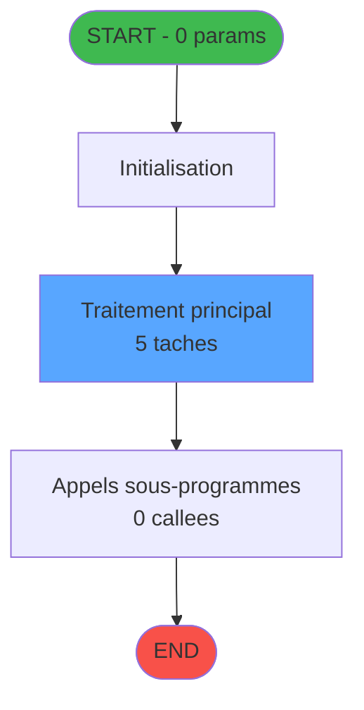
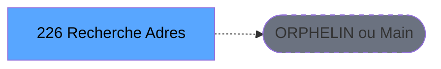
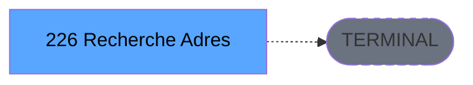

Generate a complete Zustand store for the "emailSearch" domain.

RULES (MANDATORY):
- Use import aliases: @/ for src root (e.g. @/stores/..., @/types/...)
- NEVER use `any` type - use `unknown` or precise types
- Tailwind v4 classes for styling (no tailwind.config.js)
- Arrow functions everywhere (no function declarations)
- `as const` instead of TypeScript enum
- verbatimModuleSyntax is enabled: use `import type { X }` ONLY for types/interfaces, use `import { X }` for values/consts
- File must be COMPLETE and ready to write - NO placeholders, NO TODOs, NO "// implement here"
- NO comments except for genuinely complex logic
- Output ONLY the code inside a single markdown code block (```typescript ... ``` or ```tsx ... ```)

SHARED INFRASTRUCTURE (use these exact imports):
- Data source toggle: `import { useDataSourceStore } from "@/stores/dataSourceStore"` (has .getState().isRealApi)
- API client: `import { apiClient } from "@/services/api/apiClient"` and `import type { ApiResponse } from "@/services/api/apiClient"`
- Screen layout: `import { ScreenLayout } from "@/components/layout"` (wrapper with sidebar, takes children + className)
- UI components: `import { Button, Dialog, Input } from "@/components/ui"`
- cn utility: `import { cn } from "@/lib/utils"`

STORE REQUIREMENTS:
- Use `create` from zustand (import { create } from "zustand")
- Import types from @/types/emailSearch
- Import useDataSourceStore from @/stores/dataSourceStore
- Mock/API branching via useDataSourceStore.getState().isRealApi
- try/catch with `e instanceof Error` for error handling
- Realistic mock data (not lorem ipsum)
- EVERY business rule from the analysis MUST be implemented
- Include reset() action to clear state

TYPES FILE (already generated):
import type { GmIdentifier } from "@/types";

export interface EmailAddress {
  id: number;
  societe: string;
  compte: string;
  filiation: number;
  email: string;
  isPrincipal: boolean;
  createdAt: Date | null;
  updatedAt: Date | null;
}

export interface GmRecord {
  societe: string;
  compte: string;
  filiation: number;
  nom: string | null;
  prenom: string | null;
}

export interface SearchFilters {
  societe: string;
  compte: string;
  filiation: number | null;
  email: string;
}

export interface CreateEmailDto {
  societe: string;
  compte: string;
  filiation: number;
  email: string;
  isPrincipal?: boolean;
}

export interface UpdateEmailDto {
  email?: string;
  isPrincipal?: boolean;
}

export interface EmailSearchState {
  emails: EmailAddress[];
  selectedEmail: EmailAddress | null;
  isLoading: boolean;
  error: string | null;
  filters: SearchFilters;
  searchEmails: (filters: SearchFilters) => Promise<void>;
  createEmail: (data: CreateEmailDto) => Promise<void>;
  updateEmail: (id: number, data: UpdateEmailDto) => Promise<void>;
  deleteEmail: (id: number) => Promise<void>;
  setAsPrincipal: (id: number) => Promise<void>;
  selectEmail: (email: EmailAddress | null) => void;
  setFilters: (filters: SearchFilters) => void;
  clearFilters: () => void;
  resetState: () => void;
}

export interface GetEmailsRequest {
  societe?: string;
  compte?: string;
  filiation?: number;
  email?: string;
}

export interface GetEmailsResponse {
  data: EmailAddress[];
  count: number;
}

export interface CreateEmailRequest {
  societe: string;
  compte: string;
  filiation: number;
  email: string;
  isPrincipal?: boolean;
}

export interface CreateEmailResponse {
  data: EmailAddress;
}

export interface UpdateEmailRequest {
  email?: string;
  isPrincipal?: boolean;
}

export interface UpdateEmailResponse {
  data: EmailAddress;
}

export interface DeleteEmailResponse {
  success: boolean;
}

export interface SetPrincipalResponse {
  success: boolean;
}

export const EMPTY_SEARCH_FILTERS = {
  societe: '',
  compte: '',
  filiation: null,
  email: '',
} as const;

export const EMAIL_VALIDATION_REGEX = /^[^\s@]+@[^\s@]+\.[^\s@]+$/;

export const ACTION_TYPES = {
  SEARCH_EMAILS: 'emailSearch/searchEmails',
  CREATE_EMAIL: 'emailSearch/createEmail',
  UPDATE_EMAIL: 'emailSearch/updateEmail',
  DELETE_EMAIL: 'emailSearch/deleteEmail',
  SET_PRINCIPAL: 'emailSearch/setAsPrincipal',
  SELECT_EMAIL: 'emailSearch/selectEmail',
  SET_FILTERS: 'emailSearch/setFilters',
  CLEAR_FILTERS: 'emailSearch/clearFilters',
  RESET_STATE: 'emailSearch/resetState',
} as const;

ANALYSIS DOCUMENT:
{
  "domain": "emailSearch",
  "domainPascal": "EmailSearch",
  "complexity": "MEDIUM",
  "entities": [
    {
      "name": "EmailAddress",
      "fields": [
        {
          "name": "id",
          "type": "number",
          "source": "email.id",
          "nullable": false
        },
        {
          "name": "societe",
          "type": "string",
          "source": "email.societe",
          "nullable": false
        },
        {
          "name": "compte",
          "type": "string",
          "source": "email.compte",
          "nullable": false
        },
        {
          "name": "filiation",
          "type": "number",
          "source": "email.filiation",
          "nullable": false
        },
        {
          "name": "email",
          "type": "string",
          "source": "email.email",
          "nullable": false
        },
        {
          "name": "isPrincipal",
          "type": "boolean",
          "source": "email.principal",
          "nullable": false
        },
        {
          "name": "createdAt",
          "type": "Date",
          "source": "email.date_creation",
          "nullable": true
        },
        {
          "name": "updatedAt",
          "type": "Date",
          "source": "email.date_modification",
          "nullable": true
        }
      ]
    },
    {
      "name": "GmRecord",
      "fields": [
        {
          "name": "societe",
          "type": "string",
          "source": "cafil008_dat.societe",
          "nullable": false
        },
        {
          "name": "compte",
          "type": "string",
          "source": "cafil008_dat.compte",
          "nullable": false
        },
        {
          "name": "filiation",
          "type": "number",
          "source": "cafil008_dat.filiation",
          "nullable": false
        },
        {
          "name": "nom",
          "type": "string",
          "source": "cafil008_dat.nom",
          "nullable": true
        },
        {
          "name": "prenom",
          "type": "string",
          "source": "cafil008_dat.prenom",
          "nullable": true
        }
      ]
    }
  ],
  "stateFields": [
    {
      "name": "emails",
      "type": "EmailAddress[]",
      "default": "[]"
    },
    {
      "name": "selectedEmail",
      "type": "EmailAddress | null",
      "default": "null"
    },
    {
      "name": "isLoading",
      "type": "boolean",
      "default": "false"
    },
    {
      "name": "error",
      "type": "string | null",
      "default": "null"
    },
    {
      "name": "filters",
      "type": "SearchFilters",
      "default": "{ societe: '', compte: '', filiation: null, email: '' }"
    }
  ],
  "actions": [
    {
      "name": "searchEmails",
      "params": [
        "filters: SearchFilters"
      ],
      "businessRules": [
        "RM-001: Execute search with validated entry conditions",
        "RM-002: Access email table in READ mode with optional LINK to gm-recherche and fichier_langue",
        "Multi-criteria search: societe, compte, filiation, email pattern"
      ],
      "returns": "Promise<EmailAddress[]>"
    },
    {
      "name": "createEmail",
      "params": [
        "data: CreateEmailDto"
      ],
      "businessRules": [
        "RM-002: Access email table in WRITE mode",
        "RM-002: Write to gm-recherche table (cafil008_dat)",
        "Validate email format before creation",
        "Set createdAt timestamp to current date/time"
      ],
      "returns": "Promise<EmailAddress>"
    },
    {
      "name": "updateEmail",
      "params": [
        "id: number",
        "data: UpdateEmailDto"
      ],
      "businessRules": [
        "RM-002: Access email table in WRITE mode",
        "Validate email exists before update",
        "Update updatedAt timestamp",
        "Validate email format if email field is being updated"
      ],
      "returns": "Promise<EmailAddress>"
    },
    {
      "name": "deleteEmail",
      "params": [
        "id: number"
      ],
      "businessRules": [
        "RM-002: Access email table in WRITE mode",
        "RM-004: Handle error propagation if deletion fails",
        "Validate email exists before deletion"
      ],
      "returns": "Promise<void>"
    },
    {
      "name": "setAsPrincipal",
      "params": [
        "id: number"
      ],
      "businessRules": [
        "RM-002: Write to email table",
        "Only one email can be principal per GM (societe+compte+filiation)",
        "Unset previous principal email if exists"
      ],
      "returns": "Promise<void>"
    }
  ],
  "apiEndpoints": [
    {
      "method": "GET",
      "path": "/api/email-search/emails",
      "queryParams": [
        "societe?",
        "compte?",
        "filiation?",
        "email?"
      ],
      "response": "EmailAddress[]"
    },
    {
      "method": "POST",
      "path": "/api/email-search/emails",
      "queryParams": [],
      "response": "EmailAddress"
    },
    {
      "method": "PUT",
      "path": "/api/email-search/emails/:id",
      "queryParams": [],
      "response": "EmailAddress"
    },
    {
      "method": "DELETE",
      "path": "/api/email-search/emails/:id",
      "queryParams": [],
      "response": "void"
    },
    {
      "method": "POST",
      "path": "/api/email-search/emails/:id/set-principal",
      "queryParams": [],
      "response": "void"
    }
  ],
  "uiLayout": {
    "type": "search-and-manage-page",
    "sections": [
      {
        "name": "searchFilters",
        "controls": [
          "societéInput",
          "compteInput",
          "filiationInput",
          "emailPatternInput",
          "searchButton",
          "clearButton"
        ]
      },
      {
        "name": "resultsGrid",
        "controls": [
          "emailDataGrid",
          "editButton",
          "deleteButton",
          "setPrincipalButton",
          "addNewButton"
        ]
      },
      {
        "name": "emailForm",
        "controls": [
          "societéField",
          "compteField",
          "filiationField",
          "emailField",
          "isPrincipalCheckbox",
          "saveButton",
          "cancelButton"
        ]
      }
    ]
  },
  "mockData": {
    "count": 15,
    "description": "Mock data includes 15 email addresses across 5 different GM records (3 emails per GM). Each GM has 1 principal email and 2 secondary emails. Societes: 'SKI', 'EXCHANGE'. Accounts vary from 100001 to 100005. Email patterns: firstname.lastname@email.com, contact@company.fr"
  },
  "dependencies": {
    "stores": [
      "useEmailSearchStore"
    ],
    "sharedTypes": [
      "GmIdentifier (from shared types)"
    ],
    "externalApis": []
  }
}

SPEC EXCERPT (business rules):
# ADH IDE 226 - Recherche Adresse Mail

> **Version spec**: 4.0
> **Analyse**: 2026-01-27 23:11
> **Source**: `D:\Data\Migration\XPA\PMS\ADH\Source\Prg_222.xml`
> **Methode**: APEX + PDCA (Auto-generated)

---

<!-- TAB:Fonctionnel -->

## SPECIFICATION FONCTIONNELLE

### 1.1 Objectif metier

**Recherche Adresse Mail** est le **gestionnaire d'adresses email** qui **recherche, consulte et gere les adresses email associees aux clients et GM**.

**Objectif metier** : Permettre la recherche et la gestion des adresses email des clients dans le systeme. Ce programme offre une interface de recherche multi-criteres et permet l'ajout, la modification ou la suppression des adresses email associees aux fiches GM.

| Element | Description |
|---------|-------------|
| **Qui** | Operateur reception ou marketing |
| **Quoi** | Recherche et gestion des adresses email clients |
| **Pourquoi** | Maintenir les coordonnees email pour les communications clients |
| **Declencheur** | Recherche client, mise a jour email, ou campagne marketing |
| **Resultat** | Adresse email trouvee, creee ou modifiee selon l'action |

### 1.2 Regles metier

| Code | Regle | Condition |
|------|-------|-----------|
| RM-001 | Execution du traitement principal | Conditions d'entree validees |
| RM-002 | Gestion des tables (6 tables) | Acces selon mode (R/W/L) |
| RM-003 | Appels sous-programmes (0 callees) | Selon logique metier |

### 1.3 Flux utilisateur

1. Reception des parametres d'entree (0 params)
2. Initialisation et verification conditions
3. Traitement principal (5 taches)
4. Appels sous-programmes si necessaire
5. Retour resultats

### 1.4 Cas d'erreur

| Erreur | Comportement |
|--------|--------------|
| Conditions non remplies | Abandon avec message |
| Erreur sous-programme | Propagation erreur |

---

<!-- TAB:Technique -->

## SPECIFICATION TECHNIQUE

### 2.1 Identification

| Attribut | Valeur |
|----------|--------|
| **IDE Position** | 226 |
| **Fichier XML** | `Prg_222.xml` |
| **Description** | Recherche Adresse Mail |
| **Module** | ADH |
| **Public Name** |  |
| **Nombre taches** | 5 |
| **Lignes logique** | 315 |
| **Expressions** | 0 |

### 2.2 Tables

| # | Nom logique | Nom physique | Acces | Usage |
|---|-------------|--------------|-------|-------|
| 30 | gm-recherche_____gmr | cafil008_dat | WRITE | Ecriture |
| 130 | fichier_langue | cafil108_dat | LINK | Jointure |
| 285 | email | email | LINK/READ/WRITE | Jointure+R/W |
| 720 | arc_transac_entete_bar | arc_bartransacent | LINK | Jointure |

**Resume**: 6 tables accedees dont **2 en ecriture**

### 2.3 Parametres d'entree (0 parametres)

| Var | Nom | Type | Picture |
|-----|-----|------|---------|
| - | Aucun parametre | - | - |

### 2.4 Algorigramme



### 2.5 Statistiques

| Metrique | Valeur |
|----------|--------|
| **Taches** | 5 |
| **Lignes logique** | 315 |
| **Expressions** | 0 |
| **Parametres** | 0 |
| **Tables accedees** | 6 |
| **Tables en ecriture** | 2 |
| **Callees niveau 1** | 0 |

---

<!-- TAB:Cartographie -->

## CARTOGRAPHIE APPLICATIVE

### 3.1 Chaine d'appels depuis Main



### 3.2 Callers directs

| IDE | Programme | Nb appels |
|-----|-----------|-----------|
| - | ORPHELIN ou Main direct | - |

### 3.3 Callees (3 niveaux)



| Niv | IDE | Programme | Nb appels | Status |
|-----|-----|-----------|-----------|--------|
| - | - | TERMINAL | - | - |

### 3.4 Composants ECF utilises

| ECF | IDE | Public Name | Description |
|-----|-----|-------------|-------------|
| - | - | Aucun composant ECF | - |

### 3.5 Verification orphelin

| Critere | Resultat |
|---------|----------|
| Callers actifs | 0 programmes |
| PublicName | Non defini |
| ECF partage | NON |
| **Conclusion** | **ORPHELIN** - Pas de callers actifs |

---

## NOTES MIGRATION

### Complexite

| Critere | Score | Detail |
|---------|-------|--------|
| Taches | 5 | Simple |
| Tables | 6 | Ecriture |
| Callees | 0 | Faible couplage |
| **Score global** | **MOYENNE** | - |

### Points d'attention migration

| Point | Solution moderne |
|-------|-----------------|
| Variables globales (VG*) | Service/Repository injection |
| Tables Magic | Entity Framework / Dapper |
| CallTask | Service method calls |
| Forms | React/Angular components |

---

## HISTORIQUE

| Date | Action | Auteur |
|------|--------|--------|
| 2026-01-27 23:11 | **V4.0 APEX/PDCA** - Generation automatique complete | Script |

---

*Specification V4.0 - Auto-generated with APEX/PDCA methodology*


REFERENCE PATTERN (follow this exact structure):
```typescript
import { create } from 'zustand';
import type {
  ExtraitAccountInfo,
  ExtraitTransaction,
  ExtraitSummary,
  ExtraitPrintFormat,
} from '@/types/extrait';
import { extraitApi } from '@/services/api/endpoints-lot3';
import { useDataSourceStore } from './dataSourceStore';

interface ExtraitState {
  selectedAccount: ExtraitAccountInfo | null;
  transactions: ExtraitTransaction[];
  summary: ExtraitSummary | null;
  searchResults: ExtraitAccountInfo[];
  isSearching: boolean;
  isLoadingExtrait: boolean;
  isPrinting: boolean;
  error: string | null;
}

interface ExtraitActions {
  searchAccount: (societe: string, query: string) => Promise<void>;
  selectAccount: (account: ExtraitAccountInfo) => void;
  loadExtrait: (
    societe: string,
    codeAdherent: number,
    filiation: number,
    dateDebut?: string,
    dateFin?: string,
  ) => Promise<void>;
  printExtrait: (
    societe: string,
    codeAdherent: number,
    filiation: number,
    format: ExtraitPrintFormat,
  ) => Promise<void>;
  reset: () => void;
}

type ExtraitStore = ExtraitState & ExtraitActions;

const MOCK_ACCOUNTS: ExtraitAccountInfo[] = [
  { societe: 'SOC1', codeAdherent: 1001, filiation: 0, nom: 'DUPONT', prenom: 'Jean', statut: 'normal', hasGiftPass: false },
  { societe: 'SOC1', codeAdherent: 1002, filiation: 0, nom: 'MARTIN', prenom: 'Sophie', statut: 'normal', hasGiftPass: true },
  { societe: 'SOC1', codeAdherent: 1003, filiation: 1, nom: 'DURAND', prenom: 'Pierre', statut: 'bloque', hasGiftPass: false },
];

const MOCK_TRANSACTIONS: ExtraitTransaction[] = [
  { id: 1, date: '2026-02-10', heure: '09:15', libelle: 'Achat boutique', debit: 45.50, credit: 0, solde: -45.50, codeService: 'BTQ', codeImputation: 'IMP01', giftPassFlag: false, nbArticles: 3, status: 'debit', numeroPiece: 'VTE-001', modePaiement: 'CB', caissier: 'MARTIN S.' },
  { id: 2, date: '2026-02-10', heure: '14:30', libelle: 'Credit compte', debit: 0, credit: 200, solde: 154.50, codeService: 'CAI', codeImputation: 'IMP02', giftPassFlag: false, status: 'credit', numeroPiece: 'CRD-042', modePaiement: 'Especes', caissier: 'DUPONT J.' },
  { id: 3, date: '2026-02-09', heure: '12:45', libelle: 'Repas restaurant', libelleSupplementaire: 'Menu du jour', debit: 32.00, credit: 0, solde: 122.50, codeService: 'RST', codeImputation: 'IMP03', giftPassFlag: true, nbArticles: 1, status: 'debit', numeroPiece: 'RST-117', modePaiement: 'GiftPass', caissier: 'MARTIN S.' },
  { id: 4, date: '2026-02-08', heure: '16:00', libelle: 'Annulation vente', debit: 0, credit: 15.00, solde: 154.50, codeService: 'BTQ', codeImputation: 'IMP01', giftPassFlag: false, status: 'annule', numeroPiece: 'ANN-003', modePaiement: 'CB', caissier: 'DUPONT J.', commentaire: 'Erreur de saisie' },
  { id: 5, date: '2026-02-08', heure: '10:20', libelle: 'Regularisation solde', debit: 0, credit: 5.00, solde: 139.50, codeService: 'CAI', codeImputation: 'IMP02', giftPassFlag: false, status: 'regularise', numeroPiece: 'REG-007', modePaiement: 'Interne', caissier: 'ADMIN' },
];

const MOCK_SUMMARY: ExtraitSummary = {
  totalDebit: 77.50,
  totalCredit: 220,
  soldeActuel: 142.50,
  nbTransactions: 5,
};

const initialState: ExtraitState = {
  selectedAccount: null,
  transactions: [],
  summary: null,
  searchResults: [],
  isSearching: false,
  isLoadingExtrait: false,
  isPrinting: false,
  error: null,
};

export const useExtraitStore = create<ExtraitStore>()((set) => ({
  ...initialState,

  searchAccount: async (societe, query) => {
    const { isRealApi } = useDataSourceStore.getState();
    set({ isSearching: true, error: null });

    if (!isRealApi) {
      const filtered = MOCK_ACCOUNTS.filter(
        (a) =>
          a.nom.toLowerCase().includes(query.toLowerCase()) ||
          a.prenom.toLowerCase().includes(query.toLowerCase()) ||
          String(a.codeAdherent).includes(query),
      );
      set({ searchResults: filtered, isSearching: false });
      return;
    }

    try {
      const response = await extraitApi.searchAccount(societe, query);
      set({ searchResults: response.data.data ?? [] });
    } catch (e: unknown) {
      const message = e instanceof Error ? e.message : 'Erreur recherche compte';
      set({ searchResults: [], error: message });
    } finally {
      set({ isSearching: false });
    }
  },

  selectAccount: (account) => {
    set({ selectedAccount: account, transactions: [], summary: null, error: null });
  },

  loadExtrait: async (societe, codeAdherent, filiation, dateDebut, dateFin) => {
    const { isRealApi } = useDataSourceStore.getState();
    set({ isLoadingExtrait: true, error: null });

    if (!isRealApi) {
      set({
        transactions: MOCK_TRANSACTIONS,
        summary: MOCK_SUMMARY,
        isLoadingExtrait: false,
      });
      return;
    }

    try {
      const response = await extraitApi.getExtrait(
        societe,
        codeAdherent,
        filiation,
        dateDebut,
        dateFin,
      );
      const data = response.data.data;
      set({
        transactions: data?.transactions ?? [],
        summary: data?.summary ?? null,
      });
    } catch (e: unknown) {
      const message = e instanceof Error ? e.message : 'Erreur chargement extrait';
      set({ transactions: [], summary: null, error: message });
    } finally {
      set({ isLoadingExtrait: false });
    }
  },

  printExtrait: async (societe, codeAdherent, filiation, format) => {
    const { isRealApi } = useDataSourceStore.getState();
    set({ isPrinting: true, error: null });

    if (!isRealApi) {
      set({ isPrinting: false });
      return;
    }

    try {
      await extraitApi.printExtrait({
        societe,
        codeAdherent,
        filiation,
        format,
      });
    } catch (e: unknown) {
      const message = e instanceof Error ? e.message : 'Erreur impression';
      set({ error: message });
    } finally {
      set({ isPrinting: false });
    }
  },

  reset: () => set({ ...initialState }),
}));

```