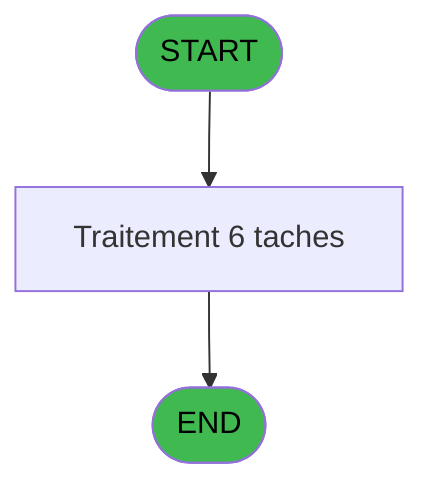

Generate a complete Zustand store for the "facturationAppel" domain.

RULES (MANDATORY):
- Use import aliases: @/ for src root (e.g. @/stores/..., @/types/...)
- NEVER use `any` type - use `unknown` or precise types
- Tailwind v4 classes for styling (no tailwind.config.js)
- Arrow functions everywhere (no function declarations)
- `as const` instead of TypeScript enum
- verbatimModuleSyntax is enabled: use `import type { X }` ONLY for types/interfaces, use `import { X }` for values/consts
- File must be COMPLETE and ready to write - NO placeholders, NO TODOs, NO "// implement here"
- NO comments except for genuinely complex logic
- Output ONLY the code inside a single markdown code block (```typescript ... ``` or ```tsx ... ```)

SHARED INFRASTRUCTURE (use these exact imports):
- Data source toggle: `import { useDataSourceStore } from "@/stores/dataSourceStore"` (has .getState().isRealApi)
- API client: `import { apiClient } from "@/services/api/apiClient"` and `import type { ApiResponse } from "@/services/api/apiClient"`
- Screen layout: `import { ScreenLayout } from "@/components/layout"` (wrapper with sidebar, takes children + className)
- UI components: `import { Button, Dialog, Input } from "@/components/ui"`
- cn utility: `import { cn } from "@/lib/utils"`

STORE REQUIREMENTS:
- Use `create` from zustand (import { create } from "zustand")
- Import types from @/types/facturationAppel
- Import useDataSourceStore from @/stores/dataSourceStore
- Mock/API branching via useDataSourceStore.getState().isRealApi
- try/catch with `e instanceof Error` for error handling
- Realistic mock data (not lorem ipsum)
- EVERY business rule from the analysis MUST be implemented
- Include reset() action to clear state

TYPES FILE (already generated):
import type { ApiResponse } from "@/services/api/apiClient";

export interface HistoriqueAppel {
  societe: string;
  prefixe: string;
  dateAppel: Date;
  heureAppel: string;
  numeroTel: string;
  duree: string;
  montant: number;
  gratuit: boolean;
  raisonGratuite: string | null;
}

export interface CoefTelephone {
  qualite: string;
  coefficient: number;
}

export interface ReseauCloture {
  testReseau: string;
  clotureEnCours: boolean;
}

export interface FacturationFilters {
  dateDebut?: Date;
  dateFin?: Date;
  numeroTel?: string;
}

export interface FacturationAppelState {
  historiqueAppels: HistoriqueAppel[];
  coefficients: CoefTelephone[];
  reseauStatus: ReseauCloture | null;
  isLoading: boolean;
  error: string | null;
  selectedAppel: HistoriqueAppel | null;
  filters: FacturationFilters;
  chargerHistoriqueAppels: (societe: string, compte: number, filiation: number) => Promise<void>;
  recupererCoefficient: (qualite: string) => Promise<number>;
  facturer: (appel: HistoriqueAppel) => Promise<void>;
  debloquerCloture: () => Promise<void>;
  testerReseau: () => Promise<string>;
  annulerFacturation: (appelId: number) => Promise<void>;
  setSelectedAppel: (appel: HistoriqueAppel | null) => void;
  setFilters: (filters: FacturationFilters) => void;
  setError: (error: string | null) => void;
  reset: () => void;
}

export interface GetHistoriqueAppelsRequest {
  societe: string;
  compte: number;
  filiation: number;
  dateDebut?: string;
  dateFin?: string;
  numeroTel?: string;
}

export interface GetHistoriqueAppelsResponse extends ApiResponse {
  data: HistoriqueAppel[];
}

export interface GetCoefficientRequest {
  qualite: string;
}

export interface GetCoefficientResponse extends ApiResponse {
  data: CoefTelephone;
}

export interface FacturerRequest {
  societe: string;
  compte: number;
  filiation: number;
  appel: HistoriqueAppel;
}

export interface FacturerResponse extends ApiResponse {
  data: {
    success: boolean;
    montant: number;
  };
}

export interface AnnulerFacturationRequest {
  appelId: number;
}

export interface AnnulerFacturationResponse extends ApiResponse {
  data: {
    success: boolean;
  };
}

export interface GetReseauStatusRequest {
  societe: string;
}

export interface GetReseauStatusResponse extends ApiResponse {
  data: ReseauCloture;
}

export interface DebloquerClotureRequest {
  societe: string;
  compte: number;
  filiation: number;
}

export interface DebloquerClotureResponse extends ApiResponse {
  data: {
    success: boolean;
  };
}

export interface TesterReseauRequest {
  societe: string;
}

export interface TesterReseauResponse extends ApiResponse {
  data: {
    status: string;
  };
}

export const FACTURATION_STATUS = {
  PENDING: 'pending',
  SUCCESS: 'success',
  ERROR: 'error',
  CANCELLED: 'cancelled',
} as const;

export type FacturationStatus = typeof FACTURATION_STATUS[keyof typeof FACTURATION_STATUS];

export const RESEAU_TEST_TYPES = {
  OK: 'OK',
  ALERT: 'ALERT',
  ERROR: 'ERROR',
} as const;

export type ReseauTestType = typeof RESEAU_TEST_TYPES[keyof typeof RESEAU_TEST_TYPES];

ANALYSIS DOCUMENT:
{
  "domain": "facturationAppel",
  "domainPascal": "FacturationAppel",
  "complexity": "MEDIUM",
  "entities": [
    {
      "name": "HistoriqueAppel",
      "fields": [
        {
          "name": "societe",
          "type": "string",
          "source": "historique_pabx.societe",
          "nullable": false
        },
        {
          "name": "prefixe",
          "type": "string",
          "source": "historique_pabx.prefixe",
          "nullable": false
        },
        {
          "name": "dateAppel",
          "type": "Date",
          "source": "historique_pabx.date_appel",
          "nullable": false
        },
        {
          "name": "heureAppel",
          "type": "string",
          "source": "historique_pabx.heure_appel",
          "nullable": false
        },
        {
          "name": "numeroTel",
          "type": "string",
          "source": "historique_pabx.numero_tel",
          "nullable": false
        },
        {
          "name": "duree",
          "type": "string",
          "source": "historique_pabx.duree",
          "nullable": false
        },
        {
          "name": "montant",
          "type": "number",
          "source": "historique_pabx.montant",
          "nullable": false
        },
        {
          "name": "gratuit",
          "type": "boolean",
          "source": "historique_pabx.gratuite",
          "nullable": false
        },
        {
          "name": "raisonGratuite",
          "type": "string",
          "source": "historique_pabx.raison_gratuite",
          "nullable": true
        }
      ]
    },
    {
      "name": "CoefTelephone",
      "fields": [
        {
          "name": "qualite",
          "type": "string",
          "source": "coef__telephone__coe.qualite",
          "nullable": false
        },
        {
          "name": "coefficient",
          "type": "number",
          "source": "coef__telephone__coe.coeff_tel",
          "nullable": false
        }
      ]
    },
    {
      "name": "ReseauCloture",
      "fields": [
        {
          "name": "testReseau",
          "type": "string",
          "source": "reseau_cloture___rec.test_reseau",
          "nullable": false
        },
        {
          "name": "clotureEnCours",
          "type": "boolean",
          "source": "reseau_cloture___rec.cloture_en_cours",
          "nullable": false
        }
      ]
    }
  ],
  "stateFields": [
    {
      "name": "historiqueAppels",
      "type": "HistoriqueAppel[]",
      "default": "[]"
    },
    {
      "name": "coefficients",
      "type": "CoefTelephone[]",
      "default": "[]"
    },
    {
      "name": "reseauStatus",
      "type": "ReseauCloture | null",
      "default": "null"
    },
    {
      "name": "isLoading",
      "type": "boolean",
      "default": "false"
    },
    {
      "name": "error",
      "type": "string | null",
      "default": "null"
    },
    {
      "name": "selectedAppel",
      "type": "HistoriqueAppel | null",
      "default": "null"
    },
    {
      "name": "filters",
      "type": "{ dateDebut?: Date; dateFin?: Date; numeroTel?: string }",
      "default": "{}"
    }
  ],
  "actions": [
    {
      "name": "chargerHistoriqueAppels",
      "params": [
        "societe: string",
        "compte: number",
        "filiation: number"
      ],
      "businessRules": [
        "Charger l'historique des appels pour un compte donné",
        "Filtrer par date si spécifié dans filters",
        "Trier par date et heure décroissante"
      ],
      "returns": "Promise<void>"
    },
    {
      "name": "recupererCoefficient",
      "params": [
        "qualite: string"
      ],
      "businessRules": [
        "[RM-001] Déterminer qualité GO ou GM selon variable GO",
        "Récupérer le coefficient téléphone correspondant"
      ],
      "returns": "Promise<number>"
    },
    {
      "name": "facturer",
      "params": [
        "appel: HistoriqueAppel"
      ],
      "businessRules": [
        "Vérifier que le réseau n'est pas en cours de clôture",
        "Calculer le montant selon coefficient et durée",
        "Créer une opération de débit (délégué à IDE 16)",
        "Mettre à jour l'historique PABX"
      ],
      "returns": "Promise<void>"
    },
    {
      "name": "debloquerCloture",
      "params": [],
      "businessRules": [
        "Vérifier l'état de clôture (IDE 19)",
        "Débloquer le compte si nécessaire (IDE 17)",
        "Mettre à jour le statut réseau"
      ],
      "returns": "Promise<void>"
    },
    {
      "name": "testerReseau",
      "params": [],
      "businessRules": [
        "Appeler IDE 18 pour tester l'état du réseau",
        "Retourner le statut du réseau"
      ],
      "returns": "Promise<string>"
    },
    {
      "name": "annulerFacturation",
      "params": [
        "appelId: number"
      ],
      "businessRules": [
        "Annuler une facturation existante",
        "Mettre à jour l'historique PABX",
        "Créer une opération inverse"
      ],
      "returns": "Promise<void>"
    }
  ],
  "apiEndpoints": [
    {
      "method": "GET",
      "path": "/api/telephone/historique",
      "queryParams": [
        "societe",
        "compte",
        "filiation",
        "dateDebut?",
        "dateFin?",
        "numeroTel?"
      ],
      "response": "HistoriqueAppel[]"
    },
    {
      "method": "GET",
      "path": "/api/telephone/coefficient/{qualite}",
      "queryParams": [],
      "response": "CoefTelephone"
    },
    {
      "method": "POST",
      "path": "/api/telephone/facturer",
      "queryParams": [],
      "response": "{ success: boolean; montant: number }"
    },
    {
      "method": "POST",
      "path": "/api/telephone/annuler/{appelId}",
      "queryParams": [],
      "response": "{ success: boolean }"
    },
    {
      "method": "GET",
      "path": "/api/reseau/status",
      "queryParams": [],
      "response": "ReseauCloture"
    },
    {
      "method": "POST",
      "path": "/api/reseau/debloquer",
      "queryParams": [],
      "response": "{ success: boolean }"
    }
  ],
  "uiLayout": {
    "type": "modal-dialog",
    "sections": [
      {
        "name": "filters",
        "controls": [
          "DateRangePicker (dateDebut, dateFin)",
          "TextInput (numeroTel)",
          "Button (rechercher)"
        ]
      },
      {
        "name": "historiqueList",
        "controls": [
          "DataGrid (columns: date, heure, numero, durée, montant, gratuit)",
          "SelectionRow (onClick -> selectedAppel)"
        ]
      },
      {
        "name": "actions",
        "controls": [
          "Button (facturer - primary)",
          "Button (annuler - danger)",
          "StatusIndicator (réseau)"
        ]
      },
      {
        "name": "details",
        "controls": [
          "ReadonlyField (société, compte, filiation)",
          "ReadonlyField (nom, prénom)",
          "ReadonlyField (solde compte)",
          "ReadonlyField (coefficient appliqué)"
        ]
      }
    ]
  },
  "mockData": {
    "count": 10,
    "description": "10 appels téléphoniques avec dates variées (7 derniers jours), numéros internationaux/locaux, durées 1-30min, montants 0.50€-25.00€, 2 gratuits avec raison 'Promotion' ou 'Erreur système'"
  },
  "dependencies": {
    "stores": [
      "useSessionStore (societe, compte, filiation)",
      "useParametresStore (testReseau)",
      "useTransactionStore (créer OD via IDE 16)"
    ],
    "sharedTypes": [
      "Devise (from deviseStore)",
      "CompteInfo (from sessionStore)"
    ],
    "externalApis": [
      "POST /api/operations/creer (IDE 16 - Creation O.D)",
      "POST /api/compte/debloquer (IDE 17 - Deblocage compte GM)",
      "GET /api/reseau/test (IDE 18 - Test reseau)",
      "GET /api/cloture/status (IDE 19 - Test si cloture en cours)"
    ]
  }
}

SPEC EXCERPT (business rules):
# ADH IDE 174 - Facturation appel

> **Analyse**: Phases 1-4 2026-02-03 10:54 -> 10:54 (16s) | Assemblage 07:23
> **Pipeline**: V7.2 Enrichi
> **Structure**: 4 onglets (Resume | Ecrans | Donnees | Connexions)

<!-- TAB:Resume -->

## 1. FICHE D'IDENTITE

| Attribut | Valeur |
|----------|--------|
| Projet | ADH |
| IDE Position | 174 |
| Nom Programme | Facturation appel |
| Fichier source | `Prg_174.xml` |
| Dossier IDE | Operations |
| Taches | 6 (0 ecrans visibles) |
| Tables modifiees | 3 |
| Programmes appeles | 5 |

## 2. DESCRIPTION FONCTIONNELLE

**Facturation appel** assure la gestion complete de ce processus, accessible depuis [Menu caisse GM - scroll @ (IDE 22)](ADH-IDE-22.md).

Le flux de traitement s'organise en **1 blocs fonctionnels** :

- **Traitement** (6 taches) : traitements metier divers

**Donnees modifiees** : 3 tables en ecriture (reseau_cloture___rec, historique_pabx, coef__telephone__coe).

**Logique metier** : 1 regles identifiees couvrant conditions metier.

<details>
<summary>Detail : phases du traitement</summary>

#### Phase 1 : Traitement (6 taches)

- **T1** - Facturation appel
- **T2** - Historique appel
- **T3** - Historique appel
- **T4** - Recuperation coef
- **T5** - Deblocage cloture
- **T8** - Deblocage cloture

Delegue a : [  Test reseau (IDE 18)](ADH-IDE-18.md), [  Test si cloture en cours (IDE 19)](ADH-IDE-19.md)

#### Tables impactees

| Table | Operations | Role metier |
|-------|-----------|-------------|
| reseau_cloture___rec | **W** (2 usages) | Donnees reseau/cloture |
| historique_pabx | **W** (2 usages) | Historique / journal |
| coef__telephone__coe | **W** (1 usages) |  |

</details>

## 3. BLOCS FONCTIONNELS

### 3.1 Traitement (6 taches)

Traitements internes.

---

#### <a id="t1"></a>T1 - Facturation appel

**Role** : Tache d'orchestration : point d'entree du programme (6 sous-taches). Coordonne l'enchainement des traitements.

<details>
<summary>5 sous-taches directes</summary>

| Tache | Nom | Bloc |
|-------|-----|------|
| [T2](#t2) | Historique appel | Traitement |
| [T3](#t3) | Historique appel | Traitement |
| [T4](#t4) | Recuperation coef | Traitement |
| [T5](#t5) | Deblocage cloture | Traitement |
| [T8](#t8) | Deblocage cloture | Traitement |

</details>
**Variables liees** : C (> date appel), D (> heure appel)
**Delegue a** : [  Test reseau (IDE 18)](ADH-IDE-18.md), [  Test si cloture en cours (IDE 19)](ADH-IDE-19.md)

---

#### <a id="t2"></a>T2 - Historique appel

**Role** : Consultation/chargement : Historique appel.
**Variables liees** : C (> date appel), D (> heure appel)
**Delegue a** : [  Test reseau (IDE 18)](ADH-IDE-18.md), [  Test si cloture en cours (IDE 19)](ADH-IDE-19.md)

---

#### <a id="t3"></a>T3 - Historique appel

**Role** : Consultation/chargement : Historique appel.
**Variables liees** : C (> date appel), D (> heure appel)
**Delegue a** : [  Test reseau (IDE 18)](ADH-IDE-18.md), [  Test si cloture en cours (IDE 19)](ADH-IDE-19.md)

---

#### <a id="t4"></a>T4 - Recuperation coef

**Role** : Consultation/chargement : Recuperation coef.
**Variables liees** : V (w0 coeff tel)
**Delegue a** : [  Test reseau (IDE 18)](ADH-IDE-18.md), [  Test si cloture en cours (IDE 19)](ADH-IDE-19.md)

---

#### <a id="t5"></a>T5 - Deblocage cloture

**Role** : Traitement : Deblocage cloture.
**Variables liees** : W (w0 cloture en cours)
**Delegue a** : [  Deblocage compte GM (IDE 17)](ADH-IDE-17.md), [  Test reseau (IDE 18)](ADH-IDE-18.md), [  Test si cloture en cours (IDE 19)](ADH-IDE-19.md)

---

#### <a id="t8"></a>T8 - Deblocage cloture

**Role** : Traitement : Deblocage cloture.
**Variables liees** : W (w0 cloture en cours)
**Delegue a** : [  Deblocage compte GM (IDE 17)](ADH-IDE-17.md), [  Test reseau (IDE 18)](ADH-IDE-18.md), [  Test si cloture en cours (IDE 19)](ADH-IDE-19.md)


## 5. REGLES METIER

1 regles identifiees:

### Autres (1 regles)

#### <a id="rm-RM-001"></a>[RM-001] Si > GO [G] alors 'GO' sinon 'GM')

| Element | Detail |
|---------|--------|
| **Condition** | `> GO [G]` |
| **Si vrai** | 'GO' |
| **Si faux** | 'GM') |
| **Variables** | G (> GO) |
| **Expression source** | Expression 4 : `IF (> GO [G],'GO','GM')` |
| **Exemple** | Si > GO [G] → 'GO'. Sinon → 'GM') |

## 6. CONTEXTE

- **Appele par**: [Menu caisse GM - scroll @ (IDE 22)](ADH-IDE-22.md)
- **Appelle**: 5 programmes | **Tables**: 3 (W:3 R:0 L:0) | **Taches**: 6 | **Expressions**: 15

<!-- TAB:Ecrans -->

## 8. ECRANS

*(Programme sans ecran visible)*

## 9. NAVIGATION

### 9.3 Structure hierarchique (6 taches)

| Position | Tache | Type | Dimensions | Bloc |
|----------|-------|------|------------|------|
| **174.1** | [**Facturation appel** (T1)](#t1) | MDI | - | Traitement |
| 174.1.1 | [Historique appel (T2)](#t2) | MDI | - | |
| 174.1.2 | [Historique appel (T3)](#t3) | MDI | - | |
| 174.1.3 | [Recuperation coef (T4)](#t4) | MDI | - | |
| 174.1.4 | [Deblocage cloture (T5)](#t5) | MDI | - | |
| 174.1.5 | [Deblocage cloture (T8)](#t8) | MDI | - | |

### 9.4 Algorigramme



> *algo-data indisponible. Utiliser `/algorigramme` pour generer.*

<!-- TAB:Donnees -->

## 10. TABLES

### Tables utilisees (3)

| ID | Nom | Description | Type | R | W | L | Usages |
|----|-----|-------------|------|---|---|---|--------|
| 23 | reseau_cloture___rec | Donnees reseau/cloture | DB |   | **W** |   | 2 |
| 155 | historique_pabx | Historique / journal | DB |   | **W** |   | 2 |
| 157 | coef__telephone__coe |  | DB |   | **W** |   | 1 |

### Colonnes par table (2 / 3 tables avec colonnes identifiees)

<details>
<summary>Table 23 - reseau_cloture___rec (**W**) - 2 usages</summary>

| Lettre | Variable | Acces | Type |
|--------|----------|-------|------|
| W | w0 cloture en cours | W | Logical |
| X | w0 test reseau | W | Alpha |

</details>


REFERENCE PATTERN (follow this exact structure):
```typescript
import { create } from 'zustand';
import type {
  ExtraitAccountInfo,
  ExtraitTransaction,
  ExtraitSummary,
  ExtraitPrintFormat,
} from '@/types/extrait';
import { extraitApi } from '@/services/api/endpoints-lot3';
import { useDataSourceStore } from './dataSourceStore';

interface ExtraitState {
  selectedAccount: ExtraitAccountInfo | null;
  transactions: ExtraitTransaction[];
  summary: ExtraitSummary | null;
  searchResults: ExtraitAccountInfo[];
  isSearching: boolean;
  isLoadingExtrait: boolean;
  isPrinting: boolean;
  error: string | null;
}

interface ExtraitActions {
  searchAccount: (societe: string, query: string) => Promise<void>;
  selectAccount: (account: ExtraitAccountInfo) => void;
  loadExtrait: (
    societe: string,
    codeAdherent: number,
    filiation: number,
    dateDebut?: string,
    dateFin?: string,
  ) => Promise<void>;
  printExtrait: (
    societe: string,
    codeAdherent: number,
    filiation: number,
    format: ExtraitPrintFormat,
  ) => Promise<void>;
  reset: () => void;
}

type ExtraitStore = ExtraitState & ExtraitActions;

const MOCK_ACCOUNTS: ExtraitAccountInfo[] = [
  { societe: 'SOC1', codeAdherent: 1001, filiation: 0, nom: 'DUPONT', prenom: 'Jean', statut: 'normal', hasGiftPass: false },
  { societe: 'SOC1', codeAdherent: 1002, filiation: 0, nom: 'MARTIN', prenom: 'Sophie', statut: 'normal', hasGiftPass: true },
  { societe: 'SOC1', codeAdherent: 1003, filiation: 1, nom: 'DURAND', prenom: 'Pierre', statut: 'bloque', hasGiftPass: false },
];

const MOCK_TRANSACTIONS: ExtraitTransaction[] = [
  { id: 1, date: '2026-02-10', heure: '09:15', libelle: 'Achat boutique', debit: 45.50, credit: 0, solde: -45.50, codeService: 'BTQ', codeImputation: 'IMP01', giftPassFlag: false, nbArticles: 3, status: 'debit', numeroPiece: 'VTE-001', modePaiement: 'CB', caissier: 'MARTIN S.' },
  { id: 2, date: '2026-02-10', heure: '14:30', libelle: 'Credit compte', debit: 0, credit: 200, solde: 154.50, codeService: 'CAI', codeImputation: 'IMP02', giftPassFlag: false, status: 'credit', numeroPiece: 'CRD-042', modePaiement: 'Especes', caissier: 'DUPONT J.' },
  { id: 3, date: '2026-02-09', heure: '12:45', libelle: 'Repas restaurant', libelleSupplementaire: 'Menu du jour', debit: 32.00, credit: 0, solde: 122.50, codeService: 'RST', codeImputation: 'IMP03', giftPassFlag: true, nbArticles: 1, status: 'debit', numeroPiece: 'RST-117', modePaiement: 'GiftPass', caissier: 'MARTIN S.' },
  { id: 4, date: '2026-02-08', heure: '16:00', libelle: 'Annulation vente', debit: 0, credit: 15.00, solde: 154.50, codeService: 'BTQ', codeImputation: 'IMP01', giftPassFlag: false, status: 'annule', numeroPiece: 'ANN-003', modePaiement: 'CB', caissier: 'DUPONT J.', commentaire: 'Erreur de saisie' },
  { id: 5, date: '2026-02-08', heure: '10:20', libelle: 'Regularisation solde', debit: 0, credit: 5.00, solde: 139.50, codeService: 'CAI', codeImputation: 'IMP02', giftPassFlag: false, status: 'regularise', numeroPiece: 'REG-007', modePaiement: 'Interne', caissier: 'ADMIN' },
];

const MOCK_SUMMARY: ExtraitSummary = {
  totalDebit: 77.50,
  totalCredit: 220,
  soldeActuel: 142.50,
  nbTransactions: 5,
};

const initialState: ExtraitState = {
  selectedAccount: null,
  transactions: [],
  summary: null,
  searchResults: [],
  isSearching: false,
  isLoadingExtrait: false,
  isPrinting: false,
  error: null,
};

export const useExtraitStore = create<ExtraitStore>()((set) => ({
  ...initialState,

  searchAccount: async (societe, query) => {
    const { isRealApi } = useDataSourceStore.getState();
    set({ isSearching: true, error: null });

    if (!isRealApi) {
      const filtered = MOCK_ACCOUNTS.filter(
        (a) =>
          a.nom.toLowerCase().includes(query.toLowerCase()) ||
          a.prenom.toLowerCase().includes(query.toLowerCase()) ||
          String(a.codeAdherent).includes(query),
      );
      set({ searchResults: filtered, isSearching: false });
      return;
    }

    try {
      const response = await extraitApi.searchAccount(societe, query);
      set({ searchResults: response.data.data ?? [] });
    } catch (e: unknown) {
      const message = e instanceof Error ? e.message : 'Erreur recherche compte';
      set({ searchResults: [], error: message });
    } finally {
      set({ isSearching: false });
    }
  },

  selectAccount: (account) => {
    set({ selectedAccount: account, transactions: [], summary: null, error: null });
  },

  loadExtrait: async (societe, codeAdherent, filiation, dateDebut, dateFin) => {
    const { isRealApi } = useDataSourceStore.getState();
    set({ isLoadingExtrait: true, error: null });

    if (!isRealApi) {
      set({
        transactions: MOCK_TRANSACTIONS,
        summary: MOCK_SUMMARY,
        isLoadingExtrait: false,
      });
      return;
    }

    try {
      const response = await extraitApi.getExtrait(
        societe,
        codeAdherent,
        filiation,
        dateDebut,
        dateFin,
      );
      const data = response.data.data;
      set({
        transactions: data?.transactions ?? [],
        summary: data?.summary ?? null,
      });
    } catch (e: unknown) {
      const message = e instanceof Error ? e.message : 'Erreur chargement extrait';
      set({ transactions: [], summary: null, error: message });
    } finally {
      set({ isLoadingExtrait: false });
    }
  },

  printExtrait: async (societe, codeAdherent, filiation, format) => {
    const { isRealApi } = useDataSourceStore.getState();
    set({ isPrinting: true, error: null });

    if (!isRealApi) {
      set({ isPrinting: false });
      return;
    }

    try {
      await extraitApi.printExtrait({
        societe,
        codeAdherent,
        filiation,
        format,
      });
    } catch (e: unknown) {
      const message = e instanceof Error ? e.message : 'Erreur impression';
      set({ error: message });
    } finally {
      set({ isPrinting: false });
    }
  },

  reset: () => set({ ...initialState }),
}));

```