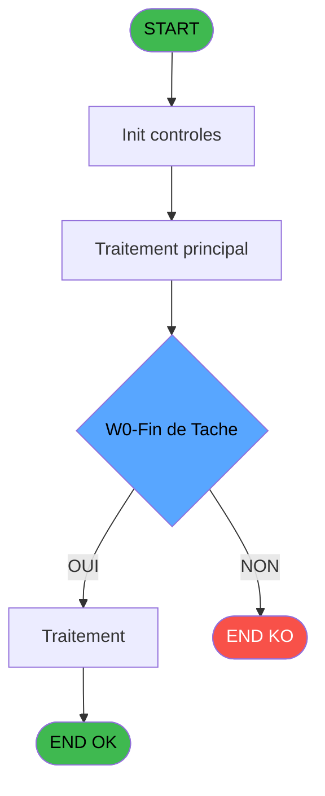
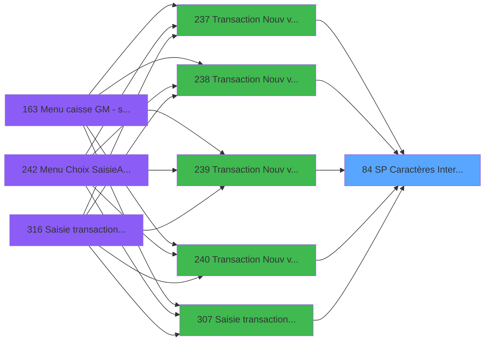

You are a software architect producing a design document for migrating a Magic Unipaas program to React/TypeScript.

Produce a JSON document following this EXACT structure:
```json
{
  "domain": "camelCaseDomainName",
  "domainPascal": "PascalCaseDomainName",
  "complexity": "LOW|MEDIUM|HIGH",
  "entities": [
    {
      "name": "EntityName",
      "fields": [
        {
          "name": "fieldName",
          "type": "string|number|boolean|Date",
          "source": "table.column",
          "nullable": false
        }
      ]
    }
  ],
  "stateFields": [
    {
      "name": "fieldName",
      "type": "TypeName[]",
      "default": "[]"
    }
  ],
  "actions": [
    {
      "name": "actionName",
      "params": [
        "param: type"
      ],
      "businessRules": [
        "Rule description"
      ],
      "returns": "Promise<void>"
    }
  ],
  "apiEndpoints": [
    {
      "method": "GET",
      "path": "/api/domain/resource",
      "queryParams": [
        "param?"
      ],
      "response": "ResponseType"
    }
  ],
  "uiLayout": {
    "type": "page-type",
    "sections": [
      {
        "name": "sectionName",
        "controls": [
          "control1"
        ]
      }
    ]
  },
  "mockData": {
    "count": 5,
    "description": "Description of mock data"
  },
  "dependencies": {
    "stores": [
      "useDataSourceStore"
    ],
    "sharedTypes": [],
    "externalApis": []
  }
}
```

IMPORTANT:
- Derive entity fields from actual DB column types when DB metadata is available
- Each business rule from the spec/contract MUST map to an action
- API endpoints should follow existing patterns: /api/{domain}/{resource}
- State fields must cover ALL data the UI needs to display
- Include isLoading, error, and filter states

PROGRAM SPEC:
# ADH IDE 84 - SP Caractères Interdits

> **Analyse**: Phases 1-4 2026-02-07 03:45 -> 02:20 (22h34min) | Assemblage 02:20
> **Pipeline**: V7.2 Enrichi
> **Structure**: 4 onglets (Resume | Ecrans | Donnees | Connexions)

<!-- TAB:Resume -->

## 1. FICHE D'IDENTITE

| Attribut | Valeur |
|----------|--------|
| Projet | ADH |
| IDE Position | 84 |
| Nom Programme | SP Caractères Interdits |
| Fichier source | `Prg_84.xml` |
| Dossier IDE | General |
| Taches | 2 (0 ecrans visibles) |
| Tables modifiees | 0 |
| Programmes appeles | 0 |
| Complexite | **BASSE** (score 0/100) |

## 2. DESCRIPTION FONCTIONNELLE

ADH IDE 84 - CARACT_INTERDIT est un utilitaire de validation de caractères interdits utilisé lors de la saisie de transactions commerciales. Le programme vérifie qu'une chaîne de caractères ne contient pas de caractères non autorisés ou invalides selon les règles métier de la caisse. Il est appelé principalement lors de la création de nouvelles ventes avec Gift Pass (IDE 237-240) et lors de la saisie manuelle de transactions (IDE 307, 310, 316).

Le programme expose une interface publique callable via `ProgIdx('CARACT_INTERDIT')` depuis d'autres modules. Il contient deux tâches principales : "Caractères Interdits" qui effectue la validation proprement dite en comparant la chaîne d'entrée contre une liste de caractères interdits, et "Vérification Chaîne" qui prépare ou post-traite les données de validation.

Ce programme fait partie de la composante ADH.ecf (Sessions_Reprises) et est partagé entre plusieurs projets. Il s'inscrit dans la couche de validation métier de la gestion de caisse, garantissant l'intégrité des données de transactions avant leur enregistrement dans la base de données.

## 3. BLOCS FONCTIONNELS

### 3.1 Traitement (1 tache)

Traitements internes.

---

#### <a id="t1"></a>84 - Caractères Interdits

**Role** : Traitement : Caractères Interdits.


### 3.2 Validation (1 tache)

Controles de coherence : 1 tache verifie les donnees et conditions.

---

#### <a id="t2"></a>84.1 - Verification Chaine

**Role** : Verification : Verification Chaine.


## 5. REGLES METIER

1 regles identifiees:

### Autres (1 regles)

#### <a id="rm-RM-001"></a>[RM-001] Condition: W0-Fin de Tache [D] egale 'F'

| Element | Detail |
|---------|--------|
| **Condition** | `W0-Fin de Tache [D]='F'` |
| **Si vrai** | Action si vrai |
| **Variables** | EQ (W0-Fin de Tache) |
| **Expression source** | Expression 2 : `W0-Fin de Tache [D]='F'` |
| **Exemple** | Si W0-Fin de Tache [D]='F' → Action si vrai |

## 6. CONTEXTE

- **Appele par**: [Transaction Nouv vente avec GP (IDE 237)](ADH-IDE-237.md), [Transaction Nouv vente PMS-584 (IDE 238)](ADH-IDE-238.md), [Transaction Nouv vente PMS-721 (IDE 239)](ADH-IDE-239.md), [Transaction Nouv vente PMS-710 (IDE 240)](ADH-IDE-240.md), [Saisie transaction 154  N.U (IDE 307)](ADH-IDE-307.md), [Saisie transaction Nouv vente (IDE 310)](ADH-IDE-310.md), [Saisie transaction Nouv vente (IDE 316)](ADH-IDE-316.md)
- **Appelle**: 0 programmes | **Tables**: 0 (W:0 R:0 L:0) | **Taches**: 2 | **Expressions**: 2

<!-- TAB:Ecrans -->

## 8. ECRANS

*(Programme sans ecran visible)*

## 9. NAVIGATION

### 9.3 Structure hierarchique (2 taches)

| Position | Tache | Type | Dimensions | Bloc |
|----------|-------|------|------------|------|
| **84.1** | [**Caractères Interdits** (84)](#t1) | MDI | - | Traitement |
| **84.2** | [**Verification Chaine** (84.1)](#t2) | MDI | - | Validation |

### 9.4 Algorigramme



> **Legende**: Vert = START/END OK | Rouge = END KO | Bleu = Decisions
> *Algorigramme auto-genere. Utiliser `/algorigramme` pour une synthese metier detaillee.*

<!-- TAB:Donnees -->

## 10. TABLES

### Tables utilisees (0)

| ID | Nom | Description | Type | R | W | L | Usages |
|----|-----|-------------|------|---|---|---|--------|

### Colonnes par table (0 / 0 tables avec colonnes identifiees)

## 11. VARIABLES

### 11.1 Autres (4)

Variables diverses.

| Lettre | Nom | Type | Usage dans |
|--------|-----|------|-----------|
| EN | P0-Code | Alpha | - |
| EO | P0-Accord Suite | Alpha | - |
| EP | P0-N/P | Alpha | - |
| EQ | W0-Fin de Tache | Alpha | 1x refs |

## 12. EXPRESSIONS

**2 / 2 expressions decodees (100%)**

### 12.1 Repartition par type

| Type | Expressions | Regles |
|------|-------------|--------|
| CONDITION | 1 | 5 |
| CONSTANTE | 1 | 0 |

### 12.2 Expressions cles par type

#### CONDITION (1 expressions)

| Type | IDE | Expression | Regle |
|------|-----|------------|-------|
| CONDITION | 2 | `W0-Fin de Tache [D]='F'` | [RM-001](#rm-RM-001) |

#### CONSTANTE (1 expressions)

| Type | IDE | Expression | Regle |
|------|-----|------------|-------|
| CONSTANTE | 1 | `'F'` | - |

<!-- TAB:Connexions -->

## 13. GRAPHE D'APPELS

### 13.1 Chaine depuis Main (Callers)

Main -> ... -> [Transaction Nouv vente avec GP (IDE 237)](ADH-IDE-237.md) -> **SP Caractères Interdits (IDE 84)**

Main -> ... -> [Transaction Nouv vente PMS-584 (IDE 238)](ADH-IDE-238.md) -> **SP Caractères Interdits (IDE 84)**

Main -> ... -> [Transaction Nouv vente PMS-721 (IDE 239)](ADH-IDE-239.md) -> **SP Caractères Interdits (IDE 84)**

Main -> ... -> [Transaction Nouv vente PMS-710 (IDE 240)](ADH-IDE-240.md) -> **SP Caractères Interdits (IDE 84)**

Main -> ... -> [Saisie transaction 154  N.U (IDE 307)](ADH-IDE-307.md) -> **SP Caractères Interdits (IDE 84)**

Main -> ... -> [Saisie transaction Nouv vente (IDE 310)](ADH-IDE-310.md) -> **SP Caractères Interdits (IDE 84)**

Main -> ... -> [Saisie transaction Nouv vente (IDE 316)](ADH-IDE-316.md) -> **SP Caractères Interdits (IDE 84)**



### 13.2 Callers

| IDE | Nom Programme | Nb Appels |
|-----|---------------|-----------|
| [237](ADH-IDE-237.md) | Transaction Nouv vente avec GP | 2 |
| [238](ADH-IDE-238.md) | Transaction Nouv vente PMS-584 | 2 |
| [239](ADH-IDE-239.md) | Transaction Nouv vente PMS-721 | 2 |
| [240](ADH-IDE-240.md) | Transaction Nouv vente PMS-710 | 2 |
| [307](ADH-IDE-307.md) | Saisie transaction 154  N.U | 2 |
| [310](ADH-IDE-310.md) | Saisie transaction Nouv vente | 2 |
| [316](ADH-IDE-316.md) | Saisie transaction Nouv vente | 2 |

### 13.3 Callees (programmes appeles)


### 13.4 Detail Callees avec contexte

| IDE | Nom Programme | Appels | Contexte |
|-----|---------------|--------|----------|
| - | (aucun) | - | - |

## 14. RECOMMANDAT

CONTRACT:
{
  "program": {
    "id": 0,
    "name": "",
    "complexity": "MEDIUM",
    "callers": [],
    "callees": [],
    "tasksCount": 2,
    "tablesCount": 0,
    "expressionsCount": 2
  },
  "rules": [
    {
      "id": "RM-001",
      "description": "Condition: W0-Fin de Tache [D] egale 'F'",
      "condition": "W0-Fin de Tache [D]='F'",
      "variables": [
        "EQ"
      ],
      "status": "IMPL",
      "targetFile": "adh-web/src/stores/saisieContenuCaisseStore.ts",
      "gapNotes": ""
    }
  ],
  "tables": [],
  "callees": [],
  "variables": [
    {
      "localId": "EQ",
      "name": "W0-Fin de Tache",
      "type": "Real",
      "status": "MISSING",
      "targetFile": "",
      "gapNotes": ""
    }
  ]
}