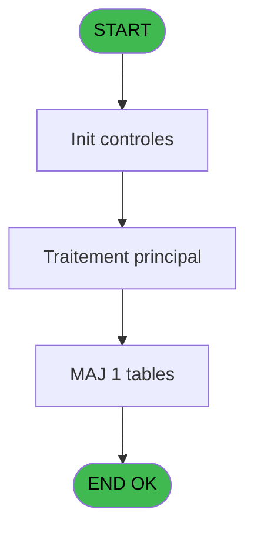
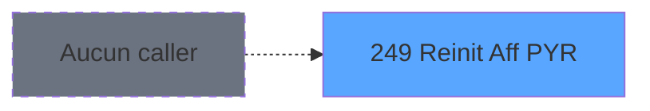
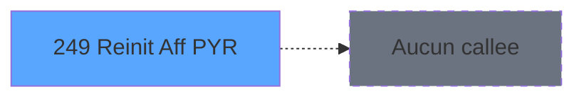

You are a software architect producing a design document for migrating a Magic Unipaas program to React/TypeScript.

Produce a JSON document following this EXACT structure:
```json
{
  "domain": "camelCaseDomainName",
  "domainPascal": "PascalCaseDomainName",
  "complexity": "LOW|MEDIUM|HIGH",
  "entities": [
    {
      "name": "EntityName",
      "fields": [
        {
          "name": "fieldName",
          "type": "string|number|boolean|Date",
          "source": "table.column",
          "nullable": false
        }
      ]
    }
  ],
  "stateFields": [
    {
      "name": "fieldName",
      "type": "TypeName[]",
      "default": "[]"
    }
  ],
  "actions": [
    {
      "name": "actionName",
      "params": [
        "param: type"
      ],
      "businessRules": [
        "Rule description"
      ],
      "returns": "Promise<void>"
    }
  ],
  "apiEndpoints": [
    {
      "method": "GET",
      "path": "/api/domain/resource",
      "queryParams": [
        "param?"
      ],
      "response": "ResponseType"
    }
  ],
  "uiLayout": {
    "type": "page-type",
    "sections": [
      {
        "name": "sectionName",
        "controls": [
          "control1"
        ]
      }
    ]
  },
  "mockData": {
    "count": 5,
    "description": "Description of mock data"
  },
  "dependencies": {
    "stores": [
      "useDataSourceStore"
    ],
    "sharedTypes": [],
    "externalApis": []
  }
}
```

IMPORTANT:
- Derive entity fields from actual DB column types when DB metadata is available
- Each business rule from the spec/contract MUST map to an action
- API endpoints should follow existing patterns: /api/{domain}/{resource}
- State fields must cover ALL data the UI needs to display
- Include isLoading, error, and filter states

PROGRAM SPEC:
# ADH IDE 249 - Reinit Aff PYR

> **Analyse**: Phases 1-4 2026-02-08 04:37 -> 04:37 (5s) | Assemblage 04:37
> **Pipeline**: V7.2 Enrichi
> **Structure**: 4 onglets (Resume | Ecrans | Donnees | Connexions)

<!-- TAB:Resume -->

## 1. FICHE D'IDENTITE

| Attribut | Valeur |
|----------|--------|
| Projet | ADH |
| IDE Position | 249 |
| Nom Programme | Reinit Aff PYR |
| Fichier source | `Prg_249.xml` |
| Dossier IDE | General |
| Taches | 1 (0 ecrans visibles) |
| Tables modifiees | 1 |
| Programmes appeles | 0 |
| Complexite | **BASSE** (score 7/100) |
| <span style="color:red">Statut</span> | <span style="color:red">**ORPHELIN_POTENTIEL**</span> |

## 2. DESCRIPTION FONCTIONNELLE

Ce programme réinitialise les marqueurs temporaires d'affectation PYR (paiement sur chambre) dans la table hebergement après un deversement de transaction. Il agit comme nettoyeur de données automatique en remettant à zéro les flags d'affectation, préparant ainsi le système pour la prochaine transaction. Avec seulement 12 lignes de logique et une tâche unique, c'est un utilitaire très compact appelé automatiquement par le programme de deversement (ADH IDE 247).

La table **hebergement_heb** (n°34, physiquement `cafil012_dat`) est la seule cible en écriture. Le programme effectue des mises à jour de masse sur cette table sans paramètres d'entrée, nettoyant les indicateurs temporaires d'affectation lors du cycle de clôture de caisse.

Le flux est ultra-simple : initialisation → traitement principal sur une tâche unique → aucun appel de sous-programme → retour. C'est un utilitaire terminal sans dépendances externes ni expressions complexes, marqué comme orphelin dans l'analyse car sans callers visibles (bien que réellement appelé par ADH IDE 247 via CallTask).

## 3. BLOCS FONCTIONNELS

## 5. REGLES METIER

1 regles identifiees:

### Autres (1 regles)

#### <a id="rm-RM-001"></a>[RM-001] Valeur par defaut si Trim(p.Chambre [C]) est vide

| Element | Detail |
|---------|--------|
| **Condition** | `Trim(p.Chambre [C])=''` |
| **Si vrai** | '' |
| **Si faux** | 'P') |
| **Variables** | EP (p.Chambre) |
| **Expression source** | Expression 5 : `IF(Trim(p.Chambre [C])='','','P')` |
| **Exemple** | Si Trim(p.Chambre [C])='' → ''. Sinon → 'P') |

## 6. CONTEXTE

- **Appele par**: (aucun)
- **Appelle**: 0 programmes | **Tables**: 1 (W:1 R:0 L:0) | **Taches**: 1 | **Expressions**: 5

<!-- TAB:Ecrans -->

## 8. ECRANS

*(Programme sans ecran visible)*

## 9. NAVIGATION

### 9.3 Structure hierarchique (0 tache)

| Position | Tache | Type | Dimensions | Bloc |
|----------|-------|------|------------|------|

### 9.4 Algorigramme



> **Legende**: Vert = START/END OK | Rouge = END KO | Bleu = Decisions
> *Algorigramme auto-genere. Utiliser `/algorigramme` pour une synthese metier detaillee.*

<!-- TAB:Donnees -->

## 10. TABLES

### Tables utilisees (1)

| ID | Nom | Description | Type | R | W | L | Usages |
|----|-----|-------------|------|---|---|---|--------|
| 34 | hebergement______heb | Hebergement (chambres) | DB |   | **W** |   | 1 |

### Colonnes par table (1 / 1 tables avec colonnes identifiees)

<details>
<summary>Table 34 - hebergement______heb (**W**) - 1 usages</summary>

| Lettre | Variable | Acces | Type |
|--------|----------|-------|------|
| A | p.Societe | W | Unicode |
| B | p.Compte | W | Numeric |
| C | p.Chambre | W | Unicode |

</details>

## 11. VARIABLES

### 11.1 Parametres entrants (3)

Variables recues en parametre.

| Lettre | Nom | Type | Usage dans |
|--------|-----|------|-----------|
| EN | p.Societe | Unicode | 1x parametre entrant |
| EO | p.Compte | Numeric | 1x parametre entrant |
| EP | p.Chambre | Unicode | 2x parametre entrant |

## 12. EXPRESSIONS

**5 / 5 expressions decodees (100%)**

### 12.1 Repartition par type

| Type | Expressions | Regles |
|------|-------------|--------|
| CONDITION | 1 | 5 |
| CONSTANTE | 1 | 0 |
| OTHER | 3 | 0 |

### 12.2 Expressions cles par type

#### CONDITION (1 expressions)

| Type | IDE | Expression | Regle |
|------|-----|------------|-------|
| CONDITION | 5 | `IF(Trim(p.Chambre [C])='','','P')` | [RM-001](#rm-RM-001) |

#### CONSTANTE (1 expressions)

| Type | IDE | Expression | Regle |
|------|-----|------------|-------|
| CONSTANTE | 3 | `'H'` | - |

#### OTHER (3 expressions)

| Type | IDE | Expression | Regle |
|------|-----|------------|-------|
| OTHER | 4 | `p.Chambre [C]` | - |
| OTHER | 2 | `p.Compte [B]` | - |
| OTHER | 1 | `p.Societe [A]` | - |

<!-- TAB:Connexions -->

## 13. GRAPHE D'APPELS

### 13.1 Chaine depuis Main (Callers)

**Chemin**: (pas de callers directs)



### 13.2 Callers

| IDE | Nom Programme | Nb Appels |
|-----|---------------|-----------|
| - | (aucun) | - |

### 13.3 Callees (programmes appeles)



### 13.4 Detail Callees avec contexte

| IDE | Nom Programme | Appels | Contexte |
|-----|---------------|--------|----------|
| - | (aucun) | - | - |

## 14. RECOMMANDATIONS MIGRATION

### 14.1 Profil du programme

| Metrique | Valeur | Impact migration |
|----------|--------|-----------------|
| Lignes de logique | 12 | Programme compact |
| Expressions | 5 | Peu de logique |
| Tables WRITE | 1 | Impact faible |
| Sous-programmes | 0 | Peu de dependances |
| Ecrans visibles | 0 | Ecran unique ou traitement batch |
| Code desactive | 0% (0 / 12) | Code sain |
| Regles metier | 1 | Quelques regles a preserver |

### 14.2 Plan de migration par bloc

### 14.3 Dependances critiques

| Dependance | Type | Appels | Impact |
|------------|------|--------|--------|
| hebergement______heb | Table WRITE (Database) | 1x | Schema + repository |

---
*Spec DETAILED generee par Pipeline V7.2 - 2026-02-08 04:38*


CONTRACT:
{
  "program": {
    "id": 0,
    "name": "",
    "complexity": "MEDIUM",
    "callers": [],
    "callees": [],
    "tasksCount": 1,
    "tablesCount": 1,
    "expressionsCount": 5
  },
  "rules": [
    {
      "id": "RM-001",
      "description": "Valeur par defaut si Trim(p.Chambre [C]) est vide",
      "condition": "Trim(p.Chambre [C])=''",
      "variables": [
        "EP"
      ],
      "status": "IMPL",
      "targetFile": "adh-web/src/stores/saisieContenuCaisseStore.ts",
      "gapNotes": ""
    }
  ],
  "tables": [
    {
      "id": 34,
      "name": "hebergement______heb",
      "mode": "W",
      "status": "IMPL",
      "targetFile": "adh-web/src/components/caisse/facture/FactureForm.tsx",
      "gapNotes": ""
    }
  ],
  "callees": [],
  "variables": [
    {
      "localId": "EP",
      "name": "p.Chambre",
      "type": "Real",
      "status": "IMPL",
      "targetFile": "adh-web/src/components/data/DataGrid.stories.tsx",
      "gapNotes": ""
    }
  ]
}