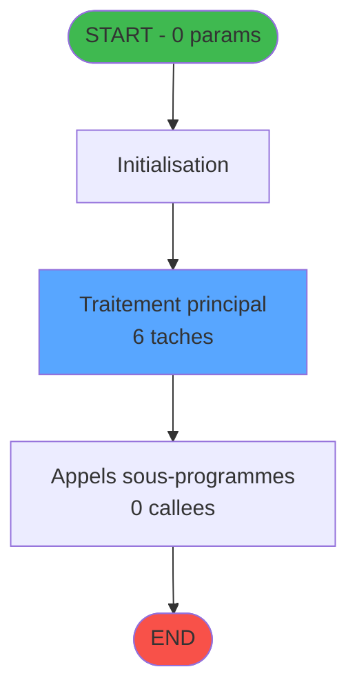

You are a software architect producing a design document for migrating a Magic Unipaas program to React/TypeScript.

Produce a JSON document following this EXACT structure:
```json
{
  "domain": "camelCaseDomainName",
  "domainPascal": "PascalCaseDomainName",
  "complexity": "LOW|MEDIUM|HIGH",
  "entities": [
    {
      "name": "EntityName",
      "fields": [
        {
          "name": "fieldName",
          "type": "string|number|boolean|Date",
          "source": "table.column",
          "nullable": false
        }
      ]
    }
  ],
  "stateFields": [
    {
      "name": "fieldName",
      "type": "TypeName[]",
      "default": "[]"
    }
  ],
  "actions": [
    {
      "name": "actionName",
      "params": [
        "param: type"
      ],
      "businessRules": [
        "Rule description"
      ],
      "returns": "Promise<void>"
    }
  ],
  "apiEndpoints": [
    {
      "method": "GET",
      "path": "/api/domain/resource",
      "queryParams": [
        "param?"
      ],
      "response": "ResponseType"
    }
  ],
  "uiLayout": {
    "type": "page-type",
    "sections": [
      {
        "name": "sectionName",
        "controls": [
          "control1"
        ]
      }
    ]
  },
  "mockData": {
    "count": 5,
    "description": "Description of mock data"
  },
  "dependencies": {
    "stores": [
      "useDataSourceStore"
    ],
    "sharedTypes": [],
    "externalApis": []
  }
}
```

IMPORTANT:
- Derive entity fields from actual DB column types when DB metadata is available
- Each business rule from the spec/contract MUST map to an action
- API endpoints should follow existing patterns: /api/{domain}/{resource}
- State fields must cover ALL data the UI needs to display
- Include isLoading, error, and filter states

PROGRAM SPEC:
# ADH IDE 248 - Choix PYR (plusieurs chambres)

> **Version spec**: 4.0
> **Analyse**: 2026-01-27 23:12
> **Source**: `D:\Data\Migration\XPA\PMS\ADH\Source\Prg_244.xml`
> **Methode**: APEX + PDCA (Auto-generated)

---

<!-- TAB:Fonctionnel -->

## SPECIFICATION FONCTIONNELLE

### 1.1 Objectif metier

**Choix PYR (plusieurs chambres)** est le **selecteur de chambre pour paiement PYR** qui **permet de choisir la chambre a debiter quand un client (GM) est associe a plusieurs chambres**.

**Objectif metier** : Gerer le cas specifique ou un client est heberge dans plusieurs chambres et doit effectuer un paiement PYR (paiement sur chambre). Le programme affiche la liste des chambres associees au client, permet la selection de la chambre cible, et met a jour la table hebergement en consequence. PYR = "Pay Your Room" (facturation sur chambre).

| Element | Description |
|---------|-------------|
| **Qui** | Operateur de caisse lors d'un paiement PYR |
| **Quoi** | Selection de la chambre pour imputation du paiement |
| **Pourquoi** | Resoudre l'ambiguite quand un GM a plusieurs chambres |
| **Declencheur** | Appel lors d'une vente avec mode de paiement PYR et client multi-chambres |
| **Resultat** | Chambre selectionnee, hebergement mis a jour pour imputation |

### 1.2 Regles metier

| Code | Regle | Condition |
|------|-------|-----------|
| RM-001 | Execution du traitement principal | Conditions d'entree validees |
| RM-002 | Gestion des tables (4 tables) | Acces selon mode (R/W/L) |
| RM-003 | Appels sous-programmes (0 callees) | Selon logique metier |

### 1.3 Flux utilisateur

1. Reception des parametres d'entree (0 params)
2. Initialisation et verification conditions
3. Traitement principal (6 taches)
4. Appels sous-programmes si necessaire
5. Retour resultats

### 1.4 Cas d'erreur

| Erreur | Comportement |
|--------|--------------|
| Conditions non remplies | Abandon avec message |
| Erreur sous-programme | Propagation erreur |

---

<!-- TAB:Technique -->

## SPECIFICATION TECHNIQUE

### 2.1 Identification

| Attribut | Valeur |
|----------|--------|
| **IDE Position** | 248 |
| **Fichier XML** | `Prg_244.xml` |
| **Description** | Choix PYR (plusieurs chambres) |
| **Module** | ADH |
| **Public Name** |  |
| **Nombre taches** | 6 |
| **Lignes logique** | 102 |
| **Expressions** | 0 |

### 2.2 Tables

| # | Nom logique | Nom physique | Acces | Usage |
|---|-------------|--------------|-------|-------|
| 30 | gm-recherche_____gmr | cafil008_dat | READ | Lecture |
| 34 | hebergement______heb | cafil012_dat | READ/WRITE | Lecture+Ecriture |
| 36 | client_gm | cafil014_dat | LINK | Jointure |

**Resume**: 4 tables accedees dont **1 en ecriture**

### 2.3 Parametres d'entree (0 parametres)

| Var | Nom | Type | Picture |
|-----|-----|------|---------|
| - | Aucun parametre | - | - |

### 2.4 Algorigramme



### 2.5 Statistiques

| Metrique | Valeur |
|----------|--------|
| **Taches** | 6 |
| **Lignes logique** | 102 |
| **Expressions** | 0 |
| **Parametres** | 0 |
| **Tables accedees** | 4 |
| **Tables en ecriture** | 1 |
| **Callees niveau 1** | 0 |

---

<!-- TAB:Cartographie -->

## CARTOGRAPHIE APPLICATIVE

### 3.1 Chaine d'appels depuis Main

```mermaid
graph LR
    T[248 Choix PYR (plus]
    ORPHAN([ORPHELIN ou Main])
    T -.-> ORPHAN
    style T fill:#58a6ff,color:#000
    style ORPHAN fill:#6b7280,stroke-dasharray: 5 5
```

### 3.2 Callers directs

| IDE | Programme | Nb appels |
|-----|-----------|-----------|
| - | ORPHELIN ou Main direct | - |

### 3.3 Callees (3 niveaux)

```mermaid
graph LR
    T[248 Choix PYR (plus]
    TERM([TERMINAL])
    T -.-> TERM
    style TERM fill:#6b7280,stroke-dasharray: 5 5
    style T fill:#58a6ff,color:#000
```

| Niv | IDE | Programme | Nb appels | Status |
|-----|-----|-----------|-----------|--------|
| - | - | TERMINAL | - | - |

### 3.4 Composants ECF utilises

| ECF | IDE | Public Name | Description |
|-----|-----|-------------|-------------|
| - | - | Aucun composant ECF | - |

### 3.5 Verification orphelin

| Critere | Resultat |
|---------|----------|
| Callers actifs | 0 programmes |
| PublicName | Non defini |
| ECF partage | NON |
| **Conclusion** | **ORPHELIN** - Pas de callers actifs |

---

## NOTES MIGRATION

### Complexite

| Critere | Score | Detail |
|---------|-------|--------|
| Taches | 6 | Moyen |
| Tables | 4 | Ecriture |
| Callees | 0 | Faible couplage |
| **Score global** | **FAIBLE** | - |

### Points d'attention migration

| Point | Solution moderne |
|-------|-----------------|
| Variables globales (VG*) | Service/Repository injection |
| Tables Magic | Entity Framework / Dapper |
| CallTask | Service method calls |
| Forms | React/Angular components |

---

## HISTORIQUE

| Date | Action | Auteur |
|------|--------|--------|
| 2026-01-27 23:12 | **V4.0 APEX/PDCA** - Generation automatique complete | Script |

---

*Specification V4.0 - Auto-generated with APEX/PDCA methodology*


CONTRACT:
{
  "program": {
    "id": 0,
    "name": "",
    "complexity": "MEDIUM",
    "callers": [],
    "callees": [],
    "tasksCount": 6,
    "tablesCount": 0,
    "expressionsCount": 0
  },
  "rules": [],
  "tables": [],
  "callees": [],
  "variables": []
}