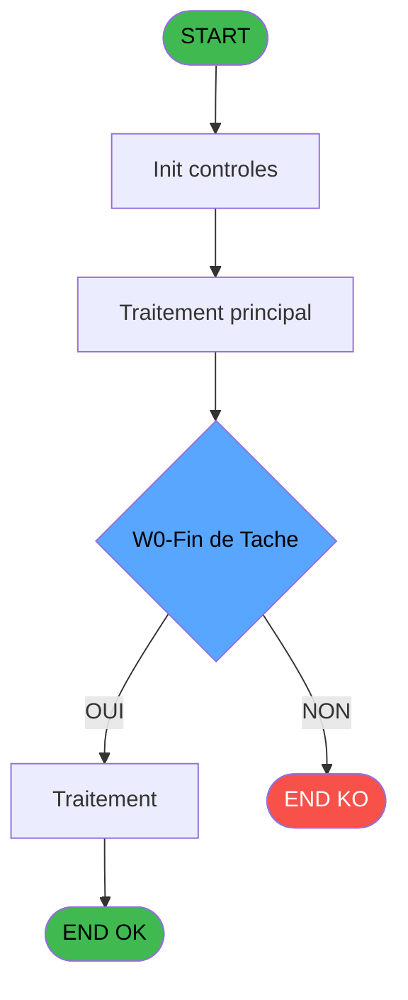

Generate a complete Zustand store for the "characterValidation" domain.

RULES (MANDATORY):
- Use import aliases: @/ for src root (e.g. @/stores/..., @/types/...)
- NEVER use `any` type - use `unknown` or precise types
- Tailwind v4 classes for styling (no tailwind.config.js)
- Arrow functions everywhere (no function declarations)
- `as const` instead of TypeScript enum
- verbatimModuleSyntax is enabled: use `import type { X }` ONLY for types/interfaces, use `import { X }` for values/consts
- File must be COMPLETE and ready to write - NO placeholders, NO TODOs, NO "// implement here"
- NO comments except for genuinely complex logic
- Output ONLY the code inside a single markdown code block (```typescript ... ``` or ```tsx ... ```)

SHARED INFRASTRUCTURE (use these exact imports):
- Data source toggle: `import { useDataSourceStore } from "@/stores/dataSourceStore"` (has .getState().isRealApi)
- API client: `import { apiClient } from "@/services/api/apiClient"` and `import type { ApiResponse } from "@/services/api/apiClient"`
- Screen layout: `import { ScreenLayout } from "@/components/layout"` (wrapper with sidebar, takes children + className)
- UI components: `import { Button, Dialog, Input } from "@/components/ui"`
- cn utility: `import { cn } from "@/lib/utils"`

STORE REQUIREMENTS:
- Use `create` from zustand (import { create } from "zustand")
- Import types from @/types/characterValidation
- Import useDataSourceStore from @/stores/dataSourceStore
- Mock/API branching via useDataSourceStore.getState().isRealApi
- try/catch with `e instanceof Error` for error handling
- Realistic mock data (not lorem ipsum)
- EVERY business rule from the analysis MUST be implemented
- Include reset() action to clear state

TYPES FILE (already generated):
export interface ValidationResult {
  isValid: boolean;
  invalidCharacters: string;
  position: number | null;
}

export interface ValidateCharactersRequest {
  input: string;
}

export interface ValidateCharactersResponse {
  result: ValidationResult;
}

export interface CheckStringRequest {
  input: string;
  forbiddenChars: string[];
}

export interface CheckStringResponse {
  result: ValidationResult;
}

export interface ForbiddenCharactersResponse {
  characters: string[];
}

export interface CharacterValidationState {
  forbiddenCharacters: string[];
  lastValidationResult: ValidationResult | null;
  isValidating: boolean;
  error: string | null;
  validateCharacters: (input: string) => Promise<ValidationResult>;
  loadForbiddenCharacters: () => Promise<void>;
  checkString: (input: string, forbiddenChars: string[]) => ValidationResult;
  setError: (error: string | null) => void;
  setIsValidating: (isValidating: boolean) => void;
  reset: () => void;
}

ANALYSIS DOCUMENT:
{
  "domain": "characterValidation",
  "domainPascal": "CharacterValidation",
  "complexity": "LOW",
  "entities": [
    {
      "name": "ValidationResult",
      "fields": [
        {
          "name": "isValid",
          "type": "boolean",
          "source": "computed",
          "nullable": false
        },
        {
          "name": "invalidCharacters",
          "type": "string",
          "source": "computed",
          "nullable": false
        },
        {
          "name": "position",
          "type": "number",
          "source": "computed",
          "nullable": true
        }
      ]
    }
  ],
  "stateFields": [
    {
      "name": "forbiddenCharacters",
      "type": "string[]",
      "default": "[]"
    },
    {
      "name": "lastValidationResult",
      "type": "ValidationResult | null",
      "default": "null"
    },
    {
      "name": "isValidating",
      "type": "boolean",
      "default": "false"
    },
    {
      "name": "error",
      "type": "string | null",
      "default": "null"
    }
  ],
  "actions": [
    {
      "name": "validateCharacters",
      "params": [
        "input: string"
      ],
      "businessRules": [
        "[RM-001] Vérifie qu'aucun caractère interdit n'est présent dans la chaîne",
        "Retourne la position du premier caractère invalide si trouvé",
        "Liste tous les caractères invalides détectés"
      ],
      "returns": "Promise<ValidationResult>"
    },
    {
      "name": "loadForbiddenCharacters",
      "params": [],
      "businessRules": [
        "Charge la liste des caractères interdits depuis la configuration",
        "Initialise la liste par défaut si aucune configuration n'existe"
      ],
      "returns": "Promise<void>"
    },
    {
      "name": "checkString",
      "params": [
        "input: string",
        "forbiddenChars: string[]"
      ],
      "businessRules": [
        "Parcourt la chaîne caractère par caractère",
        "Compare chaque caractère contre la liste interdite",
        "Arrête au premier caractère invalide trouvé"
      ],
      "returns": "ValidationResult"
    }
  ],
  "apiEndpoints": [
    {
      "method": "GET",
      "path": "/api/validation/forbidden-characters",
      "queryParams": [],
      "response": "string[]"
    },
    {
      "method": "POST",
      "path": "/api/validation/check-string",
      "queryParams": [],
      "response": "ValidationResult"
    }
  ],
  "uiLayout": {
    "type": "utility-component",
    "sections": [
      {
        "name": "validationInput",
        "controls": [
          "inputField",
          "validateButton",
          "resultDisplay"
        ]
      },
      {
        "name": "forbiddenCharsList",
        "controls": [
          "characterList",
          "addCharButton",
          "removeCharButton"
        ]
      },
      {
        "name": "validationResult",
        "controls": [
          "statusIcon",
          "invalidCharDisplay",
          "positionIndicator"
        ]
      }
    ]
  },
  "mockData": {
    "count": 10,
    "description": "10 test strings with various invalid character combinations: special chars (@#$%), control chars, unicode chars, mixed valid/invalid"
  },
  "dependencies": {
    "stores": [],
    "sharedTypes": [
      "ValidationResult"
    ],
    "externalApis": []
  }
}

SPEC EXCERPT (business rules):
# ADH IDE 84 - SP Caractères Interdits

> **Analyse**: Phases 1-4 2026-02-07 03:45 -> 02:20 (22h34min) | Assemblage 02:20
> **Pipeline**: V7.2 Enrichi
> **Structure**: 4 onglets (Resume | Ecrans | Donnees | Connexions)

<!-- TAB:Resume -->

## 1. FICHE D'IDENTITE

| Attribut | Valeur |
|----------|--------|
| Projet | ADH |
| IDE Position | 84 |
| Nom Programme | SP Caractères Interdits |
| Fichier source | `Prg_84.xml` |
| Dossier IDE | General |
| Taches | 2 (0 ecrans visibles) |
| Tables modifiees | 0 |
| Programmes appeles | 0 |
| Complexite | **BASSE** (score 0/100) |

## 2. DESCRIPTION FONCTIONNELLE

ADH IDE 84 - CARACT_INTERDIT est un utilitaire de validation de caractères interdits utilisé lors de la saisie de transactions commerciales. Le programme vérifie qu'une chaîne de caractères ne contient pas de caractères non autorisés ou invalides selon les règles métier de la caisse. Il est appelé principalement lors de la création de nouvelles ventes avec Gift Pass (IDE 237-240) et lors de la saisie manuelle de transactions (IDE 307, 310, 316).

Le programme expose une interface publique callable via `ProgIdx('CARACT_INTERDIT')` depuis d'autres modules. Il contient deux tâches principales : "Caractères Interdits" qui effectue la validation proprement dite en comparant la chaîne d'entrée contre une liste de caractères interdits, et "Vérification Chaîne" qui prépare ou post-traite les données de validation.

Ce programme fait partie de la composante ADH.ecf (Sessions_Reprises) et est partagé entre plusieurs projets. Il s'inscrit dans la couche de validation métier de la gestion de caisse, garantissant l'intégrité des données de transactions avant leur enregistrement dans la base de données.

## 3. BLOCS FONCTIONNELS

### 3.1 Traitement (1 tache)

Traitements internes.

---

#### <a id="t1"></a>84 - Caractères Interdits

**Role** : Traitement : Caractères Interdits.


### 3.2 Validation (1 tache)

Controles de coherence : 1 tache verifie les donnees et conditions.

---

#### <a id="t2"></a>84.1 - Verification Chaine

**Role** : Verification : Verification Chaine.


## 5. REGLES METIER

1 regles identifiees:

### Autres (1 regles)

#### <a id="rm-RM-001"></a>[RM-001] Condition: W0-Fin de Tache [D] egale 'F'

| Element | Detail |
|---------|--------|
| **Condition** | `W0-Fin de Tache [D]='F'` |
| **Si vrai** | Action si vrai |
| **Variables** | EQ (W0-Fin de Tache) |
| **Expression source** | Expression 2 : `W0-Fin de Tache [D]='F'` |
| **Exemple** | Si W0-Fin de Tache [D]='F' → Action si vrai |

## 6. CONTEXTE

- **Appele par**: [Transaction Nouv vente avec GP (IDE 237)](ADH-IDE-237.md), [Transaction Nouv vente PMS-584 (IDE 238)](ADH-IDE-238.md), [Transaction Nouv vente PMS-721 (IDE 239)](ADH-IDE-239.md), [Transaction Nouv vente PMS-710 (IDE 240)](ADH-IDE-240.md), [Saisie transaction 154  N.U (IDE 307)](ADH-IDE-307.md), [Saisie transaction Nouv vente (IDE 310)](ADH-IDE-310.md), [Saisie transaction Nouv vente (IDE 316)](ADH-IDE-316.md)
- **Appelle**: 0 programmes | **Tables**: 0 (W:0 R:0 L:0) | **Taches**: 2 | **Expressions**: 2

<!-- TAB:Ecrans -->

## 8. ECRANS

*(Programme sans ecran visible)*

## 9. NAVIGATION

### 9.3 Structure hierarchique (2 taches)

| Position | Tache | Type | Dimensions | Bloc |
|----------|-------|------|------------|------|
| **84.1** | [**Caractères Interdits** (84)](#t1) | MDI | - | Traitement |
| **84.2** | [**Verification Chaine** (84.1)](#t2) | MDI | - | Validation |

### 9.4 Algorigramme



> **Legende**: Vert = START/END OK | Rouge = END KO | Bleu = Decisions
> *Algorigramme auto-genere. Utiliser `/algorigramme` pour une synthese metier detaillee.*

<!-- TAB:Donnees -->

## 10. TABLES

### Tables utilisees (0)

| ID | Nom | Description | Type | R | W | L | Usages |
|----|-----|-------------|------|---|---|---|--------|

### Colonnes par table (0 / 0 tables avec colonnes identifiees)

## 11. VARIABLES

### 11.1 Autres (4)

Variables diverses.

| Lettre | Nom | Type | Usage dans |
|--------|-----|------|-----------|
| EN | P0-Code | Alpha | - |
| EO | P0-Accord Suite | Alpha | - |
| EP | P0-N/P | Alpha | - |
| EQ | W0-Fin de Tache | Alpha | 1x refs |

## 12. EXPRESSIONS

**2 / 2 expressions decodees (100%)**

### 12.1 Repartition par type

| Type | Expressions | Regles |
|------|-------------|--------|
| CONDITION | 1 | 5 |
| CONSTANTE | 1 | 0 |

### 12.2 Expressions cles par type

#### CONDITION (1 expressions)

| Type | IDE | Expression | Regle |
|------|-----|------------|-------|
| CONDITION | 2 | `W0-Fin de Tache [D]='F'` | [RM-001](#rm-RM-001) |

#### CONSTANTE (1 expressions)

| Type | IDE | Expression | Regle |
|------|-----|------------|-------|
| CONSTANTE | 1 | `'F'` | - |

<!-- TAB:Connexions -->

## 13. GRAPHE D'APPELS

### 13.1 Chaine depuis Main (Callers)

Main -> ... -> [Transaction Nouv vente avec GP (IDE 237)](ADH-IDE-237.md) -> **SP Caractères Interdits (IDE 84)**

Main -> ... -> [Transaction Nouv vente PMS-584 (IDE 238)](ADH-IDE-238.md) -> **SP Caractères Interdits (IDE 84)**

Main -> ... -> [Transaction Nouv vente PMS-721 (IDE 239)](ADH-IDE-239.md) -> **SP Caractères Interdits (IDE 84)**

Main -> ... -> [Transaction Nouv vente PMS-710 (IDE 240)](ADH-IDE-240.md) -> **SP Caractères Interdits (IDE 84)**

Main -> ... -> [Saisie transaction 154  N.U (IDE 307)](ADH-IDE-307.md) -> **SP Caractères Interdits (IDE 84)**

Main -> ... -> [Saisie transaction Nouv vente (IDE 310)](ADH-IDE-310.md) -> **SP Caractères Interdits (IDE 84)**

Main -> ... -> [Saisie transactio

REFERENCE PATTERN (follow this exact structure):
```typescript
import { create } from 'zustand';
import type {
  ExtraitAccountInfo,
  ExtraitTransaction,
  ExtraitSummary,
  ExtraitPrintFormat,
} from '@/types/extrait';
import { extraitApi } from '@/services/api/endpoints-lot3';
import { useDataSourceStore } from './dataSourceStore';

interface ExtraitState {
  selectedAccount: ExtraitAccountInfo | null;
  transactions: ExtraitTransaction[];
  summary: ExtraitSummary | null;
  searchResults: ExtraitAccountInfo[];
  isSearching: boolean;
  isLoadingExtrait: boolean;
  isPrinting: boolean;
  error: string | null;
}

interface ExtraitActions {
  searchAccount: (societe: string, query: string) => Promise<void>;
  selectAccount: (account: ExtraitAccountInfo) => void;
  loadExtrait: (
    societe: string,
    codeAdherent: number,
    filiation: number,
    dateDebut?: string,
    dateFin?: string,
  ) => Promise<void>;
  printExtrait: (
    societe: string,
    codeAdherent: number,
    filiation: number,
    format: ExtraitPrintFormat,
  ) => Promise<void>;
  reset: () => void;
}

type ExtraitStore = ExtraitState & ExtraitActions;

const MOCK_ACCOUNTS: ExtraitAccountInfo[] = [
  { societe: 'SOC1', codeAdherent: 1001, filiation: 0, nom: 'DUPONT', prenom: 'Jean', statut: 'normal', hasGiftPass: false },
  { societe: 'SOC1', codeAdherent: 1002, filiation: 0, nom: 'MARTIN', prenom: 'Sophie', statut: 'normal', hasGiftPass: true },
  { societe: 'SOC1', codeAdherent: 1003, filiation: 1, nom: 'DURAND', prenom: 'Pierre', statut: 'bloque', hasGiftPass: false },
];

const MOCK_TRANSACTIONS: ExtraitTransaction[] = [
  { id: 1, date: '2026-02-10', heure: '09:15', libelle: 'Achat boutique', debit: 45.50, credit: 0, solde: -45.50, codeService: 'BTQ', codeImputation: 'IMP01', giftPassFlag: false, nbArticles: 3, status: 'debit', numeroPiece: 'VTE-001', modePaiement: 'CB', caissier: 'MARTIN S.' },
  { id: 2, date: '2026-02-10', heure: '14:30', libelle: 'Credit compte', debit: 0, credit: 200, solde: 154.50, codeService: 'CAI', codeImputation: 'IMP02', giftPassFlag: false, status: 'credit', numeroPiece: 'CRD-042', modePaiement: 'Especes', caissier: 'DUPONT J.' },
  { id: 3, date: '2026-02-09', heure: '12:45', libelle: 'Repas restaurant', libelleSupplementaire: 'Menu du jour', debit: 32.00, credit: 0, solde: 122.50, codeService: 'RST', codeImputation: 'IMP03', giftPassFlag: true, nbArticles: 1, status: 'debit', numeroPiece: 'RST-117', modePaiement: 'GiftPass', caissier: 'MARTIN S.' },
  { id: 4, date: '2026-02-08', heure: '16:00', libelle: 'Annulation vente', debit: 0, credit: 15.00, solde: 154.50, codeService: 'BTQ', codeImputation: 'IMP01', giftPassFlag: false, status: 'annule', numeroPiece: 'ANN-003', modePaiement: 'CB', caissier: 'DUPONT J.', commentaire: 'Erreur de saisie' },
  { id: 5, date: '2026-02-08', heure: '10:20', libelle: 'Regularisation solde', debit: 0, credit: 5.00, solde: 139.50, codeService: 'CAI', codeImputation: 'IMP02', giftPassFlag: false, status: 'regularise', numeroPiece: 'REG-007', modePaiement: 'Interne', caissier: 'ADMIN' },
];

const MOCK_SUMMARY: ExtraitSummary = {
  totalDebit: 77.50,
  totalCredit: 220,
  soldeActuel: 142.50,
  nbTransactions: 5,
};

const initialState: ExtraitState = {
  selectedAccount: null,
  transactions: [],
  summary: null,
  searchResults: [],
  isSearching: false,
  isLoadingExtrait: false,
  isPrinting: false,
  error: null,
};

export const useExtraitStore = create<ExtraitStore>()((set) => ({
  ...initialState,

  searchAccount: async (societe, query) => {
    const { isRealApi } = useDataSourceStore.getState();
    set({ isSearching: true, error: null });

    if (!isRealApi) {
      const filtered = MOCK_ACCOUNTS.filter(
        (a) =>
          a.nom.toLowerCase().includes(query.toLowerCase()) ||
          a.prenom.toLowerCase().includes(query.toLowerCase()) ||
          String(a.codeAdherent).includes(query),
      );
      set({ searchResults: filtered, isSearching: false });
      return;
    }

    try {
      const response = await extraitApi.searchAccount(societe, query);
      set({ searchResults: response.data.data ?? [] });
    } catch (e: unknown) {
      const message = e instanceof Error ? e.message : 'Erreur recherche compte';
      set({ searchResults: [], error: message });
    } finally {
      set({ isSearching: false });
    }
  },

  selectAccount: (account) => {
    set({ selectedAccount: account, transactions: [], summary: null, error: null });
  },

  loadExtrait: async (societe, codeAdherent, filiation, dateDebut, dateFin) => {
    const { isRealApi } = useDataSourceStore.getState();
    set({ isLoadingExtrait: true, error: null });

    if (!isRealApi) {
      set({
        transactions: MOCK_TRANSACTIONS,
        summary: MOCK_SUMMARY,
        isLoadingExtrait: false,
      });
      return;
    }

    try {
      const response = await extraitApi.getExtrait(
        societe,
        codeAdherent,
        filiation,
        dateDebut,
        dateFin,
      );
      const data = response.data.data;
      set({
        transactions: data?.transactions ?? [],
        summary: data?.summary ?? null,
      });
    } catch (e: unknown) {
      const message = e instanceof Error ? e.message : 'Erreur chargement extrait';
      set({ transactions: [], summary: null, error: message });
    } finally {
      set({ isLoadingExtrait: false });
    }
  },

  printExtrait: async (societe, codeAdherent, filiation, format) => {
    const { isRealApi } = useDataSourceStore.getState();
    set({ isPrinting: true, error: null });

    if (!isRealApi) {
      set({ isPrinting: false });
      return;
    }

    try {
      await extraitApi.printExtrait({
        societe,
        codeAdherent,
        filiation,
        format,
      });
    } catch (e: unknown) {
      const message = e instanceof Error ? e.message : 'Erreur impression';
      set({ error: message });
    } finally {
      set({ isPrinting: false });
    }
  },

  reset: () => set({ ...initialState }),
}));

```