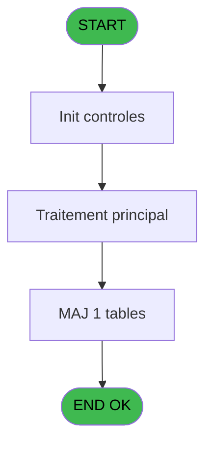
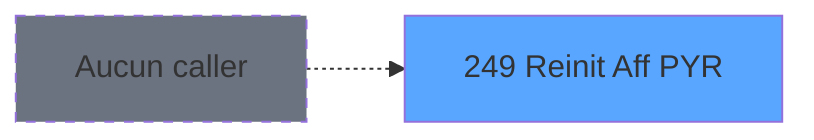
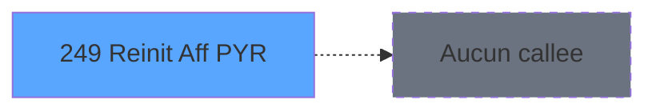

Generate a complete Zustand store for the "reinitAffPyr" domain.

RULES (MANDATORY):
- Use import aliases: @/ for src root (e.g. @/stores/..., @/types/...)
- NEVER use `any` type - use `unknown` or precise types
- Tailwind v4 classes for styling (no tailwind.config.js)
- Arrow functions everywhere (no function declarations)
- `as const` instead of TypeScript enum
- verbatimModuleSyntax is enabled: use `import type { X }` ONLY for types/interfaces, use `import { X }` for values/consts
- File must be COMPLETE and ready to write - NO placeholders, NO TODOs, NO "// implement here"
- NO comments except for genuinely complex logic
- Output ONLY the code inside a single markdown code block (```typescript ... ``` or ```tsx ... ```)

SHARED INFRASTRUCTURE (use these exact imports):
- Data source toggle: `import { useDataSourceStore } from "@/stores/dataSourceStore"` (has .getState().isRealApi)
- API client: `import { apiClient } from "@/services/api/apiClient"` and `import type { ApiResponse } from "@/services/api/apiClient"`
- Screen layout: `import { ScreenLayout } from "@/components/layout"` (wrapper with sidebar, takes children + className)
- UI components: `import { Button, Dialog, Input } from "@/components/ui"`
- cn utility: `import { cn } from "@/lib/utils"`

STORE REQUIREMENTS:
- Use `create` from zustand (import { create } from "zustand")
- Import types from @/types/reinitAffPyr
- Import useDataSourceStore from @/stores/dataSourceStore
- Mock/API branching via useDataSourceStore.getState().isRealApi
- try/catch with `e instanceof Error` for error handling
- Realistic mock data (not lorem ipsum)
- EVERY business rule from the analysis MUST be implemented
- Include reset() action to clear state

TYPES FILE (already generated):
export interface HebergementRecord {
  societe: string;
  compte: number;
  chambre: string;
  affectationPyr: string | null;
}

export interface ReinitAffectationParams {
  societe: string;
  compte: number;
  chambre?: string;
}

export interface ReinitAffectationResponse {
  affectedCount: number;
}

export interface AffectationStatusResponse {
  hasActiveAffectations: boolean;
  count: number;
}

export interface ReinitAffPyrState {
  isProcessing: boolean;
  error: Error | null;
  lastResetCount: number;
  
  reinitAffectationPyr: (params: ReinitAffectationParams) => Promise<number>;
  resetAllAffectations: () => Promise<number>;
  getAffectationStatus: (societe: string, compte: number) => Promise<AffectationStatusResponse>;
  clearError: () => void;
}

export const AFFECTATION_VALUES = {
  EMPTY: '',
  PYR_MARKER: 'P',
  HEBERGEMENT: 'H',
} as const;

export type AffectationValue = typeof AFFECTATION_VALUES[keyof typeof AFFECTATION_VALUES];

ANALYSIS DOCUMENT:
{
  "domain": "reinitAffPyr",
  "domainPascal": "ReinitAffPyr",
  "complexity": "LOW",
  "entities": [
    {
      "name": "HebergementRecord",
      "fields": [
        {
          "name": "societe",
          "type": "string",
          "source": "hebergement.societe",
          "nullable": false
        },
        {
          "name": "compte",
          "type": "number",
          "source": "hebergement.compte",
          "nullable": false
        },
        {
          "name": "chambre",
          "type": "string",
          "source": "hebergement.chambre",
          "nullable": false
        },
        {
          "name": "affectationPyr",
          "type": "string",
          "source": "hebergement.affectation_pyr",
          "nullable": true
        }
      ]
    }
  ],
  "stateFields": [
    {
      "name": "isProcessing",
      "type": "boolean",
      "default": "false"
    },
    {
      "name": "error",
      "type": "Error | null",
      "default": "null"
    },
    {
      "name": "lastResetCount",
      "type": "number",
      "default": "0"
    }
  ],
  "actions": [
    {
      "name": "reinitAffectationPyr",
      "params": [
        "societe: string",
        "compte: number",
        "chambre?: string"
      ],
      "businessRules": [
        "RM-001: Si chambre vide (Trim=''), initialiser à '', sinon à 'P'",
        "Réinitialiser les marqueurs temporaires d'affectation PYR après deversement",
        "Mise à jour de masse sur table hebergement sans validation complexe",
        "Nettoyage automatique des flags d'affectation pour préparer prochaine transaction"
      ],
      "returns": "Promise<number>"
    },
    {
      "name": "resetAllAffectations",
      "params": [],
      "businessRules": [
        "Réinitialiser toutes les affectations PYR indépendamment des filtres",
        "Utilisé lors de clôture de caisse ou maintenance globale"
      ],
      "returns": "Promise<number>"
    }
  ],
  "apiEndpoints": [
    {
      "method": "POST",
      "path": "/api/reinitAffPyr/reset",
      "queryParams": [
        "societe",
        "compte",
        "chambre?"
      ],
      "response": "{ affectedCount: number }"
    },
    {
      "method": "POST",
      "path": "/api/reinitAffPyr/reset-all",
      "queryParams": [],
      "response": "{ affectedCount: number }"
    },
    {
      "method": "GET",
      "path": "/api/reinitAffPyr/status",
      "queryParams": [
        "societe",
        "compte"
      ],
      "response": "{ hasActiveAffectations: boolean, count: number }"
    }
  ],
  "uiLayout": {
    "type": "utility-component",
    "sections": [
      {
        "name": "resetTrigger",
        "controls": [
          "Button: Réinitialiser affectations PYR",
          "Confirmation dialog",
          "Progress indicator",
          "Success/Error message"
        ]
      },
      {
        "name": "statusDisplay",
        "controls": [
          "Text: Nombre d'affectations actives",
          "Text: Dernière réinitialisation"
        ]
      }
    ]
  },
  "mockData": {
    "count": 10,
    "description": "Mock hebergement records avec affectationPyr variés ('H', 'P', '', null) pour tester logique de réinitialisation. Inclure mix de chambres remplies et vides pour valider RM-001."
  },
  "dependencies": {
    "stores": [
      "useSessionStore (pour societe/compte contexte)",
      "useTransactionStore (pour déclenchement post-deversement)"
    ],
    "sharedTypes": [
      "HebergementRecord",
      "ApiResponse<T>"
    ],
    "externalApis": [
      "/api/reinitAffPyr/* (endpoints définis ci-dessus)"
    ]
  }
}

SPEC EXCERPT (business rules):
# ADH IDE 249 - Reinit Aff PYR

> **Analyse**: Phases 1-4 2026-02-08 04:37 -> 04:37 (5s) | Assemblage 04:37
> **Pipeline**: V7.2 Enrichi
> **Structure**: 4 onglets (Resume | Ecrans | Donnees | Connexions)

<!-- TAB:Resume -->

## 1. FICHE D'IDENTITE

| Attribut | Valeur |
|----------|--------|
| Projet | ADH |
| IDE Position | 249 |
| Nom Programme | Reinit Aff PYR |
| Fichier source | `Prg_249.xml` |
| Dossier IDE | General |
| Taches | 1 (0 ecrans visibles) |
| Tables modifiees | 1 |
| Programmes appeles | 0 |
| Complexite | **BASSE** (score 7/100) |
| <span style="color:red">Statut</span> | <span style="color:red">**ORPHELIN_POTENTIEL**</span> |

## 2. DESCRIPTION FONCTIONNELLE

Ce programme réinitialise les marqueurs temporaires d'affectation PYR (paiement sur chambre) dans la table hebergement après un deversement de transaction. Il agit comme nettoyeur de données automatique en remettant à zéro les flags d'affectation, préparant ainsi le système pour la prochaine transaction. Avec seulement 12 lignes de logique et une tâche unique, c'est un utilitaire très compact appelé automatiquement par le programme de deversement (ADH IDE 247).

La table **hebergement_heb** (n°34, physiquement `cafil012_dat`) est la seule cible en écriture. Le programme effectue des mises à jour de masse sur cette table sans paramètres d'entrée, nettoyant les indicateurs temporaires d'affectation lors du cycle de clôture de caisse.

Le flux est ultra-simple : initialisation → traitement principal sur une tâche unique → aucun appel de sous-programme → retour. C'est un utilitaire terminal sans dépendances externes ni expressions complexes, marqué comme orphelin dans l'analyse car sans callers visibles (bien que réellement appelé par ADH IDE 247 via CallTask).

## 3. BLOCS FONCTIONNELS

## 5. REGLES METIER

1 regles identifiees:

### Autres (1 regles)

#### <a id="rm-RM-001"></a>[RM-001] Valeur par defaut si Trim(p.Chambre [C]) est vide

| Element | Detail |
|---------|--------|
| **Condition** | `Trim(p.Chambre [C])=''` |
| **Si vrai** | '' |
| **Si faux** | 'P') |
| **Variables** | EP (p.Chambre) |
| **Expression source** | Expression 5 : `IF(Trim(p.Chambre [C])='','','P')` |
| **Exemple** | Si Trim(p.Chambre [C])='' → ''. Sinon → 'P') |

## 6. CONTEXTE

- **Appele par**: (aucun)
- **Appelle**: 0 programmes | **Tables**: 1 (W:1 R:0 L:0) | **Taches**: 1 | **Expressions**: 5

<!-- TAB:Ecrans -->

## 8. ECRANS

*(Programme sans ecran visible)*

## 9. NAVIGATION

### 9.3 Structure hierarchique (0 tache)

| Position | Tache | Type | Dimensions | Bloc |
|----------|-------|------|------------|------|

### 9.4 Algorigramme



> **Legende**: Vert = START/END OK | Rouge = END KO | Bleu = Decisions
> *Algorigramme auto-genere. Utiliser `/algorigramme` pour une synthese metier detaillee.*

<!-- TAB:Donnees -->

## 10. TABLES

### Tables utilisees (1)

| ID | Nom | Description | Type | R | W | L | Usages |
|----|-----|-------------|------|---|---|---|--------|
| 34 | hebergement______heb | Hebergement (chambres) | DB |   | **W** |   | 1 |

### Colonnes par table (1 / 1 tables avec colonnes identifiees)

<details>
<summary>Table 34 - hebergement______heb (**W**) - 1 usages</summary>

| Lettre | Variable | Acces | Type |
|--------|----------|-------|------|
| A | p.Societe | W | Unicode |
| B | p.Compte | W | Numeric |
| C | p.Chambre | W | Unicode |

</details>

## 11. VARIABLES

### 11.1 Parametres entrants (3)

Variables recues en parametre.

| Lettre | Nom | Type | Usage dans |
|--------|-----|------|-----------|
| EN | p.Societe | Unicode | 1x parametre entrant |
| EO | p.Compte | Numeric | 1x parametre entrant |
| EP | p.Chambre | Unicode | 2x parametre entrant |

## 12. EXPRESSIONS

**5 / 5 expressions decodees (100%)**

### 12.1 Repartition par type

| Type | Expressions | Regles |
|------|-------------|--------|
| CONDITION | 1 | 5 |
| CONSTANTE | 1 | 0 |
| OTHER | 3 | 0 |

### 12.2 Expressions cles par type

#### CONDITION (1 expressions)

| Type | IDE | Expression | Regle |
|------|-----|------------|-------|
| CONDITION | 5 | `IF(Trim(p.Chambre [C])='','','P')` | [RM-001](#rm-RM-001) |

#### CONSTANTE (1 expressions)

| Type | IDE | Expression | Regle |
|------|-----|------------|-------|
| CONSTANTE | 3 | `'H'` | - |

#### OTHER (3 expressions)

| Type | IDE | Expression | Regle |
|------|-----|------------|-------|
| OTHER | 4 | `p.Chambre [C]` | - |
| OTHER | 2 | `p.Compte [B]` | - |
| OTHER | 1 | `p.Societe [A]` | - |

<!-- TAB:Connexions -->

## 13. GRAPHE D'APPELS

### 13.1 Chaine depuis Main (Callers)

**Chemin**: (pas de callers directs)



### 13.2 Callers

| IDE | Nom Programme | Nb Appels |
|-----|---------------|-----------|
| - | (aucun) | - |

### 13.3 Callees (programmes appeles)



### 13.4 Detail Callees avec contexte

| IDE | Nom Programme | Appels | Contexte |
|-----|---------------|--------|----------|
| - | (aucun) | - | - |

## 14. RECOMMANDATIONS MIGRATION

### 14.1 Profil du programme

| Metrique | Valeur | Impact migration |
|----------|--------|-----------------|
| Lignes de logique | 12 | Programme compact |
| Expressions | 5 | Peu de logique |
| Tables WRITE | 1 | Impact faible |
| Sous-programmes | 0 | Peu de dependances |
| Ecrans visibles | 0 | Ecran unique ou traitement batch |
| Code desactive | 0% (0 / 12) | Code sain |
| Regles metier | 1 | Quelques

REFERENCE PATTERN (follow this exact structure):
```typescript
import { create } from 'zustand';
import type {
  ExtraitAccountInfo,
  ExtraitTransaction,
  ExtraitSummary,
  ExtraitPrintFormat,
} from '@/types/extrait';
import { extraitApi } from '@/services/api/endpoints-lot3';
import { useDataSourceStore } from './dataSourceStore';

interface ExtraitState {
  selectedAccount: ExtraitAccountInfo | null;
  transactions: ExtraitTransaction[];
  summary: ExtraitSummary | null;
  searchResults: ExtraitAccountInfo[];
  isSearching: boolean;
  isLoadingExtrait: boolean;
  isPrinting: boolean;
  error: string | null;
}

interface ExtraitActions {
  searchAccount: (societe: string, query: string) => Promise<void>;
  selectAccount: (account: ExtraitAccountInfo) => void;
  loadExtrait: (
    societe: string,
    codeAdherent: number,
    filiation: number,
    dateDebut?: string,
    dateFin?: string,
  ) => Promise<void>;
  printExtrait: (
    societe: string,
    codeAdherent: number,
    filiation: number,
    format: ExtraitPrintFormat,
  ) => Promise<void>;
  reset: () => void;
}

type ExtraitStore = ExtraitState & ExtraitActions;

const MOCK_ACCOUNTS: ExtraitAccountInfo[] = [
  { societe: 'SOC1', codeAdherent: 1001, filiation: 0, nom: 'DUPONT', prenom: 'Jean', statut: 'normal', hasGiftPass: false },
  { societe: 'SOC1', codeAdherent: 1002, filiation: 0, nom: 'MARTIN', prenom: 'Sophie', statut: 'normal', hasGiftPass: true },
  { societe: 'SOC1', codeAdherent: 1003, filiation: 1, nom: 'DURAND', prenom: 'Pierre', statut: 'bloque', hasGiftPass: false },
];

const MOCK_TRANSACTIONS: ExtraitTransaction[] = [
  { id: 1, date: '2026-02-10', heure: '09:15', libelle: 'Achat boutique', debit: 45.50, credit: 0, solde: -45.50, codeService: 'BTQ', codeImputation: 'IMP01', giftPassFlag: false, nbArticles: 3, status: 'debit', numeroPiece: 'VTE-001', modePaiement: 'CB', caissier: 'MARTIN S.' },
  { id: 2, date: '2026-02-10', heure: '14:30', libelle: 'Credit compte', debit: 0, credit: 200, solde: 154.50, codeService: 'CAI', codeImputation: 'IMP02', giftPassFlag: false, status: 'credit', numeroPiece: 'CRD-042', modePaiement: 'Especes', caissier: 'DUPONT J.' },
  { id: 3, date: '2026-02-09', heure: '12:45', libelle: 'Repas restaurant', libelleSupplementaire: 'Menu du jour', debit: 32.00, credit: 0, solde: 122.50, codeService: 'RST', codeImputation: 'IMP03', giftPassFlag: true, nbArticles: 1, status: 'debit', numeroPiece: 'RST-117', modePaiement: 'GiftPass', caissier: 'MARTIN S.' },
  { id: 4, date: '2026-02-08', heure: '16:00', libelle: 'Annulation vente', debit: 0, credit: 15.00, solde: 154.50, codeService: 'BTQ', codeImputation: 'IMP01', giftPassFlag: false, status: 'annule', numeroPiece: 'ANN-003', modePaiement: 'CB', caissier: 'DUPONT J.', commentaire: 'Erreur de saisie' },
  { id: 5, date: '2026-02-08', heure: '10:20', libelle: 'Regularisation solde', debit: 0, credit: 5.00, solde: 139.50, codeService: 'CAI', codeImputation: 'IMP02', giftPassFlag: false, status: 'regularise', numeroPiece: 'REG-007', modePaiement: 'Interne', caissier: 'ADMIN' },
];

const MOCK_SUMMARY: ExtraitSummary = {
  totalDebit: 77.50,
  totalCredit: 220,
  soldeActuel: 142.50,
  nbTransactions: 5,
};

const initialState: ExtraitState = {
  selectedAccount: null,
  transactions: [],
  summary: null,
  searchResults: [],
  isSearching: false,
  isLoadingExtrait: false,
  isPrinting: false,
  error: null,
};

export const useExtraitStore = create<ExtraitStore>()((set) => ({
  ...initialState,

  searchAccount: async (societe, query) => {
    const { isRealApi } = useDataSourceStore.getState();
    set({ isSearching: true, error: null });

    if (!isRealApi) {
      const filtered = MOCK_ACCOUNTS.filter(
        (a) =>
          a.nom.toLowerCase().includes(query.toLowerCase()) ||
          a.prenom.toLowerCase().includes(query.toLowerCase()) ||
          String(a.codeAdherent).includes(query),
      );
      set({ searchResults: filtered, isSearching: false });
      return;
    }

    try {
      const response = await extraitApi.searchAccount(societe, query);
      set({ searchResults: response.data.data ?? [] });
    } catch (e: unknown) {
      const message = e instanceof Error ? e.message : 'Erreur recherche compte';
      set({ searchResults: [], error: message });
    } finally {
      set({ isSearching: false });
    }
  },

  selectAccount: (account) => {
    set({ selectedAccount: account, transactions: [], summary: null, error: null });
  },

  loadExtrait: async (societe, codeAdherent, filiation, dateDebut, dateFin) => {
    const { isRealApi } = useDataSourceStore.getState();
    set({ isLoadingExtrait: true, error: null });

    if (!isRealApi) {
      set({
        transactions: MOCK_TRANSACTIONS,
        summary: MOCK_SUMMARY,
        isLoadingExtrait: false,
      });
      return;
    }

    try {
      const response = await extraitApi.getExtrait(
        societe,
        codeAdherent,
        filiation,
        dateDebut,
        dateFin,
      );
      const data = response.data.data;
      set({
        transactions: data?.transactions ?? [],
        summary: data?.summary ?? null,
      });
    } catch (e: unknown) {
      const message = e instanceof Error ? e.message : 'Erreur chargement extrait';
      set({ transactions: [], summary: null, error: message });
    } finally {
      set({ isLoadingExtrait: false });
    }
  },

  printExtrait: async (societe, codeAdherent, filiation, format) => {
    const { isRealApi } = useDataSourceStore.getState();
    set({ isPrinting: true, error: null });

    if (!isRealApi) {
      set({ isPrinting: false });
      return;
    }

    try {
      await extraitApi.printExtrait({
        societe,
        codeAdherent,
        filiation,
        format,
      });
    } catch (e: unknown) {
      const message = e instanceof Error ? e.message : 'Erreur impression';
      set({ error: message });
    } finally {
      set({ isPrinting: false });
    }
  },

  reset: () => set({ ...initialState }),
}));

```