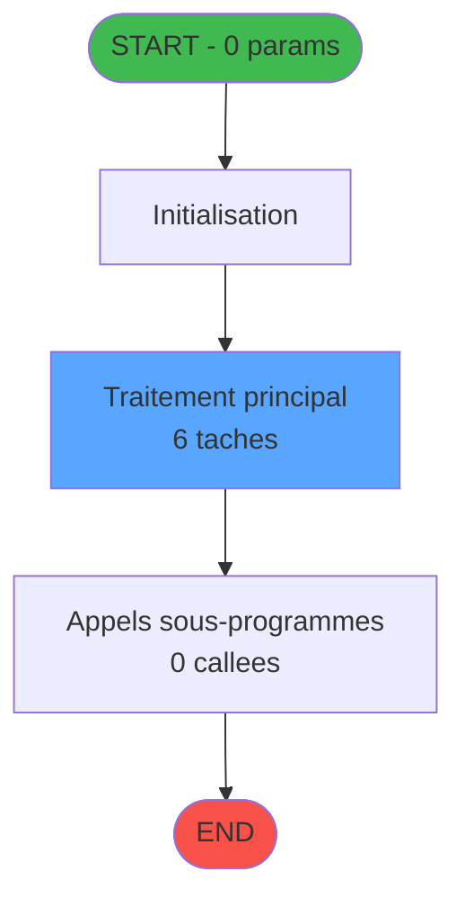

Generate a complete Zustand store for the "choixPyr" domain.

RULES (MANDATORY):
- Use import aliases: @/ for src root (e.g. @/stores/..., @/types/...)
- NEVER use `any` type - use `unknown` or precise types
- Tailwind v4 classes for styling (no tailwind.config.js)
- Arrow functions everywhere (no function declarations)
- `as const` instead of TypeScript enum
- verbatimModuleSyntax is enabled: use `import type { X }` ONLY for types/interfaces, use `import { X }` for values/consts
- File must be COMPLETE and ready to write - NO placeholders, NO TODOs, NO "// implement here"
- NO comments except for genuinely complex logic
- Output ONLY the code inside a single markdown code block (```typescript ... ``` or ```tsx ... ```)

SHARED INFRASTRUCTURE (use these exact imports):
- Data source toggle: `import { useDataSourceStore } from "@/stores/dataSourceStore"` (has .getState().isRealApi)
- API client: `import { apiClient } from "@/services/api/apiClient"` and `import type { ApiResponse } from "@/services/api/apiClient"`
- Screen layout: `import { ScreenLayout } from "@/components/layout"` (wrapper with sidebar, takes children + className)
- UI components: `import { Button, Dialog, Input } from "@/components/ui"`
- cn utility: `import { cn } from "@/lib/utils"`

STORE REQUIREMENTS:
- Use `create` from zustand (import { create } from "zustand")
- Import types from @/types/choixPyr
- Import useDataSourceStore from @/stores/dataSourceStore
- Mock/API branching via useDataSourceStore.getState().isRealApi
- try/catch with `e instanceof Error` for error handling
- Realistic mock data (not lorem ipsum)
- EVERY business rule from the analysis MUST be implemented
- Include reset() action to clear state

TYPES FILE (already generated):
import type { ApiResponse } from "@/services/api/apiClient";

export interface Hebergement {
  societe: number;
  compte: number;
  filiation: number;
  chambre: string;
  dateDebut: Date;
  dateFin: Date | null;
  statut: string;
}

export interface ClientGm {
  societe: number;
  compte: number;
  filiation: number;
  nom: string;
  prenom: string | null;
}

export interface ChoixPyrState {
  hebergements: Hebergement[];
  selectedHebergement: Hebergement | null;
  clientInfo: ClientGm | null;
  isLoading: boolean;
  error: string | null;
  fetchHebergements: (
    societe: number,
    compte: number,
    filiation: number
  ) => Promise<void>;
  selectChambre: (hebergement: Hebergement) => Promise<void>;
  cancelSelection: () => Promise<void>;
  setError: (error: string | null) => void;
  reset: () => void;
}

export interface FetchHebergementsRequest {
  societe: number;
  compte: number;
  filiation: number;
}

export interface FetchHebergementsResponse extends ApiResponse {
  data: {
    hebergements: Hebergement[];
    clientInfo: ClientGm;
  };
}

export interface SelectChambreRequest {
  societe: number;
  compte: number;
  filiation: number;
  chambre: string;
}

export interface SelectChambreResponse extends ApiResponse {
  data: {
    success: boolean;
    selectedChambre: string;
  };
}

export type ChoixPyrActionType =
  | "FETCH_HEBERGEMENTS_START"
  | "FETCH_HEBERGEMENTS_SUCCESS"
  | "FETCH_HEBERGEMENTS_ERROR"
  | "SELECT_CHAMBRE"
  | "CANCEL_SELECTION"
  | "SET_ERROR"
  | "RESET";

ANALYSIS DOCUMENT:
{
  "domain": "choixPyr",
  "domainPascal": "ChoixPyr",
  "complexity": "MEDIUM",
  "entities": [
    {
      "name": "Hebergement",
      "fields": [
        {
          "name": "societe",
          "type": "number",
          "source": "hebergement.societe",
          "nullable": false
        },
        {
          "name": "compte",
          "type": "number",
          "source": "hebergement.compte",
          "nullable": false
        },
        {
          "name": "filiation",
          "type": "number",
          "source": "hebergement.filiation",
          "nullable": false
        },
        {
          "name": "chambre",
          "type": "string",
          "source": "hebergement.chambre",
          "nullable": false
        },
        {
          "name": "dateDebut",
          "type": "Date",
          "source": "hebergement.date_debut",
          "nullable": false
        },
        {
          "name": "dateFin",
          "type": "Date",
          "source": "hebergement.date_fin",
          "nullable": true
        },
        {
          "name": "statut",
          "type": "string",
          "source": "hebergement.statut",
          "nullable": false
        }
      ]
    },
    {
      "name": "ClientGm",
      "fields": [
        {
          "name": "societe",
          "type": "number",
          "source": "client_gm.societe",
          "nullable": false
        },
        {
          "name": "compte",
          "type": "number",
          "source": "client_gm.compte",
          "nullable": false
        },
        {
          "name": "filiation",
          "type": "number",
          "source": "client_gm.filiation",
          "nullable": false
        },
        {
          "name": "nom",
          "type": "string",
          "source": "client_gm.nom",
          "nullable": false
        },
        {
          "name": "prenom",
          "type": "string",
          "source": "client_gm.prenom",
          "nullable": true
        }
      ]
    }
  ],
  "stateFields": [
    {
      "name": "hebergements",
      "type": "Hebergement[]",
      "default": "[]"
    },
    {
      "name": "selectedHebergement",
      "type": "Hebergement | null",
      "default": "null"
    },
    {
      "name": "clientInfo",
      "type": "ClientGm | null",
      "default": "null"
    },
    {
      "name": "isLoading",
      "type": "boolean",
      "default": "false"
    },
    {
      "name": "error",
      "type": "string | null",
      "default": "null"
    }
  ],
  "actions": [
    {
      "name": "fetchHebergements",
      "params": [
        "societe: number",
        "compte: number",
        "filiation: number"
      ],
      "businessRules": [
        "RM-001: Charger tous les hebergements actifs pour le client GM specifie",
        "RM-002: Filtrer les chambres valides (date debut <= aujourd'hui, date fin >= aujourd'hui ou null)",
        "Joindre avec client_gm pour recuperer les informations du client"
      ],
      "returns": "Promise<void>"
    },
    {
      "name": "selectChambre",
      "params": [
        "hebergement: Hebergement"
      ],
      "businessRules": [
        "RM-001: Valider que l'hebergement selectionne appartient au client",
        "RM-002: Mettre a jour la table hebergement pour marquer la chambre selectionnee",
        "Retourner la chambre selectionnee au programme appelant"
      ],
      "returns": "Promise<void>"
    },
    {
      "name": "cancelSelection",
      "params": [],
      "businessRules": [
        "RM-004: Annuler la selection et retourner sans mise a jour",
        "Fermer le dialogue de selection"
      ],
      "returns": "Promise<void>"
    }
  ],
  "apiEndpoints": [
    {
      "method": "GET",
      "path": "/api/choixPyr/hebergements",
      "queryParams": [
        "societe",
        "compte",
        "filiation"
      ],
      "response": "Hebergement[]"
    },
    {
      "method": "POST",
      "path": "/api/choixPyr/select",
      "queryParams": [],
      "response": "{ success: boolean; selectedChambre: string }"
    }
  ],
  "uiLayout": {
    "type": "modal-dialog",
    "sections": [
      {
        "name": "header",
        "controls": [
          "Client info display (nom, prenom)",
          "Message: 'Veuillez choisir la chambre pour le paiement PYR'"
        ]
      },
      {
        "name": "chambresGrid",
        "controls": [
          "DataGrid with columns: Chambre, Date debut, Date fin, Statut",
          "Single selection mode",
          "Sort by chambre number"
        ]
      },
      {
        "name": "actions",
        "controls": [
          "Button: Valider (primary, enabled when selection)",
          "Button: Annuler (secondary)"
        ]
      }
    ]
  },
  "mockData": {
    "count": 3,
    "description": "3 hebergements actifs pour un client GM dans differentes chambres (ex: 101, 203, 305) avec dates chevauchantes pour tester le cas multi-chambres"
  },
  "dependencies": {
    "stores": [
      "useDataSourceStore"
    ],
    "sharedTypes": [
      "Hebergement",
      "ClientGm"
    ],
    "externalApis": []
  }
}

SPEC EXCERPT (business rules):
# ADH IDE 248 - Choix PYR (plusieurs chambres)

> **Version spec**: 4.0
> **Analyse**: 2026-01-27 23:12
> **Source**: `D:\Data\Migration\XPA\PMS\ADH\Source\Prg_244.xml`
> **Methode**: APEX + PDCA (Auto-generated)

---

<!-- TAB:Fonctionnel -->

## SPECIFICATION FONCTIONNELLE

### 1.1 Objectif metier

**Choix PYR (plusieurs chambres)** est le **selecteur de chambre pour paiement PYR** qui **permet de choisir la chambre a debiter quand un client (GM) est associe a plusieurs chambres**.

**Objectif metier** : Gerer le cas specifique ou un client est heberge dans plusieurs chambres et doit effectuer un paiement PYR (paiement sur chambre). Le programme affiche la liste des chambres associees au client, permet la selection de la chambre cible, et met a jour la table hebergement en consequence. PYR = "Pay Your Room" (facturation sur chambre).

| Element | Description |
|---------|-------------|
| **Qui** | Operateur de caisse lors d'un paiement PYR |
| **Quoi** | Selection de la chambre pour imputation du paiement |
| **Pourquoi** | Resoudre l'ambiguite quand un GM a plusieurs chambres |
| **Declencheur** | Appel lors d'une vente avec mode de paiement PYR et client multi-chambres |
| **Resultat** | Chambre selectionnee, hebergement mis a jour pour imputation |

### 1.2 Regles metier

| Code | Regle | Condition |
|------|-------|-----------|
| RM-001 | Execution du traitement principal | Conditions d'entree validees |
| RM-002 | Gestion des tables (4 tables) | Acces selon mode (R/W/L) |
| RM-003 | Appels sous-programmes (0 callees) | Selon logique metier |

### 1.3 Flux utilisateur

1. Reception des parametres d'entree (0 params)
2. Initialisation et verification conditions
3. Traitement principal (6 taches)
4. Appels sous-programmes si necessaire
5. Retour resultats

### 1.4 Cas d'erreur

| Erreur | Comportement |
|--------|--------------|
| Conditions non remplies | Abandon avec message |
| Erreur sous-programme | Propagation erreur |

---

<!-- TAB:Technique -->

## SPECIFICATION TECHNIQUE

### 2.1 Identification

| Attribut | Valeur |
|----------|--------|
| **IDE Position** | 248 |
| **Fichier XML** | `Prg_244.xml` |
| **Description** | Choix PYR (plusieurs chambres) |
| **Module** | ADH |
| **Public Name** |  |
| **Nombre taches** | 6 |
| **Lignes logique** | 102 |
| **Expressions** | 0 |

### 2.2 Tables

| # | Nom logique | Nom physique | Acces | Usage |
|---|-------------|--------------|-------|-------|
| 30 | gm-recherche_____gmr | cafil008_dat | READ | Lecture |
| 34 | hebergement______heb | cafil012_dat | READ/WRITE | Lecture+Ecriture |
| 36 | client_gm | cafil014_dat | LINK | Jointure |

**Resume**: 4 tables accedees dont **1 en ecriture**

### 2.3 Parametres d'entree (0 parametres)

| Var | Nom | Type | Picture |
|-----|-----|------|---------|
| - | Aucun parametre | - | - |

### 2.4 Algorigramme



### 2.5 Statistiques

| Metrique | Valeur |
|----------|--------|
| **Taches** | 6 |
| **Lignes logique** | 102 |
| **Expressions** | 0 |
| **Parametres** | 0 |
| **Tables accedees** | 4 |
| **Tables en ecriture** | 1 |
| **Callees niveau 1** | 0 |

---

<!-- TAB:Cartographie -->

## CARTOGRAPHIE APPLICATIVE

### 3.1 Chaine d'appels depuis Main

```mermaid
graph LR
    T[248 Choix PYR (plus]
    ORPHAN([ORPHELIN ou Main])
    T -.-> ORPHAN
    style T fill:#58a6ff,color:#000
    style ORPHAN fill:#6b7280,stroke-dasharray: 5 5
```

### 3.2 Callers directs

| IDE | Programme | Nb appels |
|-----|-----------|-----------|
| - | ORPHELIN ou Main direct | - |

### 3.3 Callees (3 niveaux)

```mermaid
graph LR
    T[248 Choix PYR (plus]
    TERM([TERMINAL])
    T -.-> TERM
    style TERM fill:#6b7280,stroke-dasharray: 5 5
    style T fill:#58a6ff,color:#000
```

| Niv | IDE | Programme | Nb appels | Status |
|-----|-----|-----------|-----------|--------|
| - | - | TERMINAL | - | - |

### 3.4 Composants ECF utilises

| ECF | IDE | Public Name | Description |
|-----|-----|-------------|-------------|
| - | - | Aucun composant ECF | - |

### 3.5 Verification orphelin

| Critere | Resultat |
|---------|----------|
| Callers actifs | 0 programmes |
| PublicName | Non defini |
| ECF partage | NON |
| **Conclusion** | **ORPHELIN** - Pas de callers actifs |

---

## NOTES MIGRATION

### Complexite

| Critere | Score | Detail |
|---------|-------|--------|
| Taches | 6 | Moyen |
| Tables | 4 | Ecriture |
| Callees | 0 | Faible couplage |
| **Score global** | **FAIBLE** | - |

### Points d'attention migration

| Point | Solution moderne |
|-------|-----------------|
| Variables globales (VG*) | Service/Repository injection |
| Tables Magic | Entity Framework / Dapper |
| CallTask | Service method calls |
| Forms | React/Angular components |

---

## HISTORIQUE

| Date | Action | Auteur |
|------|--------|--------|
| 2026-01-27 23:12 | **V4.0 APEX/PDCA** - Generation automatique complete | Script |

---

*Specification V4.0 - Auto-generated with APEX/PDCA methodology*


REFERENCE PATTERN (follow this exact structure):
```typescript
import { create } from 'zustand';
import type {
  ExtraitAccountInfo,
  ExtraitTransaction,
  ExtraitSummary,
  ExtraitPrintFormat,
} from '@/types/extrait';
import { extraitApi } from '@/services/api/endpoints-lot3';
import { useDataSourceStore } from './dataSourceStore';

interface ExtraitState {
  selectedAccount: ExtraitAccountInfo | null;
  transactions: ExtraitTransaction[];
  summary: ExtraitSummary | null;
  searchResults: ExtraitAccountInfo[];
  isSearching: boolean;
  isLoadingExtrait: boolean;
  isPrinting: boolean;
  error: string | null;
}

interface ExtraitActions {
  searchAccount: (societe: string, query: string) => Promise<void>;
  selectAccount: (account: ExtraitAccountInfo) => void;
  loadExtrait: (
    societe: string,
    codeAdherent: number,
    filiation: number,
    dateDebut?: string,
    dateFin?: string,
  ) => Promise<void>;
  printExtrait: (
    societe: string,
    codeAdherent: number,
    filiation: number,
    format: ExtraitPrintFormat,
  ) => Promise<void>;
  reset: () => void;
}

type ExtraitStore = ExtraitState & ExtraitActions;

const MOCK_ACCOUNTS: ExtraitAccountInfo[] = [
  { societe: 'SOC1', codeAdherent: 1001, filiation: 0, nom: 'DUPONT', prenom: 'Jean', statut: 'normal', hasGiftPass: false },
  { societe: 'SOC1', codeAdherent: 1002, filiation: 0, nom: 'MARTIN', prenom: 'Sophie', statut: 'normal', hasGiftPass: true },
  { societe: 'SOC1', codeAdherent: 1003, filiation: 1, nom: 'DURAND', prenom: 'Pierre', statut: 'bloque', hasGiftPass: false },
];

const MOCK_TRANSACTIONS: ExtraitTransaction[] = [
  { id: 1, date: '2026-02-10', heure: '09:15', libelle: 'Achat boutique', debit: 45.50, credit: 0, solde: -45.50, codeService: 'BTQ', codeImputation: 'IMP01', giftPassFlag: false, nbArticles: 3, status: 'debit', numeroPiece: 'VTE-001', modePaiement: 'CB', caissier: 'MARTIN S.' },
  { id: 2, date: '2026-02-10', heure: '14:30', libelle: 'Credit compte', debit: 0, credit: 200, solde: 154.50, codeService: 'CAI', codeImputation: 'IMP02', giftPassFlag: false, status: 'credit', numeroPiece: 'CRD-042', modePaiement: 'Especes', caissier: 'DUPONT J.' },
  { id: 3, date: '2026-02-09', heure: '12:45', libelle: 'Repas restaurant', libelleSupplementaire: 'Menu du jour', debit: 32.00, credit: 0, solde: 122.50, codeService: 'RST', codeImputation: 'IMP03', giftPassFlag: true, nbArticles: 1, status: 'debit', numeroPiece: 'RST-117', modePaiement: 'GiftPass', caissier: 'MARTIN S.' },
  { id: 4, date: '2026-02-08', heure: '16:00', libelle: 'Annulation vente', debit: 0, credit: 15.00, solde: 154.50, codeService: 'BTQ', codeImputation: 'IMP01', giftPassFlag: false, status: 'annule', numeroPiece: 'ANN-003', modePaiement: 'CB', caissier: 'DUPONT J.', commentaire: 'Erreur de saisie' },
  { id: 5, date: '2026-02-08', heure: '10:20', libelle: 'Regularisation solde', debit: 0, credit: 5.00, solde: 139.50, codeService: 'CAI', codeImputation: 'IMP02', giftPassFlag: false, status: 'regularise', numeroPiece: 'REG-007', modePaiement: 'Interne', caissier: 'ADMIN' },
];

const MOCK_SUMMARY: ExtraitSummary = {
  totalDebit: 77.50,
  totalCredit: 220,
  soldeActuel: 142.50,
  nbTransactions: 5,
};

const initialState: ExtraitState = {
  selectedAccount: null,
  transactions: [],
  summary: null,
  searchResults: [],
  isSearching: false,
  isLoadingExtrait: false,
  isPrinting: false,
  error: null,
};

export const useExtraitStore = create<ExtraitStore>()((set) => ({
  ...initialState,

  searchAccount: async (societe, query) => {
    const { isRealApi } = useDataSourceStore.getState();
    set({ isSearching: true, error: null });

    if (!isRealApi) {
      const filtered = MOCK_ACCOUNTS.filter(
        (a) =>
          a.nom.toLowerCase().includes(query.toLowerCase()) ||
          a.prenom.toLowerCase().includes(query.toLowerCase()) ||
          String(a.codeAdherent).includes(query),
      );
      set({ searchResults: filtered, isSearching: false });
      return;
    }

    try {
      const response = await extraitApi.searchAccount(societe, query);
      set({ searchResults: response.data.data ?? [] });
    } catch (e: unknown) {
      const message = e instanceof Error ? e.message : 'Erreur recherche compte';
      set({ searchResults: [], error: message });
    } finally {
      set({ isSearching: false });
    }
  },

  selectAccount: (account) => {
    set({ selectedAccount: account, transactions: [], summary: null, error: null });
  },

  loadExtrait: async (societe, codeAdherent, filiation, dateDebut, dateFin) => {
    const { isRealApi } = useDataSourceStore.getState();
    set({ isLoadingExtrait: true, error: null });

    if (!isRealApi) {
      set({
        transactions: MOCK_TRANSACTIONS,
        summary: MOCK_SUMMARY,
        isLoadingExtrait: false,
      });
      return;
    }

    try {
      const response = await extraitApi.getExtrait(
        societe,
        codeAdherent,
        filiation,
        dateDebut,
        dateFin,
      );
      const data = response.data.data;
      set({
        transactions: data?.transactions ?? [],
        summary: data?.summary ?? null,
      });
    } catch (e: unknown) {
      const message = e instanceof Error ? e.message : 'Erreur chargement extrait';
      set({ transactions: [], summary: null, error: message });
    } finally {
      set({ isLoadingExtrait: false });
    }
  },

  printExtrait: async (societe, codeAdherent, filiation, format) => {
    const { isRealApi } = useDataSourceStore.getState();
    set({ isPrinting: true, error: null });

    if (!isRealApi) {
      set({ isPrinting: false });
      return;
    }

    try {
      await extraitApi.printExtrait({
        societe,
        codeAdherent,
        filiation,
        format,
      });
    } catch (e: unknown) {
      const message = e instanceof Error ? e.message : 'Erreur impression';
      set({ error: message });
    } finally {
      set({ isPrinting: false });
    }
  },

  reset: () => set({ ...initialState }),
}));

```