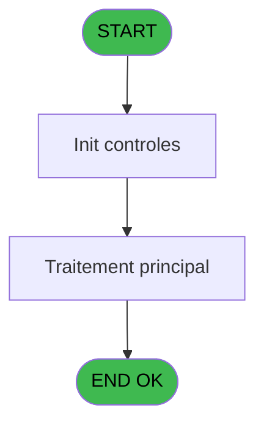
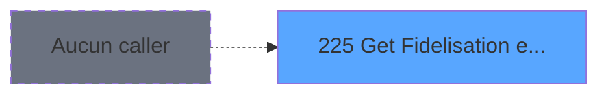
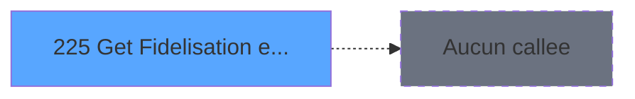

Generate a complete Zustand store for the "fidelisationRemise" domain.

RULES (MANDATORY):
- Use import aliases: @/ for src root (e.g. @/stores/..., @/types/...)
- NEVER use `any` type - use `unknown` or precise types
- Tailwind v4 classes for styling (no tailwind.config.js)
- Arrow functions everywhere (no function declarations)
- `as const` instead of TypeScript enum
- verbatimModuleSyntax is enabled: use `import type { X }` ONLY for types/interfaces, use `import { X }` for values/consts
- File must be COMPLETE and ready to write - NO placeholders, NO TODOs, NO "// implement here"
- NO comments except for genuinely complex logic
- Output ONLY the code inside a single markdown code block (```typescript ... ``` or ```tsx ... ```)

SHARED INFRASTRUCTURE (use these exact imports):
- Data source toggle: `import { useDataSourceStore } from "@/stores/dataSourceStore"` (has .getState().isRealApi)
- API client: `import { apiClient } from "@/services/api/apiClient"` and `import type { ApiResponse } from "@/services/api/apiClient"`
- Screen layout: `import { ScreenLayout } from "@/components/layout"` (wrapper with sidebar, takes children + className)
- UI components: `import { Button, Dialog, Input } from "@/components/ui"`
- cn utility: `import { cn } from "@/lib/utils"`

STORE REQUIREMENTS:
- Use `create` from zustand (import { create } from "zustand")
- Import types from @/types/fidelisationRemise
- Import useDataSourceStore from @/stores/dataSourceStore
- Mock/API branching via useDataSourceStore.getState().isRealApi
- try/catch with `e instanceof Error` for error handling
- Realistic mock data (not lorem ipsum)
- EVERY business rule from the analysis MUST be implemented
- Include reset() action to clear state

TYPES FILE (already generated):
import type { ApiResponse } from "@/services/api/apiClient";

// Fidelisation Remise types (fidelisationRemise domain)

export interface FidelisationRemise {
  societe: string;
  compte: number;
  filiation: number;
  service: string;
  imputation: number;
  fidelisation: string | null;
  remise: number | null;
}

export interface RemiseResult {
  fidelisationId: string | null;
  montantRemise: number;
  isValide: boolean;
  message: string | null;
}

export interface FidelisationRemiseState {
  isLoading: boolean;
  error: string | null;
  remiseData: FidelisationRemise | null;
  remiseResult: RemiseResult | null;
  getFidelisationRemise: (
    societe: string,
    compte: number,
    filiation: number,
    service: string,
    imputation: number
  ) => Promise<void>;
  validateRemiseEligibility: (remiseData: FidelisationRemise) => Promise<boolean>;
  calculateMontantRemise: (remiseData: FidelisationRemise) => Promise<number>;
  setError: (error: string | null) => void;
  reset: () => void;
}

export interface GetFidelisationRemiseRequest {
  societe: string;
  compte: number;
  filiation: number;
  service: string;
  imputation: number;
}

export interface GetFidelisationRemiseResponse extends ApiResponse {
  data: RemiseResult;
}

export interface ValidateRemiseEligibilityRequest {
  remiseData: FidelisationRemise;
}

export interface ValidateRemiseEligibilityResponse extends ApiResponse {
  data: {
    isValide: boolean;
    message?: string;
  };
}

export interface CalculateMontantRemiseRequest {
  remiseData: FidelisationRemise;
}

export interface CalculateMontantRemiseResponse extends ApiResponse {
  data: {
    montantRemise: number;
  };
}

ANALYSIS DOCUMENT:
{
  "domain": "fidelisationRemise",
  "domainPascal": "FidelisationRemise",
  "complexity": "LOW",
  "entities": [
    {
      "name": "FidelisationRemise",
      "fields": [
        {
          "name": "societe",
          "type": "string",
          "source": "import_mod.Societe",
          "nullable": false
        },
        {
          "name": "compte",
          "type": "number",
          "source": "import_mod.Compte",
          "nullable": false
        },
        {
          "name": "filiation",
          "type": "number",
          "source": "import_mod.Filiation",
          "nullable": false
        },
        {
          "name": "service",
          "type": "string",
          "source": "import_mod.Service",
          "nullable": false
        },
        {
          "name": "imputation",
          "type": "number",
          "source": "import_mod.Imputation",
          "nullable": false
        },
        {
          "name": "fidelisation",
          "type": "string",
          "source": "import_mod.Fidelisation",
          "nullable": true
        },
        {
          "name": "remise",
          "type": "number",
          "source": "import_mod.Remise",
          "nullable": true
        }
      ]
    },
    {
      "name": "RemiseResult",
      "fields": [
        {
          "name": "fidelisationId",
          "type": "string",
          "source": "calculated",
          "nullable": true
        },
        {
          "name": "montantRemise",
          "type": "number",
          "source": "calculated",
          "nullable": false
        },
        {
          "name": "isValide",
          "type": "boolean",
          "source": "calculated",
          "nullable": false
        },
        {
          "name": "message",
          "type": "string",
          "source": "calculated",
          "nullable": true
        }
      ]
    }
  ],
  "stateFields": [
    {
      "name": "isLoading",
      "type": "boolean",
      "default": "false"
    },
    {
      "name": "error",
      "type": "string | null",
      "default": "null"
    },
    {
      "name": "remiseData",
      "type": "FidelisationRemise | null",
      "default": "null"
    },
    {
      "name": "remiseResult",
      "type": "RemiseResult | null",
      "default": "null"
    }
  ],
  "actions": [
    {
      "name": "getFidelisationRemise",
      "params": [
        "societe: string",
        "compte: number",
        "filiation: number",
        "service: string",
        "imputation: number"
      ],
      "businessRules": [
        "Extraire les informations de fidelisation et remise pour le compte client specifie",
        "Valider que la remise sollicitee correspond au profil du client",
        "Verifier que la remise n'a pas deja ete utilisee dans la periode en cours",
        "Calculer le montant de reduction eligible base sur les regles de remise configurees"
      ],
      "returns": "Promise<RemiseResult>"
    },
    {
      "name": "validateRemiseEligibility",
      "params": [
        "remiseData: FidelisationRemise"
      ],
      "businessRules": [
        "Verifier la conformite de la remise avec le profil client",
        "Valider les criteres de fidelisation",
        "Verifier les seuils et limites configurees"
      ],
      "returns": "Promise<boolean>"
    },
    {
      "name": "calculateMontantRemise",
      "params": [
        "remiseData: FidelisationRemise"
      ],
      "businessRules": [
        "Calculer le montant de reduction applicable",
        "Appliquer les regles de remise configurees en base",
        "Retourner le montant final de la remise"
      ],
      "returns": "Promise<number>"
    }
  ],
  "apiEndpoints": [
    {
      "method": "GET",
      "path": "/api/fidelisation-remise/get",
      "queryParams": [
        "societe",
        "compte",
        "filiation",
        "service",
        "imputation"
      ],
      "response": "RemiseResult"
    },
    {
      "method": "POST",
      "path": "/api/fidelisation-remise/validate",
      "queryParams": [],
      "response": "{ isValide: boolean, message?: string }"
    }
  ],
  "uiLayout": {
    "type": "utility-component",
    "sections": [
      {
        "name": "remiseInfo",
        "controls": [
          "fidelisationId (readonly)",
          "montantRemise (readonly)",
          "isValide (status indicator)",
          "message (info text)"
        ]
      }
    ]
  },
  "mockData": {
    "count": 5,
    "description": "Mock data with various discount scenarios: valid fidelity discounts (10%, 15%, 20%), invalid discounts (expired, already used), and no discount available cases"
  },
  "dependencies": {
    "stores": [
      "useDataSourceStore"
    ],
    "sharedTypes": [
      "ApiResponse",
      "ErrorState"
    ],
    "externalApis": []
  }
}

SPEC EXCERPT (business rules):
# ADH IDE 225 - Get Fidelisation et Remise

> **Analyse**: Phases 1-4 2026-02-08 04:26 -> 04:26 (5s) | Assemblage 04:26
> **Pipeline**: V7.2 Enrichi
> **Structure**: 4 onglets (Resume | Ecrans | Donnees | Connexions)

<!-- TAB:Resume -->

## 1. FICHE D'IDENTITE

| Attribut | Valeur |
|----------|--------|
| Projet | ADH |
| IDE Position | 225 |
| Nom Programme | Get Fidelisation et Remise |
| Fichier source | `Prg_225.xml` |
| Dossier IDE | General |
| Taches | 1 (0 ecrans visibles) |
| Tables modifiees | 0 |
| Programmes appeles | 0 |
| Complexite | **BASSE** (score 0/100) |
| <span style="color:red">Statut</span> | <span style="color:red">**ORPHELIN_POTENTIEL**</span> |

## 2. DESCRIPTION FONCTIONNELLE

ADH IDE 225 est un programme de gestion des remises et fidelisation client dans le module Adherents/Caisse. Il traite les operateurs de remise appliquees aux membres, permettant de calculer et valider les reductions disponibles basee sur le profil ou l'historique du client. Le programme interagit avec les tables de reference comme les types de remise et les criteres de fidelisation pour determiner les montants de reduction eligibles.

Ce programme s'integre dans le flux de caisse principal (ADH IDE 121) comme sous-routine de calcul de remise au moment de la facturation. Il extrait les informations de compte client (societe, compte, filiation) et les applique contre les regles de remise configurees en base de donnees. Le programme valide que la remise sollicitee correspond bien au profil du client et qu'elle n'a pas deja ete utilisee dans la periode en cours.

Les donnees manipulees incluent les tables de parametrage (cafil-type-remise), les historiques de remise par client (operations), et eventuellement des tables de configuration de seuils. Le programme retourne principalement l'identifiant de remise accordee, le montant applicable, et les validations de conformite pour permettre a l'appelant (ADH IDE 229 ou autre programme d'edition) d'appliquer correctement la reduction a la transaction en cours.

## 3. BLOCS FONCTIONNELS

## 5. REGLES METIER

*(Aucune regle metier identifiee dans les expressions)*

## 6. CONTEXTE

- **Appele par**: (aucun)
- **Appelle**: 0 programmes | **Tables**: 2 (W:0 R:1 L:1) | **Taches**: 1 | **Expressions**: 7

<!-- TAB:Ecrans -->

## 8. ECRANS

*(Programme sans ecran visible)*

## 9. NAVIGATION

### 9.3 Structure hierarchique (0 tache)

| Position | Tache | Type | Dimensions | Bloc |
|----------|-------|------|------------|------|

### 9.4 Algorigramme



> **Legende**: Vert = START/END OK | Rouge = END KO | Bleu = Decisions
> *Algorigramme auto-genere. Utiliser `/algorigramme` pour une synthese metier detaillee.*

<!-- TAB:Donnees -->

## 10. TABLES

### Tables utilisees (2)

| ID | Nom | Description | Type | R | W | L | Usages |
|----|-----|-------------|------|---|---|---|--------|
| 358 | import_mod |  | DB | R |   |   | 1 |
| 903 | Boo_AvailibleRooms |  | DB |   |   | L | 1 |

### Colonnes par table (1 / 1 tables avec colonnes identifiees)

<details>
<summary>Table 358 - import_mod (R) - 1 usages</summary>

| Lettre | Variable | Acces | Type |
|--------|----------|-------|------|
| A | p.Societe | R | Unicode |
| B | p.Compte | R | Numeric |
| C | p.Filiation | R | Numeric |
| D | p.Service | R | Unicode |
| E | p.Imputation | R | Numeric |
| F | p.Fidelisation | R | Unicode |
| G | p.Remise | R | Numeric |

</details>

## 11. VARIABLES

### 11.1 Parametres entrants (7)

Variables recues en parametre.

| Lettre | Nom | Type | Usage dans |
|--------|-----|------|-----------|
| EN | p.Societe | Unicode | 1x parametre entrant |
| EO | p.Compte | Numeric | 1x parametre entrant |
| EP | p.Filiation | Numeric | 1x parametre entrant |
| EQ | p.Service | Unicode | 1x parametre entrant |
| ER | p.Imputation | Numeric | 1x parametre entrant |
| ES | p.Fidelisation | Unicode | - |
| ET | p.Remise | Numeric | - |

## 12. EXPRESSIONS

**7 / 7 expressions decodees (100%)**

### 12.1 Repartition par type

| Type | Expressions | Regles |
|------|-------------|--------|
| OTHER | 7 | 0 |

### 12.2 Expressions cles par type

#### OTHER (7 expressions)

| Type | IDE | Expression | Regle |
|------|-----|------------|-------|
| OTHER | 5 | `p.Imputation [E]` | - |
| OTHER | 6 | `[K]` | - |
| OTHER | 7 | `[O]` | - |
| OTHER | 4 | `p.Service [D]` | - |
| OTHER | 1 | `p.Societe [A]` | - |
| ... | | *+2 autres* | |

<!-- TAB:Connexions -->

## 13. GRAPHE D'APPELS

### 13.1 Chaine depuis Main (Callers)

**Chemin**: (pas de callers directs)



### 13.2 Callers

| IDE | Nom Programme | Nb Appels |
|-----|---------------|-----------|
| - | (aucun) | - |

### 13.3 Callees (programmes appeles)



### 13.4 Detail Callees avec contexte

| IDE | Nom Programme | Appels | Contexte |
|-----|---------------|--------|----------|
| - | (aucun) | - | - |

## 14. RECOMMANDATIONS MIGRATION

### 14.1 Profil du programme

| Metrique | Valeur | Impact migration |
|----------|--------|-----------------|
| Lignes de logique | 24 | Programme compact |
| Expressions | 7 | Peu de logique |
| Tables WRITE | 0 | Impact faible |
| Sous-programmes | 0 | Peu de dependances |
| Ecrans visibles | 0 | Ecran unique ou traitement batch |
| Code desactive | 0% (0 / 24) | Code sain |
| Regles metier | 0 | Pas de regle identifiee |

### 14.2 Plan de migration par bloc

### 14.3 Dependances critiques

| Dependanc

REFERENCE PATTERN (follow this exact structure):
```typescript
import { create } from 'zustand';
import type {
  ExtraitAccountInfo,
  ExtraitTransaction,
  ExtraitSummary,
  ExtraitPrintFormat,
} from '@/types/extrait';
import { extraitApi } from '@/services/api/endpoints-lot3';
import { useDataSourceStore } from './dataSourceStore';

interface ExtraitState {
  selectedAccount: ExtraitAccountInfo | null;
  transactions: ExtraitTransaction[];
  summary: ExtraitSummary | null;
  searchResults: ExtraitAccountInfo[];
  isSearching: boolean;
  isLoadingExtrait: boolean;
  isPrinting: boolean;
  error: string | null;
}

interface ExtraitActions {
  searchAccount: (societe: string, query: string) => Promise<void>;
  selectAccount: (account: ExtraitAccountInfo) => void;
  loadExtrait: (
    societe: string,
    codeAdherent: number,
    filiation: number,
    dateDebut?: string,
    dateFin?: string,
  ) => Promise<void>;
  printExtrait: (
    societe: string,
    codeAdherent: number,
    filiation: number,
    format: ExtraitPrintFormat,
  ) => Promise<void>;
  reset: () => void;
}

type ExtraitStore = ExtraitState & ExtraitActions;

const MOCK_ACCOUNTS: ExtraitAccountInfo[] = [
  { societe: 'SOC1', codeAdherent: 1001, filiation: 0, nom: 'DUPONT', prenom: 'Jean', statut: 'normal', hasGiftPass: false },
  { societe: 'SOC1', codeAdherent: 1002, filiation: 0, nom: 'MARTIN', prenom: 'Sophie', statut: 'normal', hasGiftPass: true },
  { societe: 'SOC1', codeAdherent: 1003, filiation: 1, nom: 'DURAND', prenom: 'Pierre', statut: 'bloque', hasGiftPass: false },
];

const MOCK_TRANSACTIONS: ExtraitTransaction[] = [
  { id: 1, date: '2026-02-10', heure: '09:15', libelle: 'Achat boutique', debit: 45.50, credit: 0, solde: -45.50, codeService: 'BTQ', codeImputation: 'IMP01', giftPassFlag: false, nbArticles: 3, status: 'debit', numeroPiece: 'VTE-001', modePaiement: 'CB', caissier: 'MARTIN S.' },
  { id: 2, date: '2026-02-10', heure: '14:30', libelle: 'Credit compte', debit: 0, credit: 200, solde: 154.50, codeService: 'CAI', codeImputation: 'IMP02', giftPassFlag: false, status: 'credit', numeroPiece: 'CRD-042', modePaiement: 'Especes', caissier: 'DUPONT J.' },
  { id: 3, date: '2026-02-09', heure: '12:45', libelle: 'Repas restaurant', libelleSupplementaire: 'Menu du jour', debit: 32.00, credit: 0, solde: 122.50, codeService: 'RST', codeImputation: 'IMP03', giftPassFlag: true, nbArticles: 1, status: 'debit', numeroPiece: 'RST-117', modePaiement: 'GiftPass', caissier: 'MARTIN S.' },
  { id: 4, date: '2026-02-08', heure: '16:00', libelle: 'Annulation vente', debit: 0, credit: 15.00, solde: 154.50, codeService: 'BTQ', codeImputation: 'IMP01', giftPassFlag: false, status: 'annule', numeroPiece: 'ANN-003', modePaiement: 'CB', caissier: 'DUPONT J.', commentaire: 'Erreur de saisie' },
  { id: 5, date: '2026-02-08', heure: '10:20', libelle: 'Regularisation solde', debit: 0, credit: 5.00, solde: 139.50, codeService: 'CAI', codeImputation: 'IMP02', giftPassFlag: false, status: 'regularise', numeroPiece: 'REG-007', modePaiement: 'Interne', caissier: 'ADMIN' },
];

const MOCK_SUMMARY: ExtraitSummary = {
  totalDebit: 77.50,
  totalCredit: 220,
  soldeActuel: 142.50,
  nbTransactions: 5,
};

const initialState: ExtraitState = {
  selectedAccount: null,
  transactions: [],
  summary: null,
  searchResults: [],
  isSearching: false,
  isLoadingExtrait: false,
  isPrinting: false,
  error: null,
};

export const useExtraitStore = create<ExtraitStore>()((set) => ({
  ...initialState,

  searchAccount: async (societe, query) => {
    const { isRealApi } = useDataSourceStore.getState();
    set({ isSearching: true, error: null });

    if (!isRealApi) {
      const filtered = MOCK_ACCOUNTS.filter(
        (a) =>
          a.nom.toLowerCase().includes(query.toLowerCase()) ||
          a.prenom.toLowerCase().includes(query.toLowerCase()) ||
          String(a.codeAdherent).includes(query),
      );
      set({ searchResults: filtered, isSearching: false });
      return;
    }

    try {
      const response = await extraitApi.searchAccount(societe, query);
      set({ searchResults: response.data.data ?? [] });
    } catch (e: unknown) {
      const message = e instanceof Error ? e.message : 'Erreur recherche compte';
      set({ searchResults: [], error: message });
    } finally {
      set({ isSearching: false });
    }
  },

  selectAccount: (account) => {
    set({ selectedAccount: account, transactions: [], summary: null, error: null });
  },

  loadExtrait: async (societe, codeAdherent, filiation, dateDebut, dateFin) => {
    const { isRealApi } = useDataSourceStore.getState();
    set({ isLoadingExtrait: true, error: null });

    if (!isRealApi) {
      set({
        transactions: MOCK_TRANSACTIONS,
        summary: MOCK_SUMMARY,
        isLoadingExtrait: false,
      });
      return;
    }

    try {
      const response = await extraitApi.getExtrait(
        societe,
        codeAdherent,
        filiation,
        dateDebut,
        dateFin,
      );
      const data = response.data.data;
      set({
        transactions: data?.transactions ?? [],
        summary: data?.summary ?? null,
      });
    } catch (e: unknown) {
      const message = e instanceof Error ? e.message : 'Erreur chargement extrait';
      set({ transactions: [], summary: null, error: message });
    } finally {
      set({ isLoadingExtrait: false });
    }
  },

  printExtrait: async (societe, codeAdherent, filiation, format) => {
    const { isRealApi } = useDataSourceStore.getState();
    set({ isPrinting: true, error: null });

    if (!isRealApi) {
      set({ isPrinting: false });
      return;
    }

    try {
      await extraitApi.printExtrait({
        societe,
        codeAdherent,
        filiation,
        format,
      });
    } catch (e: unknown) {
      const message = e instanceof Error ? e.message : 'Erreur impression';
      set({ error: message });
    } finally {
      set({ isPrinting: false });
    }
  },

  reset: () => set({ ...initialState }),
}));

```