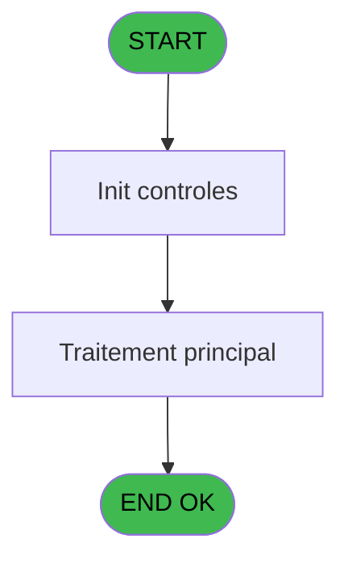
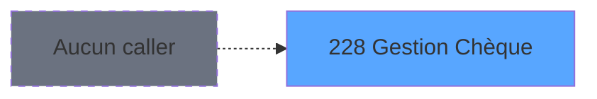
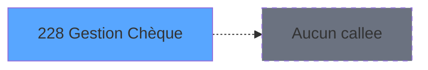

Generate a complete Zustand store for the "gestionCheque" domain.

RULES (MANDATORY):
- Use import aliases: @/ for src root (e.g. @/stores/..., @/types/...)
- NEVER use `any` type - use `unknown` or precise types
- Tailwind v4 classes for styling (no tailwind.config.js)
- Arrow functions everywhere (no function declarations)
- `as const` instead of TypeScript enum
- verbatimModuleSyntax is enabled: use `import type { X }` ONLY for types/interfaces, use `import { X }` for values/consts
- File must be COMPLETE and ready to write - NO placeholders, NO TODOs, NO "// implement here"
- NO comments except for genuinely complex logic
- Output ONLY the code inside a single markdown code block (```typescript ... ``` or ```tsx ... ```)

SHARED INFRASTRUCTURE (use these exact imports):
- Data source toggle: `import { useDataSourceStore } from "@/stores/dataSourceStore"` (has .getState().isRealApi)
- API client: `import { apiClient } from "@/services/api/apiClient"` and `import type { ApiResponse } from "@/services/api/apiClient"`
- Screen layout: `import { ScreenLayout } from "@/components/layout"` (wrapper with sidebar, takes children + className)
- UI components: `import { Button, Dialog, Input } from "@/components/ui"`
- cn utility: `import { cn } from "@/lib/utils"`

STORE REQUIREMENTS:
- Use `create` from zustand (import { create } from "zustand")
- Import types from @/types/gestionCheque
- Import useDataSourceStore from @/stores/dataSourceStore
- Mock/API branching via useDataSourceStore.getState().isRealApi
- try/catch with `e instanceof Error` for error handling
- Realistic mock data (not lorem ipsum)
- EVERY business rule from the analysis MUST be implemented
- Include reset() action to clear state

TYPES FILE (already generated):
export type ChequeOperationType = 'depot' | 'retrait';

export interface Cheque {
  numeroCheque: string;
  montant: number;
  dateEmission: Date;
  banque: string | null;
  titulaire: string | null;
  estPostdate: boolean;
}

export interface OperationCheque {
  typeOperation: ChequeOperationType;
  montant: number;
  dateOperation: Date;
  numeroCheque: string;
}

export interface ChequeFilters {
  dateDebut?: Date;
  dateFin?: Date;
  estPostdate?: boolean;
}

export interface GestionChequeState {
  cheques: Cheque[];
  selectedCheque: Cheque | null;
  isLoading: boolean;
  error: string | null;
  filters: ChequeFilters;
  totalDepots: number;
  totalRetraits: number;
  setCheques: (cheques: Cheque[]) => void;
  setSelectedCheque: (cheque: Cheque | null) => void;
  setIsLoading: (loading: boolean) => void;
  setError: (error: string | null) => void;
  setFilters: (filters: ChequeFilters) => void;
  setTotalDepots: (total: number) => void;
  setTotalRetraits: (total: number) => void;
  enregistrerDepot: (
    cheque: Cheque,
    societe: string,
    compte: string,
    filiation: string
  ) => Promise<void>;
  enregistrerRetrait: (
    cheque: Cheque,
    societe: string,
    compte: string,
    filiation: string
  ) => Promise<void>;
  validerCheque: (
    numeroCheque: string,
    dateEmission: Date
  ) => Promise<{ valide: boolean; estPostdate: boolean; erreur?: string }>;
  listerChequesCompte: (
    societe: string,
    compte: string,
    filiation: string,
    filters?: ChequeFilters
  ) => Promise<Cheque[]>;
  calculerTotaux: (
    societe: string,
    compte: string,
    filiation: string
  ) => Promise<{ totalDepots: number; totalRetraits: number }>;
  reset: () => void;
}

export interface EnregistrerDepotRequest {
  numeroCheque: string;
  montant: number;
  dateEmission: Date;
  banque: string | null;
  titulaire: string | null;
  societe: string;
  compte: string;
  filiation: string;
}

export interface EnregistrerDepotResponse {
  success: boolean;
  message?: string;
}

export interface EnregistrerRetraitRequest {
  numeroCheque: string;
  montant: number;
  dateEmission: Date;
  banque: string | null;
  titulaire: string | null;
  societe: string;
  compte: string;
  filiation: string;
}

export interface EnregistrerRetraitResponse {
  success: boolean;
  message?: string;
}

export interface ListerChequesRequest {
  societe: string;
  compte: string;
  filiation: string;
  dateDebut?: Date;
  dateFin?: Date;
  estPostdate?: boolean;
}

export interface ListerChequesResponse {
  cheques: Cheque[];
}

export interface ValiderChequeRequest {
  numeroCheque: string;
  dateEmission: Date;
}

export interface ValiderChequeResponse {
  valide: boolean;
  estPostdate: boolean;
  erreur?: string;
}

export interface CalculerTotauxRequest {
  societe: string;
  compte: string;
  filiation: string;
}

export interface CalculerTotauxResponse {
  totalDepots: number;
  totalRetraits: number;
}

export interface ChequeListItem {
  numeroCheque: string;
  dateEmission: Date;
  montant: number;
  typeOperation: ChequeOperationType;
  banque: string | null;
  titulaire: string | null;
  estPostdate: boolean;
}

export interface ChequeSummary {
  totalDepots: number;
  totalRetraits: number;
  nbChequesDeposes: number;
  nbChequesRetraites: number;
  nbChequesPostdates: number;
}

export const CHEQUE_OPERATION_TYPES = {
  DEPOT: 'depot',
  RETRAIT: 'retrait',
} as const;

export const DEFAULT_GESTION_CHEQUE_STATE: Omit<
  GestionChequeState,
  | 'setCheques'
  | 'setSelectedCheque'
  | 'setIsLoading'
  | 'setError'
  | 'setFilters'
  | 'setTotalDepots'
  | 'setTotalRetraits'
  | 'enregistrerDepot'
  | 'enregistrerRetrait'
  | 'validerCheque'
  | 'listerChequesCompte'
  | 'calculerTotaux'
  | 'reset'
> = {
  cheques: [],
  selectedCheque: null,
  isLoading: false,
  error: null,
  filters: {},
  totalDepots: 0,
  totalRetraits: 0,
};

ANALYSIS DOCUMENT:
{
  "domain": "gestionCheque",
  "domainPascal": "GestionCheque",
  "complexity": "LOW",
  "entities": [
    {
      "name": "Cheque",
      "fields": [
        {
          "name": "numeroCheque",
          "type": "string",
          "source": "user_input",
          "nullable": false
        },
        {
          "name": "montant",
          "type": "number",
          "source": "user_input",
          "nullable": false
        },
        {
          "name": "dateEmission",
          "type": "Date",
          "source": "user_input",
          "nullable": false
        },
        {
          "name": "banque",
          "type": "string",
          "source": "user_input",
          "nullable": true
        },
        {
          "name": "titulaire",
          "type": "string",
          "source": "user_input",
          "nullable": true
        },
        {
          "name": "estPostdate",
          "type": "boolean",
          "source": "computed",
          "nullable": false
        }
      ]
    },
    {
      "name": "OperationCheque",
      "fields": [
        {
          "name": "typeOperation",
          "type": "string",
          "source": "user_input",
          "nullable": false
        },
        {
          "name": "montant",
          "type": "number",
          "source": "cheque.montant",
          "nullable": false
        },
        {
          "name": "dateOperation",
          "type": "Date",
          "source": "system.now",
          "nullable": false
        },
        {
          "name": "numeroCheque",
          "type": "string",
          "source": "cheque.numero",
          "nullable": false
        }
      ]
    }
  ],
  "stateFields": [
    {
      "name": "cheques",
      "type": "Cheque[]",
      "default": "[]"
    },
    {
      "name": "selectedCheque",
      "type": "Cheque | null",
      "default": "null"
    },
    {
      "name": "isLoading",
      "type": "boolean",
      "default": "false"
    },
    {
      "name": "error",
      "type": "string | null",
      "default": "null"
    },
    {
      "name": "filters",
      "type": "{ dateDebut?: Date; dateFin?: Date; estPostdate?: boolean }",
      "default": "{}"
    },
    {
      "name": "totalDepots",
      "type": "number",
      "default": "0"
    },
    {
      "name": "totalRetraits",
      "type": "number",
      "default": "0"
    }
  ],
  "actions": [
    {
      "name": "enregistrerDepot",
      "params": [
        "cheque: Cheque",
        "societe: string",
        "compte: string",
        "filiation: string"
      ],
      "businessRules": [
        "Valider le numéro de chèque (format et unicité)",
        "Valider la date d'émission (ne peut pas être future sauf postdaté)",
        "Identifier si le chèque est postdaté (dateEmission > dateOperation)",
        "Enregistrer le mouvement dans l'historique du compte",
        "Mettre à jour le solde si chèque non postdaté",
        "Générer une écriture comptable de dépôt"
      ],
      "returns": "Promise<void>"
    },
    {
      "name": "enregistrerRetrait",
      "params": [
        "cheque: Cheque",
        "societe: string",
        "compte: string",
        "filiation: string"
      ],
      "businessRules": [
        "Valider le numéro de chèque",
        "Vérifier la disponibilité des fonds",
        "Enregistrer le mouvement de retrait",
        "Mettre à jour le solde du compte",
        "Générer une écriture comptable de retrait"
      ],
      "returns": "Promise<void>"
    },
    {
      "name": "validerCheque",
      "params": [
        "numeroCheque: string",
        "dateEmission: Date"
      ],
      "businessRules": [
        "Vérifier le format du numéro de chèque",
        "Vérifier l'unicité du numéro dans le système",
        "Valider la cohérence de la date d'émission",
        "Signaler si chèque postdaté"
      ],
      "returns": "Promise<{ valide: boolean; estPostdate: boolean; erreur?: string }>"
    },
    {
      "name": "listerChequesCompte",
      "params": [
        "societe: string",
        "compte: string",
        "filiation: string",
        "filters?: { dateDebut?: Date; dateFin?: Date; estPostdate?: boolean }"
      ],
      "businessRules": [
        "Récupérer tous les chèques du compte",
        "Appliquer les filtres de date si fournis",
        "Filtrer par statut postdaté si demandé",
        "Trier par date d'opération décroissante"
      ],
      "returns": "Promise<Cheque[]>"
    },
    {
      "name": "calculerTotaux",
      "params": [
        "societe: string",
        "compte: string",
        "filiation: string"
      ],
      "businessRules": [
        "Calculer le total des dépôts par chèque",
        "Calculer le total des retraits par chèque",
        "Retourner les totaux séparés"
      ],
      "returns": "Promise<{ totalDepots: number; totalRetraits: number }>"
    }
  ],
  "apiEndpoints": [
    {
      "method": "POST",
      "path": "/api/gestion-cheque/depot",
      "queryParams": [],
      "response": "{ success: boolean; message?: string }"
    },
    {
      "method": "POST",
      "path": "/api/gestion-cheque/retrait",
      "queryParams": [],
      "response": "{ success: boolean; message?: string }"
    },
    {
      "method": "GET",
      "path": "/api/gestion-cheque/liste/{societe}/{compte}/{filiation}",
      "queryParams": [
        "dateDebut?",
        "dateFin?",
        "estPostdate?"
      ],
      "response": "Cheque[]"
    },
    {
      "method": "POST",
      "path": "/api/gestion-cheque/valider",
      "queryParams": [],
      "response": "{ valide: boolean; estPostdate: boolean; erreur?: string }"
    },
    {
      "method": "GET",
      "path": "/api/gestion-cheque/totaux/{societe}/{compte}/{filiation}",
      "queryParams": [],
      "response": "{ totalDepots: number; totalRetraits: number }"
    }
  ],
  "uiLayout": {
    "type": "form-page",
    "sections": [
      {
        "name": "informationsCheque",
        "controls": [
          "Numéro de chèque (input texte, obligatoire)",
          "Montant (input numérique, obligatoire)",
          "Date d'émission (datepicker, obligatoire)",
          "Banque (input texte, optionnel)",
          "Titulaire (input texte, optionnel)",
          "Indicateur chèque postdaté (readonly, calculé)"
        ]
      },
      {
        "name": "typeOperation",
        "controls": [
          "Type d'opération (radio: Dépôt / Retrait)",
          "Bouton Valider",
          "Bouton Annuler"
        ]
      },
      {
        "name": "historique",
        "controls": [
          "Filtres date (date début / date fin)",
          "Filtre chèques postdatés (checkbox)",
          "Liste des chèques (DataGrid avec colonnes: numéro, date, montant, type, statut)",
          "Totaux (dépôts / retraits)"
        ]
      }
    ]
  },
  "mockData": {
    "count": 10,
    "description": "10 opérations de chèques avec numéros variés (format: CHQ-XXXXXX), montants entre 50 et 5000, dates d'émission sur les 3 derniers mois, mix dépôts/retraits, 2-3 chèques postdatés, banques variées (BNP, Société Générale, Crédit Agricole)"
  },
  "dependencies": {
    "stores": [
      "useSessionStore",
      "useCompteStore"
    ],
    "sharedTypes": [
      "ApiResponse",
      "ErrorResponse"
    ],
    "externalApis": [
      "/api/operations/create",
      "/api/comptes/update-solde"
    ]
  }
}

SPEC EXCERPT (business rules):
# ADH IDE 228 - Gestion Chèque

> **Analyse**: Phases 1-4 2026-02-08 04:28 -> 04:28 (4s) | Assemblage 04:28
> **Pipeline**: V7.2 Enrichi
> **Structure**: 4 onglets (Resume | Ecrans | Donnees | Connexions)

<!-- TAB:Resume -->

## 1. FICHE D'IDENTITE

| Attribut | Valeur |
|----------|--------|
| Projet | ADH |
| IDE Position | 228 |
| Nom Programme | Gestion Chèque |
| Fichier source | `Prg_228.xml` |
| Dossier IDE | General |
| Taches | 1 (0 ecrans visibles) |
| Tables modifiees | 0 |
| Programmes appeles | 0 |
| Complexite | **BASSE** (score 0/100) |
| <span style="color:red">Statut</span> | <span style="color:red">**ORPHELIN_POTENTIEL**</span> |

## 2. DESCRIPTION FONCTIONNELLE

ADH IDE 228 gère les opérations de chèque dans le système de caisse. Ce programme permet de traiter les dépôts et retraits de chèques, en enregistrant les mouvements dans le compte client. Il communique avec le module de gestion de caisse pour mettre à jour les soldes et générer les écritures comptables correspondantes.

Le programme s'intègre dans la chaîne de paiement du module ADH (Adhérents/Caisse), en parallèle avec les autres moyens de règlement comme les cartes, espèces et virements. Il valide les chèques remis (numéro, date d'émission, signature) avant enregistrement et peut identifier les chèques postdatés nécessitant un suivi spécifique.

Il interagit avec les tables de référence REF pour les codes devises et moyens de réglement, tout en maintenant la traçabilité complète des opérations chèque dans l'historique des mouvements du compte.

## 3. BLOCS FONCTIONNELS

## 5. REGLES METIER

*(Aucune regle metier identifiee dans les expressions)*

## 6. CONTEXTE

- **Appele par**: (aucun)
- **Appelle**: 0 programmes | **Tables**: 0 (W:0 R:0 L:0) | **Taches**: 1 | **Expressions**: 0

<!-- TAB:Ecrans -->

## 8. ECRANS

*(Programme sans ecran visible)*

## 9. NAVIGATION

### 9.3 Structure hierarchique (0 tache)

| Position | Tache | Type | Dimensions | Bloc |
|----------|-------|------|------------|------|

### 9.4 Algorigramme



> **Legende**: Vert = START/END OK | Rouge = END KO | Bleu = Decisions
> *Algorigramme auto-genere. Utiliser `/algorigramme` pour une synthese metier detaillee.*

<!-- TAB:Donnees -->

## 10. TABLES

### Tables utilisees (0)

| ID | Nom | Description | Type | R | W | L | Usages |
|----|-----|-------------|------|---|---|---|--------|

### Colonnes par table (0 / 0 tables avec colonnes identifiees)

## 11. VARIABLES

*(Programme sans variables locales mappees)*

## 12. EXPRESSIONS

**0 / 0 expressions decodees (0%)**

### 12.1 Repartition par type

| Type | Expressions | Regles |
|------|-------------|--------|

### 12.2 Expressions cles par type

<!-- TAB:Connexions -->

## 13. GRAPHE D'APPELS

### 13.1 Chaine depuis Main (Callers)

**Chemin**: (pas de callers directs)



### 13.2 Callers

| IDE | Nom Programme | Nb Appels |
|-----|---------------|-----------|
| - | (aucun) | - |

### 13.3 Callees (programmes appeles)



### 13.4 Detail Callees avec contexte

| IDE | Nom Programme | Appels | Contexte |
|-----|---------------|--------|----------|
| - | (aucun) | - | - |

## 14. RECOMMANDATIONS MIGRATION

### 14.1 Profil du programme

| Metrique | Valeur | Impact migration |
|----------|--------|-----------------|
| Lignes de logique | 2 | Programme compact |
| Expressions | 0 | Peu de logique |
| Tables WRITE | 0 | Impact faible |
| Sous-programmes | 0 | Peu de dependances |
| Ecrans visibles | 0 | Ecran unique ou traitement batch |
| Code desactive | 0% (0 / 2) | Code sain |
| Regles metier | 0 | Pas de regle identifiee |

### 14.2 Plan de migration par bloc

### 14.3 Dependances critiques

| Dependance | Type | Appels | Impact |
|------------|------|--------|--------|

---
*Spec DETAILED generee par Pipeline V7.2 - 2026-02-08 04:29*


REFERENCE PATTERN (follow this exact structure):
```typescript
import { create } from 'zustand';
import type {
  ExtraitAccountInfo,
  ExtraitTransaction,
  ExtraitSummary,
  ExtraitPrintFormat,
} from '@/types/extrait';
import { extraitApi } from '@/services/api/endpoints-lot3';
import { useDataSourceStore } from './dataSourceStore';

interface ExtraitState {
  selectedAccount: ExtraitAccountInfo | null;
  transactions: ExtraitTransaction[];
  summary: ExtraitSummary | null;
  searchResults: ExtraitAccountInfo[];
  isSearching: boolean;
  isLoadingExtrait: boolean;
  isPrinting: boolean;
  error: string | null;
}

interface ExtraitActions {
  searchAccount: (societe: string, query: string) => Promise<void>;
  selectAccount: (account: ExtraitAccountInfo) => void;
  loadExtrait: (
    societe: string,
    codeAdherent: number,
    filiation: number,
    dateDebut?: string,
    dateFin?: string,
  ) => Promise<void>;
  printExtrait: (
    societe: string,
    codeAdherent: number,
    filiation: number,
    format: ExtraitPrintFormat,
  ) => Promise<void>;
  reset: () => void;
}

type ExtraitStore = ExtraitState & ExtraitActions;

const MOCK_ACCOUNTS: ExtraitAccountInfo[] = [
  { societe: 'SOC1', codeAdherent: 1001, filiation: 0, nom: 'DUPONT', prenom: 'Jean', statut: 'normal', hasGiftPass: false },
  { societe: 'SOC1', codeAdherent: 1002, filiation: 0, nom: 'MARTIN', prenom: 'Sophie', statut: 'normal', hasGiftPass: true },
  { societe: 'SOC1', codeAdherent: 1003, filiation: 1, nom: 'DURAND', prenom: 'Pierre', statut: 'bloque', hasGiftPass: false },
];

const MOCK_TRANSACTIONS: ExtraitTransaction[] = [
  { id: 1, date: '2026-02-10', heure: '09:15', libelle: 'Achat boutique', debit: 45.50, credit: 0, solde: -45.50, codeService: 'BTQ', codeImputation: 'IMP01', giftPassFlag: false, nbArticles: 3, status: 'debit', numeroPiece: 'VTE-001', modePaiement: 'CB', caissier: 'MARTIN S.' },
  { id: 2, date: '2026-02-10', heure: '14:30', libelle: 'Credit compte', debit: 0, credit: 200, solde: 154.50, codeService: 'CAI', codeImputation: 'IMP02', giftPassFlag: false, status: 'credit', numeroPiece: 'CRD-042', modePaiement: 'Especes', caissier: 'DUPONT J.' },
  { id: 3, date: '2026-02-09', heure: '12:45', libelle: 'Repas restaurant', libelleSupplementaire: 'Menu du jour', debit: 32.00, credit: 0, solde: 122.50, codeService: 'RST', codeImputation: 'IMP03', giftPassFlag: true, nbArticles: 1, status: 'debit', numeroPiece: 'RST-117', modePaiement: 'GiftPass', caissier: 'MARTIN S.' },
  { id: 4, date: '2026-02-08', heure: '16:00', libelle: 'Annulation vente', debit: 0, credit: 15.00, solde: 154.50, codeService: 'BTQ', codeImputation: 'IMP01', giftPassFlag: false, status: 'annule', numeroPiece: 'ANN-003', modePaiement: 'CB', caissier: 'DUPONT J.', commentaire: 'Erreur de saisie' },
  { id: 5, date: '2026-02-08', heure: '10:20', libelle: 'Regularisation solde', debit: 0, credit: 5.00, solde: 139.50, codeService: 'CAI', codeImputation: 'IMP02', giftPassFlag: false, status: 'regularise', numeroPiece: 'REG-007', modePaiement: 'Interne', caissier: 'ADMIN' },
];

const MOCK_SUMMARY: ExtraitSummary = {
  totalDebit: 77.50,
  totalCredit: 220,
  soldeActuel: 142.50,
  nbTransactions: 5,
};

const initialState: ExtraitState = {
  selectedAccount: null,
  transactions: [],
  summary: null,
  searchResults: [],
  isSearching: false,
  isLoadingExtrait: false,
  isPrinting: false,
  error: null,
};

export const useExtraitStore = create<ExtraitStore>()((set) => ({
  ...initialState,

  searchAccount: async (societe, query) => {
    const { isRealApi } = useDataSourceStore.getState();
    set({ isSearching: true, error: null });

    if (!isRealApi) {
      const filtered = MOCK_ACCOUNTS.filter(
        (a) =>
          a.nom.toLowerCase().includes(query.toLowerCase()) ||
          a.prenom.toLowerCase().includes(query.toLowerCase()) ||
          String(a.codeAdherent).includes(query),
      );
      set({ searchResults: filtered, isSearching: false });
      return;
    }

    try {
      const response = await extraitApi.searchAccount(societe, query);
      set({ searchResults: response.data.data ?? [] });
    } catch (e: unknown) {
      const message = e instanceof Error ? e.message : 'Erreur recherche compte';
      set({ searchResults: [], error: message });
    } finally {
      set({ isSearching: false });
    }
  },

  selectAccount: (account) => {
    set({ selectedAccount: account, transactions: [], summary: null, error: null });
  },

  loadExtrait: async (societe, codeAdherent, filiation, dateDebut, dateFin) => {
    const { isRealApi } = useDataSourceStore.getState();
    set({ isLoadingExtrait: true, error: null });

    if (!isRealApi) {
      set({
        transactions: MOCK_TRANSACTIONS,
        summary: MOCK_SUMMARY,
        isLoadingExtrait: false,
      });
      return;
    }

    try {
      const response = await extraitApi.getExtrait(
        societe,
        codeAdherent,
        filiation,
        dateDebut,
        dateFin,
      );
      const data = response.data.data;
      set({
        transactions: data?.transactions ?? [],
        summary: data?.summary ?? null,
      });
    } catch (e: unknown) {
      const message = e instanceof Error ? e.message : 'Erreur chargement extrait';
      set({ transactions: [], summary: null, error: message });
    } finally {
      set({ isLoadingExtrait: false });
    }
  },

  printExtrait: async (societe, codeAdherent, filiation, format) => {
    const { isRealApi } = useDataSourceStore.getState();
    set({ isPrinting: true, error: null });

    if (!isRealApi) {
      set({ isPrinting: false });
      return;
    }

    try {
      await extraitApi.printExtrait({
        societe,
        codeAdherent,
        filiation,
        format,
      });
    } catch (e: unknown) {
      const message = e instanceof Error ? e.message : 'Erreur impression';
      set({ error: message });
    } finally {
      set({ isPrinting: false });
    }
  },

  reset: () => set({ ...initialState }),
}));

```