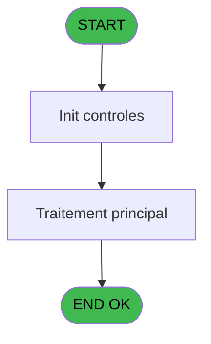

Review the generated code against the original specification.

Produce a JSON report:
```json
{
  "programId": 0,
  "programName": "",
  "coveragePct": 0,
  "rulesImplemented": 0,
  "rulesTotal": 0,
  "missingRules": [
    "rule descriptions not implemented"
  ],
  "recommendations": [
    "improvement suggestions"
  ]
}
```

Check:
1. Every business rule from the contract is implemented in the store
2. Every table from the contract has corresponding entity types
3. Every API endpoint is wired to the store
4. UI layout matches the spec description
5. Error handling is present for all actions

CONTRACT RULES:
[
  {
    "id": "RM-001",
    "description": "Valeur par defaut si type prog est vide -> CA",
    "condition": "IF (type prog [C]='','CA',type prog [C])",
    "variables": [
      "EP (type prog CA si vide)"
    ],
    "status": "N/A",
    "targetFile": "",
    "gapNotes": "Backend-only logic. Title lookup with default type 'CA' is a server-side reference table concern. Frontend does not perform title resolution from code/type."
  }
]

SPEC EXCERPT:
# ADH IDE 43 - Recuperation du titre

> **Analyse**: Phases 1-4 2026-02-07 06:46 -> 01:41 (18h54min) | Assemblage 01:41
> **Pipeline**: V7.2 Enrichi
> **Structure**: 4 onglets (Resume | Ecrans | Donnees | Connexions)

<!-- TAB:Resume -->

## 1. FICHE D'IDENTITE

| Attribut | Valeur |
|----------|--------|
| Projet | ADH |
| IDE Position | 43 |
| Nom Programme | Recuperation du titre |
| Fichier source | `Prg_43.xml` |
| Dossier IDE | General |
| Taches | 1 (0 ecrans visibles) |
| Tables modifiees | 0 |
| Programmes appeles | 0 |
| Complexite | **BASSE** (score 0/100) |

## 2. DESCRIPTION FONCTIONNELLE

ADH IDE 43 est un utilitaire de **lookup titre/civilité** appelé depuis une vingtaine de contextes différents (sessions, change, garanties, caisse, telephone, etc.). Le programme récupère le titre (M., Mme, etc.) d'un compte en lisant la table de référence **titres** via une clé identifiant le type de titre stocké dans le compte. C'est une fonction élémentaire de normalisation affichage, utilisée partout où un titre doit être présenté à l'écran.

Le programme reçoit probablement un **paramètre d'entrée** (numéro ou code titre) et retourne le **libellé du titre** formaté. Aucune logique métier complexe : il s'agit d'un simple **mapping table de référence**, similaire aux autres zooms (devises, moyens de paiement, garanties).

Son ubiquité dans l'architecture (20+ appelants) en fait un **composant critique de présentation** : si ce lookup échoue, l'affichage titres dégénère partout. C'est typiquement un programme à **migrer en utilitaire/service** centralisé, plutôt que d'appeler depuis 20 endroits.

## 3. BLOCS FONCTIONNELS

## 5. REGLES METIER

1 regles identifiees:

### Autres (1 regles)

#### <a id="rm-RM-001"></a>[RM-001] Valeur par defaut si > type prog (CA si vide) [C] est vide

| Element | Detail |
|---------|--------|
| **Condition** | `> type prog (CA si vide) [C]=''` |
| **Si vrai** | 'CA' |
| **Si faux** | > type prog (CA si vide) [C]) |
| **Variables** | EP (> type prog (CA si vide)) |
| **Expression source** | Expression 3 : `IF (> type prog (CA si vide) [C]='','CA',> type prog (CA si ` |
| **Exemple** | Si > type prog (CA si vide) [C]='' → 'CA'. Sinon → > type prog (CA si vide) [C]) |

## 6. CONTEXTE

- **Appele par**: [Affichage sessions (IDE 119)](ADH-IDE-119.md), [Change GM (IDE 25)](ADH-IDE-25.md), [Gestion forfait TAI LOCAL (IDE 173)](ADH-IDE-173.md), [Bi  Change GM Achat (IDE 293)](ADH-IDE-293.md), [Bi  Change GM Vente (IDE 294)](ADH-IDE-294.md), [Solde compte fin sejour (IDE 193)](ADH-IDE-193.md), [Garantie sur compte PMS-584 (IDE 0)](ADH-IDE-0.md), [Fusion (IDE 28)](ADH-IDE-28.md), [Comptes de depôt (IDE 40)](ADH-IDE-40.md), [Garantie sur compte (IDE 111)](ADH-IDE-111.md), [Garantie sur compte PMS-584 (IDE 112)](ADH-IDE-112.md), [Saisie contenu caisse (IDE 120)](ADH-IDE-120.md), [Apport coffre (IDE 123)](ADH-IDE-123.md), [Menu caisse GM - scroll (IDE 163)](ADH-IDE-163.md), [Messagerie (IDE 170)](ADH-IDE-170.md), [Affectation code autocom (IDE 209)](ADH-IDE-209.md), [Menu telephone (IDE 217)](ADH-IDE-217.md), [Zoom modes de paiement (IDE 272)](ADH-IDE-272.md), [Garantie sur compte (IDE 288)](ADH-IDE-288.md), [Transaction Nouv vente PMS-584 (IDE 0)](ADH-IDE-0.md)
- **Appelle**: 0 programmes | **Tables**: 1 (W:0 R:1 L:0) | **Taches**: 1 | **Expressions**: 4

<!-- TAB:Ecrans -->

## 8. ECRANS

*(Programme sans ecran visible)*

## 9. NAVIGATION

### 9.3 Structure hierarchique (0 tache)

| Position | Tache | Type | Dimensions | Bloc |
|----------|-------|------|------------|------|

### 9.4 Algorigramme



> **Legende**: Vert = START/END OK | Rouge = END KO | Bleu = Decisions
> *Algorigramme auto-genere. Utiliser `/algorigramme` pour une synthese metier detaillee.*

<!-- TAB:Donnees -->

## 10. TABLES

### Tables utilisees (1)

| ID | Nom | Description | Type | R | W | L | Usages |
|----|-----|-------------|------|---|---|---|--------|
| 719 | arc_transac_detail_bar |  | DB | R |   |   | 1 |

### Colonnes par table (1 / 1 tables avec colonnes identifiees)

<details>
<summary>Table 719 - arc_transac_detail_bar (R) - 1 usages</summary>

| Lettre | Variable | Acces | Type |
|--------|----------|-------|------|
| A | > code ecran | R | Numeric |
| B | < nom ecran | R | Alpha |
| C | > type prog (CA si vide) | R | Alpha |

</details>

## 11. VARIABLES

### 11.1 Autres (3)

Variables diverses.

| Lettre | Nom | Type | Usage dans |
|--------|-----|------|-----------|
| EN | > code ecran | Numeric | 1x refs |
| EO | < nom ecran | Alpha | - |
| EP | > type prog (CA si vide) | Alpha | 1x refs |

## 12. EXPRESSIONS

**4 / 4 expressions decodees (100%)**

### 12.1 Repartition par type

| Type | Expressions | Regles |
|------|-------------|--------|


GENERATED FILES:

--- types/titleLookup.ts ---
// Title lookup types (reference table - arc_transac_detail_bar)

export interface Title {
  code: string;
  label: string;
  type: string;
}

export interface TitleLookupResponse {
  label: string;
}

export interface TitleLookupState {
  titles: Title[];
  isLoading: boolean;
  error: string | null;
  getTitleByCode: (code: string, programType?: string) => Promise<string>;
  loadTitles: () => Promise<void>;
  setTitles: (titles: Title[]) => void;
  setIsLoading: (loading: boolean) => void;
  setError: (error: string | null) => void;
}

export const PROGRAM_TYPE_DEFAULT = 'CA' as const;

export type TitleLoadingAction =
  | { type: 'SET_LOADING'; payload: boolean }
  | { type: 'SET_ERROR'; payload: string | null }
  | { type: 'SET_TITLES'; payload: Title[] }
  | { type: 'LOAD_TITLES_START' }
  | { type: 'LOAD_TITLES_SUCCESS'; payload: Title[] }
  | { type: 'LOAD_TITLES_ERROR'; payload: string };

--- stores/titleLookupStore.ts ---
import { create } from 'zustand';
import type { Title, TitleLookupState } from '@/types/titleLookup';
import { useDataSourceStore } from '@/stores/dataSourceStore';
import { apiClient } from '@/services/api/apiClient';
import type { ApiResponse } from '@/services/api/apiClient';

const MOCK_TITLES: Title[] = [
  { code: 'M', label: 'M.', type: 'CA' },
  { code: 'MME', label: 'Mme', type: 'CA' },
  { code: 'MLLE', label: 'Mlle', type: 'CA' },
  { code: 'DR', label: 'Dr', type: 'CA' },
  { code: 'PR', label: 'Pr', type: 'CA' },
  { code: 'M', label: 'Mr', type: 'CB' },
  { code: 'MME', label: 'Mrs', type: 'CB' },
  { code: 'MLLE', label: 'Miss', type: 'CB' },
];

const initialState = {
  titles: [] as Title[],
  isLoading: false,
  error: null as string | null,
};

export const useTitleLookupStore = create<TitleLookupState>()((set, get) => ({
  ...initialState,

  getTitleByCode: async (code, programType) => {
    const { isRealApi } = useDataSourceStore.getState();
    const effectiveType = programType || 'CA';

    if (!isRealApi) {
      const title = MOCK_TITLES.find(
        (t) => t.code === code && t.type === effectiveType,
      );
      return title?.label ?? code;
    }

    try {
      const response = await apiClient.get<ApiResponse<{ label: string }>>(
        `/api/titles/${code}?programType=${effectiveType}`,
      );
      return response.data.data?.label ?? code;
    } catch (e: unknown) {
      const message = e instanceof Error ? e.message : 'Erreur recherche titre';
      set({ error: message });
      return code;
    }
  },

  loadTitles: async () => {
    const { isRealApi } = useDataSourceStore.getState();
    set({ isLoading: true, error: null });

    if (!isRealApi) {
      set({ titles: MOCK_TITLES, isLoading: false });
      return;
    }

    try {
      const response = await apiClient.get<ApiResponse<Title[]>>('/api/titles');
      set({ titles: response.data.data ?? [] });
    } catch (e: unknown) {
      const message = e instanceof E

--- services/api/endpoints-titleLookup.ts ---
import { apiClient, type ApiResponse } from './apiClient';
import type { Title, TitleLookupResponse } from '@/types/titleLookup';

export const titleLookupApi = {
  getTitles: () =>
    apiClient.get<ApiResponse<Title[]>>('/api/titles'),

  getTitleByCode: (code: string, programType?: string) => {
    const params = new URLSearchParams();
    if (programType) {
      params.append('programType', programType);
    }
    const queryString = params.toString();
    const url = queryString ? `/api/titles/${code}?${queryString}` : `/api/titles/${code}`;
    return apiClient.get<ApiResponse<TitleLookupResponse>>(url);
  },
};

--- pages/TitleLookupPage.tsx ---
import { useEffect } from 'react';
import { useNavigate } from 'react-router-dom';
import { ScreenLayout } from '@/components/layout';
import { useTitleLookupStore } from '@/stores/titleLookupStore';
import { useAuthStore } from '@/stores';

export function TitleLookupPage() {
  const navigate = useNavigate();
  const user = useAuthStore((s) => s.user);

  const titles = useTitleLookupStore((s) => s.titles);
  const isLoading = useTitleLookupStore((s) => s.isLoading);
  const error = useTitleLookupStore((s) => s.error);
  const loadTitles = useTitleLookupStore((s) => s.loadTitles);
  const reset = useTitleLookupStore((s) => s.reset);

  useEffect(() => {
    loadTitles();
    return () => reset();
  }, [loadTitles, reset]);

  return (
    <ScreenLayout>
      <div className="space-y-6 max-w-4xl mx-auto">
        <div className="flex items-center justify-between">
          <div>
            <h2 className="text-xl font-semibold">Service de recherche de titres</h2>
            <p className="text-on-surface-muted text-sm mt-1">
              Service backend - Pas d'interface utilisateur
            </p>
          </div>
          {user && (
            <span className="text-xs text-on-surface-muted">
              {user.prenom} {user.nom}
            </span>
          )}
        </div>

        {error && (
          <div className="bg-red-50 border border-red-200 text-red-700 px-4 py-3 rounded-md text-sm">
            {error}
          </div>
        )}

        <div className="bg-surface border border-border rounded-md p-6">
          <div className="space-y-4">
            <div className="flex items-center gap-3">
              <div className="w-3 h-3 rounded-full bg-green-500"></div>
              <span className="font-medium">Service actif</span>
            </div>

            <p className="text-on-surface-muted text-sm">
              Ce service fournit la recherche de titres (M., Mme, Dr, etc.) pour les autres
              composants de l'application. Il n'a p

--- components/caisse/titleLookup/NoVisibleUIPanel.tsx ---
import type { Title } from '@/types/titleLookup';

interface NoVisibleUIPanelProps {
  titles: Title[];
  isLoading: boolean;
  error: string | null;
}

export const NoVisibleUIPanel = ({ titles, isLoading, error }: NoVisibleUIPanelProps) => {
  return (
    <div className="bg-surface border border-border rounded-md p-6">
      <div className="space-y-4">
        <div className="flex items-center gap-3">
          <div className="w-3 h-3 rounded-full bg-green-500" />
          <span className="font-medium">Service actif</span>
        </div>

        <p className="text-on-surface-muted text-sm">
          Ce service fournit la recherche de titres (M., Mme, Dr, etc.) pour les autres
          composants de l'application. Il n'a pas d'interface utilisateur dédiée.
        </p>

        {isLoading && (
          <div className="flex items-center gap-2 text-sm text-on-surface-muted">
            <div className="w-4 h-4 border-2 border-primary border-t-transparent rounded-full animate-spin" />
            <span>Chargement des titres...</span>
          </div>
        )}

        {error && (
          <div className="bg-red-50 border border-red-200 text-red-700 px-3 py-2 rounded text-sm">
            {error}
          </div>
        )}

        {!isLoading && !error && titles.length > 0 && (
          <div className="space-y-2">
            <p className="text-sm font-medium">Titres disponibles:</p>
            <div className="flex flex-wrap gap-2">
              {titles.slice(0, 10).map((title) => (
                <span
                  key={title.code}
                  className="px-2 py-1 bg-surface-variant text-on-surface-variant text-xs rounded"
                >
                  {title.code} - {title.label}
                </span>
              ))}
              {titles.length > 10 && (
                <span className="px-2 py-1 text-on-surface-muted text-xs">
                  +{titles.length - 10} autres
                </span>
              )}
            </di