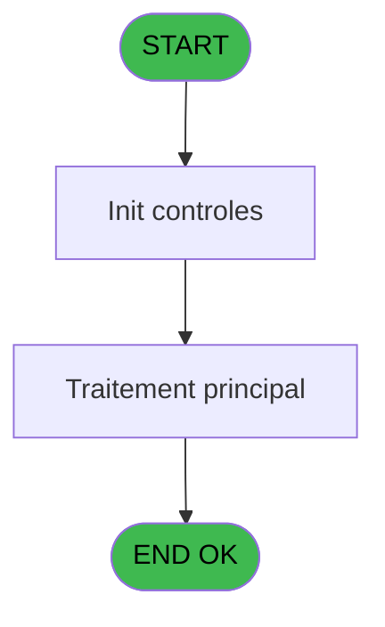

Review the generated code against the original specification.

Produce a JSON report:
```json
{
  "programId": 0,
  "programName": "",
  "coveragePct": 0,
  "rulesImplemented": 0,
  "rulesTotal": 0,
  "missingRules": [
    "rule descriptions not implemented"
  ],
  "recommendations": [
    "improvement suggestions"
  ]
}
```

Check:
1. Every business rule from the contract is implemented in the store
2. Every table from the contract has corresponding entity types
3. Every API endpoint is wired to the store
4. UI layout matches the spec description
5. Error handling is present for all actions

CONTRACT RULES:
[
  {
    "id": "RM-001",
    "description": "Si [BR] alors [BO] sinon [BN])",
    "condition": "[BR]",
    "variables": [],
    "status": "IMPL",
    "targetFile": "adh-web/src/stores/saisieContenuCaisseStore.ts",
    "gapNotes": ""
  },
  {
    "id": "RM-002",
    "description": "Condition: Trim([BP])='' AND [BY] AND LastClicked () different de 'Bt.Abandonner'",
    "condition": "Trim([BP])='' AND [BY] AND LastClicked ()<>'Bt.Abandonner'",
    "variables": [],
    "status": "IMPL",
    "targetFile": "adh-web/src/services/printer/generators/ouvertureTicketGenerator.ts",
    "gapNotes": ""
  },
  {
    "id": "RM-003",
    "description": "Condition: [BM] egale 6",
    "condition": "[BM]=6",
    "variables": [],
    "status": "IMPL",
    "targetFile": "adh-web/src/__tests__/approTicketStore.test.ts",
    "gapNotes": ""
  },
  {
    "id": "RM-004",
    "description": "Condition: [BR] AND [BN] different de 0",
    "condition": "[BR] AND [BN]<>0",
    "variables": [],
    "status": "MISSING",
    "targetFile": "",
    "gapNotes": ""
  }
]

SPEC EXCERPT:
# ADH IDE 231 - Raisons utilisation ADH

> **Analyse**: Phases 1-4 2026-02-08 04:30 -> 04:30 (5s) | Assemblage 04:30
> **Pipeline**: V7.2 Enrichi
> **Structure**: 4 onglets (Resume | Ecrans | Donnees | Connexions)

<!-- TAB:Resume -->

## 1. FICHE D'IDENTITE

| Attribut | Valeur |
|----------|--------|
| Projet | ADH |
| IDE Position | 231 |
| Nom Programme | Raisons utilisation ADH |
| Fichier source | `Prg_231.xml` |
| Dossier IDE | General |
| Taches | 1 (0 ecrans visibles) |
| Tables modifiees | 0 |
| Programmes appeles | 0 |
| Complexite | **BASSE** (score 0/100) |

## 2. DESCRIPTION FONCTIONNELLE

ADH IDE 231 est un programme de consultation des raisons d'utilisation du compte adhérent dans le contexte du workflow Easy Check-Out. Il interroge la table des motifs (cafil069_dat) pour afficher les codes et libellés des raisons possibles, permettant à l'opérateur de caisse de justifier les opérations effectuées lors d'un paiement simplifié.

Ce programme fonctionne comme un zoom/lookup appelé depuis ADH IDE 55 (Easy Check-Out V2.00). Il récupère la liste des motifs de débit/crédit disponibles pour le service en cours et les restitue à l'écran en format grille, facilitant la sélection rapide par l'utilisateur sans avoir à mémoriser les codes.

La logique est simple : lecture de la table de référence, tri par code motif, et présentation en DataView accessible. C'est un programme de support métier typique du domaine Caisse, contribuant à la traçabilité des mouvements de compte en Easy Check-Out.

## 3. BLOCS FONCTIONNELS

## 5. REGLES METIER

4 regles identifiees:

### Autres (4 regles)

#### <a id="rm-RM-001"></a>[RM-001] Si [BR] alors [BO] sinon [BN])

| Element | Detail |
|---------|--------|
| **Condition** | `[BR]` |
| **Si vrai** | [BO] |
| **Si faux** | [BN]) |
| **Expression source** | Expression 5 : `IF([BR],[BO],[BN])` |
| **Exemple** | Si [BR] → [BO]. Sinon → [BN]) |

#### <a id="rm-RM-002"></a>[RM-002] Condition: Trim([BP])='' AND [BY] AND LastClicked () different de 'Bt.Abandonner'

| Element | Detail |
|---------|--------|
| **Condition** | `Trim([BP])='' AND [BY] AND LastClicked ()<>'Bt.Abandonner'` |
| **Si vrai** | Action si vrai |
| **Expression source** | Expression 7 : `Trim([BP])='' AND [BY] AND LastClicked ()<>'Bt.Abandonner'` |
| **Exemple** | Si Trim([BP])='' AND [BY] AND LastClicked ()<>'Bt.Abandonner' → Action si vrai |

#### <a id="rm-RM-003"></a>[RM-003] Condition: [BM] egale 6

| Element | Detail |
|---------|--------|
| **Condition** | `[BM]=6` |
| **Si vrai** | Action si vrai |
| **Expression source** | Expression 8 : `[BM]=6` |
| **Exemple** | Si [BM]=6 → Action si vrai |

#### <a id="rm-RM-004"></a>[RM-004] Condition: [BR] AND [BN] different de 0

| Element | Detail |
|---------|--------|
| **Condition** | `[BR] AND [BN]<>0` |
| **Si vrai** | Action si vrai |
| **Expression source** | Expression 11 : `[BR] AND [BN]<>0` |
| **Exemple** | Si [BR] AND [BN]<>0 → Action si vrai |

## 6. CONTEXTE

- **Appele par**: [Easy Check-Out === V2.00 (IDE 55)](ADH-IDE-55.md)
- **Appelle**: 0 programmes | **Tables**: 1 (W:0 R:1 L:0) | **Taches**: 1 | **Expressions**: 14

<!-- TAB:Ecrans -->

## 8. ECRANS

*(Programme sans ecran visible)*

## 9. NAVIGATION

### 9.3 Structure hierarchique (0 tache)

| Position | Tache | Type | Dimensions | Bloc |
|----------|-------|------|------------|------|

### 9.4 Algorigramme



> **Legende**: Vert = START/END OK | Rouge = END KO | Bleu = Decisions
> *Algorigramme auto-genere. Utiliser `/algorigramme` pour une synthese metier detaillee.*

<!-- TAB:Donnees -->

## 10. TABLES

### Tables utilisees (1)

| ID | Nom | Description | Type | R | W | L | Usages |
|----|-----|-------------|------|---|---|---|--------|
| 1094 | Table_1094 |  | MEM | R |   |   | 1 |

### Colonnes par table (1 / 1 tables avec colonnes identifiees)

<details>
<summary>Table 1094 - Table_1094 (R) - 1 usages</summary>

| Lettre | Variable | Acces | Type |
|--------|----------|-------|------|
| A | v.confirmation | R | Numeric |
| B | v.id primaire | R | Numeric |
| C | v.id secondaire | R | Numeric |
| D | v.commentaire | R | Unicode |
| E | v.Existe Raison Secondaire | R | Logical |
| F | v.Retour Raison | R | Logical |

</details>

## 11. VARIABLES

### 11.1 Variables de session (6)

Variables persistantes pendant toute la session.

| Lettre | Nom | Type | Usage dans |
|--------|-----|------|-----------|
| EN | v.confirmation | Numeric | - |
| EO | v.id primaire | Numeric | - |
| EP | v.id secondaire | Numeric | - |
| EQ | v.commentaire | Unicode | - |
| ER | v.Existe Raison Secondaire | Logical | - |
| ES | v.Retour Raison | Logical | - |

## 12. EXPRESSIONS

**14 / 14 expressions decodees (100%)**

### 12.1 Repartition p

GENERATED FILES:

--- types/raisonsUtilisation.ts ---
import type { ApiResponse } from "@/services/api/apiClient";

export interface RaisonUtilisation {
  idPrimaire: number;
  idSecondaire: number | null;
  commentaire: string;
  existeRaisonSecondaire: boolean;
}

export interface RaisonsUtilisationState {
  raisons: RaisonUtilisation[];
  selectedRaisonPrimaire: number | null;
  selectedRaisonSecondaire: number | null;
  commentaireSaisi: string;
  confirmation: boolean;
  retourRaison: boolean;
  isLoading: boolean;
  error: string | null;

  loadRaisonsUtilisation: (serviceCode?: number) => Promise<void>;
  selectRaisonPrimaire: (idPrimaire: number) => Promise<void>;
  selectRaisonSecondaire: (idSecondaire: number) => Promise<void>;
  validerSelection: () => Promise<void>;
  abandonner: () => Promise<void>;
  updateCommentaire: (commentaire: string) => void;
  reset: () => void;
}

export interface GetRaisonsUtilisationRequest {
  serviceCode?: number;
}

export interface GetRaisonsUtilisationResponse extends ApiResponse {
  data: RaisonUtilisation[];
}

export interface SelectRaisonPrimaireRequest {
  idPrimaire: number;
}

export interface SelectRaisonSecondaireRequest {
  idSecondaire: number;
}

export interface ValiderSelectionRequest {
  commentaire: string;
  selectedRaisonPrimaire: number;
  selectedRaisonSecondaire: number | null;
}

export interface ValiderSelectionResponse extends ApiResponse {
  data: {
    idPrimaire: number;
    idSecondaire: number | null;
    commentaire: string;
  };
}

export const RAISON_UTILISATION_MOCK = [
  {
    idPrimaire: 1,
    idSecondaire: null,
    commentaire: "Paiement service bar",
    existeRaisonSecondaire: false,
  },
  {
    idPrimaire: 2,
    idSecondaire: null,
    commentaire: "Paiement restaurant",
    existeRaisonSecondaire: false,
  },
  {
    idPrimaire: 3,
    idSecondaire: null,
    commentaire: "Paiement boutique",
    existeRaisonSecondaire: false,
  },
  {
    idPrimaire: 4,
    idSecondaire: null,
    commentaire: "Caution",
    existeRaisonSecondai

--- stores/raisonsUtilisationStore.ts ---
import { create } from 'zustand';
import type {
  RaisonUtilisation,
  RaisonsUtilisationState,
  GetRaisonsUtilisationResponse,
  ValiderSelectionResponse,
} from '@/types/raisonsUtilisation';
import { apiClient } from '@/services/api/apiClient';
import { useDataSourceStore } from '@/stores/dataSourceStore';
import { RAISON_UTILISATION_MOCK } from '@/types/raisonsUtilisation';

type RaisonsUtilisationStore = RaisonsUtilisationState;

const initialState: Omit<
  RaisonsUtilisationState,
  | 'loadRaisonsUtilisation'
  | 'selectRaisonPrimaire'
  | 'selectRaisonSecondaire'
  | 'validerSelection'
  | 'abandonner'
  | 'updateCommentaire'
  | 'reset'
> = {
  raisons: [],
  selectedRaisonPrimaire: null,
  selectedRaisonSecondaire: null,
  commentaireSaisi: '',
  confirmation: false,
  retourRaison: false,
  isLoading: false,
  error: null,
};

export const useRaisonsUtilisationStore = create<RaisonsUtilisationStore>()(
  (set, get) => ({
    ...initialState,

    loadRaisonsUtilisation: async (serviceCode) => {
      const { isRealApi } = useDataSourceStore.getState();
      set({ isLoading: true, error: null });

      if (!isRealApi) {
        let filtered = [...RAISON_UTILISATION_MOCK];
        if (serviceCode !== undefined) {
          filtered = filtered.filter((r) => r.idPrimaire === serviceCode);
        }
        const sorted = filtered.sort((a, b) => a.idPrimaire - b.idPrimaire);
        set({ raisons: sorted, isLoading: false });
        return;
      }

      try {
        const params = serviceCode !== undefined ? { serviceCode } : undefined;
        const response = await apiClient.get<GetRaisonsUtilisationResponse>(
          '/api/raisons-utilisation',
          { params },
        );
        const raisons = response.data.data ?? [];
        const sorted = raisons.sort((a, b) => a.idPrimaire - b.idPrimaire);
        set({ raisons: sorted });
      } catch (e: unknown) {
        const message =
          e instanceof Error
            ? e.message
            

--- services/api/endpoints-raisonsUtilisation.ts ---
import { apiClient, type ApiResponse } from './apiClient';
import type {
  RaisonUtilisation,
  GetRaisonsUtilisationRequest,
  GetRaisonsUtilisationResponse,
} from '@/types/raisonsUtilisation';

export const raisonsUtilisationApi = {
  getRaisonsUtilisation: (params?: GetRaisonsUtilisationRequest) => {
    const queryString = params?.serviceCode
      ? `?serviceCode=${params.serviceCode}`
      : '';
    return apiClient.get<ApiResponse<RaisonUtilisation[]>>(
      `/api/raisons-utilisation${queryString}`,
    );
  },
};

--- pages/RaisonsUtilisationPage.tsx ---
import { useState, useEffect, useCallback } from 'react';
import { ScreenLayout } from '@/components/layout';
import { Dialog, Button, Input } from '@/components/ui';
import { useRaisonsUtilisationStore } from '@/stores/raisonsUtilisationStore';
import { cn } from '@/lib/utils';

const MAX_COMMENTAIRE_LENGTH = 100;

export function RaisonsUtilisationPage() {
  const raisons = useRaisonsUtilisationStore((s) => s.raisons);
  const selectedRaisonPrimaire = useRaisonsUtilisationStore((s) => s.selectedRaisonPrimaire);
  const selectedRaisonSecondaire = useRaisonsUtilisationStore((s) => s.selectedRaisonSecondaire);
  const commentaireSaisi = useRaisonsUtilisationStore((s) => s.commentaireSaisi);
  const confirmation = useRaisonsUtilisationStore((s) => s.confirmation);
  const isLoading = useRaisonsUtilisationStore((s) => s.isLoading);
  const error = useRaisonsUtilisationStore((s) => s.error);
  
  const loadRaisonsUtilisation = useRaisonsUtilisationStore((s) => s.loadRaisonsUtilisation);
  const selectRaisonPrimaire = useRaisonsUtilisationStore((s) => s.selectRaisonPrimaire);
  const selectRaisonSecondaire = useRaisonsUtilisationStore((s) => s.selectRaisonSecondaire);
  const validerSelection = useRaisonsUtilisationStore((s) => s.validerSelection);
  const abandonner = useRaisonsUtilisationStore((s) => s.abandonner);
  const updateCommentaire = useRaisonsUtilisationStore((s) => s.updateCommentaire);
  const reset = useRaisonsUtilisationStore((s) => s.reset);

  const [open, setOpen] = useState(true);

  useEffect(() => {
    loadRaisonsUtilisation();
    return () => reset();
  }, [loadRaisonsUtilisation, reset]);

  useEffect(() => {
    if (confirmation) {
      setOpen(false);
    }
  }, [confirmation]);

  const handleRowClick = useCallback(
    async (idPrimaire: number) => {
      await selectRaisonPrimaire(idPrimaire);
    },
    [selectRaisonPrimaire],
  );

  const handleSecondarySelect = useCallback(
    async (idSecondaire: number) => {
      await selectRaiso

--- components/caisse/raisonsUtilisation/CommentaireSectionPanel.tsx ---
import type { ChangeEvent } from 'react';
import { Input } from '@/components/ui';
import { cn } from '@/lib/utils';

const MAX_COMMENTAIRE_LENGTH = 100;

interface CommentaireSectionPanelProps {
  commentaire: string;
  onCommentaireChange: (value: string) => void;
  className?: string;
}

export const CommentaireSectionPanel = ({
  commentaire,
  onCommentaireChange,
  className,
}: CommentaireSectionPanelProps) => {
  const remainingChars = MAX_COMMENTAIRE_LENGTH - commentaire.length;
  const isNearLimit = remainingChars <= 20;
  const isAtLimit = remainingChars === 0;

  const handleChange = (e: ChangeEvent<HTMLInputElement>) => {
    const value = e.target.value;
    if (value.length <= MAX_COMMENTAIRE_LENGTH) {
      onCommentaireChange(value);
    }
  };

  return (
    <div className={cn('flex flex-col gap-2', className)}>
      <label htmlFor="commentaire" className="text-sm font-medium text-gray-700">
        Commentaire (optionnel)
      </label>
      <Input
        id="commentaire"
        type="text"
        value={commentaire}
        onChange={handleChange}
        placeholder="Saisir un commentaire..."
        maxLength={MAX_COMMENTAIRE_LENGTH}
        className="w-full"
      />
      <div
        className={cn(
          'text-xs text-right transition-colors',
          isAtLimit && 'text-red-600 font-semibold',
          isNearLimit && !isAtLimit && 'text-orange-500',
          !isNearLimit && 'text-gray-500'
        )}
      >
        {remainingChars} / {MAX_COMMENTAIRE_LENGTH} caractères restants
      </div>
    </div>
  );
};

--- components/caisse/raisonsUtilisation/FooterPanel.tsx ---
import type { FC } from 'react';
import { Button } from '@/components/ui';
import { cn } from '@/lib/utils';

interface FooterPanelProps {
  onValider: () => void | Promise<void>;
  onAbandonner: () => void | Promise<void>;
  canValider?: boolean;
  isLoading?: boolean;
  className?: string;
}

export const FooterPanel: FC<FooterPanelProps> = ({
  onValider,
  onAbandonner,
  canValider = true,
  isLoading = false,
  className,
}) => {
  return (
    <div
      className={cn(
        'flex items-center justify-end gap-3 border-t border-gray-200 bg-gray-50 px-6 py-4',
        className,
      )}
    >
      <Button
        variant="secondary"
        onClick={onAbandonner}
        disabled={isLoading}
        className="min-w-[120px]"
      >
        Abandonner
      </Button>
      <Button
        variant="primary"
        onClick={onValider}
        disabled={!canValider || isLoading}
        className="min-w-[120px]"
      >
        {isLoading ? 'Validation...' : 'Valider'}
      </Button>
    </div>
  );
};

--- components/caisse/raisonsUtilisation/HeaderPanel.tsx ---
import type { DialogProps } from "@/components/ui/Dialog";

export interface HeaderPanelProps {
  className?: string;
}

export const HeaderPanel = ({ className }: HeaderPanelProps) => {
  return (
    <div className={className}>
      <h2 className="text-lg font-semibold">Raisons d'utilisation du compte</h2>
    </div>
  );
};

--- components/caisse/raisonsUtilisation/MainGridPanel.tsx ---
import { useState, useMemo, useCallback } from 'react';
import { DataGrid } from '@/components/ui';
import type { RaisonUtilisation } from '@/types/raisonsUtilisation';
import { cn } from '@/lib/utils';

export interface MainGridPanelProps {
  raisons: RaisonUtilisation[];
  selectedRaisonPrimaire: number | null;
  onRowClick: (idPrimaire: number) => void;
  className?: string;
}

export const MainGridPanel = ({
  raisons,
  selectedRaisonPrimaire,
  onRowClick,
  className,
}: MainGridPanelProps) => {
  const [sortColumn, setSortColumn] = useState<string>('idPrimaire');
  const [sortDirection, setSortDirection] = useState<'asc' | 'desc'>('asc');

  const columns = useMemo(
    () => [
      {
        key: 'idPrimaire',
        label: 'Code Primaire',
        width: '150px',
        sortable: true,
      },
      {
        key: 'idSecondaire',
        label: 'Code Secondaire',
        width: '150px',
        sortable: true,
        render: (row: RaisonUtilisation) => row.idSecondaire ?? '-',
      },
      {
        key: 'commentaire',
        label: 'Libellé',
        width: 'auto',
        sortable: true,
      },
    ],
    [],
  );

  const sortedRaisons = useMemo(() => {
    const sorted = [...raisons].sort((a, b) => {
      let aVal: number | string | null = a[sortColumn as keyof RaisonUtilisation];
      let bVal: number | string | null = b[sortColumn as keyof RaisonUtilisation];

      if (aVal === null) aVal = -1;
      if (bVal === null) bVal = -1;

      if (typeof aVal === 'string' && typeof bVal === 'string') {
        return sortDirection === 'asc'
          ? aVal.localeCompare(bVal)
          : bVal.localeCompare(aVal);
      }

      if (typeof aVal === 'number' && typeof bVal === 'number') {
        return sortDirection === 'asc' ? aVal - bVal : bVal - aVal;
      }

      return 0;
    });

    return sorted;
  }, [raisons, sortColumn, sortDirection]);

  const handleSort = useCallback((column: string) => {
    setSortColumn((prev) => {
      if (