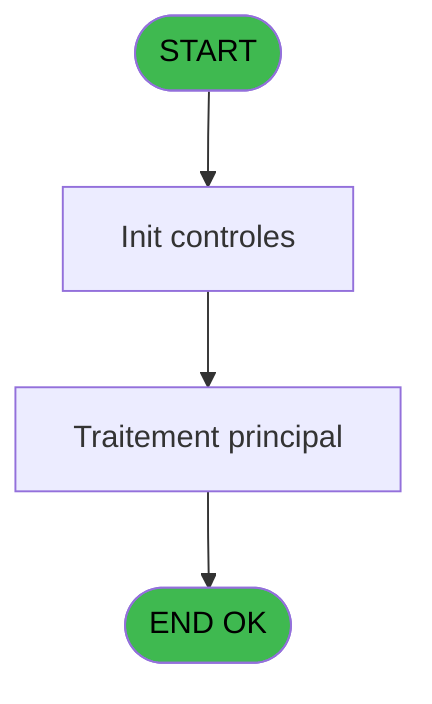

Review the generated code against the original specification.

Produce a JSON report:
```json
{
  "programId": 0,
  "programName": "",
  "coveragePct": 0,
  "rulesImplemented": 0,
  "rulesTotal": 0,
  "missingRules": [
    "rule descriptions not implemented"
  ],
  "recommendations": [
    "improvement suggestions"
  ]
}
```

Check:
1. Every business rule from the contract is implemented in the store
2. Every table from the contract has corresponding entity types
3. Every API endpoint is wired to the store
4. UI layout matches the spec description
5. Error handling is present for all actions

CONTRACT RULES:
[]

SPEC EXCERPT:
# ADH IDE 127 - Calcul solde ouverture WS

> **Analyse**: Phases 1-4 2026-02-08 03:06 -> 03:06 (4s) | Assemblage 03:06
> **Pipeline**: V7.2 Enrichi
> **Structure**: 4 onglets (Resume | Ecrans | Donnees | Connexions)

<!-- TAB:Resume -->

## 1. FICHE D'IDENTITE

| Attribut | Valeur |
|----------|--------|
| Projet | ADH |
| IDE Position | 127 |
| Nom Programme | Calcul solde ouverture WS |
| Fichier source | `Prg_127.xml` |
| Dossier IDE | Comptabilite |
| Taches | 4 (0 ecrans visibles) |
| Tables modifiees | 0 |
| Programmes appeles | 1 |
| Complexite | **BASSE** (score 5/100) |

## 2. DESCRIPTION FONCTIONNELLE

ADH IDE 127 calcule le solde d'ouverture de caisse en devises, en consolidant les montants saisis lors de l'ouverture par devise. Le programme traite chaque devise déclarée dans le paramètre d'entrée, extrait le montant correspondant de la session, et effectue les conversions monétaires nécessaires vers la devise de référence du club (généralement EUR). C'est un programme pivot entre les données d'ouverture brutes et les états financiers consolidés.

Le flux opérationnel repose sur un appel externe à ADH IDE 142 (Devise update session WS) qui actualise les taux de change en vigueur avant le calcul. Cette dépendance garantit que les conversions utilisent les taux corrects à la date d'ouverture, évitant les écarts de change dus à des taux obsolètes. Le programme valide également l'intégrité des montants par devise et signale les anomalies (devises manquantes, taux introuvables, montants négatifs).

En fermeture de caisse (IDE 131, IDE 299), ce programme est réinvoqué pour valider la cohérence entre le solde d'ouverture enregistré et le solde calculé rétrospectivement. Un écart à ce stade signale soit une modification frauduleuse des paramètres de session, soit une erreur dans la capture initiale des devises.

## 3. BLOCS FONCTIONNELS

## 5. REGLES METIER

*(Aucune regle metier identifiee dans les expressions)*

## 6. CONTEXTE

- **Appele par**: [Fermeture caisse (IDE 131)](ADH-IDE-131.md), [Fermeture caisse 144 (IDE 299)](ADH-IDE-299.md)
- **Appelle**: 1 programmes | **Tables**: 4 (W:0 R:3 L:1) | **Taches**: 4 | **Expressions**: 9

<!-- TAB:Ecrans -->

## 8. ECRANS

*(Programme sans ecran visible)*

## 9. NAVIGATION

### 9.3 Structure hierarchique (0 tache)

| Position | Tache | Type | Dimensions | Bloc |
|----------|-------|------|------------|------|

### 9.4 Algorigramme



> **Legende**: Vert = START/END OK | Rouge = END KO | Bleu = Decisions
> *Algorigramme auto-genere. Utiliser `/algorigramme` pour une synthese metier detaillee.*

<!-- TAB:Donnees -->

## 10. TABLES

### Tables utilisees (4)

| ID | Nom | Description | Type | R | W | L | Usages |
|----|-----|-------------|------|---|---|---|--------|
| 139 | moyens_reglement_mor | Reglements / paiements | DB | R |   |   | 1 |
| 249 | histo_sessions_caisse_detail | Sessions de caisse | DB | R |   |   | 1 |
| 50 | moyens_reglement_mor | Reglements / paiements | DB | R |   |   | 1 |
| 232 | gestion_devise_session | Sessions de caisse | DB |   |   | L | 2 |

### Colonnes par table (2 / 3 tables avec colonnes identifiees)

<details>
<summary>Table 139 - moyens_reglement_mor (R) - 1 usages</summary>

*Table utilisee uniquement en Link ou aucune colonne Real identifiee dans le DataView.*

</details>

<details>
<summary>Table 249 - histo_sessions_caisse_detail (R) - 1 usages</summary>

| Lettre | Variable | Acces | Type |
|--------|----------|-------|------|
| A | Param societe | R | Alpha |
| B | Param devise locale | R | Alpha |
| C | Param solde ouverture | R | Numeric |
| D | Param solde ouverture monnaie | R | Numeric |
| E | Param solde ouverture produits | R | Numeric |
| F | Param solde ouverture cartes | R | Numeric |
| G | Param solde ouverture cheques | R | Numeric |
| H | Param solde ouverture od | R | Numeric |
| I | Param nbre devise | R | Numeric |
| J | Param UNI/BI | R | Alpha |

</details>

<details>
<summary>Table 50 - moyens_reglement_mor (R) - 1 usages</summary>

*Table utilisee uniquement en Link ou aucune colonne Real identifiee dans le DataView.*

</details>

## 11. VARIABLES

### 11.1 Autres (10)

Variables diverses.

| Lettre | Nom | Type | Usage dans |
|--------|-----|------|-----------|
| EN | Param societe | Alpha | - |
| EO | Param devise locale | Alpha | - |
| EP | Param solde ouverture | Numeric | - |
| EQ | Param solde ouverture monnaie | Numeric | - |
| ER | Param solde ouverture produits | Numeric | - |
| ES | Param solde ouverture cartes | Numeric | - |
| ET | Param solde ouverture cheques | Numeric | - |
| EU | Param solde ouverture od | Numeric | - |
| EV | Param nbre devise | Numeric | - |
| EW | Param UNI/BI | Alpha | - |

## 12. EXPRESSIONS

**9 / 9 expression

GENERATED FILES:

--- types/soldeOuverture.ts ---
import type { ApiResponse } from '@/services/api/apiClient';

// ============================================================================
// ENTITIES
// ============================================================================

export interface SoldeOuverture {
  societe: string;
  deviseLocale: string;
  soldeOuverture: number;
  soldeOuvertureMonnaie: number;
  soldeOuvertureProduits: number;
  soldeOuvertureCartes: number;
  soldeOuvertureCheques: number;
  soldeOuvertureOd: number;
  nbreDevise: number;
  uniBi: string;
}

export interface MoyenReglement {
  id: number;
  code: string;
  libelle: string;
}

export interface GestionDeviseSession {
  id: number;
  sessionId: number;
  deviseCode: string;
  tauxChange: number;
  montant: number;
}

// ============================================================================
// CALCULATION TYPES
// ============================================================================

export interface DeviseConversion {
  devise: string;
  montant: number;
  tauxChange: number;
  montantEur: number;
}

export interface SoldeCalculationResult {
  totalEur: number;
  details: DeviseConversion[];
}

export interface CoherenceValidationResult {
  coherent: boolean;
  ecart: number | null;
}

// ============================================================================
// REQUEST/RESPONSE TYPES
// ============================================================================

export interface CalculerSoldeOuvertureRequest {
  societe: string;
  sessionId: number;
}

export interface GetSoldeOuvertureRequest {
  societe: string;
  sessionId: number;
}

export interface ValiderCoherenceSoldeRequest {
  soldeEnregistre: number;
  soldeCalcule: number;
}

export interface UpdateDeviseSessionRequest {
  sessionId: number;
}

// ============================================================================
// API RESPONSE TYPES
// ============================================================================

export type CalculerS

--- stores/soldeOuvertureStore.ts ---
import { create } from 'zustand';
import type {
  SoldeOuverture,
  MoyenReglement,
  GestionDeviseSession,
  SoldeCalculationResult,
  CoherenceValidationResult,
  CalculerSoldeOuvertureRequest,
  GetSoldeOuvertureRequest,
  ValiderCoherenceSoldeRequest,
  UpdateDeviseSessionRequest,
} from '@/types/soldeOuverture';
import { apiClient } from '@/services/api/apiClient';
import type { ApiResponse } from '@/services/api/apiClient';
import { useDataSourceStore } from '@/stores/dataSourceStore';

interface SoldeOuvertureState {
  soldeOuverture: SoldeOuverture | null;
  moyensReglement: MoyenReglement[];
  devisesSessions: GestionDeviseSession[];
  isLoading: boolean;
  error: string | null;
  isCalculating: boolean;
  calculationResult: SoldeCalculationResult | null;
}

interface SoldeOuvertureActions {
  loadSoldeOuverture: (societe: string, sessionId: number) => Promise<void>;
  calculerSoldeOuverture: (
    societe: string,
    sessionId: number,
  ) => Promise<SoldeCalculationResult>;
  updateDeviseSession: (sessionId: number) => Promise<void>;
  validerCoherenceSolde: (
    soldeEnregistre: number,
    soldeCalcule: number,
  ) => Promise<CoherenceValidationResult>;
  setSoldeOuverture: (solde: SoldeOuverture | null) => void;
  setMoyensReglement: (moyens: MoyenReglement[]) => void;
  setDevisesSessions: (devises: GestionDeviseSession[]) => void;
  setCalculationResult: (result: SoldeCalculationResult | null) => void;
  clearError: () => void;
  reset: () => void;
}

type SoldeOuvertureStore = SoldeOuvertureState & SoldeOuvertureActions;

const MOCK_MOYENS_REGLEMENT: MoyenReglement[] = [
  { id: 1, code: 'ESP', libelle: 'Espèces' },
  { id: 2, code: 'CB', libelle: 'Carte bancaire' },
  { id: 3, code: 'CHQ', libelle: 'Chèque' },
  { id: 4, code: 'GP', libelle: 'Gift Pass' },
  { id: 5, code: 'OD', libelle: 'Ordre de dépôt' },
];

const MOCK_DEVISES_SESSIONS: GestionDeviseSession[] = [
  { id: 1, sessionId: 1001, deviseCode: 'EUR', tauxChange: 1.0, montant: 500.0 },

--- services/api/endpoints-soldeOuverture.ts ---
import { apiClient, type ApiResponse } from './apiClient';
import type {
  CalculerSoldeOuvertureRequest,
  CalculerSoldeOuvertureResponse,
  CoherenceValidationResult,
  GetSoldeOuvertureResponse,
  SoldeCalculationResult,
  SoldeOuverture,
  UpdateDeviseSessionRequest,
  UpdateDeviseSessionResponse,
  ValiderCoherenceSoldeRequest,
  ValiderCoherenceSoldeResponse,
} from '@/types/soldeOuverture';

export const soldeOuvertureApi = {
  calculerSoldeOuverture: (data: CalculerSoldeOuvertureRequest) =>
    apiClient.post<SoldeCalculationResult>(
      '/api/solde-ouverture/calculer',
      data,
    ),

  getSoldeOuverture: (societe: string, sessionId: number) =>
    apiClient.get<SoldeOuverture>(
      `/api/solde-ouverture/${societe}/${sessionId}`,
    ),

  validerCoherenceSolde: (data: ValiderCoherenceSoldeRequest) =>
    apiClient.post<CoherenceValidationResult>(
      '/api/solde-ouverture/valider-coherence',
      data,
    ),

  updateDeviseSession: (data: UpdateDeviseSessionRequest) =>
    apiClient.post<void>(
      '/api/solde-ouverture/update-devise-session',
      data,
    ),
};

--- pages/SoldeOuverturePage.tsx ---
import { useState, useEffect, useCallback } from 'react';
import { useNavigate } from 'react-router-dom';
import { ScreenLayout } from '@/components/layout';
import { Button, Dialog, Input } from '@/components/ui';
import { useSoldeOuvertureStore } from '@/stores/soldeOuvertureStore';
import { useAuthStore } from '@/stores';
import type { DeviseConversion, CoherenceValidationResult } from '@/types/soldeOuverture';
import { cn } from '@/lib/utils';

const ALERT_TYPES = {
  MISSING_RATE: 'MISSING_RATE',
  INVALID_RATE: 'INVALID_RATE',
  NEGATIVE_AMOUNT: 'NEGATIVE_AMOUNT',
  ZERO_AMOUNT: 'ZERO_AMOUNT',
} as const;

interface Alert {
  type: keyof typeof ALERT_TYPES;
  devise: string;
  message: string;
}

const detectAnomalies = (details: DeviseConversion[]): Alert[] => {
  const alerts: Alert[] = [];
  
  details.forEach((d) => {
    if (d.tauxChange <= 0) {
      alerts.push({
        type: 'INVALID_RATE',
        devise: d.devise,
        message: `Taux de change invalide pour ${d.devise}`,
      });
    }
    if (d.montant < 0) {
      alerts.push({
        type: 'NEGATIVE_AMOUNT',
        devise: d.devise,
        message: `Montant négatif pour ${d.devise}`,
      });
    }
    if (d.montant === 0) {
      alerts.push({
        type: 'ZERO_AMOUNT',
        devise: d.devise,
        message: `Montant nul pour ${d.devise}`,
      });
    }
  });
  
  return alerts;
};

export function SoldeOuverturePage() {
  const navigate = useNavigate();
  const user = useAuthStore((s) => s.user);
  const societe = 'ADH';

  const soldeOuverture = useSoldeOuvertureStore((s) => s.soldeOuverture);
  const moyensReglement = useSoldeOuvertureStore((s) => s.moyensReglement);
  const devisesSessions = useSoldeOuvertureStore((s) => s.devisesSessions);
  const isLoading = useSoldeOuvertureStore((s) => s.isLoading);
  const error = useSoldeOuvertureStore((s) => s.error);
  const isCalculating = useSoldeOuvertureStore((s) => s.isCalculating);
  const calculationResult = useSoldeOuvertureSt

--- components/caisse/soldeOuverture/CalculationResultsPanel.tsx ---
import type { SoldeCalculationResult, CoherenceValidationResult } from '@/types/soldeOuverture';
import { cn } from '@/lib/utils';

interface CalculationResultsPanelProps {
  result: SoldeCalculationResult | null;
  validation: CoherenceValidationResult | null;
  isCalculating?: boolean;
  className?: string;
}

interface Alert {
  type: 'MISSING_RATE' | 'INVALID_RATE' | 'NEGATIVE_AMOUNT' | 'ZERO_AMOUNT';
  devise: string;
  message: string;
}

const detectAnomalies = (result: SoldeCalculationResult | null): Alert[] => {
  if (!result) return [];
  
  const alerts: Alert[] = [];
  
  result.details.forEach((d) => {
    if (d.tauxChange <= 0) {
      alerts.push({
        type: 'INVALID_RATE',
        devise: d.devise,
        message: `Taux de change invalide pour ${d.devise}`,
      });
    }
    if (d.montant < 0) {
      alerts.push({
        type: 'NEGATIVE_AMOUNT',
        devise: d.devise,
        message: `Montant négatif pour ${d.devise}`,
      });
    }
    if (d.montant === 0) {
      alerts.push({
        type: 'ZERO_AMOUNT',
        devise: d.devise,
        message: `Montant nul pour ${d.devise}`,
      });
    }
  });
  
  return alerts;
};

export const CalculationResultsPanel = ({
  result,
  validation,
  isCalculating = false,
  className,
}: CalculationResultsPanelProps) => {
  const alerts = detectAnomalies(result);

  if (isCalculating) {
    return (
      <div className={cn('rounded-lg border bg-white p-6', className)}>
        <div className="flex items-center justify-center py-8">
          <div className="h-8 w-8 animate-spin rounded-full border-4 border-gray-200 border-t-blue-600" />
          <span className="ml-3 text-gray-600">Calcul en cours...</span>
        </div>
      </div>
    );
  }

  if (!result) {
    return (
      <div className={cn('rounded-lg border bg-gray-50 p-6', className)}>
        <p className="text-center text-gray-500">
          Aucun calcul effectué. Cliquez sur "Calculer" pour démarrer.
        </p>
      </di

--- components/caisse/soldeOuverture/SoldeDetailsPanel.tsx ---
import type { SoldeOuverture } from '@/types/soldeOuverture';
import { cn } from '@/lib/utils';

interface SoldeDetailsPanelProps {
  solde: SoldeOuverture;
  className?: string;
}

const formatEuro = (value: number): string => {
  return new Intl.NumberFormat('fr-FR', {
    style: 'currency',
    currency: 'EUR',
    minimumFractionDigits: 2,
    maximumFractionDigits: 2,
  }).format(value);
};

export const SoldeDetailsPanel = ({ solde, className }: SoldeDetailsPanelProps) => {
  const details = [
    { label: 'Solde ouverture monnaie', value: solde.soldeOuvertureMonnaie },
    { label: 'Solde ouverture produits', value: solde.soldeOuvertureProduits },
    { label: 'Solde ouverture cartes', value: solde.soldeOuvertureCartes },
    { label: 'Solde ouverture chèques', value: solde.soldeOuvertureCheques },
    { label: 'Solde ouverture ordre de dépôt', value: solde.soldeOuvertureOd },
  ];

  const total = details.reduce((sum, item) => sum + item.value, 0);

  return (
    <div className={cn('rounded-lg border border-gray-200 bg-white shadow-sm', className)}>
      <div className="border-b border-gray-200 px-4 py-3">
        <h3 className="text-sm font-semibold text-gray-900">Détail des soldes</h3>
      </div>
      <div className="divide-y divide-gray-100">
        {details.map((detail) => (
          <div
            key={detail.label}
            className="flex items-center justify-between px-4 py-3 hover:bg-gray-50"
          >
            <span className="text-sm text-gray-700">{detail.label}</span>
            <span
              className={cn(
                'text-sm font-medium tabular-nums',
                detail.value < 0 ? 'text-red-600' : 'text-gray-900',
              )}
            >
              {formatEuro(detail.value)}
            </span>
          </div>
        ))}
      </div>
      <div className="border-t-2 border-gray-300 bg-gray-50 px-4 py-3">
        <div className="flex items-center justify-between">
          <span className="text-sm 