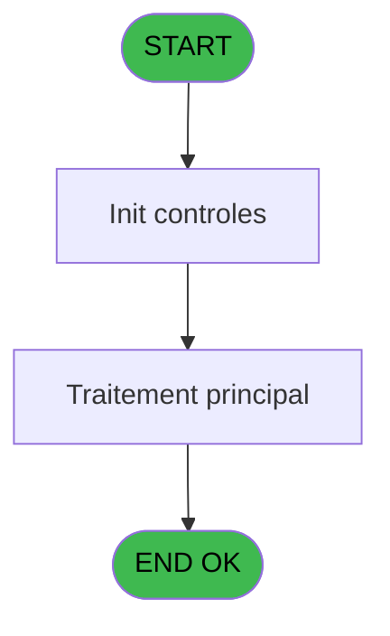

Review the generated code against the original specification.

Produce a JSON report:
```json
{
  "programId": 0,
  "programName": "",
  "coveragePct": 0,
  "rulesImplemented": 0,
  "rulesTotal": 0,
  "missingRules": [
    "rule descriptions not implemented"
  ],
  "recommendations": [
    "improvement suggestions"
  ]
}
```

Check:
1. Every business rule from the contract is implemented in the store
2. Every table from the contract has corresponding entity types
3. Every API endpoint is wired to the store
4. UI layout matches the spec description
5. Error handling is present for all actions

CONTRACT RULES:
[]

SPEC EXCERPT:
# ADH IDE 135 - Generation tableau recap WS

> **Analyse**: Phases 1-4 2026-02-08 03:13 -> 03:13 (4s) | Assemblage 03:13
> **Pipeline**: V7.2 Enrichi
> **Structure**: 4 onglets (Resume | Ecrans | Donnees | Connexions)

<!-- TAB:Resume -->

## 1. FICHE D'IDENTITE

| Attribut | Valeur |
|----------|--------|
| Projet | ADH |
| IDE Position | 135 |
| Nom Programme | Generation tableau recap WS |
| Fichier source | `Prg_135.xml` |
| Dossier IDE | General |
| Taches | 1 (0 ecrans visibles) |
| Tables modifiees | 0 |
| Programmes appeles | 0 |
| Complexite | **BASSE** (score 0/100) |

## 2. DESCRIPTION FONCTIONNELLE

ADH IDE 135 - GENERATION TABLEAU RECAP WS est un programme de synthèse qui consolide les données de fermeture de caisse en tableau récapitulatif. Appelé à la fin du workflow de fermeture (depuis ADH IDE 131, IDE 155 ou IDE 299), il agrège les mouvements de trésorerie, les écarts détectés et génère un fichier résumé pour transmission au siège ou archivage.

Le programme traite les données de session (devises manipulées, montants comptés vs attendus, écarts par type de mouvement) et les formate dans un tableau lisible. Il gère les différentes devises selon la configuration locale et calcule les totaux consolidés. Le résultat est typiquement exporté en fichier texte ou directement alimenté un module de reporting (WS = Web Service ou Worksheet selon contexte).

Ce programme est essentiel pour l'audit de caisse : il produit la trace documentée de chaque fermeture et permet la réconciliation avec le siège. Sans lui, les équipes terrain n'auraient pas de preuve formelle du solde clôturé. C'est un utility programme sans interface directe, puremnet orienté données et exports.

## 3. BLOCS FONCTIONNELS

## 5. REGLES METIER

*(Aucune regle metier identifiee dans les expressions)*

## 6. CONTEXTE

- **Appele par**: [Controle fermeture caisse WS (IDE 155)](ADH-IDE-155.md), [Fermeture caisse (IDE 131)](ADH-IDE-131.md), [Fermeture caisse 144 (IDE 299)](ADH-IDE-299.md)
- **Appelle**: 0 programmes | **Tables**: 2 (W:0 R:1 L:1) | **Taches**: 1 | **Expressions**: 30

<!-- TAB:Ecrans -->

## 8. ECRANS

*(Programme sans ecran visible)*

## 9. NAVIGATION

### 9.3 Structure hierarchique (0 tache)

| Position | Tache | Type | Dimensions | Bloc |
|----------|-------|------|------------|------|

### 9.4 Algorigramme



> **Legende**: Vert = START/END OK | Rouge = END KO | Bleu = Decisions
> *Algorigramme auto-genere. Utiliser `/algorigramme` pour une synthese metier detaillee.*

<!-- TAB:Donnees -->

## 10. TABLES

### Tables utilisees (2)

| ID | Nom | Description | Type | R | W | L | Usages |
|----|-----|-------------|------|---|---|---|--------|
| 693 | devise_in | Devises / taux de change | DB | R |   |   | 1 |
| 510 | pv_discounts |  | TMP |   |   | L | 1 |

### Colonnes par table (1 / 1 tables avec colonnes identifiees)

<details>
<summary>Table 693 - devise_in (R) - 1 usages</summary>

| Lettre | Variable | Acces | Type |
|--------|----------|-------|------|
| A | Param date comptable | R | Date |
| B | Param numero session | R | Numeric |
| C | Param type | R | Alpha |
| D | Param type appro_vers_coffre | R | Alpha |
| E | Param mode de paiement | R | Alpha |
| F | Param avec change | R | Alpha |
| G | Param code devise | R | Alpha |
| H | Param quantite devise | R | Numeric |
| I | Param taux devise | R | Numeric |
| J | Param montant | R | Numeric |
| K | Param montant monnaie | R | Numeric |
| L | Param montant produits | R | Numeric |
| M | Param montant cartes | R | Numeric |
| N | Param montant chèque | R | Numeric |
| O | Param montant od | R | Numeric |
| P | Param societe | R | Alpha |
| Q | Param compte village | R | Numeric |
| R | Param filiation | R | Numeric |
| S | Param imputation | R | Numeric |
| T | Param sous imputation | R | Numeric |
| U | Param libelle | R | Alpha |
| V | Param libelle complementaire | R | Alpha |
| W | Param nom GM | R | Alpha |
| X | Param quantite article | R | Numeric |
| Y | Param prix article | R | Numeric |

</details>

## 11. VARIABLES

### 11.1 Autres (25)

Variables diverses.

| Lettre | Nom | Type | Usage dans |
|--------|-----|------|-----------|
| EN | Param date comptable | Date | 1x refs |
| EO | Param numero session | Numeric | 1x refs |
| EP | Param type | Alpha | 2x refs |
| EQ | Param type appro_vers_coffre | Alpha | - |
| ER | Param mode de paiement | Alpha | 1x refs |
| ES | Param avec change | Alpha | 1x refs |
| ET | Param code devise | Alpha | 1x refs |
| EU | Param quantite devise | Numeric | 1x refs |
| EV | Param taux devise | Numeric | 1x refs |
| EW | Param montant | Numeric | 6x refs |
| EX | Param montant monnaie | Numeric | 1x refs |
| EY | Param montant produits | Numeric | 1x refs |
| EZ | Pa

GENERATED FILES:

--- types/recapWorksheet.ts ---
import type { Session } from "@/types";

export interface RecapWorksheetEntry {
  dateComptable: Date;
  numeroSession: number;
  type: string;
  typeApproVersCoffre: string | null;
  modePaiement: string | null;
  avecChange: string | null;
  codeDevise: string;
  quantiteDevise: number | null;
  tauxDevise: number | null;
  montant: number;
  montantMonnaie: number | null;
  montantProduits: number | null;
  montantCartes: number | null;
  montantCheque: number | null;
  montantOd: number | null;
  societe: string;
  compteVillage: number;
  filiation: number;
  imputation: number | null;
  sousImputation: number | null;
  libelle: string | null;
  libelleComplementaire: string | null;
  nomGm: string | null;
  quantiteArticle: number | null;
  prixArticle: number | null;
}

export interface RecapWorksheetSummary {
  numeroSession: number;
  dateComptable: Date;
  totalParDevise: Record<string, number>;
  totalParType: Record<string, number>;
  totalParModePaiement: Record<string, number>;
  totalGeneral: number;
}

export interface RecapWorksheetFilters {
  dateDebut?: Date;
  dateFin?: Date;
  numeroSession?: number;
}

export interface RecapWorksheetState {
  entries: RecapWorksheetEntry[];
  summary: RecapWorksheetSummary | null;
  isGenerating: boolean;
  error: string | null;
  filters: RecapWorksheetFilters;
  generateRecapWorksheet: (
    numeroSession: number,
    dateComptable: Date
  ) => Promise<RecapWorksheetSummary>;
  exportRecapWorksheet: (
    summary: RecapWorksheetSummary,
    format: "txt" | "csv" | "json"
  ) => Promise<Blob>;
  fetchRecapEntries: (numeroSession: number) => Promise<RecapWorksheetEntry[]>;
  calculateSummary: (entries: RecapWorksheetEntry[]) => RecapWorksheetSummary;
  setEntries: (entries: RecapWorksheetEntry[]) => void;
  setSummary: (summary: RecapWorksheetSummary | null) => void;
  setIsGenerating: (isGenerating: boolean) => void;
  setError: (error: string | null) => void;
  setFilters: (filters: RecapWorksheetFilters) => 

--- stores/recapWorksheetStore.ts ---
import { create } from 'zustand';
import type {
  RecapWorksheetEntry,
  RecapWorksheetSummary,
  RecapWorksheetFilters,
  RecapWorksheetExportFormat,
} from '@/types/recapWorksheet';
import { useDataSourceStore } from '@/stores/dataSourceStore';
import { apiClient } from '@/services/api/apiClient';
import type { ApiResponse } from '@/services/api/apiClient';

interface RecapWorksheetState {
  entries: RecapWorksheetEntry[];
  summary: RecapWorksheetSummary | null;
  isGenerating: boolean;
  error: string | null;
  filters: RecapWorksheetFilters;
}

interface RecapWorksheetActions {
  generateRecapWorksheet: (
    numeroSession: number,
    dateComptable: Date,
  ) => Promise<RecapWorksheetSummary>;
  exportRecapWorksheet: (
    summary: RecapWorksheetSummary,
    format: RecapWorksheetExportFormat,
  ) => Promise<Blob>;
  fetchRecapEntries: (numeroSession: number) => Promise<RecapWorksheetEntry[]>;
  calculateSummary: (entries: RecapWorksheetEntry[]) => RecapWorksheetSummary;
  setEntries: (entries: RecapWorksheetEntry[]) => void;
  setSummary: (summary: RecapWorksheetSummary | null) => void;
  setIsGenerating: (isGenerating: boolean) => void;
  setError: (error: string | null) => void;
  setFilters: (filters: RecapWorksheetFilters) => void;
  clearRecapWorksheet: () => void;
  reset: () => void;
}

type RecapWorksheetStore = RecapWorksheetState & RecapWorksheetActions;

const MOCK_ENTRIES: RecapWorksheetEntry[] = [
  {
    dateComptable: new Date('2026-02-20'),
    numeroSession: 1001,
    type: 'vente',
    typeApproVersCoffre: null,
    modePaiement: 'especes',
    avecChange: 'N',
    codeDevise: 'EUR',
    quantiteDevise: null,
    tauxDevise: 1.0,
    montant: 1250.0,
    montantMonnaie: 1250.0,
    montantProduits: null,
    montantCartes: null,
    montantCheque: null,
    montantOd: null,
    societe: 'SOC1',
    compteVillage: 1001,
    filiation: 0,
    imputation: 101,
    sousImputation: 1,
    libelle: 'Ventes espèces session matinale',
    libelleCom

--- services/api/endpoints-recapWorksheet.ts ---
import { apiClient, type ApiResponse } from './apiClient';
import type {
  RecapWorksheetEntry,
  RecapWorksheetSummary,
  ExportRecapWorksheetRequest,
} from '@/types/recapWorksheet';

export const recapWorksheetApi = {
  getEntries: (numeroSession: number) =>
    apiClient.get<ApiResponse<RecapWorksheetEntry[]>>(
      `/api/recapWorksheet/entries/${numeroSession}`,
    ),

  generate: (numeroSession: number, dateComptable: Date) =>
    apiClient.post<ApiResponse<RecapWorksheetSummary>>(
      '/api/recapWorksheet/generate',
      {
        numeroSession,
        dateComptable,
      },
    ),

  export: (summary: RecapWorksheetSummary, format?: 'txt' | 'csv' | 'json') =>
    apiClient.post<Blob>(
      `/api/recapWorksheet/export${format ? `?format=${format}` : ''}`,
      { summary },
      { responseType: 'blob' },
    ),
};

--- pages/RecapWorksheetPage.tsx ---
import { useState, useEffect, useCallback } from 'react';
import { useNavigate } from 'react-router-dom';
import { ScreenLayout } from '@/components/layout';
import { Button } from '@/components/ui/Button';
import { Input } from '@/components/ui/Input';
import { useRecapWorksheetStore } from '@/stores/recapWorksheetStore';
import { useAuthStore } from '@/stores';
import type { RecapWorksheetExportFormat } from '@/types/recapWorksheet';
import { cn } from '@/lib/utils';

export function RecapWorksheetPage() {
  const navigate = useNavigate();
  const user = useAuthStore((s) => s.user);

  const entries = useRecapWorksheetStore((s) => s.entries);
  const summary = useRecapWorksheetStore((s) => s.summary);
  const isGenerating = useRecapWorksheetStore((s) => s.isGenerating);
  const error = useRecapWorksheetStore((s) => s.error);
  const filters = useRecapWorksheetStore((s) => s.filters);
  const generateRecapWorksheet = useRecapWorksheetStore((s) => s.generateRecapWorksheet);
  const exportRecapWorksheet = useRecapWorksheetStore((s) => s.exportRecapWorksheet);
  const setFilters = useRecapWorksheetStore((s) => s.setFilters);
  const reset = useRecapWorksheetStore((s) => s.reset);

  const [numeroSession, setNumeroSession] = useState('');
  const [dateComptable, setDateComptable] = useState(
    new Date().toISOString().split('T')[0]
  );
  const [exportFormat, setExportFormat] = useState<RecapWorksheetExportFormat>('txt');
  const [isExporting, setIsExporting] = useState(false);

  useEffect(() => {
    return () => reset();
  }, [reset]);

  const handleGenerate = useCallback(async () => {
    const sessionNum = parseInt(numeroSession, 10);
    if (isNaN(sessionNum) || sessionNum <= 0) {
      return;
    }
    const date = new Date(dateComptable);
    await generateRecapWorksheet(sessionNum, date);
  }, [numeroSession, dateComptable, generateRecapWorksheet]);

  const handleExport = useCallback(async () => {
    if (!summary) return;
    setIsExporting(true);
    tr

--- components/caisse/recapWorksheet/ExportPanel.tsx ---
import { useState } from 'react';
import { Button } from '@/components/ui/Button';
import type { RecapWorksheetSummary, RecapWorksheetExportFormat } from '@/types/recapWorksheet';

interface ExportPanelProps {
  summary: RecapWorksheetSummary | null;
  onExport: (format: RecapWorksheetExportFormat) => Promise<void>;
  className?: string;
}

const EXPORT_FORMATS = [
  { value: 'txt' as const, label: 'Texte (TXT)' },
  { value: 'csv' as const, label: 'CSV' },
  { value: 'json' as const, label: 'JSON' },
];

export const ExportPanel = ({ summary, onExport, className }: ExportPanelProps) => {
  const [selectedFormat, setSelectedFormat] = useState<RecapWorksheetExportFormat>('txt');
  const [isExporting, setIsExporting] = useState(false);

  const handleExport = async () => {
    if (!summary) return;
    
    setIsExporting(true);
    try {
      await onExport(selectedFormat);
    } finally {
      setIsExporting(false);
    }
  };

  const isDisabled = !summary || isExporting;

  return (
    <div className={className}>
      <h3 className="text-lg font-semibold mb-4">Export</h3>
      
      <div className="space-y-4">
        <div>
          <label className="block text-sm font-medium mb-2">Format</label>
          <div className="space-y-2">
            {EXPORT_FORMATS.map((format) => (
              <label
                key={format.value}
                className="flex items-center gap-2 cursor-pointer"
              >
                <input
                  type="radio"
                  name="export-format"
                  value={format.value}
                  checked={selectedFormat === format.value}
                  onChange={(e) => setSelectedFormat(e.target.value as RecapWorksheetExportFormat)}
                  disabled={isDisabled}
                  className="w-4 h-4"
                />
                <span className={isDisabled ? 'text-gray-400' : ''}>{format.label}</span>
              </label>
            ))}
          </div>
        </div>

 

--- components/caisse/recapWorksheet/FiltresPanel.tsx ---
import { useState, useCallback } from 'react';
import { Button } from '@/components/ui/Button';
import { Input } from '@/components/ui/Input';
import { cn } from '@/lib/utils';

interface FiltresPanelProps {
  numeroSession: string;
  dateComptable: string;
  isGenerating: boolean;
  onNumeroSessionChange: (value: string) => void;
  onDateComptableChange: (value: string) => void;
  onGenerate: () => void;
}

export const FiltresPanel = ({
  numeroSession,
  dateComptable,
  isGenerating,
  onNumeroSessionChange,
  onDateComptableChange,
  onGenerate,
}: FiltresPanelProps) => {
  const [localNumeroSession, setLocalNumeroSession] = useState(numeroSession);
  const [localDateComptable, setLocalDateComptable] = useState(dateComptable);

  const handleNumeroSessionChange = useCallback(
    (e: React.ChangeEvent<HTMLInputElement>) => {
      const value = e.target.value;
      setLocalNumeroSession(value);
      onNumeroSessionChange(value);
    },
    [onNumeroSessionChange]
  );

  const handleDateComptableChange = useCallback(
    (e: React.ChangeEvent<HTMLInputElement>) => {
      const value = e.target.value;
      setLocalDateComptable(value);
      onDateComptableChange(value);
    },
    [onDateComptableChange]
  );

  const handleGenerate = useCallback(() => {
    const sessionNum = parseInt(localNumeroSession, 10);
    if (isNaN(sessionNum) || sessionNum <= 0) {
      return;
    }
    if (!localDateComptable) {
      return;
    }
    onGenerate();
  }, [localNumeroSession, localDateComptable, onGenerate]);

  const isValid =
    localNumeroSession.trim() !== '' &&
    !isNaN(parseInt(localNumeroSession, 10)) &&
    parseInt(localNumeroSession, 10) > 0 &&
    localDateComptable.trim() !== '';

  return (
    <div className="bg-white rounded-lg shadow-sm border border-gray-200 p-6">
      <h2 className="text-lg font-semibold text-gray-900 mb-4">Filtres</h2>

      <div className="space-y-4">
        <div>
          <label
            htmlFor="numeroSession"
    

--- components/caisse/recapWorksheet/RcapitulatifPanel.tsx ---
import { useMemo } from 'react';
import { cn } from '@/lib/utils';
import type { RecapWorksheetEntry, RecapWorksheetSummary } from '@/types/recapWorksheet';

interface RecapitulatifPanelProps {
  entries: RecapWorksheetEntry[];
  summary: RecapWorksheetSummary | null;
  className?: string;
}

interface SummaryCardProps {
  title: string;
  items: Record<string, number>;
  className?: string;
}

const SummaryCard = ({ title, items, className }: SummaryCardProps) => {
  const sortedItems = useMemo(() => {
    return Object.entries(items).sort(([a], [b]) => a.localeCompare(b));
  }, [items]);

  return (
    <div className={cn('rounded-lg border border-gray-200 bg-white p-4', className)}>
      <h3 className="mb-3 text-sm font-semibold text-gray-700">{title}</h3>
      <div className="space-y-2">
        {sortedItems.map(([key, value]) => (
          <div key={key} className="flex items-center justify-between text-sm">
            <span className="text-gray-600">{key}</span>
            <span className="font-medium text-gray-900">
              {value.toFixed(2)} €
            </span>
          </div>
        ))}
      </div>
    </div>
  );
};

export const RecapitulatifPanel = ({ entries, summary, className }: RecapitulatifPanelProps) => {
  const columns = useMemo(
    () => [
      { key: 'dateComptable', label: 'Date', width: '100px' },
      { key: 'numeroSession', label: 'Session', width: '80px' },
      { key: 'type', label: 'Type', width: '120px' },
      { key: 'modePaiement', label: 'Mode', width: '100px' },
      { key: 'codeDevise', label: 'Dev.', width: '60px' },
      { key: 'quantiteDevise', label: 'Qté', width: '80px', align: 'right' as const },
      { key: 'tauxDevise', label: 'Taux', width: '80px', align: 'right' as const },
      { key: 'montant', label: 'Montant', width: '100px', align: 'right' as const },
      { key: 'libelle', label: 'Libellé', width: '200px' },
    ],
    []
  );

  const formatCellValue = (entry: RecapWorksheetEntry, key: str