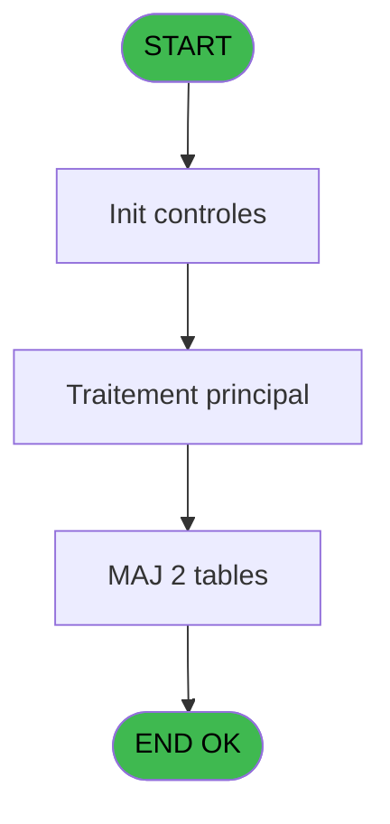

Review the generated code against the original specification.

Produce a JSON report:
```json
{
  "programId": 0,
  "programName": "",
  "coveragePct": 0,
  "rulesImplemented": 0,
  "rulesTotal": 0,
  "missingRules": [
    "rule descriptions not implemented"
  ],
  "recommendations": [
    "improvement suggestions"
  ]
}
```

Check:
1. Every business rule from the contract is implemented in the store
2. Every table from the contract has corresponding entity types
3. Every API endpoint is wired to the store
4. UI layout matches the spec description
5. Error handling is present for all actions

CONTRACT RULES:
[
  {
    "id": "RM-001",
    "description": "Condition: W0 fin tache [BH] egale 'F'",
    "condition": "W0 fin tache [BH]='F'",
    "variables": [
      "FU"
    ],
    "status": "IMPL",
    "targetFile": "adh-web/src/stores/saisieContenuCaisseStore.ts",
    "gapNotes": ""
  },
  {
    "id": "RM-002",
    "description": "Verification que l'imprimante courante est la n1",
    "condition": "GetParam ('CURRENTPRINTERNUM')=1",
    "variables": [],
    "status": "IMPL",
    "targetFile": "adh-web/src/services/printer/generators/ouvertureTicketGenerator.ts",
    "gapNotes": ""
  },
  {
    "id": "RM-003",
    "description": "Verification que l'imprimante courante est la n9",
    "condition": "GetParam ('CURRENTPRINTERNUM')=9",
    "variables": [
      "EZ"
    ],
    "status": "IMPL",
    "targetFile": "adh-web/src/__tests__/approTicketStore.test.ts",
    "gapNotes": ""
  },
  {
    "id": "RM-004",
    "description": "Condition toujours vraie (flag actif)",
    "condition": "P0 reimpression D/G [M]='D'",
    "variables": [
      "EZ"
    ],
    "status": "MISSING",
    "targetFile": "",
    "gapNotes": ""
  },
  {
    "id": "RM-005",
    "description": "Condition: P0 reimpression D/G [M] different de",
    "condition": "P0 reimpression D/G [M]<>''",
    "variables": [
      "EZ"
    ],
    "status": "MISSING",
    "targetFile": "",
    "gapNotes": ""
  }
]

SPEC EXCERPT:
# ADH IDE 154 - Tableau recap fermeture

> **Analyse**: Phases 1-4 2026-02-08 03:38 -> 03:38 (4s) | Assemblage 03:38
> **Pipeline**: V7.2 Enrichi
> **Structure**: 4 onglets (Resume | Ecrans | Donnees | Connexions)

<!-- TAB:Resume -->

## 1. FICHE D'IDENTITE

| Attribut | Valeur |
|----------|--------|
| Projet | ADH |
| IDE Position | 154 |
| Nom Programme | Tableau recap fermeture |
| Fichier source | `Prg_154.xml` |
| Dossier IDE | General |
| Taches | 93 (0 ecrans visibles) |
| Tables modifiees | 2 |
| Programmes appeles | 6 |
| Complexite | **BASSE** (score 37/100) |

## 2. DESCRIPTION FONCTIONNELLE

ADH IDE 154 génère un tableau récapitulatif détaillé de la fermeture de caisse, affichant l'ensemble des mouvements financiers effectués durant la session. Ce programme consolide les données de caisse en colonnes organisées (montants par devise, écarts détectés, totaux cumulés) et prépare le document pour validation avant clôture définitive. Il utilise les calculs d'équivalents de change via IDE 22 pour harmoniser les montants en devise de base.

Le flux d'impression est centralisé : le programme récupère le titre de la session (IDE 43), sélectionne l'imprimante active via IDE 180, configure le numéro de listing (IDE 181) et initialise les paramètres d'impression (IDE 182). Ces appels séquentiels garantissent que le bon périphérique et le bon format sont utilisés avant génération du rapport.

Les données saisies durant la fermeture (remises, ajustements, discounts) sont persistées dans les tables `saisie_remise_en_caisse` et `pv_discounts`. Le tableau récapitulatif sert à la fois de document d'audit interne et de justificatif pour les opérations de clôture ultérieures, validant ainsi l'intégrité financière de la session avant archivage.

## 3. BLOCS FONCTIONNELS

## 5. REGLES METIER

5 regles identifiees:

### Autres (5 regles)

#### <a id="rm-RM-001"></a>[RM-001] Condition: W0 fin tache [BH] egale 'F'

| Element | Detail |
|---------|--------|
| **Condition** | `W0 fin tache [BH]='F'` |
| **Si vrai** | Action si vrai |
| **Variables** | FU (W0 fin tache) |
| **Expression source** | Expression 6 : `W0 fin tache [BH]='F'` |
| **Exemple** | Si W0 fin tache [BH]='F' → Action si vrai |

#### <a id="rm-RM-002"></a>[RM-002] Verification que l'imprimante courante est la n1

| Element | Detail |
|---------|--------|
| **Condition** | `GetParam ('CURRENTPRINTERNUM')=1` |
| **Si vrai** | Action si CURRENTPRINTERNUM = 1 |
| **Expression source** | Expression 8 : `GetParam ('CURRENTPRINTERNUM')=1` |
| **Exemple** | Si GetParam ('CURRENTPRINTERNUM')=1 → Action si CURRENTPRINTERNUM = 1 |

#### <a id="rm-RM-003"></a>[RM-003] Verification que l'imprimante courante est la n9

| Element | Detail |
|---------|--------|
| **Condition** | `GetParam ('CURRENTPRINTERNUM')=9` |
| **Si vrai** | Action si CURRENTPRINTERNUM = 9 |
| **Expression source** | Expression 9 : `GetParam ('CURRENTPRINTERNUM')=9` |
| **Exemple** | Si GetParam ('CURRENTPRINTERNUM')=9 → Action si CURRENTPRINTERNUM = 9 |

#### <a id="rm-RM-004"></a>[RM-004] Condition toujours vraie (flag actif)

| Element | Detail |
|---------|--------|
| **Condition** | `P0 reimpression D/G [M]='D'` |
| **Si vrai** | 'TRUE'LOG |
| **Si faux** | 'FALSE'LOG) |
| **Variables** | EZ (P0 reimpression D/G) |
| **Expression source** | Expression 12 : `IF (P0 reimpression D/G [M]='D','TRUE'LOG,'FALSE'LOG)` |
| **Exemple** | Si P0 reimpression D/G [M]='D' → 'TRUE'LOG. Sinon → 'FALSE'LOG) |

#### <a id="rm-RM-005"></a>[RM-005] Condition: P0 reimpression D/G [M] different de

| Element | Detail |
|---------|--------|
| **Condition** | `P0 reimpression D/G [M]<>''` |
| **Si vrai** | Action si vrai |
| **Variables** | EZ (P0 reimpression D/G) |
| **Expression source** | Expression 13 : `P0 reimpression D/G [M]<>''` |
| **Exemple** | Si P0 reimpression D/G [M]<>'' → Action si vrai |

## 6. CONTEXTE

- **Appele par**: [Fermeture caisse (IDE 131)](ADH-IDE-131.md), [Reimpression tickets fermeture (IDE 151)](ADH-IDE-151.md), [Fermeture caisse 144 (IDE 299)](ADH-IDE-299.md)
- **Appelle**: 6 programmes | **Tables**: 24 (W:2 R:18 L:13) | **Taches**: 93 | **Expressions**: 13

<!-- TAB:Ecrans -->

## 8. ECRANS

*(Programme sans ecran visible)*

## 9. NAVIGATION

### 9.3 Structure hierarchique (0 tache)

| Position | Tache | Type | Dimensions | Bloc |
|----------|-------|------|------------|------|

### 9.4 Algorigramme



> **Legende**: Vert = START/END OK | Rouge = END KO | Bleu = Decisions
> *Algorigramme auto-genere. Utiliser `/algorigramme` pour une synthese metier detaillee.*

<!-- TAB:Donnees -->

## 10. TABLES

### Tables utilisees (24)

| ID | Nom | Description | Type | R | W | L | Usages |


GENERATED FILES:

--- types/recapFermeture.ts ---
import type { Session } from '@/types/session';
import type { Devise } from '@/types/devise';

export interface RecapFermeture {
  societe: string;
  session: number;
  deviseLocale: string;
  dateDebut: Date;
  heureDebut: string;
  nbreDeviseOuverture: number;
  nbreDeviseFermeture: number;
  nbreDevisesCalcule: number;
  nbreDevisesCompte: number;
}

export interface LigneRecap {
  typeOperation: string;
  montantDevise: number;
  codeDevise: string;
  tauxChange: number | null;
  montantEquivalent: number;
  ecart: number | null;
}

export interface RemiseEnCaisse {
  detailProduitRemiseEdite: boolean;
  montantRemiseMonnaie: number;
  detailRemiseFinaleEdite: boolean;
}

export interface ArticleSession {
  chronoHisto: number;
  totalArticles: number;
  codeArticle: string;
  libelleArticle: string;
}

export interface RecapFermetureState {
  recap: RecapFermeture | null;
  lignesRecap: LigneRecap[];
  remises: RemiseEnCaisse[];
  articles: ArticleSession[];
  isLoading: boolean;
  error: string | null;
  isPrinting: boolean;
  modeReimpression: 'D' | 'G' | null;
  printerCourant: number | null;
  finTache: boolean;
}

export interface LoadRecapFermetureRequest {
  societe: string;
  session: number;
}

export interface LoadRecapFermetureResponse {
  recap: RecapFermeture;
  lignesRecap: LigneRecap[];
  remises: RemiseEnCaisse[];
  articles: ArticleSession[];
}

export interface GenererTableauRequest {
  societe: string;
  session: number;
}

export interface GenererTableauResponse {
  success: boolean;
  documentUrl?: string;
}

export interface CalculerEquivalentRequest {
  montant: number;
  deviseSource: string;
  deviseCible: string;
}

export interface CalculerEquivalentResponse {
  montantEquivalent: number;
}

export interface SaveRemiseRequest {
  detailProduitRemiseEdite: boolean;
  montantRemiseMonnaie: number;
  detailRemiseFinaleEdite: boolean;
}

export interface SaveRemiseResponse {
  success: boolean;
}

export interface SaveDiscountRequest {
  

--- stores/recapFermetureStore.ts ---
import { create } from 'zustand';
import type {
  RecapFermeture,
  LigneRecap,
  RemiseEnCaisse,
  ArticleSession,
  LoadRecapFermetureResponse,
  CalculerEquivalentRequest,
  CalculerEquivalentResponse,
  SaveRemiseRequest,
  SaveDiscountRequest,
  SetModeReimpressionRequest,
  CheckPrinterRequest,
  GenererTableauRequest,
} from '@/types/recapFermeture';
import { useDataSourceStore } from '@/stores/dataSourceStore';
import { apiClient } from '@/services/api/apiClient';
import type { ApiResponse } from '@/services/api/apiClient';

interface RecapFermetureState {
  recap: RecapFermeture | null;
  lignesRecap: LigneRecap[];
  remises: RemiseEnCaisse[];
  articles: ArticleSession[];
  isLoading: boolean;
  error: string | null;
  isPrinting: boolean;
  modeReimpression: 'D' | 'G' | null;
  printerCourant: number | null;
  finTache: boolean;
}

interface RecapFermetureActions {
  loadRecapFermeture: (societe: string, session: number) => Promise<void>;
  genererTableau: (societe: string, session: number) => Promise<void>;
  calculerEquivalent: (
    montant: number,
    deviseSource: string,
    deviseCible: string,
  ) => Promise<number>;
  saveRemise: (remise: RemiseEnCaisse) => Promise<void>;
  saveDiscount: (discount: SaveDiscountRequest) => Promise<void>;
  setModeReimpression: (mode: 'D' | 'G' | null) => Promise<void>;
  checkPrinter: (printerNum: number) => Promise<boolean>;
  exportRecap: (format: 'PDF' | 'EXCEL') => Promise<Blob>;
  setIsLoading: (isLoading: boolean) => void;
  setError: (error: string | null) => void;
  setIsPrinting: (isPrinting: boolean) => void;
  setPrinterCourant: (printerNum: number | null) => void;
  setFinTache: (finTache: boolean) => void;
  reset: () => void;
}

type RecapFermetureStore = RecapFermetureState & RecapFermetureActions;

const MOCK_RECAP: RecapFermeture = {
  societe: 'SOC1',
  session: 42,
  deviseLocale: 'EUR',
  dateDebut: new Date('2026-02-10T08:00:00'),
  heureDebut: '08:00',
  nbreDeviseOuverture: 3,
  nbreDeviseF

--- services/api/endpoints-recapFermeture.ts ---
import { apiClient, type ApiResponse } from '@/services/api/apiClient';
import type {
  RecapFermeture,
  LigneRecap,
  RemiseEnCaisse,
  ArticleSession,
  GenererTableauResponse,
  CalculerEquivalentResponse,
  SaveRemiseRequest,
  SaveDiscountRequest,
  LoadRecapFermetureResponse,
} from '@/types/recapFermeture';

export const recapFermetureApi = {
  getRecapFermeture: (societe: string, session: number) =>
    apiClient.get<ApiResponse<RecapFermeture>>(
      `/api/recap-fermeture/${societe}/${session}`,
    ),

  getLignesRecap: (societe: string, session: number) =>
    apiClient.get<ApiResponse<LigneRecap[]>>(
      `/api/recap-fermeture/${societe}/${session}/lignes`,
    ),

  getRemises: (societe: string, session: number) =>
    apiClient.get<ApiResponse<RemiseEnCaisse[]>>(
      `/api/recap-fermeture/${societe}/${session}/remises`,
    ),

  getArticles: (societe: string, session: number) =>
    apiClient.get<ApiResponse<ArticleSession[]>>(
      `/api/recap-fermeture/${societe}/${session}/articles`,
    ),

  loadFull: (societe: string, session: number) =>
    apiClient.get<ApiResponse<LoadRecapFermetureResponse>>(
      `/api/recap-fermeture/${societe}/${session}`,
    ),

  saveRemise: (data: SaveRemiseRequest) =>
    apiClient.post<ApiResponse<{ success: boolean }>>(
      '/api/recap-fermeture/remise',
      data,
    ),

  saveDiscount: (data: SaveDiscountRequest) =>
    apiClient.post<ApiResponse<{ success: boolean }>>(
      '/api/recap-fermeture/discount',
      data,
    ),

  genererTableau: (societe: string, session: number) =>
    apiClient.post<ApiResponse<GenererTableauResponse>>(
      '/api/recap-fermeture/generer',
      { societe, session },
    ),

  calculerEquivalent: (
    montant: number,
    deviseSource: string,
    deviseCible: string,
  ) =>
    apiClient.post<ApiResponse<CalculerEquivalentResponse>>(
      '/api/recap-fermeture/calculer-equivalent',
      { montant, deviseSource, deviseCible },
    ),

  exportRecap: (
    societe

--- pages/RecapFermeturePage.tsx ---
import { useState, useEffect, useCallback } from 'react';
import { useNavigate } from 'react-router-dom';
import { ScreenLayout } from '@/components/layout';
import { useRecapFermetureStore } from '@/stores/recapFermetureStore';
import { useAuthStore } from '@/stores';
import { cn } from '@/lib/utils';
import type { RemiseEnCaisse } from '@/types/recapFermeture';

type Tab = 'recap' | 'remises' | 'articles' | 'exports';

export function RecapFermeturePage() {
  const navigate = useNavigate();
  const user = useAuthStore((s) => s.user);
  const societe = 'ADH';
  const sessionId = 42;

  const recap = useRecapFermetureStore((s) => s.recap);
  const lignesRecap = useRecapFermetureStore((s) => s.lignesRecap);
  const remises = useRecapFermetureStore((s) => s.remises);
  const articles = useRecapFermetureStore((s) => s.articles);
  const isLoading = useRecapFermetureStore((s) => s.isLoading);
  const error = useRecapFermetureStore((s) => s.error);
  const isPrinting = useRecapFermetureStore((s) => s.isPrinting);
  const modeReimpression = useRecapFermetureStore((s) => s.modeReimpression);
  const printerCourant = useRecapFermetureStore((s) => s.printerCourant);
  const finTache = useRecapFermetureStore((s) => s.finTache);

  const loadRecapFermeture = useRecapFermetureStore((s) => s.loadRecapFermeture);
  const genererTableau = useRecapFermetureStore((s) => s.genererTableau);
  const saveRemise = useRecapFermetureStore((s) => s.saveRemise);
  const setModeReimpression = useRecapFermetureStore((s) => s.setModeReimpression);
  const checkPrinter = useRecapFermetureStore((s) => s.checkPrinter);
  const exportRecap = useRecapFermetureStore((s) => s.exportRecap);
  const reset = useRecapFermetureStore((s) => s.reset);

  const [activeTab, setActiveTab] = useState<Tab>('recap');
  const [editingRemise, setEditingRemise] = useState<RemiseEnCaisse | null>(null);

  useEffect(() => {
    loadRecapFermeture(societe, sessionId);
    return () => reset();
  }, [loadRecapFermeture, 

--- components/caisse/recapFermeture/ArticlesPanel.tsx ---
import { useMemo } from 'react';
import { DataGrid } from '@/components/ui';
import type { ArticleSession } from '@/types/recapFermeture';
import { cn } from '@/lib/utils';

interface ArticlesPanelProps {
  articles: ArticleSession[];
  className?: string;
}

export const ArticlesPanel = ({ articles, className }: ArticlesPanelProps) => {
  const totalArticles = useMemo(
    () => articles.reduce((sum, art) => sum + art.totalArticles, 0),
    [articles]
  );

  const columns = useMemo(
    () => [
      {
        key: 'chronoHisto',
        header: 'Chrono',
        width: '100px',
      },
      {
        key: 'codeArticle',
        header: 'Code',
        width: '120px',
      },
      {
        key: 'libelleArticle',
        header: 'Libellé',
        flex: 1,
      },
      {
        key: 'totalArticles',
        header: 'Total',
        width: '100px',
        align: 'right' as const,
      },
    ],
    []
  );

  return (
    <div className={cn('flex flex-col gap-4', className)}>
      <div className="flex items-center justify-between">
        <h3 className="text-lg font-semibold">Articles de la session</h3>
        <div className="text-sm text-gray-600">
          Total: <span className="font-semibold">{totalArticles}</span> article(s)
        </div>
      </div>

      <DataGrid
        data={articles}
        columns={columns}
        keyField="chronoHisto"
        className="flex-1"
        emptyMessage="Aucun article trouvé pour cette session"
      />

      <div className="flex justify-end border-t border-gray-200 pt-3">
        <div className="text-base font-semibold">
          Total articles: {totalArticles}
        </div>
      </div>
    </div>
  );
};

--- components/caisse/recapFermeture/FooterPanel.tsx ---
import { Button } from '@/components/ui';
import { useRecapFermetureStore } from '@/stores/recapFermetureStore';
import { cn } from '@/lib/utils';

interface FooterPanelProps {
  className?: string;
  onExport?: (format: 'PDF' | 'EXCEL') => void;
}

export const FooterPanel = ({ className, onExport }: FooterPanelProps) => {
  const lignesRecap = useRecapFermetureStore((s) => s.lignesRecap);
  const recap = useRecapFermetureStore((s) => s.recap);
  const exportRecap = useRecapFermetureStore((s) => s.exportRecap);
  const isPrinting = useRecapFermetureStore((s) => s.isPrinting);

  const totalDevise = lignesRecap.reduce((sum, ligne) => sum + ligne.montantDevise, 0);
  const totalEquivalent = lignesRecap.reduce((sum, ligne) => sum + ligne.montantEquivalent, 0);
  const totalEcart = lignesRecap.reduce((sum, ligne) => sum + (ligne.ecart ?? 0), 0);

  const ecartGlobal = recap 
    ? recap.nbreDevisesCalcule - recap.nbreDevisesCompte 
    : 0;

  const hasIntegrityIssue = Math.abs(ecartGlobal) > 0.01 || Math.abs(totalEcart) > 0.01;

  const handleExport = async (format: 'PDF' | 'EXCEL') => {
    try {
      const blob = await exportRecap(format);
      const url = URL.createObjectURL(blob);
      const link = document.createElement('a');
      link.href = url;
      link.download = `recap-fermeture-${recap?.session}.${format.toLowerCase()}`;
      document.body.appendChild(link);
      link.click();
      document.body.removeChild(link);
      URL.revokeObjectURL(url);
      
      onExport?.(format);
    } catch (error) {
      console.error('Export failed:', error);
    }
  };

  return (
    <div className={cn('border-t bg-gray-50 p-4', className)}>
      <div className="mx-auto max-w-7xl space-y-4">
        <div className="grid grid-cols-3 gap-6 rounded-lg border bg-white p-4">
          <div className="space-y-1">
            <div className="text-sm font-medium text-gray-600">Total Devises</div>
            <div className="text-2xl font-bold text-gray-900">
         

--- components/caisse/recapFermeture/HeaderPanel.tsx ---
import type { RecapFermeture } from '@/types/recapFermeture';
import { Button } from '@/components/ui';
import { cn } from '@/lib/utils';

interface HeaderPanelProps {
  recap: RecapFermeture | null;
  isPrinting: boolean;
  onPrint: () => void;
  onExport: (format: 'PDF' | 'EXCEL') => void;
  className?: string;
}

export const HeaderPanel = ({
  recap,
  isPrinting,
  onPrint,
  onExport,
  className,
}: HeaderPanelProps) => {
  if (!recap) {
    return (
      <div className={cn('rounded-lg border border-gray-200 bg-white p-4', className)}>
        <div className="text-sm text-gray-500">Aucune session chargée</div>
      </div>
    );
  }

  const formatDate = (date: Date) => {
    const d = new Date(date);
    return d.toLocaleDateString('fr-FR', {
      day: '2-digit',
      month: '2-digit',
      year: 'numeric',
    });
  };

  return (
    <div className={cn('rounded-lg border border-gray-200 bg-white p-4', className)}>
      <div className="flex items-center justify-between">
        <div className="grid grid-cols-4 gap-6">
          <div>
            <div className="text-xs font-medium text-gray-500 uppercase tracking-wide mb-1">
              Session
            </div>
            <div className="text-lg font-semibold text-gray-900">
              {recap.societe} #{recap.session}
            </div>
          </div>

          <div>
            <div className="text-xs font-medium text-gray-500 uppercase tracking-wide mb-1">
              Date et heure début
            </div>
            <div className="text-sm text-gray-900">
              {formatDate(recap.dateDebut)} à {recap.heureDebut}
            </div>
          </div>

          <div>
            <div className="text-xs font-medium text-gray-500 uppercase tracking-wide mb-1">
              Devise locale
            </div>
            <div className="text-sm font-medium text-gray-900">
              {recap.deviseLocale}
            </div>
          </div>

          <div>
            <div className

--- components/caisse/recapFermeture/RemisesPanel.tsx ---
import { useState } from 'react';
import { Button, Dialog, Input } from '@/components/ui';
import { cn } from '@/lib/utils';
import type { RemiseEnCaisse } from '@/types/recapFermeture';

interface RemisesPanelProps {
  remises: RemiseEnCaisse[];
  isLoading: boolean;
  onSaveRemise: (remise: RemiseEnCaisse) => Promise<void>;
  className?: string;
}

export const RemisesPanel = ({
  remises,
  isLoading,
  onSaveRemise,
  className
}: RemisesPanelProps) => {
  const [editingRemise, setEditingRemise] = useState<RemiseEnCaisse | null>(null);
  const [showDialog, setShowDialog] = useState(false);
  const [formData, setFormData] = useState<RemiseEnCaisse>({
    detailProduitRemiseEdite: false,
    montantRemiseMonnaie: 0,
    detailRemiseFinaleEdite: false
  });

  const handleEdit = (remise: RemiseEnCaisse) => {
    setEditingRemise(remise);
    setFormData({ ...remise });
    setShowDialog(true);
  };

  const handleSave = async () => {
    try {
      await onSaveRemise(formData);
      setShowDialog(false);
      setEditingRemise(null);
    } catch (err) {
      console.error('Erreur sauvegarde remise:', err);
    }
  };

  const handleCancel = () => {
    setShowDialog(false);
    setEditingRemise(null);
  };

  if (isLoading) {
    return (
      <div className={cn('flex items-center justify-center p-8', className)}>
        <div className="text-gray-500">Chargement...</div>
      </div>
    );
  }

  if (!remises || remises.length === 0) {
    return (
      <div className={cn('flex items-center justify-center p-8', className)}>
        <div className="text-gray-500">Aucune remise disponible</div>
      </div>
    );
  }

  return (
    <div className={cn('space-y-4', className)}>
      <div className="rounded-lg border border-gray-200 bg-white shadow-sm">
        <table className="w-full">
          <thead className="bg-gray-50 border-b border-gray-200">
            <tr>
              <th className="px-4 py-3 text-left text-sm font-medium text-gray-700">
       

--- components/caisse/recapFermeture/TableauRecapPanel.tsx ---
import { useMemo } from 'react';
import type { LigneRecap } from '@/types/recapFermeture';
import { cn } from '@/lib/utils';

interface TableauRecapPanelProps {
  lignes: LigneRecap[];
  className?: string;
}

export const TableauRecapPanel = ({ lignes, className }: TableauRecapPanelProps) => {
  const devises = useMemo(() => {
    const uniqueDevises = new Set(lignes.map((l) => l.codeDevise));
    return Array.from(uniqueDevises).sort();
  }, [lignes]);

  const totauxParDevise = useMemo(() => {
    return devises.map((devise) => {
      const lignesDevise = lignes.filter((l) => l.codeDevise === devise);
      const totalMontant = lignesDevise.reduce((sum, l) => sum + l.montantDevise, 0);
      const totalEquivalent = lignesDevise.reduce((sum, l) => sum + l.montantEquivalent, 0);
      const totalEcart = lignesDevise.reduce((sum, l) => sum + (l.ecart ?? 0), 0);
      return { devise, totalMontant, totalEquivalent, totalEcart };
    });
  }, [devises, lignes]);

  const ecartsDetectes = useMemo(() => {
    return lignes.filter((l) => l.ecart !== null && Math.abs(l.ecart) > 0.01);
  }, [lignes]);

  if (lignes.length === 0) {
    return (
      <div className={cn('rounded-lg border border-slate-200 bg-white p-8 text-center', className)}>
        <p className="text-slate-500">Aucune ligne récapitulative disponible</p>
      </div>
    );
  }

  return (
    <div className={cn('space-y-6', className)}>
      <div className="rounded-lg border border-slate-200 bg-white">
        <div className="border-b border-slate-200 bg-slate-50 px-4 py-3">
          <h3 className="font-semibold text-slate-900">Lignes récapitulatives</h3>
        </div>
        <div className="overflow-x-auto">
          <table className="w-full">
            <thead className="border-b border-slate-200 bg-slate-50 text-sm text-slate-700">
              <tr>
                <th className="px-4 py-3 text-left font-medium">Type opération</th>
                <th className="px-4 py-3 text-right font-mediu