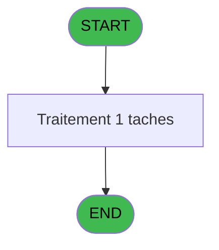

Review the generated code against the original specification.

Produce a JSON report:
```json
{
  "programId": 0,
  "programName": "",
  "coveragePct": 0,
  "rulesImplemented": 0,
  "rulesTotal": 0,
  "missingRules": [
    "rule descriptions not implemented"
  ],
  "recommendations": [
    "improvement suggestions"
  ]
}
```

Check:
1. Every business rule from the contract is implemented in the store
2. Every table from the contract has corresponding entity types
3. Every API endpoint is wired to the store
4. UI layout matches the spec description
5. Error handling is present for all actions

CONTRACT RULES:
[]

SPEC EXCERPT:
# ADH IDE 179 - Set Village Address

> **Analyse**: Phases 1-4 2026-02-07 07:24 -> 07:25 (16s) | Assemblage 07:25
> **Pipeline**: V7.2 Enrichi
> **Structure**: 4 onglets (Resume | Ecrans | Donnees | Connexions)

<!-- TAB:Resume -->

## 1. FICHE D'IDENTITE

| Attribut | Valeur |
|----------|--------|
| Projet | ADH |
| IDE Position | 179 |
| Nom Programme | Set Village Address |
| Fichier source | `Prg_179.xml` |
| Dossier IDE | Printer |
| Taches | 1 (0 ecrans visibles) |
| Tables modifiees | 0 |
| Programmes appeles | 0 |

## 2. DESCRIPTION FONCTIONNELLE

**Set Village Address** assure la gestion complete de ce processus.

## 3. BLOCS FONCTIONNELS

## 5. REGLES METIER

*(Aucune regle metier identifiee)*

## 6. CONTEXTE

- **Appele par**: (aucun)
- **Appelle**: 0 programmes | **Tables**: 1 (W:0 R:1 L:0) | **Taches**: 1 | **Expressions**: 10

<!-- TAB:Ecrans -->

## 8. ECRANS

*(Programme sans ecran visible)*

## 9. NAVIGATION

### 9.3 Structure hierarchique (0 tache)

| Position | Tache | Type | Dimensions | Bloc |
|----------|-------|------|------------|------|

### 9.4 Algorigramme



> *algo-data indisponible. Utiliser `/algorigramme` pour generer.*

<!-- TAB:Donnees -->

## 10. TABLES

### Tables utilisees (1)

| ID | Nom | Description | Type | R | W | L | Usages |
|----|-----|-------------|------|---|---|---|--------|
| 372 | pv_budget |  | DB | R |   |   | 1 |

### Colonnes par table (0 / 1 tables avec colonnes identifiees)

<details>
<summary>Table 372 - pv_budget (R) - 1 usages</summary>

*Table utilisee uniquement en Link ou aucune colonne Real identifiee dans le DataView.*

</details>

## 11. VARIABLES

*(Programme sans variables locales mappees)*

## 12. EXPRESSIONS

**10 / 10 expressions decodees (100%)**

### 12.1 Repartition par type

| Type | Expressions | Regles |
|------|-------------|--------|
| OTHER | 4 | 0 |
| STRING | 6 | 0 |

### 12.2 Expressions cles par type

#### OTHER (4 expressions)

| Type | IDE | Expression | Regle |
|------|-----|------------|-------|
| OTHER | 3 | `SetParam ('VI_ADR1',[D])` | - |
| OTHER | 4 | `SetParam ('VI_ADR2',[E])` | - |
| OTHER | 1 | `SetParam ('VI_CLUB',[B])` | - |
| OTHER | 2 | `SetParam ('VI_NAME',[C])` | - |

#### STRING (6 expressions)

| Type | IDE | Expression | Regle |
|------|-----|------------|-------|
| STRING | 8 | `SetParam ('VI_MAIL',Trim([I]))` | - |
| STRING | 9 | `SetParam ('VI_SIRE',Trim([J]))` | - |
| STRING | 10 | `SetParam ('VI_VATN',Trim([K]))` | - |
| STRING | 5 | `SetParam ('VI_ZIPC',Trim([F]))` | - |
| STRING | 6 | `SetParam ('VI_PHON',Trim([G]))` | - |
| ... | | *+1 autres* | |

<!-- TAB:Connexions -->

## 13. GRAPHE D'APPELS

### 13.1 Chaine depuis Main (Callers)

**Chemin**: (pas de callers directs)


### 13.2 Callers

| IDE | Nom Programme | Nb Appels |
|-----|---------------|-----------|
| - | (aucun) | - |

### 13.3 Callees (programmes appeles)


### 13.4 Detail Callees avec contexte

| IDE | Nom Programme | Appels | Contexte |
|-----|---------------|--------|----------|
| - | (aucun) | - | - |

## 14. RECOMMANDATIONS MIGRATION

### 14.1 Profil du programme

| Metrique | Valeur | Impact migration |
|----------|--------|-----------------|
| Lignes de logique | 30 | Programme compact |
| Expressions | 10 | Peu de logique |
| Tables WRITE | 0 | Impact faible |
| Sous-programmes | 0 | Peu de dependances |
| Ecrans visibles | 0 | Ecran unique ou traitement batch |
| Code desactive | 0% (0 / 30) | Code sain |
| Regles metier | 0 | Pas de regle identifiee |

### 14.2 Plan de migration par bloc

### 14.3 Dependances critiques

| Dependance | Type | Appels | Impact |
|------------|------|--------|--------|

---
*Spec DETAILED generee par Pipeline V7.2 - 2026-02-07 07:25*


GENERATED FILES:

--- types/villageAddress.ts ---
export interface VillageAddress {
  clubCode: string;
  name: string;
  address1: string;
  address2: string | null;
  zipCode: string;
  phone: string | null;
  email: string | null;
  siret: string | null;
  vatNumber: string | null;
}

export interface VillageAddressFormData {
  clubCode: string;
  name: string;
  address1: string;
  address2: string;
  zipCode: string;
  phone: string;
  email: string;
  siret: string;
  vatNumber: string;
}

export interface VillageAddressState {
  villageAddress: VillageAddress | null;
  isLoading: boolean;
  error: string | null;
  setVillageAddress: (address: VillageAddress) => Promise<void>;
  loadVillageAddress: () => Promise<VillageAddress | null>;
  clearError: () => void;
}

export interface SetVillageAddressRequest {
  clubCode: string;
  name: string;
  address1: string;
  address2?: string;
  zipCode: string;
  phone?: string;
  email?: string;
  siret?: string;
  vatNumber?: string;
}

export interface SetVillageAddressResponse {
  success: boolean;
  message?: string;
}

export interface GetVillageAddressResponse extends VillageAddress {
  retrievedAt: string;
}

export const VILLAGE_ADDRESS_MOCK_DATA = [
  {
    clubCode: 'CLUB001',
    name: 'Village Principal',
    address1: '123 Rue de la Paix',
    address2: 'Bâtiment A',
    zipCode: '75001',
    phone: '+33123456789',
    email: 'contact@village.fr',
    siret: '12345678901234',
    vatNumber: 'FR12345678901',
  },
  {
    clubCode: 'CLUB002',
    name: 'Village Secondaire',
    address1: '456 Avenue du Soleil',
    address2: null,
    zipCode: '13001',
    phone: null,
    email: 'info@village2.fr',
    siret: null,
    vatNumber: null,
  },
  {
    clubCode: 'CLUB003',
    name: 'Village Côtier',
    address1: '789 Boulevard de la Mer',
    address2: 'Suite 200',
    zipCode: '06000',
    phone: '+33987654321',
    email: null,
    siret: '98765432109876',
    vatNumber: 'FR98765432109',
  },
] as const satisfies readonly VillageAddress[];

--- stores/villageAddressStore.ts ---
import { create } from 'zustand';
import type {
  VillageAddress,
  VillageAddressState,
  SetVillageAddressRequest,
  SetVillageAddressResponse,
  GetVillageAddressResponse,
} from '@/types/villageAddress';
import { useDataSourceStore } from '@/stores/dataSourceStore';
import { apiClient } from '@/services/api/apiClient';
import type { ApiResponse } from '@/services/api/apiClient';

interface VillageAddressActions {
  setVillageAddress: (address: VillageAddress) => Promise<void>;
  loadVillageAddress: () => Promise<VillageAddress | null>;
  clearError: () => void;
  reset: () => void;
}

type VillageAddressStore = VillageAddressState & VillageAddressActions;

const MOCK_VILLAGE: VillageAddress = {
  clubCode: 'CLUB001',
  name: 'Village Principal',
  address1: '123 Rue de la Paix',
  address2: 'Bâtiment A',
  zipCode: '75001',
  phone: '+33123456789',
  email: 'contact@village.fr',
  siret: '12345678901234',
  vatNumber: 'FR12345678901',
};

const initialState: VillageAddressState = {
  villageAddress: null,
  isLoading: false,
  error: null,
  setVillageAddress: async () => {},
  loadVillageAddress: async () => null,
  clearError: () => {},
};

export const useVillageAddressStore = create<VillageAddressStore>()((set, get) => ({
  ...initialState,

  setVillageAddress: async (address) => {
    const { isRealApi } = useDataSourceStore.getState();
    set({ isLoading: true, error: null });

    if (!isRealApi) {
      const trimmedAddress: VillageAddress = {
        ...address,
        phone: address.phone?.trim() || null,
        email: address.email?.trim() || null,
        siret: address.siret?.trim() || null,
        vatNumber: address.vatNumber?.trim() || null,
        zipCode: address.zipCode.trim(),
      };
      set({
        villageAddress: trimmedAddress,
        isLoading: false,
      });
      return;
    }

    try {
      const payload: SetVillageAddressRequest = {
        clubCode: address.clubCode,
        name: address.name,
        address1: addre

--- services/api/endpoints-villageAddress.ts ---
import { apiClient, type ApiResponse } from "@/services/api/apiClient";
import type {
  VillageAddress,
  GetVillageAddressResponse,
  SetVillageAddressRequest,
  SetVillageAddressResponse,
} from "@/types/villageAddress";

export const villageAddressApi = {
  getVillageAddress: () =>
    apiClient.get<ApiResponse<GetVillageAddressResponse>>(
      "/api/village-address",
    ),

  setVillageAddress: (data: SetVillageAddressRequest) =>
    apiClient.put<ApiResponse<SetVillageAddressResponse>>(
      "/api/village-address",
      data,
    ),
};

--- pages/VillageAddressPage.tsx ---
import { useState, useEffect, useCallback } from 'react';
import { useNavigate } from 'react-router-dom';
import { ScreenLayout } from '@/components/layout';
import { Button, Input } from '@/components/ui';
import { useVillageAddressStore } from '@/stores/villageAddressStore';
import { useAuthStore } from '@/stores';
import type { VillageAddressFormData } from '@/types/villageAddress';

export function VillageAddressPage() {
  const navigate = useNavigate();
  const user = useAuthStore((s) => s.user);

  const villageAddress = useVillageAddressStore((s) => s.villageAddress);
  const isLoading = useVillageAddressStore((s) => s.isLoading);
  const error = useVillageAddressStore((s) => s.error);
  const setVillageAddress = useVillageAddressStore((s) => s.setVillageAddress);
  const loadVillageAddress = useVillageAddressStore((s) => s.loadVillageAddress);
  const clearError = useVillageAddressStore((s) => s.clearError);
  const reset = useVillageAddressStore((s) => s.reset);

  const [formData, setFormData] = useState<VillageAddressFormData>({
    clubCode: '',
    name: '',
    address1: '',
    address2: '',
    zipCode: '',
    phone: '',
    email: '',
    siret: '',
    vatNumber: '',
  });

  const [validationErrors, setValidationErrors] = useState<Partial<Record<keyof VillageAddressFormData, string>>>({});

  useEffect(() => {
    const initData = async () => {
      const data = await loadVillageAddress();
      if (data) {
        setFormData({
          clubCode: data.clubCode,
          name: data.name,
          address1: data.address1,
          address2: data.address2 || '',
          zipCode: data.zipCode,
          phone: data.phone || '',
          email: data.email || '',
          siret: data.siret || '',
          vatNumber: data.vatNumber || '',
        });
      }
    };
    initData();
  }, [loadVillageAddress]);

  useEffect(() => {
    return () => reset();
  }, [reset]);

  useEffect(() => {
    if (error) {
      const timer = setTimeout(() =>

--- components/caisse/villageAddress/ActionsPanel.tsx ---
import type { VillageAddressFormData } from "@/types/villageAddress";
import { Button } from "@/components/ui";

interface ActionsPanelProps {
  formData: VillageAddressFormData;
  validationErrors: Partial<Record<keyof VillageAddressFormData, string>>;
  isLoading: boolean;
  onSave: () => void;
  onCancel: () => void;
}

export const ActionsPanel = ({
  formData,
  validationErrors,
  isLoading,
  onSave,
  onCancel,
}: ActionsPanelProps) => {
  const hasErrors = Object.keys(validationErrors).length > 0;
  const hasRequiredFields =
    formData.clubCode.trim() !== "" &&
    formData.name.trim() !== "" &&
    formData.address1.trim() !== "" &&
    formData.zipCode.trim() !== "";

  const canSave = !isLoading && !hasErrors && hasRequiredFields;

  return (
    <div className="flex items-center justify-end gap-3 p-4 border-t border-gray-200 bg-gray-50">
      <Button
        variant="secondary"
        onClick={onCancel}
        disabled={isLoading}
      >
        Annuler
      </Button>
      <Button
        variant="primary"
        onClick={onSave}
        disabled={!canSave}
      >
        {isLoading ? "Enregistrement..." : "Enregistrer"}
      </Button>
    </div>
  );
};

--- components/caisse/villageAddress/ContactInfoPanel.tsx ---
import type { VillageAddressFormData } from '@/types/villageAddress';
import { Input } from '@/components/ui';

interface ContactInfoPanelProps {
  formData: VillageAddressFormData;
  validationErrors: Partial<Record<keyof VillageAddressFormData, string>>;
  onChange: (field: keyof VillageAddressFormData, value: string) => void;
  disabled?: boolean;
}

export const ContactInfoPanel = ({
  formData,
  validationErrors,
  onChange,
  disabled = false,
}: ContactInfoPanelProps) => {
  return (
    <div className="space-y-4">
      <h2 className="text-lg font-semibold text-gray-900">Informations de Contact</h2>
      
      <div className="grid grid-cols-1 md:grid-cols-2 gap-4">
        <div>
          <label htmlFor="phone" className="block text-sm font-medium text-gray-700 mb-1">
            Téléphone
          </label>
          <Input
            id="phone"
            type="tel"
            value={formData.phone}
            onChange={(e) => onChange('phone', e.target.value)}
            error={validationErrors.phone}
            disabled={disabled}
            placeholder="+33123456789"
          />
        </div>

        <div>
          <label htmlFor="email" className="block text-sm font-medium text-gray-700 mb-1">
            Email
          </label>
          <Input
            id="email"
            type="email"
            value={formData.email}
            onChange={(e) => onChange('email', e.target.value)}
            error={validationErrors.email}
            disabled={disabled}
            placeholder="contact@village.fr"
          />
        </div>
      </div>
    </div>
  );
};

--- components/caisse/villageAddress/LegalInfoPanel.tsx ---
import type { VillageAddressFormData } from '@/types/villageAddress';
import { Input } from '@/components/ui';

interface LegalInfoPanelProps {
  formData: VillageAddressFormData;
  onChange: (field: keyof VillageAddressFormData, value: string) => void;
  validationErrors?: Partial<Record<keyof VillageAddressFormData, string>>;
  disabled?: boolean;
}

export const LegalInfoPanel = ({ formData, onChange, validationErrors = {}, disabled = false }: LegalInfoPanelProps) => {
  return (
    <div className="space-y-4">
      <h3 className="text-lg font-semibold text-gray-900">Informations légales</h3>
      
      <div className="grid grid-cols-1 md:grid-cols-2 gap-4">
        <div>
          <Input
            label="SIRET"
            type="text"
            value={formData.siret}
            onChange={(e) => onChange('siret', e.target.value)}
            error={validationErrors.siret}
            disabled={disabled}
            placeholder="Numéro SIRET (14 chiffres)"
            maxLength={14}
          />
        </div>

        <div>
          <Input
            label="Numéro TVA"
            type="text"
            value={formData.vatNumber}
            onChange={(e) => onChange('vatNumber', e.target.value)}
            error={validationErrors.vatNumber}
            disabled={disabled}
            placeholder="Ex: FR12345678901"
            maxLength={13}
          />
        </div>
      </div>
    </div>
  );
};

--- components/caisse/villageAddress/VillageInfoPanel.tsx ---
import type { VillageAddressFormData } from '@/types/villageAddress';
import { Input } from '@/components/ui';
import { cn } from '@/lib/utils';

interface VillageInfoPanelProps {
  formData: VillageAddressFormData;
  validationErrors: Partial<Record<keyof VillageAddressFormData, string>>;
  onFieldChange: (field: keyof VillageAddressFormData, value: string) => void;
  disabled?: boolean;
  className?: string;
}

export const VillageInfoPanel = ({
  formData,
  validationErrors,
  onFieldChange,
  disabled = false,
  className,
}: VillageInfoPanelProps) => {
  return (
    <div className={cn('space-y-4', className)}>
      <h3 className="text-lg font-semibold text-gray-900">Informations Village</h3>
      
      <div className="grid grid-cols-1 gap-4 md:grid-cols-2">
        <div>
          <label htmlFor="clubCode" className="block text-sm font-medium text-gray-700 mb-1">
            Code Club <span className="text-red-500">*</span>
          </label>
          <Input
            id="clubCode"
            type="text"
            value={formData.clubCode}
            onChange={(e) => onFieldChange('clubCode', e.target.value)}
            disabled={disabled}
            className={cn(validationErrors.clubCode && 'border-red-500')}
            placeholder="CLUB001"
          />
          {validationErrors.clubCode && (
            <p className="mt-1 text-sm text-red-600">{validationErrors.clubCode}</p>
          )}
        </div>

        <div>
          <label htmlFor="name" className="block text-sm font-medium text-gray-700 mb-1">
            Nom <span className="text-red-500">*</span>
          </label>
          <Input
            id="name"
            type="text"
            value={formData.name}
            onChange={(e) => onFieldChange('name', e.target.value)}
            disabled={disabled}
            className={cn(validationErrors.name && 'border-red-500')}
            placeholder="Village Principal"
          />
          {validationErrors.name && (
      