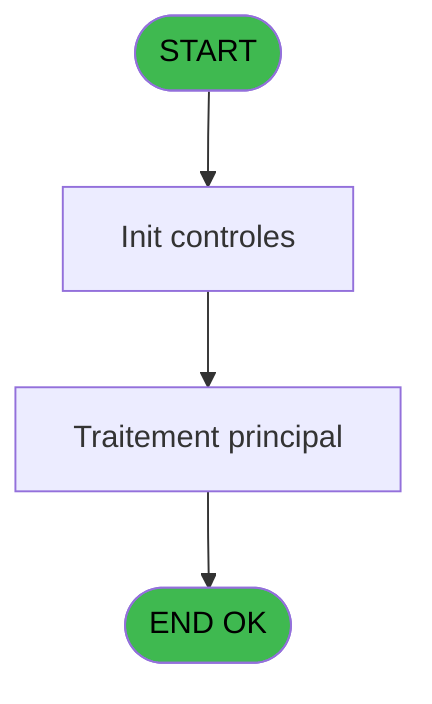

Review the generated code against the original specification.

Produce a JSON report:
```json
{
  "programId": 0,
  "programName": "",
  "coveragePct": 0,
  "rulesImplemented": 0,
  "rulesTotal": 0,
  "missingRules": [
    "rule descriptions not implemented"
  ],
  "recommendations": [
    "improvement suggestions"
  ]
}
```

Check:
1. Every business rule from the contract is implemented in the store
2. Every table from the contract has corresponding entity types
3. Every API endpoint is wired to the store
4. UI layout matches the spec description
5. Error handling is present for all actions

CONTRACT RULES:
[
  {
    "id": "RM-001",
    "description": "Condition: parametre SPECIFICPRINT egale 'VOID'",
    "condition": "GetParam ('SPECIFICPRINT')='VOID'",
    "variables": [],
    "status": "IMPL",
    "targetFile": "adh-web/src/stores/saisieContenuCaisseStore.ts",
    "gapNotes": ""
  }
]

SPEC EXCERPT:
# ADH IDE 181 - Set Listing Number

> **Analyse**: Phases 1-4 2026-02-07 03:52 -> 04:01 (24h08min) | Assemblage 04:01
> **Pipeline**: V7.2 Enrichi
> **Structure**: 4 onglets (Resume | Ecrans | Donnees | Connexions)

<!-- TAB:Resume -->

## 1. FICHE D'IDENTITE

| Attribut | Valeur |
|----------|--------|
| Projet | ADH |
| IDE Position | 181 |
| Nom Programme | Set Listing Number |
| Fichier source | `Prg_181.xml` |
| Dossier IDE | General |
| Taches | 1 (0 ecrans visibles) |
| Tables modifiees | 0 |
| Programmes appeles | 0 |
| Complexite | **BASSE** (score 0/100) |

## 2. DESCRIPTION FONCTIONNELLE

**Set Listing Number (ADH IDE 181)** est un utilitaire de configuration impression sans interface visible. Il initialise le numéro de listing courant et réinitialise les paramètres d'impression (nom imprimante, nombre copies, numéro imprimante) à leurs valeurs par défaut. Ce programme fait partie intégrante du **subsystème d'impression en chaîne** (Chained Listing) du module caisse ADH, utilisé pour orchestrer une série d'impressions de documents (factures, garanties, tickets) sur une imprimante configurée.

Le programme reçoit en paramètre un **numéro de listing** et exécute 5 appels `SetParam()` simples pour configurer les paramètres globaux du système d'impression. Aucune table n'est modifiée, aucun sous-programme n'est appelé : c'est une opération purement paramétrée qui sert de **point d'entrée de configuration** avant de lancer les chaînes d'impression. Il est appelé depuis le menu impression (ADH IDE 214) et son résultat est utilisé par tous les programmes d'impression qui lisent ces paramètres via `GetParam()`.

Avec seulement 11 lignes de logique et 0 dépendances horizontales, c'est l'un des programmes les plus simples du module ADH. La migration vers TypeScript ou C# est triviale : transformer en fonction utilitaire d'un service de configuration impression, sans aucune complexité métier à préserver.

## 3. BLOCS FONCTIONNELS

### 3.1 Traitement (1 tache)

Traitements internes.

---

#### <a id="t1"></a>181 - Set Listing Number

**Role** : Traitement : Set Listing Number.
**Variables liees** : EN (Param Listing number)


## 5. REGLES METIER

1 regles identifiees:

### Autres (1 regles)

#### <a id="rm-RM-001"></a>[RM-001] Condition: parametre SPECIFICPRINT egale 'VOID'

| Element | Detail |
|---------|--------|
| **Condition** | `GetParam ('SPECIFICPRINT')='VOID'` |
| **Si vrai** | Action si SPECIFICPRINT = 'VOID' |
| **Expression source** | Expression 5 : `GetParam ('SPECIFICPRINT')='VOID'` |
| **Exemple** | Si GetParam ('SPECIFICPRINT')='VOID' → Action si SPECIFICPRINT = 'VOID' |

## 6. CONTEXTE

- **Appele par**: (aucun)
- **Appelle**: 0 programmes | **Tables**: 0 (W:0 R:0 L:0) | **Taches**: 1 | **Expressions**: 5

<!-- TAB:Ecrans -->

## 8. ECRANS

*(Programme sans ecran visible)*

## 9. NAVIGATION

### 9.3 Structure hierarchique (1 tache)

| Position | Tache | Type | Dimensions | Bloc |
|----------|-------|------|------------|------|
| **181.1** | [**Set Listing Number** (181)](#t1) | MDI | - | Traitement |

### 9.4 Algorigramme



> **Legende**: Vert = START/END OK | Rouge = END KO | Bleu = Decisions
> *Algorigramme auto-genere. Utiliser `/algorigramme` pour une synthese metier detaillee.*

<!-- TAB:Donnees -->

## 10. TABLES

### Tables utilisees (0)

| ID | Nom | Description | Type | R | W | L | Usages |
|----|-----|-------------|------|---|---|---|--------|

### Colonnes par table (0 / 0 tables avec colonnes identifiees)

## 11. VARIABLES

*(Programme sans variables locales mappees)*

## 12. EXPRESSIONS

**5 / 5 expressions decodees (100%)**

### 12.1 Repartition par type

| Type | Expressions | Regles |
|------|-------------|--------|
| CONDITION | 1 | 5 |
| OTHER | 4 | 0 |

### 12.2 Expressions cles par type

#### CONDITION (1 expressions)

| Type | IDE | Expression | Regle |
|------|-----|------------|-------|
| CONDITION | 5 | `GetParam ('SPECIFICPRINT')='VOID'` | [RM-001](#rm-RM-001) |

#### OTHER (4 expressions)

| Type | IDE | Expression | Regle |
|------|-----|------------|-------|
| OTHER | 3 | `SetParam ('CURRENTPRINTERNAME','VOID')` | - |
| OTHER | 4 | `SetParam ('NUMBERCOPIES',0)` | - |
| OTHER | 1 | `SetParam ('CURRENTLISTINGNUM',Param Listing number [A])` | - |
| OTHER | 2 | `SetParam ('CURRENTPRINTERNUM',0)` | - |

<!-- TAB:Connexions -->

## 13. GRAPHE D'APPELS

### 13.1 Chaine depuis Main (Callers)

**Chemin**: (pas de callers directs)


### 13.2 Callers

| IDE | Nom Programme | Nb Appels |
|-----|---------------|-----------|
| - | (aucun) | - |

##

GENERATED FILES:

--- types/printConfiguration.ts ---
export interface PrintConfig {
  currentListingNum: number;
  currentPrinterName: string;
  currentPrinterNum: number;
  numberCopies: number;
  specificPrint: string;
}

export interface SetListingRequest {
  listingNumber: number;
}

export interface ResetPrintParametersRequest {}

export interface GetPrintConfigRequest {}

export type PrintConfigAction = 
  | { type: 'SET_CONFIG'; payload: PrintConfig }
  | { type: 'SET_LOADING'; payload: boolean }
  | { type: 'SET_ERROR'; payload: string | null }
  | { type: 'RESET' };

export interface PrintConfigState {
  currentConfig: PrintConfig | null;
  isInitializing: boolean;
  error: string | null;
  setListingNumber: (listingNumber: number) => Promise<void>;
  resetPrintParameters: () => Promise<void>;
  getPrintConfig: () => Promise<PrintConfig>;
  setError: (error: string | null) => void;
  reset: () => void;
}

export const DEFAULT_PRINT_CONFIG: PrintConfig = {
  currentListingNum: 0,
  currentPrinterName: 'VOID',
  currentPrinterNum: 0,
  numberCopies: 0,
  specificPrint: 'VOID',
};

--- stores/printConfigurationStore.ts ---
import { create } from 'zustand';
import type { PrintConfig } from '@/types/printConfiguration';
import { useDataSourceStore } from './dataSourceStore';
import { apiClient } from '@/services/api/apiClient';
import type { ApiResponse } from '@/services/api/apiClient';

interface PrintConfigState {
  currentConfig: PrintConfig | null;
  isInitializing: boolean;
  error: string | null;
}

interface PrintConfigActions {
  setListingNumber: (listingNumber: number) => Promise<void>;
  resetPrintParameters: () => Promise<void>;
  getPrintConfig: () => Promise<PrintConfig>;
  setError: (error: string | null) => void;
  reset: () => void;
}

type PrintConfigStore = PrintConfigState & PrintConfigActions;

const DEFAULT_CONFIG: PrintConfig = {
  currentListingNum: 0,
  currentPrinterName: 'VOID',
  currentPrinterNum: 0,
  numberCopies: 0,
  specificPrint: 'VOID',
};

const initialState: PrintConfigState = {
  currentConfig: null,
  isInitializing: false,
  error: null,
};

export const usePrintConfigStore = create<PrintConfigStore>()((set, get) => ({
  ...initialState,

  setListingNumber: async (listingNumber) => {
    const { isRealApi } = useDataSourceStore.getState();
    set({ isInitializing: true, error: null });

    if (!isRealApi) {
      const config: PrintConfig = {
        currentListingNum: listingNumber,
        currentPrinterName: 'VOID',
        currentPrinterNum: 0,
        numberCopies: 0,
        specificPrint: 'VOID',
      };
      set({ currentConfig: config, isInitializing: false });
      return;
    }

    try {
      await apiClient.post<ApiResponse<void>>('/api/print-config/set-listing', {
        listingNumber,
      });
      const updatedConfig = await get().getPrintConfig();
      set({ currentConfig: updatedConfig });
    } catch (e: unknown) {
      const message = e instanceof Error ? e.message : 'Erreur configuration listing';
      set({ error: message });
      throw e;
    } finally {
      set({ isInitializing: false });
    }
  },

  res

--- services/api/endpoints-printConfiguration.ts ---
import { apiClient, type ApiResponse } from './apiClient';
import type {
  PrintConfig,
  SetListingRequest,
  ResetPrintParametersRequest,
  GetPrintConfigRequest,
} from '@/types/printConfiguration';

export const printConfigApi = {
  setListing: (data: SetListingRequest) =>
    apiClient.post<ApiResponse<void>>(
      '/print-config/set-listing',
      data,
    ),
  resetPrintParameters: (data: ResetPrintParametersRequest) =>
    apiClient.post<ApiResponse<void>>(
      '/print-config/reset',
      data,
    ),
  getPrintConfig: () =>
    apiClient.get<ApiResponse<PrintConfig>>(
      '/print-config',
    ),
};

--- pages/PrintConfigurationPage.tsx ---
import { useEffect } from 'react';
import { useNavigate } from 'react-router-dom';
import { ScreenLayout } from '@/components/layout';
import { usePrintConfigStore } from '@/stores/printConfigurationStore';
import { useAuthStore } from '@/stores';

export const PrintConfigurationPage = () => {
  const navigate = useNavigate();
  const user = useAuthStore((s) => s.user);

  const currentConfig = usePrintConfigStore((s) => s.currentConfig);
  const isInitializing = usePrintConfigStore((s) => s.isInitializing);
  const error = usePrintConfigStore((s) => s.error);
  const getPrintConfig = usePrintConfigStore((s) => s.getPrintConfig);
  const setListingNumber = usePrintConfigStore((s) => s.setListingNumber);
  const resetPrintParameters = usePrintConfigStore((s) => s.resetPrintParameters);
  const reset = usePrintConfigStore((s) => s.reset);

  useEffect(() => {
    getPrintConfig();
    return () => reset();
  }, [getPrintConfig, reset]);

  const handleBack = () => {
    navigate('/caisse/menu');
  };

  return (
    <ScreenLayout>
      <div className="space-y-6 max-w-4xl mx-auto">
        <div className="flex items-center justify-between">
          <div>
            <h2 className="text-xl font-semibold">Configuration impression</h2>
            <p className="text-on-surface-muted text-sm mt-1">
              Service utilitaire backend sans interface
            </p>
          </div>
          {user && (
            <span className="text-xs text-on-surface-muted">
              {user.prenom} {user.nom}
            </span>
          )}
        </div>

        {error && (
          <div className="bg-red-50 border border-red-200 text-red-700 px-4 py-3 rounded-md text-sm">
            {error}
          </div>
        )}

        {isInitializing && (
          <div className="bg-surface-hover border border-border px-4 py-3 rounded-md text-sm text-on-surface">
            Chargement de la configuration...
          </div>
        )}

        {currentConfig && (
          

--- components/caisse/printConfiguration/ConfigurationPanel.tsx ---
import type { PrintConfig } from '@/types/printConfiguration';
import { cn } from '@/lib/utils';

interface ConfigurationPanelProps {
  config: PrintConfig;
  className?: string;
}

export const ConfigurationPanel = ({ config, className }: ConfigurationPanelProps) => {
  return (
    <div className={cn('bg-surface border border-border rounded-lg p-6 space-y-4', className)}>
      <div className="grid grid-cols-2 gap-4">
        <div>
          <div className="text-sm font-medium text-on-surface-muted mb-1">
            Numéro de listing actuel
          </div>
          <div className="text-lg font-semibold text-on-surface">
            {config.currentListingNum}
          </div>
        </div>

        <div>
          <div className="text-sm font-medium text-on-surface-muted mb-1">
            Numéro d'imprimante
          </div>
          <div className="text-lg font-semibold text-on-surface">
            {config.currentPrinterNum}
          </div>
        </div>

        <div>
          <div className="text-sm font-medium text-on-surface-muted mb-1">
            Nom de l'imprimante
          </div>
          <div className="text-lg font-semibold text-on-surface">
            {config.currentPrinterName}
          </div>
        </div>

        <div>
          <div className="text-sm font-medium text-on-surface-muted mb-1">
            Nombre de copies
          </div>
          <div className="text-lg font-semibold text-on-surface">
            {config.numberCopies}
          </div>
        </div>

        <div className="col-span-2">
          <div className="text-sm font-medium text-on-surface-muted mb-1">
            Impression spécifique
          </div>
          <div className="text-lg font-semibold text-on-surface">
            {config.specificPrint}
          </div>
        </div>
      </div>

      <div className="mt-6 pt-4 border-t border-border">
        <p className="text-xs text-on-surface-muted italic">
          Configuration géré automatiquement p