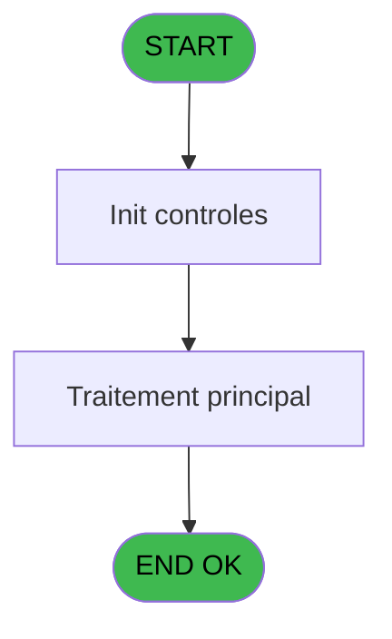

Review the generated code against the original specification.

Produce a JSON report:
```json
{
  "programId": 0,
  "programName": "",
  "coveragePct": 0,
  "rulesImplemented": 0,
  "rulesTotal": 0,
  "missingRules": [
    "rule descriptions not implemented"
  ],
  "recommendations": [
    "improvement suggestions"
  ]
}
```

Check:
1. Every business rule from the contract is implemented in the store
2. Every table from the contract has corresponding entity types
3. Every API endpoint is wired to the store
4. UI layout matches the spec description
5. Error handling is present for all actions

CONTRACT RULES:
[
  {
    "id": "RM-001",
    "description": "Condition: Param UNI/BI [D] different de 'B'",
    "condition": "Param UNI/BI [D]<>'B'",
    "variables": [
      "EQ"
    ],
    "status": "IMPL",
    "targetFile": "adh-web/src/stores/saisieContenuCaisseStore.ts",
    "gapNotes": ""
  },
  {
    "id": "RM-002",
    "description": "Condition: Param UNI/BI [D] egale 'B'",
    "condition": "Param UNI/BI [D]='B'",
    "variables": [
      "EQ"
    ],
    "status": "IMPL",
    "targetFile": "adh-web/src/services/printer/generators/ouvertureTicketGenerator.ts",
    "gapNotes": ""
  }
]

SPEC EXCERPT:
# ADH IDE 152 - Recup Classe et Lib du MOP

> **Analyse**: Phases 1-4 2026-02-07 03:51 -> 03:36 (23h44min) | Assemblage 03:36
> **Pipeline**: V7.2 Enrichi
> **Structure**: 4 onglets (Resume | Ecrans | Donnees | Connexions)

<!-- TAB:Resume -->

## 1. FICHE D'IDENTITE

| Attribut | Valeur |
|----------|--------|
| Projet | ADH |
| IDE Position | 152 |
| Nom Programme | Recup Classe et Lib du MOP |
| Fichier source | `Prg_152.xml` |
| Dossier IDE | General |
| Taches | 3 (0 ecrans visibles) |
| Tables modifiees | 0 |
| Programmes appeles | 0 |
| Complexite | **BASSE** (score 0/100) |

## 2. DESCRIPTION FONCTIONNELLE

ADH IDE 152 - RECUP_CLASSE_MOP est un programme utilitaire critiquement utilisé dans la chaîne des ventes pour récupérer les informations de classification et de libellé d'un moyen de paiement (MOP) donné. Appelé par plus de 15 programmes différents (principalement des écrans de vente et d'impression), ce programme centralise la logique de lookup des MOP, évitant la duplication de code à travers les différents modules de transaction et d'édition. Il prend en entrée le code du MOP et retourne sa classification (UNI ou BI) ainsi que son libellé, informations essentielles pour le routage des transactions et l'affichage des reçus.

Le programme utilise deux tâches principales correspondant aux deux contextes d'utilisation : la tâche UNI pour les transactions en devise unique (opérations simples) et la tâche BI pour les transactions en devises multiples (change). Cette séparation permet une gestion différenciée des MOP selon que la transaction concerne une seule devise ou un échange. Les données proviennent de la table des moyens de paiement référencée (probablement dans REF.ecf), avec une architecture simple de type lookup sans calcul métier complexe, ce qui en fait un service de base robuste et performant pour toute la chaîne transactionnelle des ventes.

Son utilisation massive (15+ callers) souligne son rôle d'élément infrastructure fondamental : tout changement à sa logique ou à sa source de données affecte directement l'ensemble du processus de vente, des écrans de saisie aux éditions finales. Il est donc critique d'assurer sa stabilité et sa compatibilité avec les évolutions futures du référentiel MOP.

## 3. BLOCS FONCTIONNELS

### 3.1 Traitement (3 taches)

Traitements internes.

---

#### <a id="t1"></a>152 - (sans nom)

**Role** : Traitement interne.

---

#### <a id="t2"></a>152.1 - UNI

**Role** : Traitement interne.

---

#### <a id="t3"></a>152.2 - BI

**Role** : Traitement interne.


## 5. REGLES METIER

2 regles identifiees:

### Autres (2 regles)

#### <a id="rm-RM-001"></a>[RM-001] Condition: Param UNI/BI [D] different de 'B'

| Element | Detail |
|---------|--------|
| **Condition** | `Param UNI/BI [D]<>'B'` |
| **Si vrai** | Action si vrai |
| **Variables** | EQ (Param UNI/BI) |
| **Expression source** | Expression 1 : `Param UNI/BI [D]<>'B'` |
| **Exemple** | Si Param UNI/BI [D]<>'B' → Action si vrai |

#### <a id="rm-RM-002"></a>[RM-002] Condition: Param UNI/BI [D] egale 'B'

| Element | Detail |
|---------|--------|
| **Condition** | `Param UNI/BI [D]='B'` |
| **Si vrai** | Action si vrai |
| **Variables** | EQ (Param UNI/BI) |
| **Expression source** | Expression 2 : `Param UNI/BI [D]='B'` |
| **Exemple** | Si Param UNI/BI [D]='B' → Action si vrai |

## 6. CONTEXTE

- **Appele par**: [ Print ticket vente (IDE 234)](ADH-IDE-234.md), [ Print ticket vente LEX (IDE 235)](ADH-IDE-235.md), [ Print ticket vente PMS-584 (IDE 236)](ADH-IDE-236.md), [ Print ticket vente LEX (IDE 285)](ADH-IDE-285.md), [ Print ticket vente (IDE 323)](ADH-IDE-323.md), [Transaction Nouv vente avec GP (IDE 237)](ADH-IDE-237.md), [Transaction Nouv vente PMS-584 (IDE 238)](ADH-IDE-238.md), [Transaction Nouv vente PMS-721 (IDE 239)](ADH-IDE-239.md), [Transaction Nouv vente PMS-710 (IDE 240)](ADH-IDE-240.md), [Saisie transaction 154  N.U (IDE 307)](ADH-IDE-307.md), [Saisie transaction Nouv vente (IDE 310)](ADH-IDE-310.md), [Saisie transaction Nouv vente (IDE 316)](ADH-IDE-316.md), [Controle fermeture caisse WS (IDE 155)](ADH-IDE-155.md), [Saisie transaction 154 N.U (IDE 300)](ADH-IDE-300.md), [Print ticket vente/OD N.U (IDE 306)](ADH-IDE-306.md)
- **Appelle**: 0 programmes | **Tables**: 3 (W:0 R:2 L:1) | **Taches**: 3 | **Expressions**: 2

<!-- TAB:Ecrans -->

## 8. ECRANS

*(Programme sans ecran visible)*

## 9. NAVIGATION

### 9.3 Structure hierarchique (3 taches)

| Position | Tache | Type | Dimensions | Bloc |
|----------|-------|------|------------|------|
| **152.1** | [**(sans nom)** (152)](#t1) | MDI | - | Traitement |
| 152.1.1 | [UNI (152.1)](#t2) | MDI | - | |
| 152.1.2 | [BI (152.2)](#t3) | MDI | - | |

### 9.4 Algorigramme



> **Legende**: 

GENERATED FILES:

--- types/moyenPaiement.ts ---
import type { ApiResponse } from "@/services/api/apiClient";

export type TypeDevise = "UNI" | "BI";
export type ClasseMOP = "UNI" | "BI" | "TRANSF" | "CHQ";

export interface MoyenPaiement {
  code: string;
  libelle: string;
  classe: ClasseMOP;
  typeDevise: TypeDevise;
}

export interface MoyenReglement {
  code: string;
  libelle: string;
}

export interface MOPInfo {
  classe: ClasseMOP;
  libelle: string;
  existe: boolean;
}

export interface MOPExistsResponse {
  existe: boolean;
}

export interface GetMOPInfoRequest {
  code: string;
  typeDevise?: TypeDevise;
}

export interface GetMOPInfoResponse extends ApiResponse {
  data: MOPInfo;
}

export interface CheckMOPExistsRequest {
  code: string;
  societe: string;
}

export interface CheckMOPExistsResponse extends ApiResponse {
  data: MOPExistsResponse;
}

export interface GetMOPByCodeRequest {
  code: string;
}

export interface GetMOPByCodeResponse extends ApiResponse {
  data: MoyenPaiement | null;
}

export interface MoyenPaiementState {
  moyensPaiement: MoyenPaiement[];
  selectedMOP: MoyenPaiement | null;
  isLoading: boolean;
  error: string | null;
}

export interface MoyenPaiementActions {
  getMOPInfo: (
    codeMOP: string,
    typeDevise: TypeDevise
  ) => Promise<{ classe: ClasseMOP; libelle: string; existe: boolean }>;
  checkMOPExists: (codeMOP: string, societe: string) => Promise<boolean>;
  getMOPByCode: (codeMOP: string) => Promise<MoyenPaiement | null>;
  setMoyensPaiement: (moyens: MoyenPaiement[]) => void;
  setSelectedMOP: (mop: MoyenPaiement | null) => void;
  setIsLoading: (isLoading: boolean) => void;
  setError: (error: string | null) => void;
  reset: () => void;
}

export type MoyenPaiementStore = MoyenPaiementState & MoyenPaiementActions;

--- stores/moyenPaiementStore.ts ---
import { create } from 'zustand';
import type {
  MoyenPaiement,
  MOPInfo,
  TypeDevise,
  ClasseMOP,
} from '@/types/moyenPaiement';
import { useDataSourceStore } from './dataSourceStore';

interface MoyenPaiementState {
  moyensPaiement: MoyenPaiement[];
  selectedMOP: MoyenPaiement | null;
  isLoading: boolean;
  error: string | null;
}

interface MoyenPaiementActions {
  getMOPInfo: (
    codeMOP: string,
    typeDevise: TypeDevise,
  ) => Promise<{ classe: ClasseMOP; libelle: string; existe: boolean }>;
  checkMOPExists: (codeMOP: string, societe: string) => Promise<boolean>;
  getMOPByCode: (codeMOP: string) => Promise<MoyenPaiement | null>;
  setMoyensPaiement: (moyens: MoyenPaiement[]) => void;
  setSelectedMOP: (mop: MoyenPaiement | null) => void;
  setIsLoading: (isLoading: boolean) => void;
  setError: (error: string | null) => void;
  reset: () => void;
}

type MoyenPaiementStore = MoyenPaiementState & MoyenPaiementActions;

const MOCK_MOYENS_PAIEMENT: MoyenPaiement[] = [
  {
    code: 'CB',
    libelle: 'Carte Bancaire',
    classe: 'UNI',
    typeDevise: 'UNI',
  },
  {
    code: 'ESP',
    libelle: 'Espèces',
    classe: 'UNI',
    typeDevise: 'UNI',
  },
  {
    code: 'CHQ',
    libelle: 'Chèque',
    classe: 'CHQ',
    typeDevise: 'UNI',
  },
  {
    code: 'VIR',
    libelle: 'Virement',
    classe: 'TRANSF',
    typeDevise: 'UNI',
  },
  {
    code: 'CHG',
    libelle: 'Change',
    classe: 'BI',
    typeDevise: 'BI',
  },
  {
    code: 'CBE',
    libelle: 'CB Étranger',
    classe: 'BI',
    typeDevise: 'BI',
  },
  {
    code: 'TRV',
    libelle: 'Chèques Voyage',
    classe: 'BI',
    typeDevise: 'BI',
  },
  {
    code: 'VAC',
    libelle: 'Chèques Vacances',
    classe: 'UNI',
    typeDevise: 'UNI',
  },
  {
    code: 'PRE',
    libelle: 'Prélèvement',
    classe: 'TRANSF',
    typeDevise: 'UNI',
  },
  {
    code: 'AVO',
    libelle: 'Avoir',
    classe: 'UNI',
    typeDevise: 'UNI',
  },
];

const initialState: MoyenPaiementState = {
  moye

--- services/api/endpoints-moyenPaiement.ts ---
import { apiClient, type ApiResponse } from "@/services/api/apiClient";
import type {
  MoyenPaiement,
  MOPInfo,
  MOPExistsResponse,
  TypeDevise,
  ClasseMOP,
} from "@/types/moyenPaiement";

export const moyenPaiementApi = {
  getMOPInfo: (code: string, typeDevise?: TypeDevise) => {
    const params = new URLSearchParams({ code });
    if (typeDevise) {
      params.append("typeDevise", typeDevise);
    }
    return apiClient.get<ApiResponse<MOPInfo>>(
      `/api/moyenpaiement/info?${params.toString()}`,
    );
  },

  getMOPByCode: (code: string) =>
    apiClient.get<ApiResponse<MoyenPaiement>>(
      `/api/moyenpaiement/${encodeURIComponent(code)}`,
    ),

  checkMOPExists: (code: string, societe: string) => {
    const params = new URLSearchParams({ code, societe });
    return apiClient.get<ApiResponse<MOPExistsResponse>>(
      `/api/moyenpaiement/exists?${params.toString()}`,
    );
  },
};

--- pages/MoyenPaiementPage.tsx ---
import { useState, useEffect, useCallback } from 'react';
import { useNavigate } from 'react-router-dom';
import { ScreenLayout } from '@/components/layout';
import { Button, Input, Dialog } from '@/components/ui';
import { useMoyenPaiementStore } from '@/stores/moyenPaiementStore';
import { useAuthStore } from '@/stores';
import type { TypeDevise, ClasseMOP, MoyenPaiement } from '@/types/moyenPaiement';
import { cn } from '@/lib/utils';

type Phase = 'lookup' | 'list';

export function MoyenPaiementPage() {
  const navigate = useNavigate();
  const user = useAuthStore((s) => s.user);

  const moyensPaiement = useMoyenPaiementStore((s) => s.moyensPaiement);
  const selectedMOP = useMoyenPaiementStore((s) => s.selectedMOP);
  const isLoading = useMoyenPaiementStore((s) => s.isLoading);
  const error = useMoyenPaiementStore((s) => s.error);
  const getMOPInfo = useMoyenPaiementStore((s) => s.getMOPInfo);
  const checkMOPExists = useMoyenPaiementStore((s) => s.checkMOPExists);
  const getMOPByCode = useMoyenPaiementStore((s) => s.getMOPByCode);
  const setSelectedMOP = useMoyenPaiementStore((s) => s.setSelectedMOP);
  const reset = useMoyenPaiementStore((s) => s.reset);

  const [phase, setPhase] = useState<Phase>('lookup');
  const [codeMOP, setCodeMOP] = useState('');
  const [typeDevise, setTypeDevise] = useState<TypeDevise>('UNI');
  const [searchResult, setSearchResult] = useState<{
    classe: ClasseMOP;
    libelle: string;
    existe: boolean;
  } | null>(null);
  const [showInfoDialog, setShowInfoDialog] = useState(false);

  useEffect(() => {
    return () => reset();
  }, [reset]);

  const handleLookup = useCallback(async () => {
    if (!codeMOP.trim()) {
      return;
    }

    const result = await getMOPInfo(codeMOP.trim(), typeDevise);
    setSearchResult(result);
    setShowInfoDialog(true);
  }, [codeMOP, typeDevise, getMOPInfo]);

  const handleCheckExists = useCallback(async () => {
    if (!codeMOP.trim()) {
      return;
    }

    const exists =

--- components/caisse/moyenPaiement/IntegrationPanel.tsx ---
import type { MoyenPaiement } from '@/types/moyenPaiement';

interface IntegrationPanelProps {
  selectedMOP: MoyenPaiement | null;
  className?: string;
}

export const IntegrationPanel = ({ selectedMOP, className }: IntegrationPanelProps) => {
  const usageExamples = [
    {
      screen: 'Écrans de vente',
      description: 'Affichage du libellé du moyen de paiement',
      example: selectedMOP ? `"${selectedMOP.libelle}"` : 'Sélectionnez un MOP'
    },
    {
      screen: 'Générateurs de tickets',
      description: 'Formatage des moyens de paiement',
      example: selectedMOP
        ? `Code: ${selectedMOP.code} - ${selectedMOP.libelle} (${selectedMOP.classe})`
        : 'Sélectionnez un MOP'
    },
    {
      screen: 'Écrans de transaction',
      description: 'Validation des MOP saisis',
      example: selectedMOP
        ? `Classe: ${selectedMOP.classe}, Type: ${selectedMOP.typeDevise}`
        : 'Sélectionnez un MOP'
    }
  ];

  return (
    <div className={className}>
      <h3 className="text-sm font-medium text-gray-900 mb-3">Intégration</h3>
      <div className="space-y-3">
        {usageExamples.map((usage) => (
          <div
            key={usage.screen}
            className="border border-gray-200 rounded-md p-3 bg-gray-50"
          >
            <div className="flex items-start gap-2 mb-2">
              <div className="flex-shrink-0 w-1.5 h-1.5 rounded-full bg-blue-500 mt-1.5" />
              <div className="flex-1">
                <div className="text-sm font-medium text-gray-900">
                  {usage.screen}
                </div>
                <div className="text-xs text-gray-600 mt-0.5">
                  {usage.description}
                </div>
              </div>
            </div>
            <div className="mt-2 pl-3.5">
              <div className="text-xs font-mono bg-white border border-gray-200 rounded px-2 py-1.5 text-gray-700">
                {usage.example}
              </div>
            </div>
          </