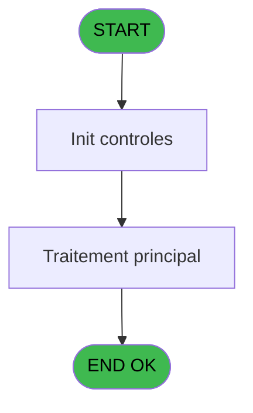

Review the generated code against the original specification.

Produce a JSON report:
```json
{
  "programId": 0,
  "programName": "",
  "coveragePct": 0,
  "rulesImplemented": 0,
  "rulesTotal": 0,
  "missingRules": [
    "rule descriptions not implemented"
  ],
  "recommendations": [
    "improvement suggestions"
  ]
}
```

Check:
1. Every business rule from the contract is implemented in the store
2. Every table from the contract has corresponding entity types
3. Every API endpoint is wired to the store
4. UI layout matches the spec description
5. Error handling is present for all actions

CONTRACT RULES:
[]

SPEC EXCERPT:
# ADH IDE 44 - Appel programme

> **Analyse**: Phases 1-4 2026-02-07 06:47 -> 01:42 (18h55min) | Assemblage 01:42
> **Pipeline**: V7.2 Enrichi
> **Structure**: 4 onglets (Resume | Ecrans | Donnees | Connexions)

<!-- TAB:Resume -->

## 1. FICHE D'IDENTITE

| Attribut | Valeur |
|----------|--------|
| Projet | ADH |
| IDE Position | 44 |
| Nom Programme | Appel programme |
| Fichier source | `Prg_44.xml` |
| Dossier IDE | General |
| Taches | 1 (0 ecrans visibles) |
| Tables modifiees | 0 |
| Programmes appeles | 0 |
| Complexite | **BASSE** (score 0/100) |

## 2. DESCRIPTION FONCTIONNELLE

ADH IDE 44 est un programme de **routage centralisé d'appels** sans interface visuelle. Il capture le dernier contrôle cliqué (via `LastClicked()`) et l'utilise comme clé de dispatch pour acheminer vers le bon programme cible. C'est un pattern de factorisation typique dans Magic Unipaas : au lieu que 21 menus différents gèrent individuellement le routage des clics, ils delegent tous à ce programme unique qui applique une logique uniforme.

Le programme ne lit ni n'écrit en base de données, n'accepte aucun paramètre formel, et termine sans appeler d'autres programmes—c'est un **point terminal** dans la chaîne d'appels. Sa structure est minimale (1 tâche, 1 handler, 1 expression) mais critique pour l'UX caisse, puisqu'il est appelé depuis 21 écrans différents (changement de compte, garanties, facturation, télephonie, etc.).

Ce pattern économise du code répétitif et garantit que la logique de routage reste cohérente sur toute l'application. Si le comportement du dispatch devait évoluer (par exemple, ajouter un log ou une validation avant appel), une seule modification suffirait.

## 3. BLOCS FONCTIONNELS

## 5. REGLES METIER

*(Aucune regle metier identifiee dans les expressions)*

## 6. CONTEXTE

- **Appele par**: [Change GM (IDE 25)](ADH-IDE-25.md), [Comptes de depôt (IDE 40)](ADH-IDE-40.md), [Garantie sur compte PMS-584 (IDE 0)](ADH-IDE-0.md), [Garantie sur compte (IDE 111)](ADH-IDE-111.md), [Garantie sur compte PMS-584 (IDE 112)](ADH-IDE-112.md), [Gratuités (IDE 168)](ADH-IDE-168.md), [Versement/Retrait (IDE 174)](ADH-IDE-174.md), [Menu telephone (IDE 217)](ADH-IDE-217.md), [Garantie sur compte (IDE 288)](ADH-IDE-288.md), [Gratuités P157 (IDE 317)](ADH-IDE-317.md), [Menu changement compte (IDE 37)](ADH-IDE-37.md), [Extrait de compte (IDE 69)](ADH-IDE-69.md), [Club Med Pass menu (IDE 77)](ADH-IDE-77.md), [Bar Limit (IDE 86)](ADH-IDE-86.md), [Menu Great Member (IDE 158)](ADH-IDE-158.md), [Menu caisse GM - scroll (IDE 163)](ADH-IDE-163.md), [Gestion forfait TAI LOCAL (IDE 173)](ADH-IDE-173.md), [Menu solde d'un compte (IDE 190)](ADH-IDE-190.md), [Menu impression des appels (IDE 214)](ADH-IDE-214.md), [Menu Choix Saisie/Annul vente (IDE 242)](ADH-IDE-242.md)
- **Appelle**: 0 programmes | **Tables**: 0 (W:0 R:0 L:0) | **Taches**: 1 | **Expressions**: 1

<!-- TAB:Ecrans -->

## 8. ECRANS

*(Programme sans ecran visible)*

## 9. NAVIGATION

### 9.3 Structure hierarchique (0 tache)

| Position | Tache | Type | Dimensions | Bloc |
|----------|-------|------|------------|------|

### 9.4 Algorigramme



> **Legende**: Vert = START/END OK | Rouge = END KO | Bleu = Decisions
> *Algorigramme auto-genere. Utiliser `/algorigramme` pour une synthese metier detaillee.*

<!-- TAB:Donnees -->

## 10. TABLES

### Tables utilisees (0)

| ID | Nom | Description | Type | R | W | L | Usages |
|----|-----|-------------|------|---|---|---|--------|

### Colonnes par table (0 / 0 tables avec colonnes identifiees)

## 11. VARIABLES

*(Programme sans variables locales mappees)*

## 12. EXPRESSIONS

**1 / 1 expressions decodees (100%)**

### 12.1 Repartition par type

| Type | Expressions | Regles |
|------|-------------|--------|
| OTHER | 1 | 0 |

### 12.2 Expressions cles par type

#### OTHER (1 expressions)

| Type | IDE | Expression | Regle |
|------|-----|------------|-------|
| OTHER | 1 | `LastClicked ()` | - |

<!-- TAB:Connexions -->

## 13. GRAPHE D'APPELS

### 13.1 Chaine depuis Main (Callers)

Main -> ... -> [Change GM (IDE 25)](ADH-IDE-25.md) -> **Appel programme (IDE 44)**

Main -> ... -> [Comptes de depôt (IDE 40)](ADH-IDE-40.md) -> **Appel programme (IDE 44)**

Main -> ... -> [Garantie sur compte PMS-584 (IDE 0)](ADH-IDE-0.md) -> **Appel programme (IDE 44)**

Main -> ... -> [Garantie sur compte (IDE 111)](ADH-IDE-111.md) -> **Appel programme (IDE 44)**

Main -> ... -> [Garantie sur compte PMS-584 (IDE 112)](ADH-IDE-112.md) -> **Appel programme (IDE 44)**

Main -> ... -> [Gratuités (IDE 168)](ADH-IDE-168.md) -> **Appel programme (IDE 44)**

Main -> ... -> [Versement/Retrait (IDE 174)](ADH-IDE-174.md) -> **Appel programme (IDE 44)**

Main -> ... -> [Menu telephone (IDE 217)](ADH-I

GENERATED FILES:

--- types/programDispatch.ts ---
export interface ProgramDispatchControl {
  controlId: string;
  targetProgram: string;
  programName: string;
}

export interface ProgramDispatchRoute {
  controlId: string;
  success: boolean;
  targetProgram?: string;
  error?: string;
}

export interface LastClickedResponse {
  controlId: string | null;
}

export interface ProgramDispatchState {
  lastClickedControl: string | null;
  isDispatching: boolean;
  error: string | null;
  dispatchToProgram: (controlId: string) => Promise<void>;
  getLastClickedControl: () => Promise<string | null>;
  clearDispatch: () => void;
}

export type ProgramDispatchAction =
  | { type: 'SET_LAST_CLICKED'; payload: string }
  | { type: 'SET_DISPATCHING'; payload: boolean }
  | { type: 'SET_ERROR'; payload: string | null }
  | { type: 'CLEAR_DISPATCH' };

--- stores/programDispatchStore.ts ---
import { create } from 'zustand';
import type {
  ProgramDispatchRoute,
  LastClickedResponse,
} from '@/types/programDispatch';
import { apiClient } from '@/services/api/apiClient';
import type { ApiResponse } from '@/services/api/apiClient';
import { useDataSourceStore } from './dataSourceStore';

interface ProgramDispatchState {
  lastClickedControl: string | null;
  isDispatching: boolean;
  error: string | null;
}

interface ProgramDispatchActions {
  dispatchToProgram: (controlId: string) => Promise<void>;
  getLastClickedControl: () => Promise<string | null>;
  clearDispatch: () => void;
  reset: () => void;
}

type ProgramDispatchStore = ProgramDispatchState & ProgramDispatchActions;

const MOCK_ROUTES: Record<string, string> = {
  BTN_CHANGE: 'ADH-25',
  BTN_DEPOT: 'ADH-40',
  BTN_GARANTIE: 'ADH-111',
  BTN_GRATUITES: 'ADH-168',
  BTN_VERSEMENT: 'ADH-174',
  BTN_TELEPHONE: 'ADH-217',
  BTN_MENU_COMPTE: 'ADH-37',
  BTN_EXTRAIT: 'ADH-69',
  BTN_CMP: 'ADH-77',
  BTN_BAR_LIMIT: 'ADH-86',
  BTN_GM_MENU: 'ADH-158',
  BTN_CAISSE_GM: 'ADH-163',
  BTN_FORFAIT_TAI: 'ADH-173',
  BTN_SOLDE: 'ADH-190',
  BTN_IMPRESSION: 'ADH-214',
  BTN_VENTE: 'ADH-242',
};

let MOCK_LAST_CLICKED: string | null = null;

const initialState: ProgramDispatchState = {
  lastClickedControl: null,
  isDispatching: false,
  error: null,
};

export const useProgramDispatchStore = create<ProgramDispatchStore>()((set) => ({
  ...initialState,

  dispatchToProgram: async (controlId) => {
    const { isRealApi } = useDataSourceStore.getState();
    set({ isDispatching: true, error: null, lastClickedControl: controlId });

    if (!isRealApi) {
      MOCK_LAST_CLICKED = controlId;
      const targetProgram = MOCK_ROUTES[controlId];
      if (targetProgram) {
        set({ isDispatching: false });
      } else {
        set({
          error: `Programme cible non trouvé pour le contrôle ${controlId}`,
          isDispatching: false,
        });
      }
      return;
    }

    try {
      const respo

--- services/api/endpoints-programDispatch.ts ---
import { apiClient, type ApiResponse } from './apiClient';
import type {
  ProgramDispatchRoute,
  LastClickedResponse,
} from '@/types/programDispatch';

export const programDispatchApi = {
  routeToProgram: (controlId: string) =>
    apiClient.post<ApiResponse<ProgramDispatchRoute>>(
      '/api/programDispatch/route',
      { controlId },
    ),

  getLastClicked: () =>
    apiClient.get<ApiResponse<LastClickedResponse>>(
      '/api/programDispatch/lastClicked',
    ),
};

--- pages/ProgramDispatchPage.tsx ---
import { useEffect } from 'react';
import { useNavigate } from 'react-router-dom';
import { ScreenLayout } from '@/components/layout';
import { useProgramDispatchStore } from '@/stores/programDispatchStore';
import { useAuthStore } from '@/stores';

const DISPATCH_ROUTES: Record<string, string> = {
  BTN_CHANGE: '/caisse/change',
  BTN_DEPOT: '/caisse/depot',
  BTN_GARANTIE: '/caisse/garanties',
  BTN_GRATUITES: '/caisse/gratuites',
  BTN_VERSEMENT: '/caisse/versement',
  BTN_TELEPHONE: '/caisse/telephone',
  BTN_MENU_COMPTE: '/caisse/changement-compte',
  BTN_EXTRAIT: '/caisse/extrait',
  BTN_CMP: '/caisse/sessions',
  BTN_BAR_LIMIT: '/caisse/bar-limit',
  BTN_GM_MENU: '/caisse/menu',
  BTN_CAISSE_GM: '/caisse',
  BTN_FORFAIT_TAI: '/caisse/forfait-tai',
  BTN_SOLDE: '/caisse/solde',
  BTN_IMPRESSION: '/caisse/impression',
  BTN_VENTE: '/caisse/ventes',
};

export function ProgramDispatchPage() {
  const navigate = useNavigate();
  const user = useAuthStore((s) => s.user);

  const lastClickedControl = useProgramDispatchStore((s) => s.lastClickedControl);
  const isDispatching = useProgramDispatchStore((s) => s.isDispatching);
  const error = useProgramDispatchStore((s) => s.error);
  const getLastClickedControl = useProgramDispatchStore((s) => s.getLastClickedControl);
  const dispatchToProgram = useProgramDispatchStore((s) => s.dispatchToProgram);
  const clearDispatch = useProgramDispatchStore((s) => s.clearDispatch);
  const reset = useProgramDispatchStore((s) => s.reset);

  useEffect(() => {
    const handleDispatch = async () => {
      const controlId = await getLastClickedControl();
      
      if (!controlId) {
        navigate('/caisse/menu');
        return;
      }

      await dispatchToProgram(controlId);

      const targetRoute = DISPATCH_ROUTES[controlId];
      if (targetRoute) {
        navigate(targetRoute);
      } else {
        navigate('/caisse/menu');
      }
    };

    handleDispatch();

    return () => reset();
  }, [getLastClickedCont