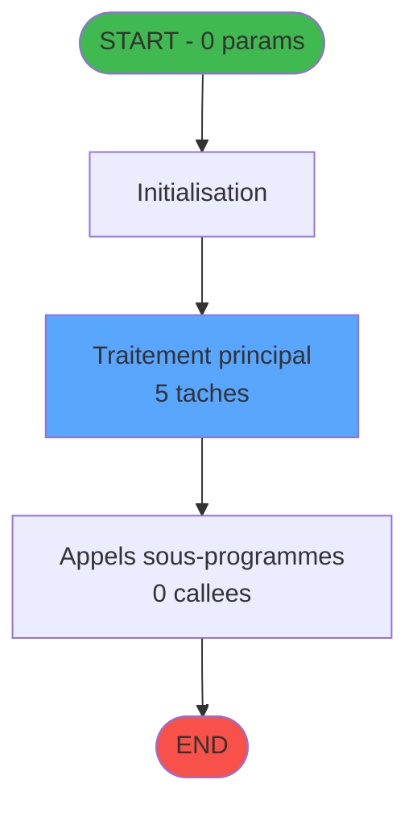
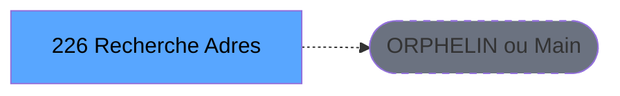
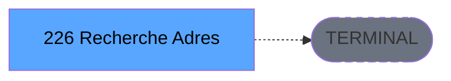

Review the generated code against the original specification.

Produce a JSON report:
```json
{
  "programId": 0,
  "programName": "",
  "coveragePct": 0,
  "rulesImplemented": 0,
  "rulesTotal": 0,
  "missingRules": [
    "rule descriptions not implemented"
  ],
  "recommendations": [
    "improvement suggestions"
  ]
}
```

Check:
1. Every business rule from the contract is implemented in the store
2. Every table from the contract has corresponding entity types
3. Every API endpoint is wired to the store
4. UI layout matches the spec description
5. Error handling is present for all actions

CONTRACT RULES:
[]

SPEC EXCERPT:
# ADH IDE 226 - Recherche Adresse Mail

> **Version spec**: 4.0
> **Analyse**: 2026-01-27 23:11
> **Source**: `D:\Data\Migration\XPA\PMS\ADH\Source\Prg_222.xml`
> **Methode**: APEX + PDCA (Auto-generated)

---

<!-- TAB:Fonctionnel -->

## SPECIFICATION FONCTIONNELLE

### 1.1 Objectif metier

**Recherche Adresse Mail** est le **gestionnaire d'adresses email** qui **recherche, consulte et gere les adresses email associees aux clients et GM**.

**Objectif metier** : Permettre la recherche et la gestion des adresses email des clients dans le systeme. Ce programme offre une interface de recherche multi-criteres et permet l'ajout, la modification ou la suppression des adresses email associees aux fiches GM.

| Element | Description |
|---------|-------------|
| **Qui** | Operateur reception ou marketing |
| **Quoi** | Recherche et gestion des adresses email clients |
| **Pourquoi** | Maintenir les coordonnees email pour les communications clients |
| **Declencheur** | Recherche client, mise a jour email, ou campagne marketing |
| **Resultat** | Adresse email trouvee, creee ou modifiee selon l'action |

### 1.2 Regles metier

| Code | Regle | Condition |
|------|-------|-----------|
| RM-001 | Execution du traitement principal | Conditions d'entree validees |
| RM-002 | Gestion des tables (6 tables) | Acces selon mode (R/W/L) |
| RM-003 | Appels sous-programmes (0 callees) | Selon logique metier |

### 1.3 Flux utilisateur

1. Reception des parametres d'entree (0 params)
2. Initialisation et verification conditions
3. Traitement principal (5 taches)
4. Appels sous-programmes si necessaire
5. Retour resultats

### 1.4 Cas d'erreur

| Erreur | Comportement |
|--------|--------------|
| Conditions non remplies | Abandon avec message |
| Erreur sous-programme | Propagation erreur |

---

<!-- TAB:Technique -->

## SPECIFICATION TECHNIQUE

### 2.1 Identification

| Attribut | Valeur |
|----------|--------|
| **IDE Position** | 226 |
| **Fichier XML** | `Prg_222.xml` |
| **Description** | Recherche Adresse Mail |
| **Module** | ADH |
| **Public Name** |  |
| **Nombre taches** | 5 |
| **Lignes logique** | 315 |
| **Expressions** | 0 |

### 2.2 Tables

| # | Nom logique | Nom physique | Acces | Usage |
|---|-------------|--------------|-------|-------|
| 30 | gm-recherche_____gmr | cafil008_dat | WRITE | Ecriture |
| 130 | fichier_langue | cafil108_dat | LINK | Jointure |
| 285 | email | email | LINK/READ/WRITE | Jointure+R/W |
| 720 | arc_transac_entete_bar | arc_bartransacent | LINK | Jointure |

**Resume**: 6 tables accedees dont **2 en ecriture**

### 2.3 Parametres d'entree (0 parametres)

| Var | Nom | Type | Picture |
|-----|-----|------|---------|
| - | Aucun parametre | - | - |

### 2.4 Algorigramme



### 2.5 Statistiques

| Metrique | Valeur |
|----------|--------|
| **Taches** | 5 |
| **Lignes logique** | 315 |
| **Expressions** | 0 |
| **Parametres** | 0 |
| **Tables accedees** | 6 |
| **Tables en ecriture** | 2 |
| **Callees niveau 1** | 0 |

---

<!-- TAB:Cartographie -->

## CARTOGRAPHIE APPLICATIVE

### 3.1 Chaine d'appels depuis Main



### 3.2 Callers directs

| IDE | Programme | Nb appels |
|-----|-----------|-----------|
| - | ORPHELIN ou Main direct | - |

### 3.3 Callees (3 niveaux)



| Niv | IDE | Programme | Nb appels | Status |
|-----|-----|-----------|-----------|--------|
| - | - | TERMINAL | - | - |

### 3.4 Composants ECF utilises

| ECF | IDE | Public Name | Description |
|-----|-----|-------------|-------------|
| - | - | Aucun composant ECF | - |

### 3.5 Verification orphelin

| Critere | Resultat |
|---------|----------|
| Callers actifs | 0 programmes |
| PublicName | Non defini |
| ECF partage | NON |
| **Conclusion** | **ORPHELIN** - Pas de callers actifs |

---

## NOTES MIGRATION

### Complexite

| Critere | Score | Detail |
|---------|-------|--------|
| Taches | 5 | Simple |
| Tables | 6 | Ecriture |
| Callees | 0 | Faible couplage |
| **Score global** | **MOYENNE** | - |

### Points d'attention migration

| Point | Solution moderne |
|-------|-----------------|
| Variables globales (VG*) | Service/Repositor

GENERATED FILES:

--- types/emailSearch.ts ---
import type { GmIdentifier } from "@/types";

export interface EmailAddress {
  id: number;
  societe: string;
  compte: string;
  filiation: number;
  email: string;
  isPrincipal: boolean;
  createdAt: Date | null;
  updatedAt: Date | null;
}

export interface GmRecord {
  societe: string;
  compte: string;
  filiation: number;
  nom: string | null;
  prenom: string | null;
}

export interface SearchFilters {
  societe: string;
  compte: string;
  filiation: number | null;
  email: string;
}

export interface CreateEmailDto {
  societe: string;
  compte: string;
  filiation: number;
  email: string;
  isPrincipal?: boolean;
}

export interface UpdateEmailDto {
  email?: string;
  isPrincipal?: boolean;
}

export interface EmailSearchState {
  emails: EmailAddress[];
  selectedEmail: EmailAddress | null;
  isLoading: boolean;
  error: string | null;
  filters: SearchFilters;
  searchEmails: (filters: SearchFilters) => Promise<void>;
  createEmail: (data: CreateEmailDto) => Promise<void>;
  updateEmail: (id: number, data: UpdateEmailDto) => Promise<void>;
  deleteEmail: (id: number) => Promise<void>;
  setAsPrincipal: (id: number) => Promise<void>;
  selectEmail: (email: EmailAddress | null) => void;
  setFilters: (filters: SearchFilters) => void;
  clearFilters: () => void;
  resetState: () => void;
}

export interface GetEmailsRequest {
  societe?: string;
  compte?: string;
  filiation?: number;
  email?: string;
}

export interface GetEmailsResponse {
  data: EmailAddress[];
  count: number;
}

export interface CreateEmailRequest {
  societe: string;
  compte: string;
  filiation: number;
  email: string;
  isPrincipal?: boolean;
}

export interface CreateEmailResponse {
  data: EmailAddress;
}

export interface UpdateEmailRequest {
  email?: string;
  isPrincipal?: boolean;
}

export interface UpdateEmailResponse {
  data: EmailAddress;
}

export interface DeleteEmailResponse {
  success: boolean;
}

export interface SetPrincipalResponse {
  success: boolean;
}

--- stores/emailSearchStore.ts ---
import { create } from 'zustand';
import type {
  EmailAddress,
  SearchFilters,
  CreateEmailDto,
  UpdateEmailDto,
  GetEmailsResponse,
  CreateEmailResponse,
  UpdateEmailResponse,
  DeleteEmailResponse,
  SetPrincipalResponse,
} from '@/types/emailSearch';
import { apiClient } from '@/services/api/apiClient';
import type { ApiResponse } from '@/services/api/apiClient';
import { useDataSourceStore } from '@/stores/dataSourceStore';

interface EmailSearchState {
  emails: EmailAddress[];
  selectedEmail: EmailAddress | null;
  isLoading: boolean;
  error: string | null;
  filters: SearchFilters;
}

interface EmailSearchActions {
  searchEmails: (filters: SearchFilters) => Promise<void>;
  createEmail: (data: CreateEmailDto) => Promise<void>;
  updateEmail: (id: number, data: UpdateEmailDto) => Promise<void>;
  deleteEmail: (id: number) => Promise<void>;
  setAsPrincipal: (id: number) => Promise<void>;
  selectEmail: (email: EmailAddress | null) => void;
  setFilters: (filters: SearchFilters) => void;
  clearFilters: () => void;
  resetState: () => void;
}

type EmailSearchStore = EmailSearchState & EmailSearchActions;

const MOCK_EMAILS: EmailAddress[] = [
  {
    id: 1,
    societe: 'SKI',
    compte: '100001',
    filiation: 0,
    email: 'jean.dupont@email.com',
    isPrincipal: true,
    createdAt: new Date('2026-01-15T10:30:00'),
    updatedAt: new Date('2026-02-10T14:20:00'),
  },
  {
    id: 2,
    societe: 'SKI',
    compte: '100001',
    filiation: 0,
    email: 'contact@dupont-family.fr',
    isPrincipal: false,
    createdAt: new Date('2026-01-20T09:15:00'),
    updatedAt: null,
  },
  {
    id: 3,
    societe: 'SKI',
    compte: '100001',
    filiation: 0,
    email: 'j.dupont@work.com',
    isPrincipal: false,
    createdAt: new Date('2026-02-01T16:45:00'),
    updatedAt: null,
  },
  {
    id: 4,
    societe: 'SKI',
    compte: '100002',
    filiation: 0,
    email: 'sophie.martin@email.com',
    isPrincipal: true,
    createdAt: new Date('2026-01-10

--- services/api/endpoints-emailSearch.ts ---
import { apiClient, type ApiResponse } from './apiClient';
import type {
  EmailAddress,
  GetEmailsRequest,
  GetEmailsResponse,
  CreateEmailRequest,
  CreateEmailResponse,
  UpdateEmailRequest,
  UpdateEmailResponse,
  DeleteEmailResponse,
  SetPrincipalResponse,
} from '@/types/emailSearch';

export const emailSearchApi = {
  getEmails: (filters?: GetEmailsRequest) => {
    const params = new URLSearchParams();
    if (filters?.societe) params.append('societe', filters.societe);
    if (filters?.compte) params.append('compte', filters.compte);
    if (filters?.filiation !== undefined) params.append('filiation', String(filters.filiation));
    if (filters?.email) params.append('email', filters.email);

    const queryString = params.toString();
    const url = queryString ? `/api/email-search/emails?${queryString}` : '/api/email-search/emails';

    return apiClient.get<ApiResponse<GetEmailsResponse>>(url);
  },

  createEmail: (data: CreateEmailRequest) =>
    apiClient.post<ApiResponse<CreateEmailResponse>>(
      '/api/email-search/emails',
      data,
    ),

  updateEmail: (id: number, data: UpdateEmailRequest) =>
    apiClient.put<ApiResponse<UpdateEmailResponse>>(
      `/api/email-search/emails/${id}`,
      data,
    ),

  deleteEmail: (id: number) =>
    apiClient.delete<ApiResponse<DeleteEmailResponse>>(
      `/api/email-search/emails/${id}`,
    ),

  setAsPrincipal: (id: number) =>
    apiClient.post<ApiResponse<SetPrincipalResponse>>(
      `/api/email-search/emails/${id}/set-principal`,
      {},
    ),
};

--- pages/EmailSearchPage.tsx ---
import { useState, useEffect, useCallback } from 'react';
import { ScreenLayout } from '@/components/layout';
import { Button, Dialog, Input } from '@/components/ui';
import { useEmailSearchStore } from '@/stores/emailSearchStore';
import { cn } from '@/lib/utils';
import type { EmailAddress, CreateEmailDto, UpdateEmailDto } from '@/types/emailSearch';

export const EmailSearchPage = () => {
  const emails = useEmailSearchStore((s) => s.emails);
  const selectedEmail = useEmailSearchStore((s) => s.selectedEmail);
  const isLoading = useEmailSearchStore((s) => s.isLoading);
  const error = useEmailSearchStore((s) => s.error);
  const filters = useEmailSearchStore((s) => s.filters);
  const searchEmails = useEmailSearchStore((s) => s.searchEmails);
  const createEmail = useEmailSearchStore((s) => s.createEmail);
  const updateEmail = useEmailSearchStore((s) => s.updateEmail);
  const deleteEmail = useEmailSearchStore((s) => s.deleteEmail);
  const setAsPrincipal = useEmailSearchStore((s) => s.setAsPrincipal);
  const selectEmail = useEmailSearchStore((s) => s.selectEmail);
  const setFilters = useEmailSearchStore((s) => s.setFilters);
  const clearFilters = useEmailSearchStore((s) => s.clearFilters);
  const resetState = useEmailSearchStore((s) => s.resetState);

  const [showDialog, setShowDialog] = useState(false);
  const [isEditMode, setIsEditMode] = useState(false);
  const [formData, setFormData] = useState<CreateEmailDto>({
    societe: '',
    compte: '',
    filiation: 0,
    email: '',
    isPrincipal: false,
  });

  useEffect(() => {
    return () => resetState();
  }, [resetState]);

  const handleSearch = useCallback(() => {
    searchEmails(filters);
  }, [filters, searchEmails]);

  const handleClearFilters = useCallback(() => {
    clearFilters();
  }, [clearFilters]);

  const handleFilterChange = useCallback(
    (field: keyof typeof filters, value: string | number | null) => {
      setFilters({ ...filters, [field]: value });
    },
    [filters, s

--- components/caisse/emailSearch/EmailFormPanel.tsx ---
import { useState, useEffect } from 'react';
import { Button, Input } from '@/components/ui';
import { cn } from '@/lib/utils';
import type { CreateEmailDto, UpdateEmailDto, EmailAddress } from '@/types/emailSearch';

interface EmailFormPanelProps {
  isEditMode: boolean;
  selectedEmail: EmailAddress | null;
  onSave: (data: CreateEmailDto | UpdateEmailDto) => Promise<void>;
  onCancel: () => void;
}

export const EmailFormPanel = ({
  isEditMode,
  selectedEmail,
  onSave,
  onCancel,
}: EmailFormPanelProps) => {
  const [formData, setFormData] = useState<CreateEmailDto>({
    societe: '',
    compte: '',
    filiation: 0,
    email: '',
    isPrincipal: false,
  });

  const [isSubmitting, setIsSubmitting] = useState(false);
  const [validationError, setValidationError] = useState<string | null>(null);

  useEffect(() => {
    if (isEditMode && selectedEmail) {
      setFormData({
        societe: selectedEmail.societe,
        compte: selectedEmail.compte,
        filiation: selectedEmail.filiation,
        email: selectedEmail.email,
        isPrincipal: selectedEmail.isPrincipal,
      });
    } else {
      setFormData({
        societe: '',
        compte: '',
        filiation: 0,
        email: '',
        isPrincipal: false,
      });
    }
    setValidationError(null);
  }, [isEditMode, selectedEmail]);

  const validateForm = (): boolean => {
    if (!isEditMode) {
      if (!formData.societe.trim()) {
        setValidationError('Société est requis');
        return false;
      }
      if (!formData.compte.trim()) {
        setValidationError('Compte est requis');
        return false;
      }
      if (formData.filiation < 0) {
        setValidationError('Filiation doit être >= 0');
        return false;
      }
    }

    if (!formData.email.trim()) {
      setValidationError('Email est requis');
      return false;
    }

    const emailRegex = /^[^\s@]+@[^\s@]+\.[^\s@]+$/;
    if (!emailRegex.test(formData.email)) {
      setValidationError('Format

--- components/caisse/emailSearch/ResultsGridPanel.tsx ---
import type { EmailAddress } from '@/types/emailSearch';
import { cn } from '@/lib/utils';
import { Button } from '@/components/ui';

interface ResultsGridPanelProps {
  emails: EmailAddress[];
  selectedEmail: EmailAddress | null;
  isLoading: boolean;
  onEdit: () => void;
  onDelete: () => void;
  onSetPrincipal: () => void;
  onAddNew: () => void;
  onSelectEmail: (email: EmailAddress | null) => void;
}

export const ResultsGridPanel = ({
  emails,
  selectedEmail,
  isLoading,
  onEdit,
  onDelete,
  onSetPrincipal,
  onAddNew,
  onSelectEmail,
}: ResultsGridPanelProps) => {
  const handleRowClick = (email: EmailAddress) => {
    if (selectedEmail?.id === email.id) {
      onSelectEmail(null);
    } else {
      onSelectEmail(email);
    }
  };

  return (
    <div className="flex flex-col gap-3">
      <div className="flex items-center justify-between">
        <h2 className="text-lg font-semibold">Résultats ({emails.length})</h2>
        <div className="flex gap-2">
          <Button
            variant="primary"
            size="sm"
            onClick={onAddNew}
            disabled={isLoading}
          >
            Nouveau
          </Button>
          <Button
            variant="secondary"
            size="sm"
            onClick={onEdit}
            disabled={!selectedEmail || isLoading}
          >
            Modifier
          </Button>
          <Button
            variant="secondary"
            size="sm"
            onClick={onSetPrincipal}
            disabled={!selectedEmail || selectedEmail.isPrincipal || isLoading}
          >
            Définir principal
          </Button>
          <Button
            variant="danger"
            size="sm"
            onClick={onDelete}
            disabled={!selectedEmail || isLoading}
          >
            Supprimer
          </Button>
        </div>
      </div>

      <div className="border border-gray-300 rounded bg-white overflow-hidden">
        {isLoading ? (
          <div className="flex it

--- components/caisse/emailSearch/SearchFiltersPanel.tsx ---
import type { SearchFilters } from '@/types/emailSearch';
import { Input, Button } from '@/components/ui';
import { cn } from '@/lib/utils';

interface SearchFiltersPanelProps {
  filters: SearchFilters;
  onFilterChange: (field: keyof SearchFilters, value: string | number | null) => void;
  onSearch: () => void;
  onClear: () => void;
  disabled?: boolean;
  className?: string;
}

export const SearchFiltersPanel = ({
  filters,
  onFilterChange,
  onSearch,
  onClear,
  disabled = false,
  className,
}: SearchFiltersPanelProps) => {
  const handleFiliationChange = (value: string) => {
    if (value === '') {
      onFilterChange('filiation', null);
    } else {
      const numValue = parseInt(value, 10);
      if (!isNaN(numValue)) {
        onFilterChange('filiation', numValue);
      }
    }
  };

  const handleKeyDown = (e: React.KeyboardEvent) => {
    if (e.key === 'Enter' && !disabled) {
      onSearch();
    }
  };

  return (
    <div className={cn('flex flex-col gap-4 p-4 bg-white border border-gray-200 rounded-lg', className)}>
      <div className="grid grid-cols-1 md:grid-cols-2 lg:grid-cols-4 gap-4">
        <div className="flex flex-col gap-2">
          <label htmlFor="societe-input" className="text-sm font-medium text-gray-700">
            Société
          </label>
          <Input
            id="societe-input"
            type="text"
            value={filters.societe}
            onChange={(e) => onFilterChange('societe', e.target.value)}
            onKeyDown={handleKeyDown}
            disabled={disabled}
            placeholder="SOC001"
            maxLength={10}
          />
        </div>

        <div className="flex flex-col gap-2">
          <label htmlFor="compte-input" className="text-sm font-medium text-gray-700">
            Compte
          </label>
          <Input
            id="compte-input"
            type="text"
            value={filters.compte}
            onChange={(e) => onFilterChange('compte', e.target.value)}
        