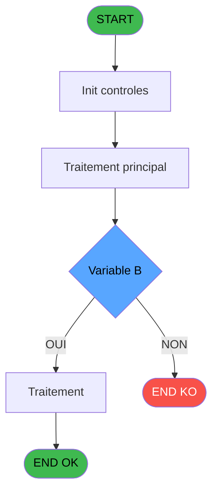

Review the generated code against the original specification.

Produce a JSON report:
```json
{
  "programId": 0,
  "programName": "",
  "coveragePct": 0,
  "rulesImplemented": 0,
  "rulesTotal": 0,
  "missingRules": [
    "rule descriptions not implemented"
  ],
  "recommendations": [
    "improvement suggestions"
  ]
}
```

Check:
1. Every business rule from the contract is implemented in the store
2. Every table from the contract has corresponding entity types
3. Every API endpoint is wired to the store
4. UI layout matches the spec description
5. Error handling is present for all actions

CONTRACT RULES:
[
  {
    "id": "RM-001",
    "description": "Condition: > Type operation [J]='A' AND > Uni/BI [B] different de 'B'",
    "condition": "> Type operation [J]='A' AND > Uni/BI [B]<>'B'",
    "variables": [
      "EO",
      "EW"
    ],
    "status": "IMPL",
    "targetFile": "adh-web/src/stores/saisieContenuCaisseStore.ts",
    "gapNotes": ""
  },
  {
    "id": "RM-002",
    "description": "Condition: > Type operation [J]='A' AND > Uni/BI [B] egale 'B'",
    "condition": "> Type operation [J]='A' AND > Uni/BI [B]='B'",
    "variables": [
      "EO",
      "EW"
    ],
    "status": "IMPL",
    "targetFile": "adh-web/src/services/printer/generators/ouvertureTicketGenerator.ts",
    "gapNotes": ""
  },
  {
    "id": "RM-003",
    "description": "Condition: > Uni/BI [B] different de 'B'",
    "condition": "> Uni/BI [B]<>'B'",
    "variables": [
      "EO"
    ],
    "status": "IMPL",
    "targetFile": "adh-web/src/__tests__/approTicketStore.test.ts",
    "gapNotes": ""
  },
  {
    "id": "RM-004",
    "description": "Condition: > Uni/BI [B] egale 'B'",
    "condition": "> Uni/BI [B]='B'",
    "variables": [
      "EO"
    ],
    "status": "MISSING",
    "targetFile": "",
    "gapNotes": ""
  },
  {
    "id": "RM-005",
    "description": "Condition: > Type operation [J] different de 'A'",
    "condition": "> Type operation [J]<>'A'",
    "variables": [
      "EW"
    ],
    "status": "MISSING",
    "targetFile": "",
    "gapNotes": ""
  }
]

SPEC EXCERPT:
# ADH IDE 22 - Calcul equivalent

> **Analyse**: Phases 1-4 2026-02-07 06:39 -> 01:21 (18h42min) | Assemblage 01:21
> **Pipeline**: V7.2 Enrichi
> **Structure**: 4 onglets (Resume | Ecrans | Donnees | Connexions)

<!-- TAB:Resume -->

## 1. FICHE D'IDENTITE

| Attribut | Valeur |
|----------|--------|
| Projet | ADH |
| IDE Position | 22 |
| Nom Programme | Calcul equivalent |
| Fichier source | `Prg_22.xml` |
| Dossier IDE | General |
| Taches | 1 (0 ecrans visibles) |
| Tables modifiees | 0 |
| Programmes appeles | 0 |
| Complexite | **BASSE** (score 0/100) |

## 2. DESCRIPTION FONCTIONNELLE

### 1.1 Objectif metier

**Calcul equivalent** est le **programme de conversion monetaire** qui **calcule l'equivalent en devise locale d'un montant en devise etrangere**.

**Objectif metier** : Ce programme est le moteur de calcul de change du systeme. Il recoit un montant en devise etrangere avec son mode de paiement et son type d'operation (achat/vente), puis calcule l'equivalent en devise locale en appliquant le taux de change approprie. Il gere les specificites bilaterales (Uni/BI) et les differents types d'operations. Ce programme est appele massivement (20 appels) par les programmes d'impression de recus de change et le tableau recapitulatif de fermeture de caisse.

**Calcul equivalent** assure la gestion complete de ce processus, accessible depuis [Print reçu change achat (IDE 23)](ADH-IDE-23.md), [Print reçu change vente (IDE 24)](ADH-IDE-24.md), [Tableau recap fermeture (IDE 154)](ADH-IDE-154.md).

Le flux de traitement s'organise en **1 blocs fonctionnels** :

- **Consultation** (1 tache) : ecrans de recherche, selection et consultation

## 3. BLOCS FONCTIONNELS

## 5. REGLES METIER

5 regles identifiees:

### Autres (5 regles)

#### <a id="rm-RM-001"></a>[RM-001] Condition: > Type operation [J]='A' AND > Uni/BI [B] different de 'B'

| Element | Detail |
|---------|--------|
| **Condition** | `> Type operation [J]='A' AND > Uni/BI [B]<>'B'` |
| **Si vrai** | Action si vrai |
| **Variables** | EO (> Uni/BI), EW (> Type operation) |
| **Expression source** | Expression 12 : `> Type operation [J]='A' AND > Uni/BI [B]<>'B'` |
| **Exemple** | Si > Type operation [J]='A' AND > Uni/BI [B]<>'B' → Action si vrai |

#### <a id="rm-RM-002"></a>[RM-002] Condition: > Type operation [J]='A' AND > Uni/BI [B] egale 'B'

| Element | Detail |
|---------|--------|
| **Condition** | `> Type operation [J]='A' AND > Uni/BI [B]='B'` |
| **Si vrai** | Action si vrai |
| **Variables** | EO (> Uni/BI), EW (> Type operation) |
| **Expression source** | Expression 13 : `> Type operation [J]='A' AND > Uni/BI [B]='B'` |
| **Exemple** | Si > Type operation [J]='A' AND > Uni/BI [B]='B' → Action si vrai |

#### <a id="rm-RM-003"></a>[RM-003] Condition: > Uni/BI [B] different de 'B'

| Element | Detail |
|---------|--------|
| **Condition** | `> Uni/BI [B]<>'B'` |
| **Si vrai** | Action si vrai |
| **Variables** | EO (> Uni/BI) |
| **Expression source** | Expression 14 : `> Uni/BI [B]<>'B'` |
| **Exemple** | Si > Uni/BI [B]<>'B' → Action si vrai |

#### <a id="rm-RM-004"></a>[RM-004] Condition: > Uni/BI [B] egale 'B'

| Element | Detail |
|---------|--------|
| **Condition** | `> Uni/BI [B]='B'` |
| **Si vrai** | Action si vrai |
| **Variables** | EO (> Uni/BI) |
| **Expression source** | Expression 15 : `> Uni/BI [B]='B'` |
| **Exemple** | Si > Uni/BI [B]='B' → Action si vrai |

#### <a id="rm-RM-005"></a>[RM-005] Condition: > Type operation [J] different de 'A'

| Element | Detail |
|---------|--------|
| **Condition** | `> Type operation [J]<>'A'` |
| **Si vrai** | Action si vrai |
| **Variables** | EW (> Type operation) |
| **Expression source** | Expression 16 : `> Type operation [J]<>'A'` |
| **Exemple** | Si > Type operation [J]<>'A' → Action si vrai |

## 6. CONTEXTE

- **Appele par**: [Print reçu change achat (IDE 23)](ADH-IDE-23.md), [Print reçu change vente (IDE 24)](ADH-IDE-24.md), [Tableau recap fermeture (IDE 154)](ADH-IDE-154.md)
- **Appelle**: 0 programmes | **Tables**: 2 (W:0 R:1 L:1) | **Taches**: 1 | **Expressions**: 16

<!-- TAB:Ecrans -->

## 8. ECRANS

*(Programme sans ecran visible)*

## 9. NAVIGATION

### 9.3 Structure hierarchique (0 tache)

| Position | Tache | Type | Dimensions | Bloc |
|----------|-------|------|------------|------|

### 9.4 Algorigramme



> **Legende**: Vert = START/END OK | Rouge = END KO | Bleu = Decisions
> *Algorigramme auto-genere. Utiliser `/algorigramme` pour une synthese metier detaillee.*

<!-- TAB:Don

GENERATED FILES:

--- types/calculEquivalent.ts ---
import type { ApiResponse } from '@/services/api/apiClient';

// ============================================================================
// DOMAIN TYPES - calculEquivalent (Change Devises - ADH IDE 25)
// ============================================================================

export type OperationType = 'A' | 'V';
export type DirectionalType = 'U' | 'B';

export interface TauxChange {
  societe: string;
  devise: string;
  tauxAchat: number;
  tauxVente: number;
  typeDevise: number;
  dateValidite: string;
  nbDecimales: number;
}

export interface MoyenReglement {
  code: string;
  libelle: string;
  cdrtDeviseIn: boolean;
  ordreAffichage: number;
}

// ============================================================================
// CONVERSION REQUEST/RESPONSE
// ============================================================================

export interface ConversionParams {
  societe: string;
  uniBi: DirectionalType;
  deviseLocale: string;
  nombreDecimal: number;
  devise: string;
  modePaiement: string;
  quantite: number;
  typeOperation: OperationType;
  typeDevise: number;
}

export interface ConversionResult {
  equivalent: number;
  cdrtDeviseIn: boolean;
  taux?: number;
  quantiteOriginale?: number;
  deviseOriginale?: string;
  deviseLocale?: string;
}

export interface ConversionError {
  field: keyof ConversionParams;
  message: string;
}

// ============================================================================
// API REQUEST/RESPONSE TYPES
// ============================================================================

export interface CalculerEquivalentRequest {
  params: ConversionParams;
}

export interface CalculerEquivalentResponse extends ApiResponse<ConversionResult> {}

export interface GetTauxChangeRequest {
  societe: string;
  devise: string;
  typeOperation: OperationType;
  uniBi: DirectionalType;
}

export interface GetTauxChangeResponse extends ApiResponse<TauxChange> {}

// =========================================

--- stores/calculEquivalentStore.ts ---
import { create } from 'zustand';
import type {
  ConversionParams,
  ConversionResult,
  ConversionError,
  ValidationResult,
  TauxChange,
  GetTauxChangeRequest,
  CalculEquivalentState,
} from '@/types/calculEquivalent';
import { useDataSourceStore } from '@/stores/dataSourceStore';
import { apiClient } from '@/services/api/apiClient';

const MOCK_TAUX_CHANGES: Record<string, TauxChange> = {
  USD: {
    societe: '1',
    devise: 'USD',
    tauxAchat: 0.925,
    tauxVente: 1.08,
    typeDevise: 1,
    dateValidite: '2026-02-22',
    nbDecimales: 2,
  },
  EUR: {
    societe: '1',
    devise: 'EUR',
    tauxAchat: 1,
    tauxVente: 1,
    typeDevise: 0,
    dateValidite: '2026-02-22',
    nbDecimales: 2,
  },
  GBP: {
    societe: '1',
    devise: 'GBP',
    tauxAchat: 1.175,
    tauxVente: 1.29,
    typeDevise: 1,
    dateValidite: '2026-02-22',
    nbDecimales: 2,
  },
  JPY: {
    societe: '1',
    devise: 'JPY',
    tauxAchat: 145.2,
    tauxVente: 145.8,
    typeDevise: 2,
    dateValidite: '2026-02-22',
    nbDecimales: 0,
  },
};

const MOCK_MOYENS_REGLEMENT: Record<string, boolean> = {
  ESP: true,
  CB: false,
  CHQ: false,
  VIR: false,
};

const initialState = {
  isCalculating: false,
  isValidating: false,
  error: null,
  validationErrors: [],
  lastConversion: null,
  conversionHistory: [],
  maxHistorySize: 20,
};

export const useCalculEquivalentStore = create<CalculEquivalentState>()((set, get) => ({
  ...initialState,

  validateConversionParams: async (params: ConversionParams): Promise<ValidationResult> => {
    set({ isValidating: true, validationErrors: [] });

    const errors: ConversionError[] = [];

    if (!params.societe || params.societe.trim() === '') {
      errors.push({ field: 'societe', message: 'La société est requise' });
    }

    if (!params.devise || params.devise.trim() === '') {
      errors.push({ field: 'devise', message: 'La devise est requise' });
    }

    if (!params.deviseLocale || params.deviseLocale.trim() === 

--- services/api/endpoints-calculEquivalent.ts ---
import { apiClient, type ApiResponse } from '@/services/api/apiClient';
import type {
  TauxChange,
  ConversionParams,
  ConversionResult,
  GetTauxChangeRequest,
  CalculerEquivalentRequest,
  CalculerEquivalentResponse,
  GetTauxChangeResponse,
} from '@/types/calculEquivalent';

export const calculEquivalentApi = {
  calculerEquivalent: (params: ConversionParams) =>
    apiClient.post<CalculerEquivalentResponse>(
      '/api/change/calculer-equivalent',
      { params } as CalculerEquivalentRequest,
    ),

  getTauxChange: (
    societe: string,
    devise: string,
    typeOperation: 'A' | 'V',
    uniBi: 'U' | 'B',
  ) =>
    apiClient.get<GetTauxChangeResponse>(
      `/api/change/taux?societe=${encodeURIComponent(societe)}&devise=${encodeURIComponent(devise)}&typeOperation=${typeOperation}&uniBi=${uniBi}`,
    ),
};

--- pages/CalculEquivalentPage.tsx ---
import { useState, useEffect, useCallback } from 'react';
import { useNavigate } from 'react-router-dom';
import { ScreenLayout } from '@/components/layout';
import { Button, Input } from '@/components/ui';
import { useCalculEquivalentStore } from '@/stores/calculEquivalentStore';
import { useAuthStore } from '@/stores';
import type { ConversionParams, OperationType } from '@/types/calculEquivalent';

const DEVISES = [
  { code: 'EUR', label: 'Euro (EUR)' },
  { code: 'USD', label: 'Dollar US (USD)' },
  { code: 'GBP', label: 'Livre Sterling (GBP)' },
  { code: 'JPY', label: 'Yen Japonais (JPY)' },
] as const;

const MOYENS_PAIEMENT = [
  { code: 'ESP', label: 'Espèces' },
  { code: 'CB', label: 'Carte Bancaire' },
  { code: 'CHQ', label: 'Chèque' },
  { code: 'VIR', label: 'Virement' },
] as const;

export function CalculEquivalentPage() {
  const navigate = useNavigate();
  const user = useAuthStore((s) => s.user);

  const isCalculating = useCalculEquivalentStore((s) => s.isCalculating);
  const error = useCalculEquivalentStore((s) => s.error);
  const validationErrors = useCalculEquivalentStore((s) => s.validationErrors);
  const lastConversion = useCalculEquivalentStore((s) => s.lastConversion);
  const calculerEquivalent = useCalculEquivalentStore((s) => s.calculerEquivalent);
  const clearError = useCalculEquivalentStore((s) => s.clearError);
  const resetState = useCalculEquivalentStore((s) => s.resetState);

  const [quantite, setQuantite] = useState<string>('');
  const [devise, setDevise] = useState<string>('USD');
  const [typeOperation, setTypeOperation] = useState<OperationType>('A');
  const [modePaiement, setModePaiement] = useState<string>('ESP');

  useEffect(() => {
    return () => resetState();
  }, [resetState]);

  const handleCalculer = useCallback(async () => {
    clearError();

    const quantiteNum = parseFloat(quantite);
    if (isNaN(quantiteNum) || quantiteNum <= 0) {
      return;
    }

    const params: ConversionParams = {
      so

--- components/caisse/calculEquivalent/ConversionUtilityPanel.tsx ---
import { useState } from 'react';
import { Button, Input } from '@/components/ui';
import { cn } from '@/lib/utils';
import type { OperationType, DirectionalType } from '@/types/calculEquivalent';

interface ConversionUtilityPanelProps {
  societe: string;
  deviseLocale: string;
  onCalculate: (params: {
    quantite: number;
    devise: string;
    typeOperation: OperationType;
    modePaiement: string;
    uniBi: DirectionalType;
    nombreDecimal: number;
    typeDevise: number;
  }) => void;
  equivalent: number | null;
  isCalculating?: boolean;
  className?: string;
}

const DEVISES = [
  { code: 'EUR', label: 'Euro (EUR)', typeDevise: 0, nbDecimales: 2 },
  { code: 'USD', label: 'Dollar US (USD)', typeDevise: 1, nbDecimales: 2 },
  { code: 'GBP', label: 'Livre Sterling (GBP)', typeDevise: 1, nbDecimales: 2 },
  { code: 'JPY', label: 'Yen Japonais (JPY)', typeDevise: 2, nbDecimales: 0 },
] as const;

const MOYENS_PAIEMENT = [
  { code: 'ESP', label: 'Espèces' },
  { code: 'CB', label: 'Carte Bancaire' },
  { code: 'CHQ', label: 'Chèque' },
  { code: 'VIR', label: 'Virement' },
] as const;

export const ConversionUtilityPanel = ({
  societe,
  deviseLocale,
  onCalculate,
  equivalent,
  isCalculating = false,
  className,
}: ConversionUtilityPanelProps) => {
  const [quantite, setQuantite] = useState<string>('');
  const [devise, setDevise] = useState<string>('USD');
  const [typeOperation, setTypeOperation] = useState<OperationType>('A');
  const [modePaiement, setModePaiement] = useState<string>('ESP');

  const selectedDevise = DEVISES.find((d) => d.code === devise);

  const handleCalculer = () => {
    const quantiteNum = parseFloat(quantite);
    if (isNaN(quantiteNum) || quantiteNum <= 0 || !selectedDevise) {
      return;
    }

    onCalculate({
      quantite: quantiteNum,
      devise,
      typeOperation,
      modePaiement,
      uniBi: 'U',
      nombreDecimal: selectedDevise.nbDecimales,
      typeDevise: selectedDevise.typeDevise,
    });
  };