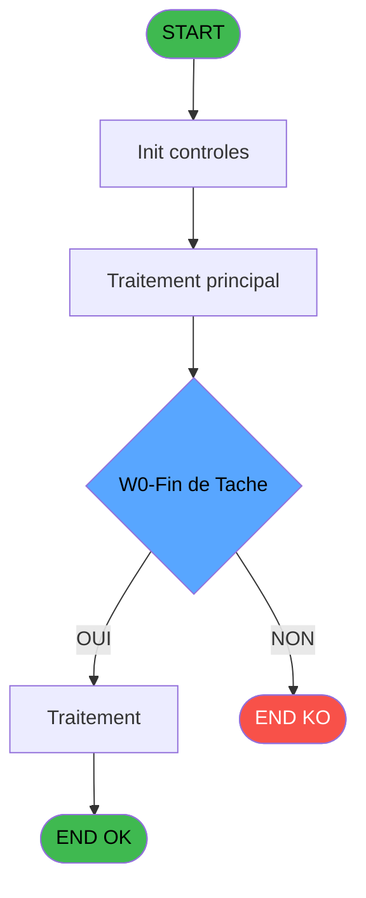

Review the generated code against the original specification.

Produce a JSON report:
```json
{
  "programId": 0,
  "programName": "",
  "coveragePct": 0,
  "rulesImplemented": 0,
  "rulesTotal": 0,
  "missingRules": [
    "rule descriptions not implemented"
  ],
  "recommendations": [
    "improvement suggestions"
  ]
}
```

Check:
1. Every business rule from the contract is implemented in the store
2. Every table from the contract has corresponding entity types
3. Every API endpoint is wired to the store
4. UI layout matches the spec description
5. Error handling is present for all actions

CONTRACT RULES:
[
  {
    "id": "RM-001",
    "description": "Condition: W0-Fin de Tache [D] egale 'F'",
    "condition": "W0-Fin de Tache [D]='F'",
    "variables": [
      "EQ"
    ],
    "status": "IMPL",
    "targetFile": "adh-web/src/stores/saisieContenuCaisseStore.ts",
    "gapNotes": ""
  }
]

SPEC EXCERPT:
# ADH IDE 84 - SP Caractères Interdits

> **Analyse**: Phases 1-4 2026-02-07 03:45 -> 02:20 (22h34min) | Assemblage 02:20
> **Pipeline**: V7.2 Enrichi
> **Structure**: 4 onglets (Resume | Ecrans | Donnees | Connexions)

<!-- TAB:Resume -->

## 1. FICHE D'IDENTITE

| Attribut | Valeur |
|----------|--------|
| Projet | ADH |
| IDE Position | 84 |
| Nom Programme | SP Caractères Interdits |
| Fichier source | `Prg_84.xml` |
| Dossier IDE | General |
| Taches | 2 (0 ecrans visibles) |
| Tables modifiees | 0 |
| Programmes appeles | 0 |
| Complexite | **BASSE** (score 0/100) |

## 2. DESCRIPTION FONCTIONNELLE

ADH IDE 84 - CARACT_INTERDIT est un utilitaire de validation de caractères interdits utilisé lors de la saisie de transactions commerciales. Le programme vérifie qu'une chaîne de caractères ne contient pas de caractères non autorisés ou invalides selon les règles métier de la caisse. Il est appelé principalement lors de la création de nouvelles ventes avec Gift Pass (IDE 237-240) et lors de la saisie manuelle de transactions (IDE 307, 310, 316).

Le programme expose une interface publique callable via `ProgIdx('CARACT_INTERDIT')` depuis d'autres modules. Il contient deux tâches principales : "Caractères Interdits" qui effectue la validation proprement dite en comparant la chaîne d'entrée contre une liste de caractères interdits, et "Vérification Chaîne" qui prépare ou post-traite les données de validation.

Ce programme fait partie de la composante ADH.ecf (Sessions_Reprises) et est partagé entre plusieurs projets. Il s'inscrit dans la couche de validation métier de la gestion de caisse, garantissant l'intégrité des données de transactions avant leur enregistrement dans la base de données.

## 3. BLOCS FONCTIONNELS

### 3.1 Traitement (1 tache)

Traitements internes.

---

#### <a id="t1"></a>84 - Caractères Interdits

**Role** : Traitement : Caractères Interdits.


### 3.2 Validation (1 tache)

Controles de coherence : 1 tache verifie les donnees et conditions.

---

#### <a id="t2"></a>84.1 - Verification Chaine

**Role** : Verification : Verification Chaine.


## 5. REGLES METIER

1 regles identifiees:

### Autres (1 regles)

#### <a id="rm-RM-001"></a>[RM-001] Condition: W0-Fin de Tache [D] egale 'F'

| Element | Detail |
|---------|--------|
| **Condition** | `W0-Fin de Tache [D]='F'` |
| **Si vrai** | Action si vrai |
| **Variables** | EQ (W0-Fin de Tache) |
| **Expression source** | Expression 2 : `W0-Fin de Tache [D]='F'` |
| **Exemple** | Si W0-Fin de Tache [D]='F' → Action si vrai |

## 6. CONTEXTE

- **Appele par**: [Transaction Nouv vente avec GP (IDE 237)](ADH-IDE-237.md), [Transaction Nouv vente PMS-584 (IDE 238)](ADH-IDE-238.md), [Transaction Nouv vente PMS-721 (IDE 239)](ADH-IDE-239.md), [Transaction Nouv vente PMS-710 (IDE 240)](ADH-IDE-240.md), [Saisie transaction 154  N.U (IDE 307)](ADH-IDE-307.md), [Saisie transaction Nouv vente (IDE 310)](ADH-IDE-310.md), [Saisie transaction Nouv vente (IDE 316)](ADH-IDE-316.md)
- **Appelle**: 0 programmes | **Tables**: 0 (W:0 R:0 L:0) | **Taches**: 2 | **Expressions**: 2

<!-- TAB:Ecrans -->

## 8. ECRANS

*(Programme sans ecran visible)*

## 9. NAVIGATION

### 9.3 Structure hierarchique (2 taches)

| Position | Tache | Type | Dimensions | Bloc |
|----------|-------|------|------------|------|
| **84.1** | [**Caractères Interdits** (84)](#t1) | MDI | - | Traitement |
| **84.2** | [**Verification Chaine** (84.1)](#t2) | MDI | - | Validation |

### 9.4 Algorigramme



> **Legende**: Vert = START/END OK | Rouge = END KO | Bleu = Decisions
> *Algorigramme auto-genere. Utiliser `/algorigramme` pour une synthese metier detaillee.*

<!-- TAB:Donnees -->

## 10. TABLES

### Tables utilisees (0)

| ID | Nom | Description | Type | R | W | L | Usages |
|----|-----|-------------|------|---|---|---|--------|

### Colonnes par table (0 / 0 tables avec colonnes identifiees)

## 11. VARIABLES

### 11.1 Autres (4)

Variables diverses.

| Lettre | Nom | Type | Usage dans |
|--------|-----|------|-----------|
| EN | P0-Code | Alpha | - |
| EO | P0-Accord Suite | Alpha | - |
| EP | P0-N/P | Alpha | - |
| EQ | W0-Fin de Tache | Alpha | 1x refs |

## 12. EXPRESSIONS

**2 / 2 expressions decodees (100%)**

### 12.1 Repartition par type

| Type | Expressions | Regles |
|------|-------------|--------|
| CONDITION | 1 | 5 |
| CONSTANTE | 1 | 0 |

### 12.2 Expressions cles par type

#### CONDITION (1 expressions)

| Type | IDE | Expression | Regle |
|------|-----|------------|-------|
| CONDITION 

GENERATED FILES:

--- types/characterValidation.ts ---
export interface ValidationResult {
  isValid: boolean;
  invalidCharacters: string;
  position: number | null;
}

export interface ValidateCharactersRequest {
  input: string;
}

export interface ValidateCharactersResponse {
  result: ValidationResult;
}

export interface CheckStringRequest {
  input: string;
  forbiddenChars: string[];
}

export interface CheckStringResponse {
  result: ValidationResult;
}

export interface ForbiddenCharactersResponse {
  characters: string[];
}

export interface CharacterValidationState {
  forbiddenCharacters: string[];
  lastValidationResult: ValidationResult | null;
  isValidating: boolean;
  error: string | null;
  validateCharacters: (input: string) => Promise<ValidationResult>;
  loadForbiddenCharacters: () => Promise<void>;
  checkString: (input: string, forbiddenChars: string[]) => ValidationResult;
  setError: (error: string | null) => void;
  setIsValidating: (isValidating: boolean) => void;
  reset: () => void;
}

--- stores/characterValidationStore.ts ---
import { create } from 'zustand';
import type {
  ValidationResult,
  ValidateCharactersRequest,
  ValidateCharactersResponse,
  CheckStringRequest,
  CheckStringResponse,
  ForbiddenCharactersResponse,
  CharacterValidationState,
} from '@/types/characterValidation';
import { apiClient } from '@/services/api/apiClient';
import type { ApiResponse } from '@/services/api/apiClient';
import { useDataSourceStore } from '@/stores/dataSourceStore';

const MOCK_FORBIDDEN_CHARS = [
  '@', '#', '$', '%', '&', '*', '<', '>', '|', '\\', '/', '?', '"', "'",
  '\n', '\r', '\t', '\0', '\x01', '\x02', '\x03',
];

const MOCK_VALIDATION_RESULTS: Record<string, ValidationResult> = {
  'test@email.com': {
    isValid: false,
    invalidCharacters: '@',
    position: 4,
  },
  'valid-name': {
    isValid: true,
    invalidCharacters: '',
    position: null,
  },
  'special$char%here': {
    isValid: false,
    invalidCharacters: '$%',
    position: 7,
  },
};

const initialState = {
  forbiddenCharacters: [],
  lastValidationResult: null,
  isValidating: false,
  error: null,
};

export const useCharacterValidationStore = create<CharacterValidationState>()((set, get) => ({
  ...initialState,

  validateCharacters: async (input: string): Promise<ValidationResult> => {
    const { isRealApi } = useDataSourceStore.getState();
    set({ isValidating: true, error: null });

    if (!isRealApi) {
      const mockResult = MOCK_VALIDATION_RESULTS[input] || {
        isValid: true,
        invalidCharacters: '',
        position: null,
      };
      set({ lastValidationResult: mockResult, isValidating: false });
      return mockResult;
    }

    try {
      const response = await apiClient.post<ApiResponse<ValidateCharactersResponse>>(
        '/api/validation/check-string',
        { input } as ValidateCharactersRequest,
      );
      const result = response.data.data?.result || {
        isValid: true,
        invalidCharacters: '',
        position: null,
      };
      set({ lastValidat

--- services/api/endpoints-characterValidation.ts ---
import { apiClient, type ApiResponse } from "./apiClient";
import type {
  ValidationResult,
  ValidateCharactersRequest,
  ValidateCharactersResponse,
  CheckStringRequest,
  CheckStringResponse,
  ForbiddenCharactersResponse,
} from "@/types/characterValidation";

export const characterValidationApi = {
  getForbiddenCharacters: () =>
    apiClient.get<ApiResponse<ForbiddenCharactersResponse>>(
      "/api/validation/forbidden-characters",
    ),

  checkString: (data: CheckStringRequest) =>
    apiClient.post<ApiResponse<CheckStringResponse>>(
      "/api/validation/check-string",
      data,
    ),

  validateCharacters: (input: string) =>
    apiClient.post<ApiResponse<ValidateCharactersResponse>>(
      "/api/validation/check-string",
      { input } as CheckStringRequest,
    ),
};

--- pages/CharacterValidationPage.tsx ---
import { useState, useEffect, useCallback } from 'react';
import { useNavigate } from 'react-router-dom';
import { ScreenLayout } from '@/components/layout';
import { Button, Input, Dialog } from '@/components/ui';
import { useCharacterValidationStore } from '@/stores/characterValidationStore';
import { useAuthStore } from '@/stores';
import { cn } from '@/lib/utils';

export function CharacterValidationPage() {
  const navigate = useNavigate();
  const user = useAuthStore((s) => s.user);

  const forbiddenCharacters = useCharacterValidationStore((s) => s.forbiddenCharacters);
  const lastValidationResult = useCharacterValidationStore((s) => s.lastValidationResult);
  const isValidating = useCharacterValidationStore((s) => s.isValidating);
  const error = useCharacterValidationStore((s) => s.error);
  const validateCharacters = useCharacterValidationStore((s) => s.validateCharacters);
  const loadForbiddenCharacters = useCharacterValidationStore((s) => s.loadForbiddenCharacters);
  const checkString = useCharacterValidationStore((s) => s.checkString);
  const setError = useCharacterValidationStore((s) => s.setError);
  const setIsValidating = useCharacterValidationStore((s) => s.setIsValidating);
  const reset = useCharacterValidationStore((s) => s.reset);

  const [inputValue, setInputValue] = useState('');
  const [showCharListDialog, setShowCharListDialog] = useState(false);
  const [newChar, setNewChar] = useState('');
  const [localForbiddenChars, setLocalForbiddenChars] = useState<string[]>([]);

  useEffect(() => {
    loadForbiddenCharacters();
    return () => reset();
  }, [loadForbiddenCharacters, reset]);

  useEffect(() => {
    setLocalForbiddenChars(forbiddenCharacters);
  }, [forbiddenCharacters]);

  const handleValidate = useCallback(async () => {
    if (!inputValue.trim()) {
      setError('Veuillez saisir un texte à valider');
      return;
    }
    await validateCharacters(inputValue);
  }, [inputValue, validateCharacters, setError]);

  const

--- components/caisse/characterValidation/ForbiddenCharsListPanel.tsx ---
import type { FC } from 'react';
import { cn } from '@/lib/utils';
import { Button } from '@/components/ui';

interface ForbiddenCharsListPanelProps {
  characters: string[];
  onAdd: () => void;
  onRemove: (char: string) => void;
  className?: string;
}

export const ForbiddenCharsListPanel: FC<ForbiddenCharsListPanelProps> = ({
  characters,
  onAdd,
  onRemove,
  className,
}) => {
  return (
    <div className={cn('flex flex-col gap-4', className)}>
      <div className='flex items-center justify-between'>
        <h3 className='text-sm font-medium text-gray-700'>
          Caractères interdits
        </h3>
        <Button
          size='sm'
          onClick={onAdd}
          className='bg-blue-500 hover:bg-blue-600 text-white'
        >
          Ajouter
        </Button>
      </div>

      <div className='border border-gray-300 rounded-md overflow-hidden'>
        {characters.length === 0 ? (
          <div className='p-8 text-center text-gray-500 text-sm'>
            Aucun caractère interdit configuré
          </div>
        ) : (
          <div className='max-h-96 overflow-y-auto'>
            <table className='w-full text-sm'>
              <thead className='bg-gray-50 border-b border-gray-300'>
                <tr>
                  <th className='px-4 py-2 text-left font-medium text-gray-700'>
                    Caractère
                  </th>
                  <th className='px-4 py-2 text-left font-medium text-gray-700'>
                    Code ASCII
                  </th>
                  <th className='px-4 py-2 text-right font-medium text-gray-700'>
                    Actions
                  </th>
                </tr>
              </thead>
              <tbody className='divide-y divide-gray-200'>
                {characters.map((char, index) => (
                  <tr
                    key={`${char}-${index}`}
                    className='hover:bg-gray-50 transition-colors'
                  >
                    <td className=

--- components/caisse/characterValidation/ValidationInputPanel.tsx ---
import { useState, useCallback } from 'react';
import { Button, Input } from '@/components/ui';
import { useCharacterValidationStore } from '@/stores/characterValidationStore';
import { cn } from '@/lib/utils';

interface ValidationInputPanelProps {
  className?: string;
}

export const ValidationInputPanel = ({ className }: ValidationInputPanelProps) => {
  const [inputValue, setInputValue] = useState('');
  
  const validateCharacters = useCharacterValidationStore((s) => s.validateCharacters);
  const lastValidationResult = useCharacterValidationStore((s) => s.lastValidationResult);
  const isValidating = useCharacterValidationStore((s) => s.isValidating);
  const error = useCharacterValidationStore((s) => s.error);
  const setError = useCharacterValidationStore((s) => s.setError);

  const handleValidate = useCallback(async () => {
    if (!inputValue.trim()) {
      setError('Veuillez saisir un texte à valider');
      return;
    }
    await validateCharacters(inputValue);
  }, [inputValue, validateCharacters, setError]);

  const handleKeyPress = useCallback((e: React.KeyboardEvent<HTMLInputElement>) => {
    if (e.key === 'Enter' && !isValidating) {
      handleValidate();
    }
  }, [handleValidate, isValidating]);

  return (
    <div className={cn('flex flex-col gap-4', className)}>
      <div className="flex flex-col gap-2">
        <label htmlFor="validation-input" className="text-sm font-medium text-gray-700">
          Texte à valider
        </label>
        <Input
          id="validation-input"
          type="text"
          value={inputValue}
          onChange={(e) => setInputValue(e.target.value)}
          onKeyPress={handleKeyPress}
          placeholder="Saisissez le texte à vérifier"
          disabled={isValidating}
          className="w-full"
        />
      </div>

      <div>
        <Button
          onClick={handleValidate}
          disabled={isValidating || !inputValue.trim()}
          className="w-full sm:w-auto"
        >
      

--- components/caisse/characterValidation/ValidationResultPanel.tsx ---
import { cn } from '@/lib/utils';
import type { ValidationResult } from '@/types/characterValidation';

interface ValidationResultPanelProps {
  result: ValidationResult | null;
  className?: string;
}

export const ValidationResultPanel = ({ result, className }: ValidationResultPanelProps) => {
  if (!result) {
    return (
      <div
        className={cn(
          'rounded-lg border border-gray-200 bg-gray-50 p-6 text-center',
          className
        )}
      >
        <p className="text-sm text-gray-500">
          Aucun résultat de validation disponible
        </p>
      </div>
    );
  }

  const { isValid, invalidCharacters, position } = result;

  return (
    <div
      className={cn(
        'rounded-lg border p-6',
        isValid
          ? 'border-green-200 bg-green-50'
          : 'border-red-200 bg-red-50',
        className
      )}
    >
      <div className="flex items-start gap-4">
        <div className="flex-shrink-0">
          {isValid ? (
            <svg
              className="h-8 w-8 text-green-600"
              fill="none"
              viewBox="0 0 24 24"
              stroke="currentColor"
            >
              <path
                strokeLinecap="round"
                strokeLinejoin="round"
                strokeWidth={2}
                d="M9 12l2 2 4-4m6 2a9 9 0 11-18 0 9 9 0 0118 0z"
              />
            </svg>
          ) : (
            <svg
              className="h-8 w-8 text-red-600"
              fill="none"
              viewBox="0 0 24 24"
              stroke="currentColor"
            >
              <path
                strokeLinecap="round"
                strokeLinejoin="round"
                strokeWidth={2}
                d="M10 14l2-2m0 0l2-2m-2 2l-2-2m2 2l2 2m7-2a9 9 0 11-18 0 9 9 0 0118 0z"
              />
            </svg>
          )}
        </div>

        <div className="flex-1 space-y-3">
          <div>
            <h3
              className={cn(
                'text-lg font-se