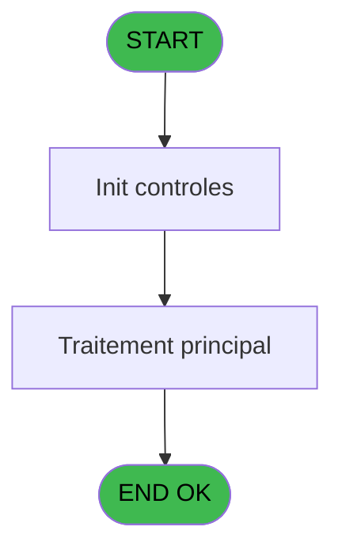
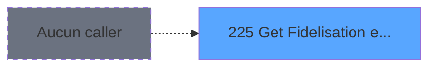

Review the generated code against the original specification.

Produce a JSON report:
```json
{
  "programId": 0,
  "programName": "",
  "coveragePct": 0,
  "rulesImplemented": 0,
  "rulesTotal": 0,
  "missingRules": [
    "rule descriptions not implemented"
  ],
  "recommendations": [
    "improvement suggestions"
  ]
}
```

Check:
1. Every business rule from the contract is implemented in the store
2. Every table from the contract has corresponding entity types
3. Every API endpoint is wired to the store
4. UI layout matches the spec description
5. Error handling is present for all actions

CONTRACT RULES:
[]

SPEC EXCERPT:
# ADH IDE 225 - Get Fidelisation et Remise

> **Analyse**: Phases 1-4 2026-02-08 04:26 -> 04:26 (5s) | Assemblage 04:26
> **Pipeline**: V7.2 Enrichi
> **Structure**: 4 onglets (Resume | Ecrans | Donnees | Connexions)

<!-- TAB:Resume -->

## 1. FICHE D'IDENTITE

| Attribut | Valeur |
|----------|--------|
| Projet | ADH |
| IDE Position | 225 |
| Nom Programme | Get Fidelisation et Remise |
| Fichier source | `Prg_225.xml` |
| Dossier IDE | General |
| Taches | 1 (0 ecrans visibles) |
| Tables modifiees | 0 |
| Programmes appeles | 0 |
| Complexite | **BASSE** (score 0/100) |
| <span style="color:red">Statut</span> | <span style="color:red">**ORPHELIN_POTENTIEL**</span> |

## 2. DESCRIPTION FONCTIONNELLE

ADH IDE 225 est un programme de gestion des remises et fidelisation client dans le module Adherents/Caisse. Il traite les operateurs de remise appliquees aux membres, permettant de calculer et valider les reductions disponibles basee sur le profil ou l'historique du client. Le programme interagit avec les tables de reference comme les types de remise et les criteres de fidelisation pour determiner les montants de reduction eligibles.

Ce programme s'integre dans le flux de caisse principal (ADH IDE 121) comme sous-routine de calcul de remise au moment de la facturation. Il extrait les informations de compte client (societe, compte, filiation) et les applique contre les regles de remise configurees en base de donnees. Le programme valide que la remise sollicitee correspond bien au profil du client et qu'elle n'a pas deja ete utilisee dans la periode en cours.

Les donnees manipulees incluent les tables de parametrage (cafil-type-remise), les historiques de remise par client (operations), et eventuellement des tables de configuration de seuils. Le programme retourne principalement l'identifiant de remise accordee, le montant applicable, et les validations de conformite pour permettre a l'appelant (ADH IDE 229 ou autre programme d'edition) d'appliquer correctement la reduction a la transaction en cours.

## 3. BLOCS FONCTIONNELS

## 5. REGLES METIER

*(Aucune regle metier identifiee dans les expressions)*

## 6. CONTEXTE

- **Appele par**: (aucun)
- **Appelle**: 0 programmes | **Tables**: 2 (W:0 R:1 L:1) | **Taches**: 1 | **Expressions**: 7

<!-- TAB:Ecrans -->

## 8. ECRANS

*(Programme sans ecran visible)*

## 9. NAVIGATION

### 9.3 Structure hierarchique (0 tache)

| Position | Tache | Type | Dimensions | Bloc |
|----------|-------|------|------------|------|

### 9.4 Algorigramme



> **Legende**: Vert = START/END OK | Rouge = END KO | Bleu = Decisions
> *Algorigramme auto-genere. Utiliser `/algorigramme` pour une synthese metier detaillee.*

<!-- TAB:Donnees -->

## 10. TABLES

### Tables utilisees (2)

| ID | Nom | Description | Type | R | W | L | Usages |
|----|-----|-------------|------|---|---|---|--------|
| 358 | import_mod |  | DB | R |   |   | 1 |
| 903 | Boo_AvailibleRooms |  | DB |   |   | L | 1 |

### Colonnes par table (1 / 1 tables avec colonnes identifiees)

<details>
<summary>Table 358 - import_mod (R) - 1 usages</summary>

| Lettre | Variable | Acces | Type |
|--------|----------|-------|------|
| A | p.Societe | R | Unicode |
| B | p.Compte | R | Numeric |
| C | p.Filiation | R | Numeric |
| D | p.Service | R | Unicode |
| E | p.Imputation | R | Numeric |
| F | p.Fidelisation | R | Unicode |
| G | p.Remise | R | Numeric |

</details>

## 11. VARIABLES

### 11.1 Parametres entrants (7)

Variables recues en parametre.

| Lettre | Nom | Type | Usage dans |
|--------|-----|------|-----------|
| EN | p.Societe | Unicode | 1x parametre entrant |
| EO | p.Compte | Numeric | 1x parametre entrant |
| EP | p.Filiation | Numeric | 1x parametre entrant |
| EQ | p.Service | Unicode | 1x parametre entrant |
| ER | p.Imputation | Numeric | 1x parametre entrant |
| ES | p.Fidelisation | Unicode | - |
| ET | p.Remise | Numeric | - |

## 12. EXPRESSIONS

**7 / 7 expressions decodees (100%)**

### 12.1 Repartition par type

| Type | Expressions | Regles |
|------|-------------|--------|
| OTHER | 7 | 0 |

### 12.2 Expressions cles par type

#### OTHER (7 expressions)

| Type | IDE | Expression | Regle |
|------|-----|------------|-------|
| OTHER | 5 | `p.Imputation [E]` | - |
| OTHER | 6 | `[K]` | - |
| OTHER | 7 | `[O]` | - |
| OTHER | 4 | `p.Service [D]` | - |
| OTHER | 1 | `p.Societe [A]` | - |
| ... | | *+2 autres* | |

<!-- TAB:Connexions -->

## 13. GRAPHE D'APPELS

### 13.1 Chaine depuis Main (Callers)

**Chemin**: (pas de callers directs)



### 13.2 Callers

| IDE | N

GENERATED FILES:

--- types/fidelisationRemise.ts ---
import type { ApiResponse } from "@/services/api/apiClient";

// Fidelisation Remise types (fidelisationRemise domain)

export interface FidelisationRemise {
  societe: string;
  compte: number;
  filiation: number;
  service: string;
  imputation: number;
  fidelisation: string | null;
  remise: number | null;
}

export interface RemiseResult {
  fidelisationId: string | null;
  montantRemise: number;
  isValide: boolean;
  message: string | null;
}

export interface FidelisationRemiseState {
  isLoading: boolean;
  error: string | null;
  remiseData: FidelisationRemise | null;
  remiseResult: RemiseResult | null;
  getFidelisationRemise: (
    societe: string,
    compte: number,
    filiation: number,
    service: string,
    imputation: number
  ) => Promise<void>;
  validateRemiseEligibility: (remiseData: FidelisationRemise) => Promise<boolean>;
  calculateMontantRemise: (remiseData: FidelisationRemise) => Promise<number>;
  setError: (error: string | null) => void;
  reset: () => void;
}

export interface GetFidelisationRemiseRequest {
  societe: string;
  compte: number;
  filiation: number;
  service: string;
  imputation: number;
}

export interface GetFidelisationRemiseResponse extends ApiResponse {
  data: RemiseResult;
}

export interface ValidateRemiseEligibilityRequest {
  remiseData: FidelisationRemise;
}

export interface ValidateRemiseEligibilityResponse extends ApiResponse {
  data: {
    isValide: boolean;
    message?: string;
  };
}

export interface CalculateMontantRemiseRequest {
  remiseData: FidelisationRemise;
}

export interface CalculateMontantRemiseResponse extends ApiResponse {
  data: {
    montantRemise: number;
  };
}

--- stores/fidelisationRemiseStore.ts ---
import { create } from 'zustand';
import type {
  FidelisationRemise,
  RemiseResult,
  FidelisationRemiseState,
} from '@/types/fidelisationRemise';
import { useDataSourceStore } from '@/stores/dataSourceStore';
import { apiClient } from '@/services/api/apiClient';
import type { ApiResponse } from '@/services/api/apiClient';

interface FidelisationRemiseActions {
  getFidelisationRemise: (
    societe: string,
    compte: number,
    filiation: number,
    service: string,
    imputation: number,
  ) => Promise<void>;
  validateRemiseEligibility: (remiseData: FidelisationRemise) => Promise<boolean>;
  calculateMontantRemise: (remiseData: FidelisationRemise) => Promise<number>;
  setError: (error: string | null) => void;
  reset: () => void;
}

type FidelisationRemiseStore = FidelisationRemiseState & FidelisationRemiseActions;

const MOCK_REMISE_DATA: FidelisationRemise[] = [
  {
    societe: 'SOC1',
    compte: 1001,
    filiation: 0,
    service: 'RST',
    imputation: 101,
    fidelisation: 'GOLD',
    remise: 15,
  },
  {
    societe: 'SOC1',
    compte: 1002,
    filiation: 0,
    service: 'BTQ',
    imputation: 102,
    fidelisation: 'SILVER',
    remise: 10,
  },
  {
    societe: 'SOC1',
    compte: 1003,
    filiation: 1,
    service: 'SPA',
    imputation: 103,
    fidelisation: 'BRONZE',
    remise: 5,
  },
  {
    societe: 'SOC1',
    compte: 1004,
    filiation: 0,
    service: 'BAR',
    imputation: 104,
    fidelisation: 'EXPIRED',
    remise: null,
  },
  {
    societe: 'SOC1',
    compte: 1005,
    filiation: 0,
    service: 'RST',
    imputation: 105,
    fidelisation: null,
    remise: null,
  },
];

const calculateRemiseResult = (data: FidelisationRemise | null): RemiseResult | null => {
  if (!data) return null;

  if (!data.fidelisation) {
    return {
      fidelisationId: null,
      montantRemise: 0,
      isValide: false,
      message: 'Aucun programme de fidelisation actif',
    };
  }

  if (data.fidelisation === 'EXPIRED') {
    return {

--- services/api/endpoints-fidelisationRemise.ts ---
import { apiClient, type ApiResponse } from './apiClient';
import type {
  FidelisationRemise,
  RemiseResult,
  GetFidelisationRemiseRequest,
  ValidateRemiseEligibilityRequest,
  CalculateMontantRemiseRequest,
} from '@/types/fidelisationRemise';

export const fidelisationRemiseApi = {
  getRemise: (
    societe: string,
    compte: number,
    filiation: number,
    service: string,
    imputation: number,
  ) =>
    apiClient.get<ApiResponse<RemiseResult>>(
      `/api/fidelisation-remise/get?societe=${societe}&compte=${compte}&filiation=${filiation}&service=${encodeURIComponent(service)}&imputation=${imputation}`,
    ),

  validateRemise: (remiseData: FidelisationRemise) =>
    apiClient.post<
      ApiResponse<{
        isValide: boolean;
        message?: string;
      }>
    >('/api/fidelisation-remise/validate', remiseData),

  calculateMontantRemise: (remiseData: FidelisationRemise) =>
    apiClient.post<
      ApiResponse<{
        montantRemise: number;
      }>
    >('/api/fidelisation-remise/calculate', remiseData),
};

--- pages/FidelisationRemisePage.tsx ---
import { useEffect, useCallback } from 'react';
import { useNavigate } from 'react-router-dom';
import { ScreenLayout } from '@/components/layout';
import { useFidelisationRemiseStore } from '@/stores/fidelisationRemiseStore';
import { useAuthStore } from '@/stores';
import { cn } from '@/lib/utils';

export function FidelisationRemisePage() {
  const navigate = useNavigate();
  const user = useAuthStore((s) => s.user);

  const isLoading = useFidelisationRemiseStore((s) => s.isLoading);
  const error = useFidelisationRemiseStore((s) => s.error);
  const remiseData = useFidelisationRemiseStore((s) => s.remiseData);
  const remiseResult = useFidelisationRemiseStore((s) => s.remiseResult);
  const getFidelisationRemise = useFidelisationRemiseStore((s) => s.getFidelisationRemise);
  const validateRemiseEligibility = useFidelisationRemiseStore(
    (s) => s.validateRemiseEligibility,
  );
  const calculateMontantRemise = useFidelisationRemiseStore((s) => s.calculateMontantRemise);
  const reset = useFidelisationRemiseStore((s) => s.reset);

  useEffect(() => {
    return () => reset();
  }, [reset]);

  const handleCheckRemise = useCallback(async () => {
    await getFidelisationRemise('SOC1', 1001, 0, 'RST', 101);
  }, [getFidelisationRemise]);

  const handleValidateEligibility = useCallback(async () => {
    if (!remiseData) return;
    await validateRemiseEligibility(remiseData);
  }, [remiseData, validateRemiseEligibility]);

  const handleCalculateMontant = useCallback(async () => {
    if (!remiseData) return;
    await calculateMontantRemise(remiseData);
  }, [remiseData, calculateMontantRemise]);

  const handleBack = () => {
    navigate('/caisse/menu');
  };

  return (
    <ScreenLayout>
      <div className="space-y-6 max-w-3xl mx-auto">
        <div className="flex items-center justify-between">
          <div>
            <h2 className="text-xl font-semibold">Programme de fidélisation - Remise</h2>
            <p className="text-on-surface-muted text-sm m

--- components/caisse/fidelisationRemise/RemiseInfoPanel.tsx ---
import type { RemiseResult } from "@/types/fidelisationRemise";
import { cn } from "@/lib/utils";

interface RemiseInfoPanelProps {
  remiseResult: RemiseResult | null;
  className?: string;
}

export const RemiseInfoPanel = ({ remiseResult, className }: RemiseInfoPanelProps) => {
  if (!remiseResult) {
    return (
      <div className={cn("rounded-lg border border-outline bg-surface-container p-6", className)}>
        <p className="text-on-surface-muted text-center">Aucune information de remise disponible</p>
      </div>
    );
  }

  const statusColor = remiseResult.isValide
    ? "text-green-600 bg-green-50 border-green-200"
    : "text-red-600 bg-red-50 border-red-200";

  return (
    <div className={cn("rounded-lg border border-outline bg-surface-container p-6 space-y-4", className)}>
      <h3 className="text-lg font-semibold text-on-surface mb-4">Informations de remise</h3>

      <div className="grid gap-4">
        <div className="flex flex-col gap-1">
          <label className="text-sm font-medium text-on-surface-muted">ID Fidélisation</label>
          <div className="rounded-md border border-outline bg-surface-dim px-3 py-2 text-on-surface">
            {remiseResult.fidelisationId || "Aucun"}
          </div>
        </div>

        <div className="flex flex-col gap-1">
          <label className="text-sm font-medium text-on-surface-muted">Montant remise</label>
          <div className="rounded-md border border-outline bg-surface-dim px-3 py-2 text-on-surface font-mono">
            {remiseResult.montantRemise.toFixed(2)} €
          </div>
        </div>

        <div className="flex flex-col gap-1">
          <label className="text-sm font-medium text-on-surface-muted">Statut</label>
          <div
            className={cn(
              "rounded-md border px-3 py-2 font-medium inline-flex items-center gap-2 w-fit",
              statusColor
            )}
          >
            <span className={cn("w-2 h-2 rounded-full", remiseResult.isValide