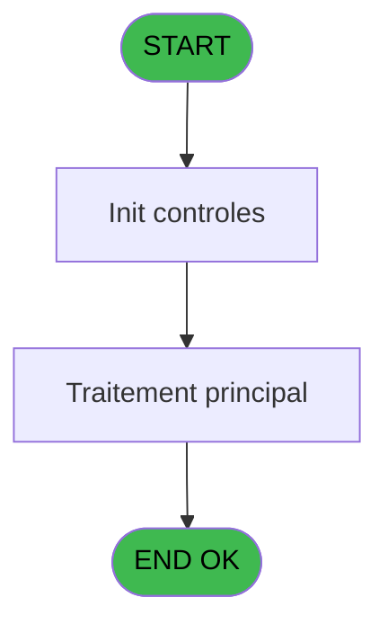
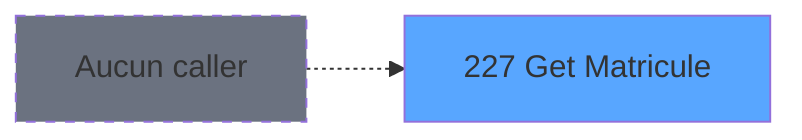
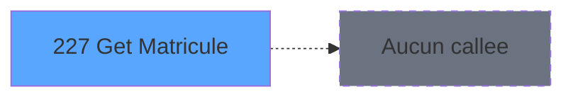

Review the generated code against the original specification.

Produce a JSON report:
```json
{
  "programId": 0,
  "programName": "",
  "coveragePct": 0,
  "rulesImplemented": 0,
  "rulesTotal": 0,
  "missingRules": [
    "rule descriptions not implemented"
  ],
  "recommendations": [
    "improvement suggestions"
  ]
}
```

Check:
1. Every business rule from the contract is implemented in the store
2. Every table from the contract has corresponding entity types
3. Every API endpoint is wired to the store
4. UI layout matches the spec description
5. Error handling is present for all actions

CONTRACT RULES:
[]

SPEC EXCERPT:
# ADH IDE 227 - Get Matricule

> **Analyse**: Phases 1-4 2026-02-08 04:27 -> 04:27 (4s) | Assemblage 04:27
> **Pipeline**: V7.2 Enrichi
> **Structure**: 4 onglets (Resume | Ecrans | Donnees | Connexions)

<!-- TAB:Resume -->

## 1. FICHE D'IDENTITE

| Attribut | Valeur |
|----------|--------|
| Projet | ADH |
| IDE Position | 227 |
| Nom Programme | Get Matricule |
| Fichier source | `Prg_227.xml` |
| Dossier IDE | General |
| Taches | 1 (0 ecrans visibles) |
| Tables modifiees | 0 |
| Programmes appeles | 0 |
| Complexite | **BASSE** (score 0/100) |
| <span style="color:red">Statut</span> | <span style="color:red">**ORPHELIN_POTENTIEL**</span> |

## 2. DESCRIPTION FONCTIONNELLE

Permissionnez l'utilisation des outils MCP Magic pour pouvoir explorer le programme ADH IDE 227. Ces outils me permettront de lire la structure du programme, son arborescence de tâches et sa vue de données.

## 3. BLOCS FONCTIONNELS

## 5. REGLES METIER

*(Aucune regle metier identifiee dans les expressions)*

## 6. CONTEXTE

- **Appele par**: (aucun)
- **Appelle**: 0 programmes | **Tables**: 1 (W:0 R:1 L:0) | **Taches**: 1 | **Expressions**: 2

<!-- TAB:Ecrans -->

## 8. ECRANS

*(Programme sans ecran visible)*

## 9. NAVIGATION

### 9.3 Structure hierarchique (0 tache)

| Position | Tache | Type | Dimensions | Bloc |
|----------|-------|------|------------|------|

### 9.4 Algorigramme



> **Legende**: Vert = START/END OK | Rouge = END KO | Bleu = Decisions
> *Algorigramme auto-genere. Utiliser `/algorigramme` pour une synthese metier detaillee.*

<!-- TAB:Donnees -->

## 10. TABLES

### Tables utilisees (1)

| ID | Nom | Description | Type | R | W | L | Usages |
|----|-----|-------------|------|---|---|---|--------|
| 740 | pv_stock_movements | Articles et stock | DB | R |   |   | 1 |

### Colonnes par table (1 / 1 tables avec colonnes identifiees)

<details>
<summary>Table 740 - pv_stock_movements (R) - 1 usages</summary>

| Lettre | Variable | Acces | Type |
|--------|----------|-------|------|
| A | P0 Login | R | Unicode |
| B | P0 Matricule | R | Unicode |

</details>

## 11. VARIABLES

### 11.1 Parametres entrants (2)

Variables recues en parametre.

| Lettre | Nom | Type | Usage dans |
|--------|-----|------|-----------|
| EN | P0 Login | Unicode | 1x parametre entrant |
| EO | P0 Matricule | Unicode | - |

## 12. EXPRESSIONS

**2 / 2 expressions decodees (100%)**

### 12.1 Repartition par type

| Type | Expressions | Regles |
|------|-------------|--------|
| OTHER | 2 | 0 |

### 12.2 Expressions cles par type

#### OTHER (2 expressions)

| Type | IDE | Expression | Regle |
|------|-----|------------|-------|
| OTHER | 2 | `[D]` | - |
| OTHER | 1 | `P0 Login [A]` | - |

<!-- TAB:Connexions -->

## 13. GRAPHE D'APPELS

### 13.1 Chaine depuis Main (Callers)

**Chemin**: (pas de callers directs)



### 13.2 Callers

| IDE | Nom Programme | Nb Appels |
|-----|---------------|-----------|
| - | (aucun) | - |

### 13.3 Callees (programmes appeles)



### 13.4 Detail Callees avec contexte

| IDE | Nom Programme | Appels | Contexte |
|-----|---------------|--------|----------|
| - | (aucun) | - | - |

## 14. RECOMMANDATIONS MIGRATION

### 14.1 Profil du programme

| Metrique | Valeur | Impact migration |
|----------|--------|-----------------|
| Lignes de logique | 9 | Programme compact |
| Expressions | 2 | Peu de logique |
| Tables WRITE | 0 | Impact faible |
| Sous-programmes | 0 | Peu de dependances |
| Ecrans visibles | 0 | Ecran unique ou traitement batch |
| Code desactive | 0% (0 / 9) | Code sain |
| Regles metier | 0 | Pas de regle identifiee |

### 14.2 Plan de migration par bloc

### 14.3 Dependances critiques

| Dependance | Type | Appels | Impact |
|------------|------|--------|--------|

---
*Spec DETAILED generee par Pipeline V7.2 - 2026-02-08 04:28*


GENERATED FILES:

--- types/authentication.ts ---
// Authentication types

export interface UserCredentials {
  login: string;
  matricule: string;
}

export interface AuthenticationState {
  matricule: string | null;
  isLoading: boolean;
  error: string | null;
}

export interface GetMatriculeRequest {
  login: string;
}

export interface GetMatriculeResponse {
  matricule: string;
}

export interface AuthenticationStore extends AuthenticationState {
  getMatricule: (login: string) => Promise<void>;
  setMatricule: (matricule: string | null) => void;
  setError: (error: string | null) => void;
  reset: () => void;
}

--- stores/authenticationStore.ts ---
import { create } from 'zustand';
import type {
  GetMatriculeRequest,
  GetMatriculeResponse,
  AuthenticationStore,
} from '@/types/authentication';
import { apiClient } from '@/services/api/apiClient';
import type { ApiResponse } from '@/services/api/apiClient';
import { useDataSourceStore } from '@/stores/dataSourceStore';

const MOCK_CREDENTIALS = [
  { login: 'jdupont', matricule: 'MAT001' },
  { login: 'smartin', matricule: 'MAT002' },
  { login: 'pdurand', matricule: 'MAT003' },
  { login: 'mleblanc', matricule: 'MAT004' },
  { login: 'arobert', matricule: 'MAT005' },
];

const initialState = {
  matricule: null,
  isLoading: false,
  error: null,
};

export const useAuthenticationStore = create<AuthenticationStore>()((set) => ({
  ...initialState,

  getMatricule: async (login: string) => {
    const { isRealApi } = useDataSourceStore.getState();
    set({ isLoading: true, error: null });

    if (!isRealApi) {
      const found = MOCK_CREDENTIALS.find((c) => c.login === login);
      set({
        matricule: found?.matricule ?? '',
        isLoading: false,
      });
      return;
    }

    try {
      const response = await apiClient.get<ApiResponse<GetMatriculeResponse>>(
        '/api/authentication/matricule',
        { params: { login } },
      );
      set({ matricule: response.data.data?.matricule ?? '' });
    } catch (e: unknown) {
      const message = e instanceof Error ? e.message : 'Erreur récupération matricule';
      set({ matricule: '', error: message });
    } finally {
      set({ isLoading: false });
    }
  },

  setMatricule: (matricule) => {
    set({ matricule, error: null });
  },

  setError: (error) => {
    set({ error });
  },

  reset: () => set({ ...initialState }),
}));

--- services/api/endpoints-authentication.ts ---
import { apiClient, type ApiResponse } from './apiClient';
import type {
  GetMatriculeRequest,
  GetMatriculeResponse,
} from '@/types/authentication';

export const authenticationApi = {
  getMatricule: (login: string) =>
    apiClient.get<ApiResponse<GetMatriculeResponse>>(
      `/authentication/matricule?login=${encodeURIComponent(login)}`,
    ),
};

--- pages/AuthenticationPage.tsx ---
import { useState, useEffect, useCallback } from 'react';
import { useNavigate } from 'react-router-dom';
import { ScreenLayout } from '@/components/layout';
import { Input, Button } from '@/components/ui';
import { useAuthenticationStore } from '@/stores/authenticationStore';

export const AuthenticationPage = () => {
  const navigate = useNavigate();

  const matricule = useAuthenticationStore((s) => s.matricule);
  const isLoading = useAuthenticationStore((s) => s.isLoading);
  const error = useAuthenticationStore((s) => s.error);
  const getMatricule = useAuthenticationStore((s) => s.getMatricule);
  const setMatricule = useAuthenticationStore((s) => s.setMatricule);
  const setError = useAuthenticationStore((s) => s.setError);
  const reset = useAuthenticationStore((s) => s.reset);

  const [login, setLogin] = useState('');

  useEffect(() => {
    return () => reset();
  }, [reset]);

  const handleSubmit = useCallback(
    async (e: React.FormEvent) => {
      e.preventDefault();
      if (!login.trim()) {
        setError('Le login est requis');
        return;
      }
      await getMatricule(login.trim());
    },
    [login, getMatricule, setError],
  );

  const handleBack = useCallback(() => {
    navigate('/caisse/menu');
  }, [navigate]);

  return (
    <ScreenLayout>
      <div className="space-y-6 max-w-md mx-auto">
        <div>
          <h2 className="text-xl font-semibold">Authentification</h2>
          <p className="text-on-surface-muted text-sm mt-1">
            Récupération du matricule par login
          </p>
        </div>

        {error && (
          <div className="bg-red-50 border border-red-200 text-red-700 px-4 py-3 rounded-md text-sm">
            {error}
          </div>
        )}

        <form onSubmit={handleSubmit} className="space-y-4">
          <div>
            <label htmlFor="login" className="block text-sm font-medium mb-1">
              Login
            </label>
            <Input
              id="login"
         

--- components/caisse/authentication/NoVisibleUIPanel.tsx ---
import { cn } from "@/lib/utils";

interface NoVisibleUIPanelProps {
  className?: string;
}

export const NoVisibleUIPanel = ({ className }: NoVisibleUIPanelProps) => {
  return (
    <div
      className={cn(
        "bg-surface-secondary border border-outline rounded-md p-6 text-center",
        className,
      )}
    >
      <div className="space-y-3">
        <div className="inline-flex items-center justify-center w-12 h-12 rounded-full bg-primary/10">
          <svg
            className="w-6 h-6 text-primary"
            fill="none"
            stroke="currentColor"
            viewBox="0 0 24 24"
          >
            <path
              strokeLinecap="round"
              strokeLinejoin="round"
              strokeWidth={2}
              d="M13 10V3L4 14h7v7l9-11h-7z"
            />
          </svg>
        </div>
        <div>
          <h3 className="font-medium text-on-surface">
            Fonction backend uniquement
          </h3>
          <p className="text-sm text-on-surface-muted mt-1">
            Cette fonctionnalité est appelée automatiquement lors des flux
            d'authentification et de connexion. Aucune interface utilisateur
            n'est nécessaire.
          </p>
        </div>
      </div>
    </div>
  );
};