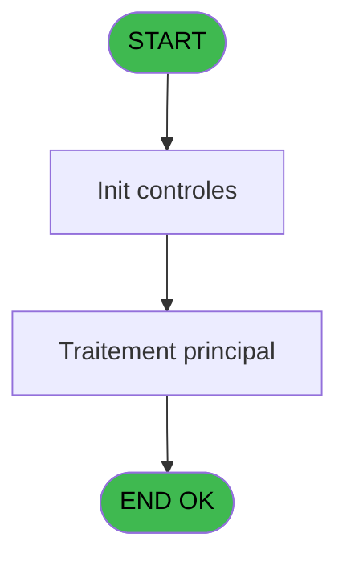
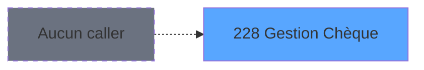
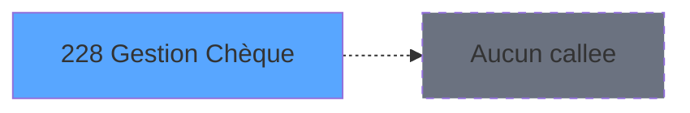

Review the generated code against the original specification.

Produce a JSON report:
```json
{
  "programId": 0,
  "programName": "",
  "coveragePct": 0,
  "rulesImplemented": 0,
  "rulesTotal": 0,
  "missingRules": [
    "rule descriptions not implemented"
  ],
  "recommendations": [
    "improvement suggestions"
  ]
}
```

Check:
1. Every business rule from the contract is implemented in the store
2. Every table from the contract has corresponding entity types
3. Every API endpoint is wired to the store
4. UI layout matches the spec description
5. Error handling is present for all actions

CONTRACT RULES:
[]

SPEC EXCERPT:
# ADH IDE 228 - Gestion Chèque

> **Analyse**: Phases 1-4 2026-02-08 04:28 -> 04:28 (4s) | Assemblage 04:28
> **Pipeline**: V7.2 Enrichi
> **Structure**: 4 onglets (Resume | Ecrans | Donnees | Connexions)

<!-- TAB:Resume -->

## 1. FICHE D'IDENTITE

| Attribut | Valeur |
|----------|--------|
| Projet | ADH |
| IDE Position | 228 |
| Nom Programme | Gestion Chèque |
| Fichier source | `Prg_228.xml` |
| Dossier IDE | General |
| Taches | 1 (0 ecrans visibles) |
| Tables modifiees | 0 |
| Programmes appeles | 0 |
| Complexite | **BASSE** (score 0/100) |
| <span style="color:red">Statut</span> | <span style="color:red">**ORPHELIN_POTENTIEL**</span> |

## 2. DESCRIPTION FONCTIONNELLE

ADH IDE 228 gère les opérations de chèque dans le système de caisse. Ce programme permet de traiter les dépôts et retraits de chèques, en enregistrant les mouvements dans le compte client. Il communique avec le module de gestion de caisse pour mettre à jour les soldes et générer les écritures comptables correspondantes.

Le programme s'intègre dans la chaîne de paiement du module ADH (Adhérents/Caisse), en parallèle avec les autres moyens de règlement comme les cartes, espèces et virements. Il valide les chèques remis (numéro, date d'émission, signature) avant enregistrement et peut identifier les chèques postdatés nécessitant un suivi spécifique.

Il interagit avec les tables de référence REF pour les codes devises et moyens de réglement, tout en maintenant la traçabilité complète des opérations chèque dans l'historique des mouvements du compte.

## 3. BLOCS FONCTIONNELS

## 5. REGLES METIER

*(Aucune regle metier identifiee dans les expressions)*

## 6. CONTEXTE

- **Appele par**: (aucun)
- **Appelle**: 0 programmes | **Tables**: 0 (W:0 R:0 L:0) | **Taches**: 1 | **Expressions**: 0

<!-- TAB:Ecrans -->

## 8. ECRANS

*(Programme sans ecran visible)*

## 9. NAVIGATION

### 9.3 Structure hierarchique (0 tache)

| Position | Tache | Type | Dimensions | Bloc |
|----------|-------|------|------------|------|

### 9.4 Algorigramme



> **Legende**: Vert = START/END OK | Rouge = END KO | Bleu = Decisions
> *Algorigramme auto-genere. Utiliser `/algorigramme` pour une synthese metier detaillee.*

<!-- TAB:Donnees -->

## 10. TABLES

### Tables utilisees (0)

| ID | Nom | Description | Type | R | W | L | Usages |
|----|-----|-------------|------|---|---|---|--------|

### Colonnes par table (0 / 0 tables avec colonnes identifiees)

## 11. VARIABLES

*(Programme sans variables locales mappees)*

## 12. EXPRESSIONS

**0 / 0 expressions decodees (0%)**

### 12.1 Repartition par type

| Type | Expressions | Regles |
|------|-------------|--------|

### 12.2 Expressions cles par type

<!-- TAB:Connexions -->

## 13. GRAPHE D'APPELS

### 13.1 Chaine depuis Main (Callers)

**Chemin**: (pas de callers directs)



### 13.2 Callers

| IDE | Nom Programme | Nb Appels |
|-----|---------------|-----------|
| - | (aucun) | - |

### 13.3 Callees (programmes appeles)



### 13.4 Detail Callees avec contexte

| IDE | Nom Programme | Appels | Contexte |
|-----|---------------|--------|----------|
| - | (aucun) | - | - |

## 14. RECOMMANDATIONS MIGRATION

### 14.1 Profil du programme

| Metrique | Valeur | Impact migration |
|----------|--------|-----------------|
| Lignes de logique | 2 | Programme compact |
| Expressions | 0 | Peu de logique |
| Tables WRITE | 0 | Impact faible |
| Sous-programmes | 0 | Peu de dependances |
| Ecrans visibles | 0 | Ecran unique ou traitement batch |
| Code desactive | 0% (0 / 2) | Code sain |
| Regles metier | 0 | Pas de regle identifiee |

### 14.2 Plan de migration par bloc

### 14.3 Dependances critiques

| Dependance | Type | Appels | Impact |
|------------|------|--------|--------|

---
*Spec DETAILED generee par Pipeline V7.2 - 2026-02-08 04:29*


GENERATED FILES:

--- types/gestionCheque.ts ---
export type ChequeOperationType = 'depot' | 'retrait';

export interface Cheque {
  numeroCheque: string;
  montant: number;
  dateEmission: Date;
  banque: string | null;
  titulaire: string | null;
  estPostdate: boolean;
}

export interface OperationCheque {
  typeOperation: ChequeOperationType;
  montant: number;
  dateOperation: Date;
  numeroCheque: string;
}

export interface ChequeFilters {
  dateDebut?: Date;
  dateFin?: Date;
  estPostdate?: boolean;
}

export interface GestionChequeState {
  cheques: Cheque[];
  selectedCheque: Cheque | null;
  isLoading: boolean;
  error: string | null;
  filters: ChequeFilters;
  totalDepots: number;
  totalRetraits: number;
  setCheques: (cheques: Cheque[]) => void;
  setSelectedCheque: (cheque: Cheque | null) => void;
  setIsLoading: (loading: boolean) => void;
  setError: (error: string | null) => void;
  setFilters: (filters: ChequeFilters) => void;
  setTotalDepots: (total: number) => void;
  setTotalRetraits: (total: number) => void;
  enregistrerDepot: (
    cheque: Cheque,
    societe: string,
    compte: string,
    filiation: string
  ) => Promise<void>;
  enregistrerRetrait: (
    cheque: Cheque,
    societe: string,
    compte: string,
    filiation: string
  ) => Promise<void>;
  validerCheque: (
    numeroCheque: string,
    dateEmission: Date
  ) => Promise<{ valide: boolean; estPostdate: boolean; erreur?: string }>;
  listerChequesCompte: (
    societe: string,
    compte: string,
    filiation: string,
    filters?: ChequeFilters
  ) => Promise<Cheque[]>;
  calculerTotaux: (
    societe: string,
    compte: string,
    filiation: string
  ) => Promise<{ totalDepots: number; totalRetraits: number }>;
  reset: () => void;
}

export interface EnregistrerDepotRequest {
  numeroCheque: string;
  montant: number;
  dateEmission: Date;
  banque: string | null;
  titulaire: string | null;
  societe: string;
  compte: string;
  filiation: string;
}

export interface EnregistrerDepotResponse {
  success: boolean;

--- stores/gestionChequeStore.ts ---
import { create } from 'zustand';
import type {
  GestionChequeState,
  Cheque,
  ChequeFilters,
  EnregistrerDepotRequest,
  EnregistrerRetraitRequest,
  ListerChequesRequest,
  ValiderChequeRequest,
  CalculerTotauxRequest,
} from '@/types/gestionCheque';
import type { ApiResponse } from '@/services/api/apiClient';
import { apiClient } from '@/services/api/apiClient';
import { useDataSourceStore } from './dataSourceStore';

const MOCK_CHEQUES: Cheque[] = [
  {
    numeroCheque: 'CHQ-245781',
    montant: 1250.0,
    dateEmission: new Date('2025-12-15'),
    banque: 'BNP Paribas',
    titulaire: 'DUPONT Jean',
    estPostdate: false,
  },
  {
    numeroCheque: 'CHQ-389042',
    montant: 3500.0,
    dateEmission: new Date('2026-01-22'),
    banque: 'Société Générale',
    titulaire: 'MARTIN Sophie',
    estPostdate: false,
  },
  {
    numeroCheque: 'CHQ-567123',
    montant: 850.5,
    dateEmission: new Date('2026-02-01'),
    banque: 'Crédit Agricole',
    titulaire: 'BERNARD Pierre',
    estPostdate: false,
  },
  {
    numeroCheque: 'CHQ-892456',
    montant: 2100.0,
    dateEmission: new Date('2026-02-28'),
    banque: 'BNP Paribas',
    titulaire: 'DUBOIS Marie',
    estPostdate: true,
  },
  {
    numeroCheque: 'CHQ-134567',
    montant: 450.0,
    dateEmission: new Date('2026-01-18'),
    banque: 'Crédit Mutuel',
    titulaire: 'PETIT Luc',
    estPostdate: false,
  },
  {
    numeroCheque: 'CHQ-678901',
    montant: 5000.0,
    dateEmission: new Date('2026-02-10'),
    banque: 'Société Générale',
    titulaire: 'ROUX Claire',
    estPostdate: false,
  },
  {
    numeroCheque: 'CHQ-445566',
    montant: 175.0,
    dateEmission: new Date('2026-01-28'),
    banque: 'Crédit Agricole',
    titulaire: 'LEROY Paul',
    estPostdate: false,
  },
  {
    numeroCheque: 'CHQ-998877',
    montant: 3200.0,
    dateEmission: new Date('2026-03-05'),
    banque: 'BNP Paribas',
    titulaire: 'MOREAU Anne',
    estPostdate: true,
  },
  {
    numeroCheque: 'CHQ-223344',
   

--- services/api/endpoints-gestionCheque.ts ---
import { apiClient, type ApiResponse } from './apiClient';
import type {
  Cheque,
  EnregistrerDepotRequest,
  EnregistrerDepotResponse,
  EnregistrerRetraitRequest,
  EnregistrerRetraitResponse,
  ListerChequesResponse,
  ValiderChequeRequest,
  ValiderChequeResponse,
  CalculerTotauxResponse,
  ChequeFilters,
} from '@/types/gestionCheque';

export const gestionChequeApi = {
  enregistrerDepot: (data: EnregistrerDepotRequest) =>
    apiClient.post<ApiResponse<EnregistrerDepotResponse>>(
      '/api/gestion-cheque/depot',
      data,
    ),

  enregistrerRetrait: (data: EnregistrerRetraitRequest) =>
    apiClient.post<ApiResponse<EnregistrerRetraitResponse>>(
      '/api/gestion-cheque/retrait',
      data,
    ),

  listerCheques: (
    societe: string,
    compte: string,
    filiation: string,
    filters?: ChequeFilters,
  ) => {
    const params = new URLSearchParams();
    if (filters?.dateDebut) {
      params.append('dateDebut', filters.dateDebut.toISOString());
    }
    if (filters?.dateFin) {
      params.append('dateFin', filters.dateFin.toISOString());
    }
    if (filters?.estPostdate !== undefined) {
      params.append('estPostdate', String(filters.estPostdate));
    }

    const queryString = params.toString();
    const url = `/api/gestion-cheque/liste/${societe}/${compte}/${filiation}${queryString ? `?${queryString}` : ''}`;

    return apiClient.get<ApiResponse<Cheque[]>>(url);
  },

  validerCheque: (data: ValiderChequeRequest) =>
    apiClient.post<ApiResponse<ValiderChequeResponse>>(
      '/api/gestion-cheque/valider',
      data,
    ),

  calculerTotaux: (societe: string, compte: string, filiation: string) =>
    apiClient.get<ApiResponse<CalculerTotauxResponse>>(
      `/api/gestion-cheque/totaux/${societe}/${compte}/${filiation}`,
    ),
};

--- pages/GestionChequePage.tsx ---
import { useState, useEffect, useCallback } from 'react';
import { useNavigate } from 'react-router-dom';
import { ScreenLayout } from '@/components/layout';
import { Button, Input, Dialog } from '@/components/ui';
import { useGestionChequeStore } from '@/stores/gestionChequeStore';
import { useAuthStore } from '@/stores';
import { cn } from '@/lib/utils';
import type { Cheque, ChequeOperationType } from '@/types/gestionCheque';

type Phase = 'form' | 'historique';

export function GestionChequePage() {
  const navigate = useNavigate();
  const user = useAuthStore((s) => s.user);
  const societe = 'ADH';
  const compte = user?.compte || '';
  const filiation = user?.filiation || '';

  const cheques = useGestionChequeStore((s) => s.cheques);
  const selectedCheque = useGestionChequeStore((s) => s.selectedCheque);
  const isLoading = useGestionChequeStore((s) => s.isLoading);
  const error = useGestionChequeStore((s) => s.error);
  const filters = useGestionChequeStore((s) => s.filters);
  const totalDepots = useGestionChequeStore((s) => s.totalDepots);
  const totalRetraits = useGestionChequeStore((s) => s.totalRetraits);
  const setFilters = useGestionChequeStore((s) => s.setFilters);
  const enregistrerDepot = useGestionChequeStore((s) => s.enregistrerDepot);
  const enregistrerRetrait = useGestionChequeStore((s) => s.enregistrerRetrait);
  const validerCheque = useGestionChequeStore((s) => s.validerCheque);
  const listerChequesCompte = useGestionChequeStore((s) => s.listerChequesCompte);
  const calculerTotaux = useGestionChequeStore((s) => s.calculerTotaux);
  const reset = useGestionChequeStore((s) => s.reset);

  const [phase, setPhase] = useState<Phase>('form');
  const [numeroCheque, setNumeroCheque] = useState('');
  const [montant, setMontant] = useState('');
  const [dateEmission, setDateEmission] = useState('');
  const [banque, setBanque] = useState('');
  const [titulaire, setTitulaire] = useState('');
  const [typeOperation, setTypeOperation] = useSt

--- components/caisse/gestionCheque/HistoriquePanel.tsx ---
import { useState, useEffect } from 'react';
import { DataGrid } from '@/components/ui';
import { useGestionChequeStore } from '@/stores/gestionChequeStore';
import { cn } from '@/lib/utils';
import type { Cheque } from '@/types/gestionCheque';

interface HistoriquePanelProps {
  societe: string;
  compte: string;
  filiation: string;
  className?: string;
}

export const HistoriquePanel = ({
  societe,
  compte,
  filiation,
  className,
}: HistoriquePanelProps) => {
  const cheques = useGestionChequeStore((s) => s.cheques);
  const isLoading = useGestionChequeStore((s) => s.isLoading);
  const totalDepots = useGestionChequeStore((s) => s.totalDepots);
  const totalRetraits = useGestionChequeStore((s) => s.totalRetraits);
  const setFilters = useGestionChequeStore((s) => s.setFilters);
  const listerChequesCompte = useGestionChequeStore((s) => s.listerChequesCompte);
  const calculerTotaux = useGestionChequeStore((s) => s.calculerTotaux);

  const [dateDebut, setDateDebut] = useState('');
  const [dateFin, setDateFin] = useState('');
  const [filtrePostdate, setFiltrePostdate] = useState(false);

  useEffect(() => {
    const loadData = async () => {
      const filters = {
        dateDebut: dateDebut ? new Date(dateDebut) : undefined,
        dateFin: dateFin ? new Date(dateFin) : undefined,
        estPostdate: filtrePostdate ? true : undefined,
      };
      setFilters(filters);
      await Promise.all([
        listerChequesCompte(societe, compte, filiation, filters),
        calculerTotaux(societe, compte, filiation),
      ]);
    };

    loadData();
  }, [
    dateDebut,
    dateFin,
    filtrePostdate,
    societe,
    compte,
    filiation,
    setFilters,
    listerChequesCompte,
    calculerTotaux,
  ]);

  const columns = [
    {
      key: 'numeroCheque',
      label: 'Numéro',
      width: '15%',
    },
    {
      key: 'dateEmission',
      label: 'Date',
      width: '15%',
      render: (cheque: Cheque) =>
        new Date(cheque.dateEmission).to

--- components/caisse/gestionCheque/InformationsChequePanel.tsx ---
import { useState, useEffect } from 'react';
import { Input } from '@/components/ui';
import { cn } from '@/lib/utils';
import type { Cheque } from '@/types/gestionCheque';

interface InformationsChequeFormData {
  numeroCheque: string;
  montant: string;
  dateEmission: string;
  banque: string;
  titulaire: string;
}

interface InformationsChequeFormErrors {
  numeroCheque?: string;
  montant?: string;
  dateEmission?: string;
}

interface InformationsChequeCallbacks {
  onFormDataChange: (data: InformationsChequeFormData) => void;
  onValidationChange: (isValid: boolean) => void;
}

interface InformationsChequePanelProps {
  formData: InformationsChequeFormData;
  className?: string;
  disabled?: boolean;
  callbacks?: InformationsChequeCallbacks;
}

export const InformationsChequePanel = ({
  formData,
  className,
  disabled = false,
  callbacks,
}: InformationsChequePanelProps) => {
  const [errors, setErrors] = useState<InformationsChequeFormErrors>({});
  const [estPostdate, setEstPostdate] = useState(false);

  const validateField = (name: keyof InformationsChequeFormData, value: string): string | undefined => {
    switch (name) {
      case 'numeroCheque':
        if (!value.trim()) return 'Le numéro de chèque est obligatoire';
        if (!/^[0-9]+$/.test(value)) return 'Le numéro de chèque doit contenir uniquement des chiffres';
        return undefined;
      case 'montant':
        if (!value.trim()) return 'Le montant est obligatoire';
        const montantNum = parseFloat(value);
        if (isNaN(montantNum) || montantNum <= 0) return 'Le montant doit être supérieur à 0';
        return undefined;
      case 'dateEmission':
        if (!value.trim()) return 'La date d\'émission est obligatoire';
        return undefined;
      default:
        return undefined;
    }
  };

  const handleChange = (name: keyof InformationsChequeFormData, value: string) => {
    const newFormData = { ...formData, [name]: value };
    const error = validateField(name, 

--- components/caisse/gestionCheque/TypeOperationPanel.tsx ---
import type { ChequeOperationType } from '@/types/gestionCheque';
import { cn } from '@/lib/utils';
import { Button } from '@/components/ui';

interface TypeOperationPanelProps {
  typeOperation: ChequeOperationType | null;
  onTypeOperationChange: (type: ChequeOperationType) => void;
  onValidate: () => void;
  onCancel: () => void;
  className?: string;
}

export const TypeOperationPanel = ({
  typeOperation,
  onTypeOperationChange,
  onValidate,
  onCancel,
  className,
}: TypeOperationPanelProps) => {
  return (
    <div className={cn('space-y-4', className)}>
      <div className="space-y-2">
        <label className="block text-sm font-medium text-gray-700">
          Type d'opération
        </label>
        <div className="flex gap-4">
          <label className="flex items-center gap-2 cursor-pointer">
            <input
              type="radio"
              name="typeOperation"
              value="depot"
              checked={typeOperation === 'depot'}
              onChange={() => onTypeOperationChange('depot')}
              className="w-4 h-4 text-blue-600 border-gray-300 focus:ring-blue-500"
            />
            <span className="text-sm text-gray-700">Dépôt</span>
          </label>
          <label className="flex items-center gap-2 cursor-pointer">
            <input
              type="radio"
              name="typeOperation"
              value="retrait"
              checked={typeOperation === 'retrait'}
              onChange={() => onTypeOperationChange('retrait')}
              className="w-4 h-4 text-blue-600 border-gray-300 focus:ring-blue-500"
            />
            <span className="text-sm text-gray-700">Retrait</span>
          </label>
        </div>
      </div>

      <div className="flex gap-2 justify-end">
        <Button
          variant="outline"
          onClick={onCancel}
          className="px-4 py-2"
        >
          Annuler
        </Button>
        <Button
          variant="primary"
          onClick={o