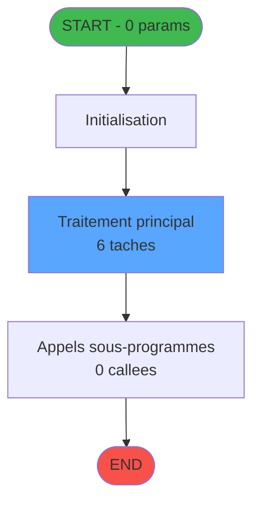

Review the generated code against the original specification.

Produce a JSON report:
```json
{
  "programId": 0,
  "programName": "",
  "coveragePct": 0,
  "rulesImplemented": 0,
  "rulesTotal": 0,
  "missingRules": [
    "rule descriptions not implemented"
  ],
  "recommendations": [
    "improvement suggestions"
  ]
}
```

Check:
1. Every business rule from the contract is implemented in the store
2. Every table from the contract has corresponding entity types
3. Every API endpoint is wired to the store
4. UI layout matches the spec description
5. Error handling is present for all actions

CONTRACT RULES:
[]

SPEC EXCERPT:
# ADH IDE 248 - Choix PYR (plusieurs chambres)

> **Version spec**: 4.0
> **Analyse**: 2026-01-27 23:12
> **Source**: `D:\Data\Migration\XPA\PMS\ADH\Source\Prg_244.xml`
> **Methode**: APEX + PDCA (Auto-generated)

---

<!-- TAB:Fonctionnel -->

## SPECIFICATION FONCTIONNELLE

### 1.1 Objectif metier

**Choix PYR (plusieurs chambres)** est le **selecteur de chambre pour paiement PYR** qui **permet de choisir la chambre a debiter quand un client (GM) est associe a plusieurs chambres**.

**Objectif metier** : Gerer le cas specifique ou un client est heberge dans plusieurs chambres et doit effectuer un paiement PYR (paiement sur chambre). Le programme affiche la liste des chambres associees au client, permet la selection de la chambre cible, et met a jour la table hebergement en consequence. PYR = "Pay Your Room" (facturation sur chambre).

| Element | Description |
|---------|-------------|
| **Qui** | Operateur de caisse lors d'un paiement PYR |
| **Quoi** | Selection de la chambre pour imputation du paiement |
| **Pourquoi** | Resoudre l'ambiguite quand un GM a plusieurs chambres |
| **Declencheur** | Appel lors d'une vente avec mode de paiement PYR et client multi-chambres |
| **Resultat** | Chambre selectionnee, hebergement mis a jour pour imputation |

### 1.2 Regles metier

| Code | Regle | Condition |
|------|-------|-----------|
| RM-001 | Execution du traitement principal | Conditions d'entree validees |
| RM-002 | Gestion des tables (4 tables) | Acces selon mode (R/W/L) |
| RM-003 | Appels sous-programmes (0 callees) | Selon logique metier |

### 1.3 Flux utilisateur

1. Reception des parametres d'entree (0 params)
2. Initialisation et verification conditions
3. Traitement principal (6 taches)
4. Appels sous-programmes si necessaire
5. Retour resultats

### 1.4 Cas d'erreur

| Erreur | Comportement |
|--------|--------------|
| Conditions non remplies | Abandon avec message |
| Erreur sous-programme | Propagation erreur |

---

<!-- TAB:Technique -->

## SPECIFICATION TECHNIQUE

### 2.1 Identification

| Attribut | Valeur |
|----------|--------|
| **IDE Position** | 248 |
| **Fichier XML** | `Prg_244.xml` |
| **Description** | Choix PYR (plusieurs chambres) |
| **Module** | ADH |
| **Public Name** |  |
| **Nombre taches** | 6 |
| **Lignes logique** | 102 |
| **Expressions** | 0 |

### 2.2 Tables

| # | Nom logique | Nom physique | Acces | Usage |
|---|-------------|--------------|-------|-------|
| 30 | gm-recherche_____gmr | cafil008_dat | READ | Lecture |
| 34 | hebergement______heb | cafil012_dat | READ/WRITE | Lecture+Ecriture |
| 36 | client_gm | cafil014_dat | LINK | Jointure |

**Resume**: 4 tables accedees dont **1 en ecriture**

### 2.3 Parametres d'entree (0 parametres)

| Var | Nom | Type | Picture |
|-----|-----|------|---------|
| - | Aucun parametre | - | - |

### 2.4 Algorigramme



### 2.5 Statistiques

| Metrique | Valeur |
|----------|--------|
| **Taches** | 6 |
| **Lignes logique** | 102 |
| **Expressions** | 0 |
| **Parametres** | 0 |
| **Tables accedees** | 4 |
| **Tables en ecriture** | 1 |
| **Callees niveau 1** | 0 |

---

<!-- TAB:Cartographie -->

## CARTOGRAPHIE APPLICATIVE

### 3.1 Chaine d'appels depuis Main

```mermaid
graph LR
    T[248 Choix PYR (plus]
    ORPHAN([ORPHELIN ou Main])
    T -.-> ORPHAN
    style T fill:#58a6ff,color:#000
    style ORPHAN fill:#6b7280,stroke-dasharray: 5 5
```

### 3.2 Callers directs

| IDE | Programme | Nb appels |
|-----|-----------|-----------|
| - | ORPHELIN ou Main direct | - |

### 3.3 Callees (3 niveaux)

```mermaid
graph LR
    T[248 Choix PYR (plus]
    TERM([TERMINAL])
    T -.-> TERM
    style TERM fill:#6b7280,stroke-dasharray: 5 5
    style T fill:#58a6ff,color:#000
```

| Niv | IDE | Programme | Nb appels | Status |
|-----|-----|-----------|-----------|--------|
| - | - | TERMINAL | - | - |

### 3.4 Composants ECF utilises

| ECF | IDE | Public Name | Description |
|-----|-----|-------------|-------------|
| - | - | Aucun composant ECF | - |

### 3.5 Verification orphelin

| Critere | Resultat |
|---------|----------|
| Callers actifs | 0 programmes |
| PublicName | Non defini |
| ECF partage | NON |
| **Conclusion** | **ORPHELIN** - Pas de callers actifs |

---

## NOTES MIGRATION

### Complexite

| Critere | Score | Detail |
|---------|-------|--------|
| Taches | 6 | Moyen |
| Tables | 4 | Ecriture |
| Callees | 0 | Faible couplage |
| **Score global** | **FAIBLE** | - |

### Points d'attention migration


GENERATED FILES:

--- types/choixPyr.ts ---
import type { ApiResponse } from "@/services/api/apiClient";

export interface Hebergement {
  societe: number;
  compte: number;
  filiation: number;
  chambre: string;
  dateDebut: Date;
  dateFin: Date | null;
  statut: string;
}

export interface ClientGm {
  societe: number;
  compte: number;
  filiation: number;
  nom: string;
  prenom: string | null;
}

export interface ChoixPyrState {
  hebergements: Hebergement[];
  selectedHebergement: Hebergement | null;
  clientInfo: ClientGm | null;
  isLoading: boolean;
  error: string | null;
  fetchHebergements: (
    societe: number,
    compte: number,
    filiation: number
  ) => Promise<void>;
  selectChambre: (hebergement: Hebergement) => Promise<void>;
  cancelSelection: () => Promise<void>;
  setError: (error: string | null) => void;
  reset: () => void;
}

export interface FetchHebergementsRequest {
  societe: number;
  compte: number;
  filiation: number;
}

export interface FetchHebergementsResponse extends ApiResponse {
  data: {
    hebergements: Hebergement[];
    clientInfo: ClientGm;
  };
}

export interface SelectChambreRequest {
  societe: number;
  compte: number;
  filiation: number;
  chambre: string;
}

export interface SelectChambreResponse extends ApiResponse {
  data: {
    success: boolean;
    selectedChambre: string;
  };
}

export type ChoixPyrActionType =
  | "FETCH_HEBERGEMENTS_START"
  | "FETCH_HEBERGEMENTS_SUCCESS"
  | "FETCH_HEBERGEMENTS_ERROR"
  | "SELECT_CHAMBRE"
  | "CANCEL_SELECTION"
  | "SET_ERROR"
  | "RESET";

--- stores/choixPyrStore.ts ---
import { create } from 'zustand';
import type {
  Hebergement,
  ClientGm,
  ChoixPyrState,
  FetchHebergementsResponse,
  SelectChambreResponse,
} from '@/types/choixPyr';
import { apiClient } from '@/services/api/apiClient';
import { useDataSourceStore } from '@/stores/dataSourceStore';

interface ChoixPyrActions {
  fetchHebergements: (
    societe: number,
    compte: number,
    filiation: number
  ) => Promise<void>;
  selectChambre: (hebergement: Hebergement) => Promise<void>;
  cancelSelection: () => void;
  setError: (error: string | null) => void;
  reset: () => void;
}

type ChoixPyrStore = ChoixPyrState & ChoixPyrActions;

const MOCK_CLIENT: ClientGm = {
  societe: 1,
  compte: 1001,
  filiation: 0,
  nom: 'DUBOIS',
  prenom: 'Marc',
};

const MOCK_HEBERGEMENTS: Hebergement[] = [
  {
    societe: 1,
    compte: 1001,
    filiation: 0,
    chambre: '101',
    dateDebut: new Date('2026-02-15'),
    dateFin: new Date('2026-02-28'),
    statut: 'ACTIF',
  },
  {
    societe: 1,
    compte: 1001,
    filiation: 0,
    chambre: '203',
    dateDebut: new Date('2026-02-18'),
    dateFin: null,
    statut: 'ACTIF',
  },
  {
    societe: 1,
    compte: 1001,
    filiation: 0,
    chambre: '305',
    dateDebut: new Date('2026-02-10'),
    dateFin: new Date('2026-03-05'),
    statut: 'ACTIF',
  },
];

const initialState: ChoixPyrState = {
  hebergements: [],
  selectedHebergement: null,
  clientInfo: null,
  isLoading: false,
  error: null,
};

export const useChoixPyrStore = create<ChoixPyrStore>()((set, get) => ({
  ...initialState,

  fetchHebergements: async (societe, compte, filiation) => {
    const { isRealApi } = useDataSourceStore.getState();
    set({ isLoading: true, error: null });

    if (!isRealApi) {
      const today = new Date();
      const validHebergements = MOCK_HEBERGEMENTS.filter(
        (h) => h.dateDebut <= today && (h.dateFin === null || h.dateFin >= today)
      );
      set({
        hebergements: validHebergements,
        clientInfo: 

--- services/api/endpoints-choixPyr.ts ---
import { apiClient, type ApiResponse } from './apiClient';
import type {
  Hebergement,
  ClientGm,
  FetchHebergementsResponse,
  SelectChambreResponse,
} from '@/types/choixPyr';

export const choixPyrApi = {
  getHebergements: (
    societe: number,
    compte: number,
    filiation: number,
  ) =>
    apiClient.get<FetchHebergementsResponse>(
      `/api/choixPyr/hebergements?societe=${societe}&compte=${compte}&filiation=${filiation}`,
    ),

  selectChambre: (
    societe: number,
    compte: number,
    filiation: number,
    chambre: string,
  ) =>
    apiClient.post<SelectChambreResponse>(
      '/api/choixPyr/select',
      {
        societe,
        compte,
        filiation,
        chambre,
      },
    ),
};

--- pages/ChoixPyrPage.tsx ---
import { useEffect, useCallback } from 'react';
import { useNavigate } from 'react-router-dom';
import { ScreenLayout } from '@/components/layout';
import { useChoixPyrStore } from '@/stores/choixPyrStore';
import { useAuthStore } from '@/stores';
import type { Hebergement } from '@/types/choixPyr';
import { cn } from '@/lib/utils';

export function ChoixPyrPage() {
  const navigate = useNavigate();
  const user = useAuthStore((s) => s.user);

  const hebergements = useChoixPyrStore((s) => s.hebergements);
  const selectedHebergement = useChoixPyrStore((s) => s.selectedHebergement);
  const clientInfo = useChoixPyrStore((s) => s.clientInfo);
  const isLoading = useChoixPyrStore((s) => s.isLoading);
  const error = useChoixPyrStore((s) => s.error);
  const fetchHebergements = useChoixPyrStore((s) => s.fetchHebergements);
  const selectChambre = useChoixPyrStore((s) => s.selectChambre);
  const cancelSelection = useChoixPyrStore((s) => s.cancelSelection);
  const reset = useChoixPyrStore((s) => s.reset);

  useEffect(() => {
    fetchHebergements(1, 1001, 0);
    return () => reset();
  }, [fetchHebergements, reset]);

  const handleSelectRow = useCallback((heb: Hebergement) => {
    selectChambre(heb);
  }, [selectChambre]);

  const handleValider = useCallback(async () => {
    if (!selectedHebergement) return;
    navigate('/caisse/menu');
  }, [selectedHebergement, navigate]);

  const handleAnnuler = useCallback(() => {
    cancelSelection();
    navigate('/caisse/menu');
  }, [cancelSelection, navigate]);

  const formatDate = (date: Date | null) => {
    if (!date) return 'N/A';
    return new Date(date).toLocaleDateString('fr-FR');
  };

  const sortedHebergements = [...hebergements].sort((a, b) =>
    a.chambre.localeCompare(b.chambre)
  );

  return (
    <ScreenLayout>
      <div className="max-w-4xl mx-auto space-y-6">
        <div className="flex items-center justify-between">
          <div>
            <h2 className="text-xl font-semibold">Choix chambre

--- components/caisse/choixPyr/ActionsPanel.tsx ---
import { Button } from '@/components/ui';
import { cn } from '@/lib/utils';

interface ActionsPanelProps {
  hasSelection: boolean;
  onValider: () => void;
  onAnnuler: () => void;
  className?: string;
}

export const ActionsPanel = ({
  hasSelection,
  onValider,
  onAnnuler,
  className,
}: ActionsPanelProps) => {
  return (
    <div className={cn('flex items-center justify-end gap-3', className)}>
      <Button
        variant="primary"
        onClick={onValider}
        disabled={!hasSelection}
      >
        Valider
      </Button>
      <Button
        variant="secondary"
        onClick={onAnnuler}
      >
        Annuler
      </Button>
    </div>
  );
};

--- components/caisse/choixPyr/ChambresGridPanel.tsx ---
import type { Hebergement } from "@/types/choixPyr";
import { cn } from "@/lib/utils";

export interface ChambresGridPanelProps {
  hebergements: Hebergement[];
  selectedHebergement: Hebergement | null;
  isLoading: boolean;
  onSelectRow: (hebergement: Hebergement) => void;
}

export const ChambresGridPanel = ({
  hebergements,
  selectedHebergement,
  isLoading,
  onSelectRow,
}: ChambresGridPanelProps) => {
  const formatDate = (date: Date | null) => {
    if (!date) return "";
    return new Date(date).toLocaleDateString("fr-FR");
  };

  const sortedHebergements = [...hebergements].sort((a, b) =>
    a.chambre.localeCompare(b.chambre)
  );

  if (isLoading) {
    return (
      <div className="flex items-center justify-center h-64 text-gray-500">
        Chargement des chambres...
      </div>
    );
  }

  if (hebergements.length === 0) {
    return (
      <div className="flex items-center justify-center h-64 text-gray-500">
        Aucune chambre disponible
      </div>
    );
  }

  return (
    <div className="border border-gray-300 rounded">
      <div className="overflow-x-auto">
        <table className="w-full">
          <thead>
            <tr className="bg-gray-100 border-b border-gray-300">
              <th className="px-4 py-2 text-left text-sm font-semibold text-gray-700">
                Chambre
              </th>
              <th className="px-4 py-2 text-left text-sm font-semibold text-gray-700">
                Date début
              </th>
              <th className="px-4 py-2 text-left text-sm font-semibold text-gray-700">
                Date fin
              </th>
              <th className="px-4 py-2 text-left text-sm font-semibold text-gray-700">
                Statut
              </th>
            </tr>
          </thead>
          <tbody>
            {sortedHebergements.map((heb) => {
              const isSelected =
                selectedHebergement?.chambre === heb.chambre &&
                selectedHebergement?.societe 

--- components/caisse/choixPyr/HeaderPanel.tsx ---
import type { ClientGm } from "@/types/choixPyr";

export interface HeaderPanelProps {
  clientInfo: ClientGm | null;
  className?: string;
}

export const HeaderPanel = ({ clientInfo, className }: HeaderPanelProps) => {
  const displayName = clientInfo
    ? `${clientInfo.nom}${clientInfo.prenom ? ` ${clientInfo.prenom}` : ''}`
    : 'Client non identifié';

  return (
    <div className={className}>
      <div className="bg-blue-50 border border-blue-200 rounded-lg p-4 space-y-2">
        <div className="flex items-center gap-2">
          <span className="font-medium text-gray-700">Client:</span>
          <span className="text-gray-900">{displayName}</span>
        </div>
        <div className="text-sm text-blue-800 italic">
          Veuillez choisir la chambre pour le paiement PYR
        </div>
      </div>
    </div>
  );
};