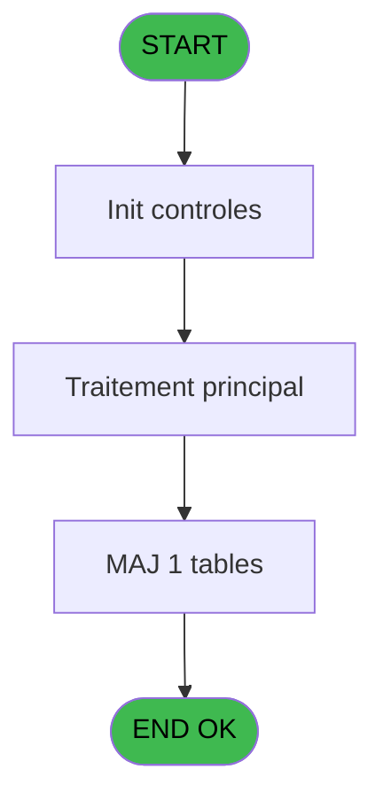

Review the generated code against the original specification.

Produce a JSON report:
```json
{
  "programId": 0,
  "programName": "",
  "coveragePct": 0,
  "rulesImplemented": 0,
  "rulesTotal": 0,
  "missingRules": [
    "rule descriptions not implemented"
  ],
  "recommendations": [
    "improvement suggestions"
  ]
}
```

Check:
1. Every business rule from the contract is implemented in the store
2. Every table from the contract has corresponding entity types
3. Every API endpoint is wired to the store
4. UI layout matches the spec description
5. Error handling is present for all actions

CONTRACT RULES:
[
  {
    "id": "RM-001",
    "description": "Valeur par defaut si Trim(p.Chambre [C]) est vide",
    "condition": "Trim(p.Chambre [C])=''",
    "variables": [
      "EP"
    ],
    "status": "IMPL",
    "targetFile": "adh-web/src/stores/saisieContenuCaisseStore.ts",
    "gapNotes": ""
  }
]

SPEC EXCERPT:
# ADH IDE 249 - Reinit Aff PYR

> **Analyse**: Phases 1-4 2026-02-08 04:37 -> 04:37 (5s) | Assemblage 04:37
> **Pipeline**: V7.2 Enrichi
> **Structure**: 4 onglets (Resume | Ecrans | Donnees | Connexions)

<!-- TAB:Resume -->

## 1. FICHE D'IDENTITE

| Attribut | Valeur |
|----------|--------|
| Projet | ADH |
| IDE Position | 249 |
| Nom Programme | Reinit Aff PYR |
| Fichier source | `Prg_249.xml` |
| Dossier IDE | General |
| Taches | 1 (0 ecrans visibles) |
| Tables modifiees | 1 |
| Programmes appeles | 0 |
| Complexite | **BASSE** (score 7/100) |
| <span style="color:red">Statut</span> | <span style="color:red">**ORPHELIN_POTENTIEL**</span> |

## 2. DESCRIPTION FONCTIONNELLE

Ce programme réinitialise les marqueurs temporaires d'affectation PYR (paiement sur chambre) dans la table hebergement après un deversement de transaction. Il agit comme nettoyeur de données automatique en remettant à zéro les flags d'affectation, préparant ainsi le système pour la prochaine transaction. Avec seulement 12 lignes de logique et une tâche unique, c'est un utilitaire très compact appelé automatiquement par le programme de deversement (ADH IDE 247).

La table **hebergement_heb** (n°34, physiquement `cafil012_dat`) est la seule cible en écriture. Le programme effectue des mises à jour de masse sur cette table sans paramètres d'entrée, nettoyant les indicateurs temporaires d'affectation lors du cycle de clôture de caisse.

Le flux est ultra-simple : initialisation → traitement principal sur une tâche unique → aucun appel de sous-programme → retour. C'est un utilitaire terminal sans dépendances externes ni expressions complexes, marqué comme orphelin dans l'analyse car sans callers visibles (bien que réellement appelé par ADH IDE 247 via CallTask).

## 3. BLOCS FONCTIONNELS

## 5. REGLES METIER

1 regles identifiees:

### Autres (1 regles)

#### <a id="rm-RM-001"></a>[RM-001] Valeur par defaut si Trim(p.Chambre [C]) est vide

| Element | Detail |
|---------|--------|
| **Condition** | `Trim(p.Chambre [C])=''` |
| **Si vrai** | '' |
| **Si faux** | 'P') |
| **Variables** | EP (p.Chambre) |
| **Expression source** | Expression 5 : `IF(Trim(p.Chambre [C])='','','P')` |
| **Exemple** | Si Trim(p.Chambre [C])='' → ''. Sinon → 'P') |

## 6. CONTEXTE

- **Appele par**: (aucun)
- **Appelle**: 0 programmes | **Tables**: 1 (W:1 R:0 L:0) | **Taches**: 1 | **Expressions**: 5

<!-- TAB:Ecrans -->

## 8. ECRANS

*(Programme sans ecran visible)*

## 9. NAVIGATION

### 9.3 Structure hierarchique (0 tache)

| Position | Tache | Type | Dimensions | Bloc |
|----------|-------|------|------------|------|

### 9.4 Algorigramme



> **Legende**: Vert = START/END OK | Rouge = END KO | Bleu = Decisions
> *Algorigramme auto-genere. Utiliser `/algorigramme` pour une synthese metier detaillee.*

<!-- TAB:Donnees -->

## 10. TABLES

### Tables utilisees (1)

| ID | Nom | Description | Type | R | W | L | Usages |
|----|-----|-------------|------|---|---|---|--------|
| 34 | hebergement______heb | Hebergement (chambres) | DB |   | **W** |   | 1 |

### Colonnes par table (1 / 1 tables avec colonnes identifiees)

<details>
<summary>Table 34 - hebergement______heb (**W**) - 1 usages</summary>

| Lettre | Variable | Acces | Type |
|--------|----------|-------|------|
| A | p.Societe | W | Unicode |
| B | p.Compte | W | Numeric |
| C | p.Chambre | W | Unicode |

</details>

## 11. VARIABLES

### 11.1 Parametres entrants (3)

Variables recues en parametre.

| Lettre | Nom | Type | Usage dans |
|--------|-----|------|-----------|
| EN | p.Societe | Unicode | 1x parametre entrant |
| EO | p.Compte | Numeric | 1x parametre entrant |
| EP | p.Chambre | Unicode | 2x parametre entrant |

## 12. EXPRESSIONS

**5 / 5 expressions decodees (100%)**

### 12.1 Repartition par type

| Type | Expressions | Regles |
|------|-------------|--------|
| CONDITION | 1 | 5 |
| CONSTANTE | 1 | 0 |
| OTHER | 3 | 0 |

### 12.2 Expressions cles par type

#### CONDITION (1 expressions)

| Type | IDE | Expression | Regle |
|------|-----|------------|-------|
| CONDITION | 5 | `IF(Trim(p.Chambre [C])='','','P')` | [RM-001](#rm-RM-001) |

#### CONSTANTE (1 expressions)

| Type | IDE | Expression | Regle |
|------|-----|------------|-------|
| CONSTANTE | 3 | `'H'` | - |

#### OTHER (3 expressions)

| Type | IDE | Expression | Regle |
|------|-----|------------|-------|
| OTHER | 4 | `p.Chambre [C]` | - |
| OTHER | 2 | `p.Compte [B]` | - |
| OTHER | 1 | `p.Societe [A]` | - |

<!-- TAB:Connexions -->

## 13. GRAPHE D'APPELS

### 13.1 Chaine depuis Main (Callers)

**Chemin**: (pas de callers directs)

```mermaid
graph LR
    T249[249 Reinit Aff PYR]
    style T249 fill:#58a6ff
    NONE[Aucun cal

GENERATED FILES:

--- types/reinitAffPyr.ts ---
export interface HebergementRecord {
  societe: string;
  compte: number;
  chambre: string;
  affectationPyr: string | null;
}

export interface ReinitAffectationParams {
  societe: string;
  compte: number;
  chambre?: string;
}

export interface ReinitAffectationResponse {
  affectedCount: number;
}

export interface AffectationStatusResponse {
  hasActiveAffectations: boolean;
  count: number;
}

export interface ReinitAffPyrState {
  isProcessing: boolean;
  error: Error | null;
  lastResetCount: number;
  
  reinitAffectationPyr: (params: ReinitAffectationParams) => Promise<number>;
  resetAllAffectations: () => Promise<number>;
  getAffectationStatus: (societe: string, compte: number) => Promise<AffectationStatusResponse>;
  clearError: () => void;
}

export const AFFECTATION_VALUES = {
  EMPTY: '',
  PYR_MARKER: 'P',
  HEBERGEMENT: 'H',
} as const;

export type AffectationValue = typeof AFFECTATION_VALUES[keyof typeof AFFECTATION_VALUES];

--- stores/reinitAffPyrStore.ts ---
import { create } from 'zustand';
import type {
  ReinitAffectationParams,
  ReinitAffectationResponse,
  AffectationStatusResponse,
  ReinitAffPyrState,
} from '@/types/reinitAffPyr';
import { useDataSourceStore } from './dataSourceStore';
import { apiClient } from '@/services/api/apiClient';
import type { ApiResponse } from '@/services/api/apiClient';

interface ReinitAffPyrStore extends ReinitAffPyrState {
  reset: () => void;
}

const initialState: Omit<ReinitAffPyrState, 'reinitAffectationPyr' | 'resetAllAffectations' | 'getAffectationStatus' | 'clearError'> = {
  isProcessing: false,
  error: null,
  lastResetCount: 0,
};

const MOCK_HEBERGEMENT_RECORDS = [
  { societe: 'SOC1', compte: 1001, chambre: '101', affectationPyr: 'P' },
  { societe: 'SOC1', compte: 1001, chambre: '102', affectationPyr: 'H' },
  { societe: 'SOC1', compte: 1002, chambre: '201', affectationPyr: 'P' },
  { societe: 'SOC1', compte: 1002, chambre: '', affectationPyr: 'P' },
  { societe: 'SOC1', compte: 1003, chambre: '301', affectationPyr: null },
  { societe: 'SOC1', compte: 1004, chambre: '401', affectationPyr: 'P' },
  { societe: 'SOC1', compte: 1004, chambre: '', affectationPyr: 'H' },
  { societe: 'SOC2', compte: 2001, chambre: '501', affectationPyr: 'P' },
  { societe: 'SOC2', compte: 2001, chambre: '502', affectationPyr: '' },
  { societe: 'SOC2', compte: 2002, chambre: '', affectationPyr: null },
];

export const useReinitAffPyrStore = create<ReinitAffPyrStore>()((set) => ({
  ...initialState,

  reinitAffectationPyr: async (params: ReinitAffectationParams) => {
    const { isRealApi } = useDataSourceStore.getState();
    set({ isProcessing: true, error: null });

    if (!isRealApi) {
      await new Promise((resolve) => setTimeout(resolve, 800));
      
      const filtered = MOCK_HEBERGEMENT_RECORDS.filter(
        (r) =>
          r.societe === params.societe &&
          r.compte === params.compte &&
          (params.chambre === undefined || r.chambre === params.chambre),
   

--- services/api/endpoints-reinitAffPyr.ts ---
import { apiClient, type ApiResponse } from './apiClient';
import type {
  ReinitAffectationParams,
  ReinitAffectationResponse,
  AffectationStatusResponse,
} from '@/types/reinitAffPyr';

export const reinitAffPyrApi = {
  resetAffectationPyr: (params: ReinitAffectationParams) => {
    const queryParts = [
      `societe=${encodeURIComponent(params.societe)}`,
      `compte=${params.compte}`,
    ];
    if (params.chambre) {
      queryParts.push(`chambre=${encodeURIComponent(params.chambre)}`);
    }
    return apiClient.post<ApiResponse<ReinitAffectationResponse>>(
      `/api/reinitAffPyr/reset?${queryParts.join('&')}`,
      {},
    );
  },

  resetAllAffectations: () =>
    apiClient.post<ApiResponse<ReinitAffectationResponse>>(
      '/api/reinitAffPyr/reset-all',
      {},
    ),

  getAffectationStatus: (societe: string, compte: number) =>
    apiClient.get<ApiResponse<AffectationStatusResponse>>(
      `/api/reinitAffPyr/status?societe=${encodeURIComponent(societe)}&compte=${compte}`,
    ),
};

--- pages/ReinitAffPyrPage.tsx ---
import { useState, useEffect, useCallback } from 'react';
import { useNavigate } from 'react-router-dom';
import { ScreenLayout } from '@/components/layout';
import { Button, Dialog, Input } from '@/components/ui';
import { useReinitAffPyrStore } from '@/stores/reinitAffPyrStore';
import { useAuthStore } from '@/stores';
import { cn } from '@/lib/utils';

export function ReinitAffPyrPage() {
  const navigate = useNavigate();
  const user = useAuthStore((s) => s.user);

  const isProcessing = useReinitAffPyrStore((s) => s.isProcessing);
  const error = useReinitAffPyrStore((s) => s.error);
  const lastResetCount = useReinitAffPyrStore((s) => s.lastResetCount);
  const reinitAffectationPyr = useReinitAffPyrStore((s) => s.reinitAffectationPyr);
  const resetAllAffectations = useReinitAffPyrStore((s) => s.resetAllAffectations);
  const getAffectationStatus = useReinitAffPyrStore((s) => s.getAffectationStatus);
  const clearError = useReinitAffPyrStore((s) => s.clearError);
  const reset = useReinitAffPyrStore((s) => s.reset);

  const [showConfirmDialog, setShowConfirmDialog] = useState(false);
  const [showTargetDialog, setShowTargetDialog] = useState(false);
  const [societe] = useState('ADH');
  const [compte, setCompte] = useState('');
  const [chambre, setChambre] = useState('');
  const [activeCount, setActiveCount] = useState<number | null>(null);
  const [successMessage, setSuccessMessage] = useState<string | null>(null);

  useEffect(() => {
    return () => reset();
  }, [reset]);

  useEffect(() => {
    if (error) {
      const timer = setTimeout(() => clearError(), 5000);
      return () => clearTimeout(timer);
    }
  }, [error, clearError]);

  useEffect(() => {
    if (successMessage) {
      const timer = setTimeout(() => setSuccessMessage(null), 5000);
      return () => clearTimeout(timer);
    }
  }, [successMessage]);

  const loadStatus = useCallback(async () => {
    if (!compte) return;
    try {
      const status = await getAffectationStatus(so

--- components/caisse/reinitAffPyr/ResetTriggerPanel.tsx ---
import { useState } from 'react';
import { Button, Dialog } from '@/components/ui';
import { useReinitAffPyrStore } from '@/stores/reinitAffPyrStore';
import { cn } from '@/lib/utils';

interface ResetTriggerPanelProps {
  className?: string;
  onResetComplete?: (count: number) => void;
}

export const ResetTriggerPanel = ({ className, onResetComplete }: ResetTriggerPanelProps) => {
  const [showConfirm, setShowConfirm] = useState(false);
  const [successMessage, setSuccessMessage] = useState<string | null>(null);

  const isProcessing = useReinitAffPyrStore((s) => s.isProcessing);
  const error = useReinitAffPyrStore((s) => s.error);
  const resetAllAffectations = useReinitAffPyrStore((s) => s.resetAllAffectations);

  const handleReset = async () => {
    setShowConfirm(false);
    setSuccessMessage(null);

    try {
      const count = await resetAllAffectations();
      const message = `${count} affectation${count > 1 ? 's' : ''} PYR réinitialisée${count > 1 ? 's' : ''}`;
      setSuccessMessage(message);
      onResetComplete?.(count);

      setTimeout(() => setSuccessMessage(null), 5000);
    } catch {
      // Error handled by store
    }
  };

  return (
    <div className={cn('flex flex-col gap-4', className)}>
      <div className="flex items-center justify-between">
        <h3 className="text-lg font-semibold">Réinitialisation globale</h3>
        <Button
          onClick={() => setShowConfirm(true)}
          variant="destructive"
          disabled={isProcessing}
        >
          Réinitialiser affectations PYR
        </Button>
      </div>

      {isProcessing && (
        <div className="flex items-center gap-2 p-4 bg-blue-50 border border-blue-200 rounded">
          <div className="w-5 h-5 border-2 border-blue-600 border-t-transparent rounded-full animate-spin" />
          <span className="text-sm text-blue-900">Réinitialisation en cours...</span>
        </div>
      )}

      {successMessage && (
        <div className="p-4 bg-green-50 bord

--- components/caisse/reinitAffPyr/StatusDisplayPanel.tsx ---
import type { AffectationStatusResponse } from '@/types/reinitAffPyr';
import { cn } from '@/lib/utils';

interface StatusDisplayPanelProps {
  activeCount: number | null;
  lastResetCount: number;
  isLoading?: boolean;
  className?: string;
}

export const StatusDisplayPanel = ({
  activeCount,
  lastResetCount,
  isLoading = false,
  className,
}: StatusDisplayPanelProps) => {
  const formatDate = (timestamp: number): string => {
    if (timestamp === 0) return 'Jamais';
    const date = new Date(timestamp);
    return new Intl.DateTimeFormat('fr-FR', {
      day: '2-digit',
      month: '2-digit',
      year: 'numeric',
      hour: '2-digit',
      minute: '2-digit',
    }).format(date);
  };

  return (
    <div className={cn('space-y-4 rounded-lg border border-gray-200 bg-white p-4', className)}>
      <h3 className="text-sm font-semibold text-gray-700">Statut des affectations</h3>
      
      <div className="space-y-3">
        <div className="flex items-center justify-between border-b border-gray-100 pb-2">
          <span className="text-sm text-gray-600">Nombre d'affectations actives</span>
          <span
            className={cn(
              'text-sm font-medium',
              isLoading && 'text-gray-400',
              !isLoading && activeCount !== null && activeCount > 0 && 'text-blue-600',
              !isLoading && activeCount === 0 && 'text-gray-500'
            )}
          >
            {isLoading ? '...' : activeCount !== null ? activeCount : '—'}
          </span>
        </div>

        <div className="flex items-center justify-between">
          <span className="text-sm text-gray-600">Dernière réinitialisation</span>
          <span className="text-sm font-medium text-gray-700">
            {lastResetCount > 0 ? `${lastResetCount} enregistrement(s)` : '—'}
          </span>
        </div>
      </div>
    </div>
  );
};