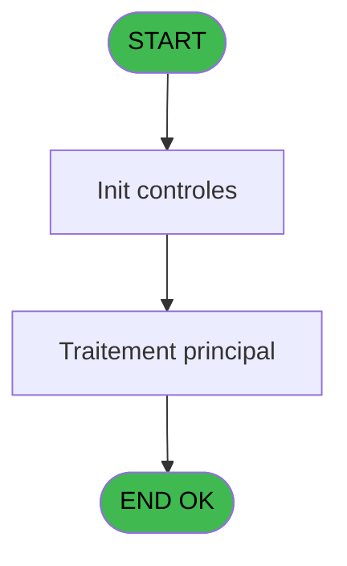
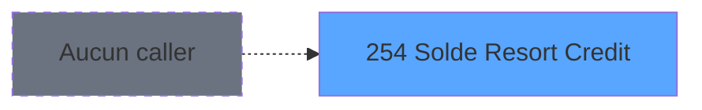

Review the generated code against the original specification.

Produce a JSON report:
```json
{
  "programId": 0,
  "programName": "",
  "coveragePct": 0,
  "rulesImplemented": 0,
  "rulesTotal": 0,
  "missingRules": [
    "rule descriptions not implemented"
  ],
  "recommendations": [
    "improvement suggestions"
  ]
}
```

Check:
1. Every business rule from the contract is implemented in the store
2. Every table from the contract has corresponding entity types
3. Every API endpoint is wired to the store
4. UI layout matches the spec description
5. Error handling is present for all actions

CONTRACT RULES:
[
  {
    "id": "RM-001",
    "description": "Si [J]>[K] alors [J]-[K] sinon 0)",
    "condition": "[J]>[K]",
    "variables": [],
    "status": "IMPL",
    "targetFile": "adh-web/src/stores/saisieContenuCaisseStore.ts",
    "gapNotes": ""
  }
]

SPEC EXCERPT:
# ADH IDE 254 - Solde Resort Credit

> **Analyse**: Phases 1-4 2026-02-08 04:41 -> 04:41 (4s) | Assemblage 04:41
> **Pipeline**: V7.2 Enrichi
> **Structure**: 4 onglets (Resume | Ecrans | Donnees | Connexions)

<!-- TAB:Resume -->

## 1. FICHE D'IDENTITE

| Attribut | Valeur |
|----------|--------|
| Projet | ADH |
| IDE Position | 254 |
| Nom Programme | Solde Resort Credit |
| Fichier source | `Prg_254.xml` |
| Dossier IDE | Comptabilite |
| Taches | 1 (0 ecrans visibles) |
| Tables modifiees | 0 |
| Programmes appeles | 0 |
| Complexite | **BASSE** (score 0/100) |
| <span style="color:red">Statut</span> | <span style="color:red">**ORPHELIN_POTENTIEL**</span> |

## 2. DESCRIPTION FONCTIONNELLE

ADH IDE 254 - Solde Resort Credit calcule le solde disponible en Resort Credit pour un compte membre. Le programme lit la table de gestion des Resort Credits (crédits de séjour) et compare le montant attribué au montant déjà utilisé. La logique retourne le solde restant ou zéro si le crédit est entièrement consommé.

Ce programme est appelé dans le flux de ventes (ADH IDE 250) pour afficher les informations de solde au client avant une transaction. Il s'inscrit dans l'écosystème des programmes de consultation de solde (ADH IDE 192 SOLDE_COMPTE, ADH IDE 237 solde Gift Pass) et utilise des tables de référence partagées pour identifier les services associés au Resort Credit.

Le calcul suit une logique simple : `IF(attribué > utilisé, attribué - utilisé, 0)`. Les paramètres d'entrée incluent la clé de compte (sociétés, compte, filiation) et optionnellement le numéro de service pour filtrer les crédits par type de prestation.

## 3. BLOCS FONCTIONNELS

## 5. REGLES METIER

1 regles identifiees:

### Autres (1 regles)

#### <a id="rm-RM-001"></a>[RM-001] Si [J]>[K] alors [J]-[K] sinon 0)

| Element | Detail |
|---------|--------|
| **Condition** | `[J]>[K]` |
| **Si vrai** | [J]-[K] |
| **Si faux** | 0) |
| **Expression source** | Expression 7 : `IF([J]>[K],[J]-[K],0)` |
| **Exemple** | Si [J]>[K] → [J]-[K]. Sinon → 0) |

## 6. CONTEXTE

- **Appele par**: (aucun)
- **Appelle**: 0 programmes | **Tables**: 1 (W:0 R:1 L:0) | **Taches**: 1 | **Expressions**: 7

<!-- TAB:Ecrans -->

## 8. ECRANS

*(Programme sans ecran visible)*

## 9. NAVIGATION

### 9.3 Structure hierarchique (0 tache)

| Position | Tache | Type | Dimensions | Bloc |
|----------|-------|------|------------|------|

### 9.4 Algorigramme



> **Legende**: Vert = START/END OK | Rouge = END KO | Bleu = Decisions
> *Algorigramme auto-genere. Utiliser `/algorigramme` pour une synthese metier detaillee.*

<!-- TAB:Donnees -->

## 10. TABLES

### Tables utilisees (1)

| ID | Nom | Description | Type | R | W | L | Usages |
|----|-----|-------------|------|---|---|---|--------|
| 980 | Table_980 |  | MEM | R |   |   | 1 |

### Colonnes par table (1 / 1 tables avec colonnes identifiees)

<details>
<summary>Table 980 - Table_980 (R) - 1 usages</summary>

| Lettre | Variable | Acces | Type |
|--------|----------|-------|------|
| A | P0 societe | R | Alpha |
| B | P0 compte | R | Numeric |
| C | P0 filiation | R | Numeric |
| D | P0 service | R | Unicode |
| E | P0 solde resort credit | R | Numeric |

</details>

## 11. VARIABLES

### 11.1 Parametres entrants (5)

Variables recues en parametre.

| Lettre | Nom | Type | Usage dans |
|--------|-----|------|-----------|
| EN | P0 societe | Alpha | 1x parametre entrant |
| EO | P0 compte | Numeric | 1x parametre entrant |
| EP | P0 filiation | Numeric | 1x parametre entrant |
| EQ | P0 service | Unicode | 1x parametre entrant |
| ER | P0 solde resort credit | Numeric | - |

## 12. EXPRESSIONS

**7 / 7 expressions decodees (100%)**

### 12.1 Repartition par type

| Type | Expressions | Regles |
|------|-------------|--------|
| CONDITION | 1 | 5 |
| OTHER | 6 | 0 |

### 12.2 Expressions cles par type

#### CONDITION (1 expressions)

| Type | IDE | Expression | Regle |
|------|-----|------------|-------|
| CONDITION | 7 | `IF([J]>[K],[J]-[K],0)` | [RM-001](#rm-RM-001) |

#### OTHER (6 expressions)

| Type | IDE | Expression | Regle |
|------|-----|------------|-------|
| OTHER | 4 | `P0 compte [B]` | - |
| OTHER | 5 | `P0 filiation [C]` | - |
| OTHER | 6 | `P0 service [D]` | - |
| OTHER | 1 | `SetCrsr (1)` | - |
| OTHER | 2 | `SetCrsr (2)` | - |
| ... | | *+1 autres* | |

<!-- TAB:Connexions -->

## 13. GRAPHE D'APPELS

### 13.1 Chaine depuis Main (Callers)

**Chemin**: (pas de callers directs)



### 13.2 Callers

| IDE | Nom Programme | Nb Appels |
|-----|---------------|-----------|
| - | (a

GENERATED FILES:

--- types/saisieContenuCaisse.ts ---
import type { ApiResponse } from "@/services/api/apiClient";

export interface Denomination {
  id: number;
  deviseCode: string;
  valeur: number;
  libelle: string;
}

export interface ComptageDetail {
  denominationId: number;
  deviseCode: string;
  valeur: number;
  quantite: number;
  total: number;
}

export interface RecapMOP {
  moyenPaiement: string;
  moyenPaiementLibelle: string;
  attendu: number;
  compte: number;
  ecart: number;
}

export interface DeviseComptage {
  deviseCode: string;
  deviseLibelle: string;
  totalSaisi: number;
  denominations: ComptageDetail[];
}

export interface ValidationResult {
  totalCaisse: number;
  totalMonnaie: number;
  totalProduits: number;
  totalCartes: number;
  totalCheques: number;
  totalOD: number;
  shouldProcess: boolean;
  nbreDevise: number;
  fromIms: boolean;
}

export interface PersistanceResult {
  success: boolean;
  ticketUrl?: string;
  sessionId: number;
  timestamp: string;
}

export interface SaisieContenuCaisseState {
  activeDevise: string | null;
  comptageDevises: Map<string, DeviseComptage>;
  recapMOP: RecapMOP[];
  validationResult: ValidationResult | null;
  isValidating: boolean;
  validationError: string | null;
  isPersisting: boolean;
  canSubmit: boolean;
  devisesAutorisees: string[];
  sessionId: number | null;
  quand: "O" | "F" | null;

  initComptage: (
    sessionId: number,
    quand: "O" | "F",
    devisesAutorisees: string[]
  ) => Promise<void>;

  updateQuantite: (
    deviseCode: string,
    denominationId: number,
    quantite: number
  ) => void;

  switchDevise: (deviseCode: string) => void;

  validateComptage: () => Promise<ValidationResult>;

  loadRecapMOP: (sessionId: number) => Promise<RecapMOP[]>;

  persistComptage: (
    sessionId: number,
    validationResult: ValidationResult
  ) => Promise<PersistanceResult>;

  resetState: () => void;

  setValidationError: (error: s

--- stores/saisieContenuCaisseStore.ts ---
import { create } from "zustand";
import type {
  Denomination,
  ComptageDetail,
  DeviseComptage,
  RecapMOP,
  ValidationResult,
  PersistanceResult,
  GetDenominationsResponse,
  ValidateComptageResponse,
  GetRecapMOPResponse,
  PersistComptageResponse,
} from "@/types/saisieContenuCaisse";
import { apiClient } from "@/services/api/apiClient";
import { useDataSourceStore } from "@/stores/dataSourceStore";

interface SaisieContenuCaisseState {
  activeDevise: string | null;
  comptageDevises: Map<string, DeviseComptage>;
  recapMOP: RecapMOP[];
  validationResult: ValidationResult | null;
  isValidating: boolean;
  validationError: string | null;
  isPersisting: boolean;
  canSubmit: boolean;
  devisesAutorisees: string[];
  sessionId: number | null;
  quand: "O" | "F" | null;
}

interface SaisieContenuCaisseActions {
  initComptage: (
    sessionId: number,
    quand: "O" | "F",
    devisesAutorisees: string[]
  ) => Promise<void>;
  updateQuantite: (
    deviseCode: string,
    denominationId: number,
    quantite: number
  ) => void;
  switchDevise: (deviseCode: string) => void;
  validateComptage: () => Promise<ValidationResult>;
  loadRecapMOP: (sessionId: number) => Promise<RecapMOP[]>;
  persistComptage: (
    sessionId: number,
    validationResult: ValidationResult
  ) => Promise<PersistanceResult>;
  resetState: () => void;
  setValidationError: (error: string | null) => void;
}

type SaisieContenuCaisseStore = SaisieContenuCaisseState &
  SaisieContenuCaisseActions;

const MOCK_DENOMINATIONS: Record<string, Denomination[]> = {
  EUR: [
    { id: 1, deviseCode: "EUR", valeur: 500, libelle: "500 EUR" },
    { id: 2, deviseCode: "EUR", valeur: 200, libelle: "200 EUR" },
    { id: 3, deviseCode: "EUR", valeur: 100, libelle: "100 EUR" },
    { id: 4, deviseCode: "EUR", valeur: 50, libelle: "50 EUR" },
    { id: 5, deviseCode: "EUR", valeur: 20, libelle: "20 EUR" },
    { id: 6, deviseCode: "EUR"

--- services/api/endpoints-saisieContenuCaisse.ts ---
import { apiClient, type ApiResponse } from './apiClient';
import type {
  Denomination,
  RecapMOP,
  DeviseComptage,
  ValidationResult,
} from '@/types/saisieContenuCaisse';

export const saisieContenuCaisseApi = {
  getDenominations: (deviseCode: string) =>
    apiClient.get<ApiResponse<Denomination[]>>(
      `/api/caisse/denominations/${encodeURIComponent(deviseCode)}`,
    ),

  validateComptage: (data: {
    comptageDevises: Record<string, DeviseComptage>;
    nbreDevise: number;
    fromIms: boolean;
  }) =>
    apiClient.post<ApiResponse<ValidationResult>>(
      '/api/caisse/comptage/validate',
      data,
    ),

  getRecapMOP: (sessionId: number) =>
    apiClient.get<ApiResponse<RecapMOP[]>>(
      `/api/caisse/session/${sessionId}/recap-mop`,
    ),

  persistComptage: (data: {
    sessionId: number;
    validationResult: ValidationResult;
    comptageDevises: Record<string, DeviseComptage>;
    recapMOP: RecapMOP[];
  }) =>
    apiClient.post<
      ApiResponse<{
        success: boolean;
        ticketUrl?: string;
      }>
    >('/api/caisse/comptage/persist', data),
};

--- pages/SaisieContenuCaissePage.tsx ---
import { useState, useEffect, useCallback } from 'react';
import { useNavigate, useSearchParams } from 'react-router-dom';
import { ScreenLayout } from '@/components/layout';
import { Button } from '@/components/ui';
import { useSaisieContenuCaisseStore } from '@/stores/saisieContenuCaisseStore';
import { useAuthStore } from '@/stores';
import { cn } from '@/lib/utils';

type Phase = 'comptage' | 'recapitulatif' | 'confirmation';

export const SaisieContenuCaissePage = () => {
  const navigate = useNavigate();
  const [searchParams] = useSearchParams();
  const user = useAuthStore((s) => s.user);

  const sessionId = Number(searchParams.get('sessionId')) || null;
  const quand = (searchParams.get('quand') as 'O' | 'F') || null;

  const activeDevise = useSaisieContenuCaisseStore((s) => s.activeDevise);
  const comptageDevises = useSaisieContenuCaisseStore((s) => s.comptageDevises);
  const recapMOP = useSaisieContenuCaisseStore((s) => s.recapMOP);
  const validationResult = useSaisieContenuCaisseStore(
    (s) => s.validationResult,
  );
  const isValidating = useSaisieContenuCaisseStore((s) => s.isValidating);
  const validationError = useSaisieContenuCaisseStore((s) => s.validationError);
  const isPersisting = useSaisieContenuCaisseStore((s) => s.isPersisting);
  const canSubmit = useSaisieContenuCaisseStore((s) => s.canSubmit);
  const devisesAutorisees = useSaisieContenuCaisseStore(
    (s) => s.devisesAutorisees,
  );

  const initComptage = useSaisieContenuCaisseStore((s) => s.initComptage);
  const updateQuantite = useSaisieContenuCaisseStore((s) => s.updateQuantite);
  const switchDevise = useSaisieContenuCaisseStore((s) => s.switchDevise);
  const validateComptage = useSaisieContenuCaisseStore(
    (s) => s.validateComptage,
  );
  const loadRecapMOP = useSaisieContenuCaisseStore((s) => s.loadRecapMOP);
  const persistComptage = useSaisieContenuCaisseStore((s) => s.persistComptage);
  const resetState = useSaisieCont

--- components/caisse/saisieContenuCaisse/ComptageDevisePanel.tsx ---
import { useMemo } from 'react';
import type { DeviseComptage, Denomination } from '@/types/saisieContenuCaisse';
import { cn } from '@/lib/utils';
import { Input } from '@/components/ui';

interface ComptageDevisePanelProps {
  deviseCode: string;
  deviseLibelle: string;
  comptage: DeviseComptage;
  denominations: Denomination[];
  onQuantiteChange: (denominationId: number, quantite: number) => void;
  className?: string;
}

export const ComptageDevisePanel = ({
  deviseCode,
  deviseLibelle,
  comptage,
  denominations,
  onQuantiteChange,
  className,
}: ComptageDevisePanelProps) => {
  const totalSaisi = useMemo(() => {
    return comptage.denominations.reduce((sum, d) => sum + d.total, 0);
  }, [comptage.denominations]);

  const formatCurrency = (value: number): string => {
    return new Intl.NumberFormat('fr-FR', {
      minimumFractionDigits: 2,
      maximumFractionDigits: 2,
    }).format(value);
  };

  const handleQuantiteChange = (denominationId: number, value: string) => {
    const quantite = value === '' ? 0 : parseInt(value, 10);
    if (isNaN(quantite) || quantite < 0) return;
    onQuantiteChange(denominationId, quantite);
  };

  return (
    <div className={cn('flex flex-col gap-4', className)}>
      <div className="flex items-center justify-between px-4 py-2 bg-blue-50 border border-blue-200 rounded">
        <h3 className="text-lg font-semibold text-blue-900">
          {deviseLibelle} ({deviseCode})
        </h3>
        <div className="text-right">
          <div className="text-xs text-blue-600 uppercase">Total saisi</div>
          <div className="text-xl font-bold text-blue-900">
            {formatCurrency(totalSaisi)} {deviseCode}
          </div>
        </div>
      </div>

      <div className="border border-gray-200 rounded overflow-hidden">
        <div className="bg-gray-50 border-b border-gray-200">
          <div className="grid grid-cols-4 gap-4 px-4 py-2 text-sm font-s

--- components/caisse/saisieContenuCaisse/ConfirmationPanel.tsx ---
import type { PersistanceResult } from "@/types/saisieContenuCaisse";
import { Button } from "@/components/ui";
import { cn } from "@/lib/utils";

interface ConfirmationPanelProps {
  result: PersistanceResult | null;
  onPrintTicket?: () => void;
  onReturn: () => void;
  className?: string;
}

export const ConfirmationPanel = ({
  result,
  onPrintTicket,
  onReturn,
  className,
}: ConfirmationPanelProps) => {
  if (!result) {
    return null;
  }

  return (
    <div
      className={cn(
        "flex flex-col items-center justify-center gap-6 rounded-lg border border-green-200 bg-green-50 p-8",
        className
      )}
    >
      <div className="flex items-center gap-3">
        <div className="flex h-12 w-12 items-center justify-center rounded-full bg-green-500">
          <svg
            className="h-6 w-6 text-white"
            fill="none"
            viewBox="0 0 24 24"
            stroke="currentColor"
            strokeWidth={2}
          >
            <path
              strokeLinecap="round"
              strokeLinejoin="round"
              d="M5 13l4 4L19 7"
            />
          </svg>
        </div>
        <h2 className="text-2xl font-semibold text-green-900">
          Comptage enregistré avec succès
        </h2>
      </div>

      <div className="text-center text-sm text-green-700">
        <p>Session: {result.sessionId}</p>
        <p>
          Date:{" "}
          {new Date(result.timestamp).toLocaleDateString("fr-FR", {
            day: "2-digit",
            month: "2-digit",
            year: "numeric",
            hour: "2-digit",
            minute: "2-digit",
          })}
        </p>
      </div>

      <div className="flex gap-3">
        {result.ticketUrl && onPrintTicket && (
          <Button
            variant="primary"
            size="lg"
            onClick={onPrintTicket}
            className="min-w-[160px]"
          >
            <svg
      

--- components/caisse/saisieContenuCaisse/RecapitulatifPanel.tsx ---
import type { RecapMOP, ValidationResult } from '@/types/saisieContenuCaisse';
import { cn } from '@/lib/utils';

interface RecapitulatifPanelProps {
  recapMOP: RecapMOP[];
  validationResult: ValidationResult | null;
  validationError: string | null;
  isValidating: boolean;
  className?: string;
}

export const RecapitulatifPanel = ({
  recapMOP,
  validationResult,
  validationError,
  isValidating,
  className,
}: RecapitulatifPanelProps) => {
  const formatMontant = (value: number): string => {
    return new Intl.NumberFormat('fr-FR', {
      minimumFractionDigits: 2,
      maximumFractionDigits: 2,
    }).format(value);
  };

  const getEcartStyle = (ecart: number): string => {
    if (ecart === 0) return 'text-green-600';
    return Math.abs(ecart) > 0 ? 'text-red-600 font-semibold' : 'text-gray-900';
  };

  return (
    <div className={cn('flex flex-col gap-6', className)}>
      <div className="rounded-lg border border-gray-200 bg-white p-6">
        <h2 className="mb-4 text-lg font-semibold text-gray-900">
          Récapitulatif par Moyen de Paiement
        </h2>

        {recapMOP.length === 0 && !isValidating && (
          <p className="text-sm text-gray-500">
            Aucune donnée de récapitulatif disponible.
          </p>
        )}

        {recapMOP.length > 0 && (
          <div className="overflow-x-auto">
            <table className="w-full border-collapse">
              <thead>
                <tr className="border-b border-gray-200 bg-gray-50">
                  <th className="px-4 py-3 text-left text-sm font-semibold text-gray-700">
                    Moyen de Paiement
                  </th>
                  <th className="px-4 py-3 text-right text-sm font-semibold text-gray-700">
                    Attendu
                  </th>
                  <th className="px-4 py-3 text-right text-sm font-semibold text-gray-700">
                    Compté
                  </th>


--- components/caisse/saisieContenuCaisse/ResortCreditDisplayPanel.tsx ---
import type { FC } from 'react';
import { useState, useEffect } from 'react';
import { cn } from '@/lib/utils';
import { apiClient } from '@/services/api/apiClient';
import type { ApiResponse } from '@/services/api/apiClient';
import { useDataSourceStore } from '@/stores/dataSourceStore';

interface ResortCreditDisplayPanelProps {
  societe: number;
  compte: number;
  filiation: number;
  className?: string;
}

interface SoldeResortCredit {
  societe: number;
  compte: number;
  filiation: number;
  service: string;
  attribue: number;
  utilise: number;
  solde: number;
}

type GetSoldeResortCreditResponse = ApiResponse<SoldeResortCredit[]>;

const MOCK_RESORT_CREDITS: SoldeResortCredit[] = [
  {
    societe: 1,
    compte: 12345,
    filiation: 1,
    service: 'SPA',
    attribue: 500.0,
    utilise: 150.0,
    solde: 350.0,
  },
  {
    societe: 1,
    compte: 12345,
    filiation: 1,
    service: 'RESTAURANT',
    attribue: 1000.0,
    utilise: 450.0,
    solde: 550.0,
  },
  {
    societe: 1,
    compte: 12345,
    filiation: 1,
    service: 'BAR',
    attribue: 300.0,
    utilise: 300.0,
    solde: 0.0,
  },
];

const formatCurrency = (amount: number): string => {
  return new Intl.NumberFormat('fr-FR', {
    minimumFractionDigits: 2,
    maximumFractionDigits: 2,
  }).format(amount);
};

export const ResortCreditDisplayPanel: FC<ResortCreditDisplayPanelProps> = ({
  societe,
  compte,
  filiation,
  className,
}) => {
  const [soldes, setSoldes] = useState<SoldeResortCredit[]>([]);
  const [selectedService, setSelectedService] = useState<string>('ALL');
  const [isLoading, setIsLoading] = useState(true);
  const isRealApi = useDataSourceStore((s) => s.isRealApi);

  useEffect(() => {
    const fetchSolde = async () => {
      setIsLoading(true);

      if (!isRealApi) {
        await new Promise((resolve) => setTimeout(resolve, 300));
        setSoldes(MOCK_RESORT_CREDITS);
        setIsLoading(false);
        return;
      }

      try {
        const respo