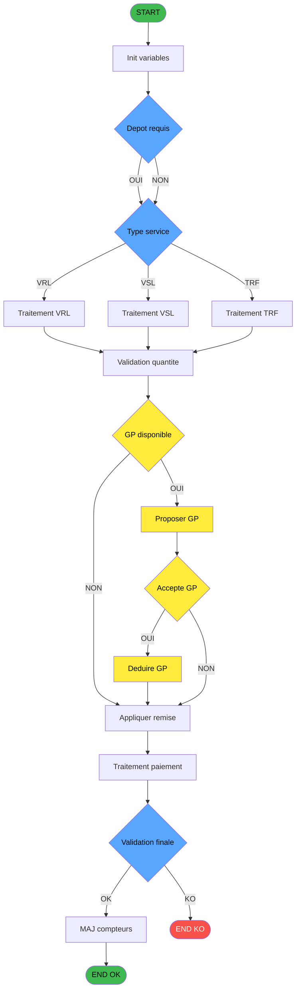

<objective>
Generer un algorigramme de flux metier haut niveau pour un programme Magic Unipaas.
L'algorigramme represente le PROCESSUS METIER (pas un dump de regles IF).
Approche hybride: script PS1 extrait les donnees → Claude synthetise le flux → resultat stocke dans la spec.
</objective>

<decisions>
## DECISIONS VALIDEES (2026-02-01)

Ces decisions ont ete validees point par point avec l'utilisateur.
Elles sont IMMUABLES sauf nouvelle session de validation explicite.

**Phase 1 (P1-P5)**: Structure, types, couleurs, patterns, methode - Valide 2026-02-01
**Phase 2 (S1-S6)**: Regles de synthese detaillees - Valide 2026-02-01

### P1 - Structure
**Decision**: Flux metier haut niveau
- 10 a 20 noeuds semantiques maximum
- Noeuds = etapes metier (pas des RM-XXX ou ID techniques)
- Labels en francais, courts et descriptifs

### P2 - Types de noeuds
| Type | Forme Mermaid | Identification |
|------|---------------|----------------|
| Terminal | `([texte])` | START, END OK, END KO (fixe) |
| Action | `[texte]` | Taches avec side-effects (UPDATE, INSERT, ecrans saisie) |
| Decision | `{texte}` | Conditions IF principales (variables cles par frequence) |
| Traitement | `[texte]` | Blocs de taches regroupes par domaine |
| Cle metier | `{texte}` + jaune | Noeuds critiques du domaine principal du programme |

### P3 - Couleurs
| Noeud | Couleur | Hex |
|-------|---------|-----|
| START | Vert | `fill:#3fb950,color:#000` |
| END OK | Vert | `fill:#3fb950,color:#000` |
| END KO | Rouge | `fill:#f85149,color:#fff` |
| Cles metier | Jaune | `fill:#ffeb3b,color:#000` |
| Decisions | Bleu | `fill:#58a6ff,color:#000` |
| Actions/Traitements | Defaut | (pas de style) |

### P4 - Patterns de branchement
4 patterns couvrent TOUS les cas:

**Pattern 1 - Binaire OUI/NON**: Les deux branches convergent vers le meme noeud suivant.
```mermaid
DECISION -->|OUI| NEXT
DECISION -->|NON| NEXT
```

**Pattern 2 - Multi-voies**: Chaque branche a un noeud action, toutes convergent.
```mermaid
GTYPE -->|VRL| VRL --> QTY
GTYPE -->|VSL| VSL --> QTY
GTYPE -->|TRF| TRF --> QTY
```

**Pattern 3 - Skip**: Branche OUI traverse des etapes, branche NON saute.
```mermaid
CHECK -->|OUI| STEP1 --> STEP2
CHECK -->|NON| AFTER
STEP2 --> AFTER
```

**Pattern 4 - Fin alternative**: OK continue, KO termine.
```mermaid
FINAL -->|OK| UPDATE --> ENDOK
FINAL -->|KO| ENDKO
```

### P5 - Methode de generation
**Hybride**: Script PS1 extraction + Claude synthese + resultat stocke
1. Script PS1 extrait les donnees structurees (JSON)
2. Claude synthetise le flux metier a partir des donnees
3. Le Mermaid genere est stocke dans la spec
4. Tant que le XML source ne change pas, le Mermaid ne change pas
</decisions>

<workflow>
## WORKFLOW DE GENERATION

### Etape 1 : Extraction automatique (Script PS1)

Executer le script d'extraction:
```powershell
.\tools\spec-generator\Extract-AlgoData.ps1 -Project "ADH" -IdePosition 237
```

Le script extrait dans un JSON:
- `tasks`: Arbre hierarchique des taches (nom, type, parent, has_form)
- `conditions`: Expressions de type CONDITION (IF principaux)
- `tables_write`: Tables en ecriture (side-effects)
- `callees`: Sous-programmes appeles
- `domain_keywords`: Mots-cles du domaine metier (depuis les noms de taches/variables)
- `parameters`: Parametres IN/OUT

### Etape 2 : Synthese par Claude (6 regles validees)

A partir du JSON, Claude construit le flux metier en 6 etapes sequentielles.

#### S1 - Identifier le domaine principal (combinaison ponderee)

Calculer un score pour chaque mot-cle candidat:
- **Nom du programme** (poids x3): Mots du champ `program`
- **Variable la plus frequente** dans les conditions (poids x2): Compter les occurrences de chaque variable dans `conditions[].decoded`
- **Tables en ecriture** (poids x1): Noms metier des tables dans `tables_write`
- **Callees** (poids x1): Noms des sous-programmes dans `callees`

Le domaine avec le score le plus eleve = domaine principal.
Exemple ADH 237: "Gift Pass" (nom programme x3) + "code article" (23/29 conditions x2) → domaine "Gift Pass / Ventes".

#### S2 - Extraire les etapes cles (hierarchique + groupement)

1. Prendre les taches **level 1** (enfants directs de la racine, `parent_isn2 = racine`)
2. **Filtrer** par pertinence metier:
   - Garder: taches avec `has_form=true` (ecrans de saisie)
   - Garder: taches avec `source_access` W/C/D (side-effects)
   - Garder: taches avec `logic_lines > 20` (logique significative)
   - Evaluer: taches Read avec nom interrogatif (ex: "garantie?", "Gratuite?")
3. **Grouper** par domaine fonctionnel en analysant les noms et les tables source:
   - Taches sur la meme table = meme domaine
   - Taches avec noms similaires = meme domaine (ex: "Blocage cloture v1" + "Deblocage cloture v1")
   - Taches RAZ/Effacement = domaine Nettoyage (regrouper)
4. Chaque groupe = **1 noeud d'algorigramme** (sauf si le groupe contient une decision majeure)
5. Reduire de N taches brutes a **10-20 noeuds** semantiques

#### S3 - Selectionner les decisions (frequence variable)

1. **Compter les occurrences** de chaque variable dans les conditions decodees
2. La variable **la plus frequente** = Decision principale
   - Si >2 valeurs distinctes testees → noeud **multi-voies** (Pattern P2)
   - Si 2 valeurs → noeud **binaire** (Pattern P1/P3/P4)
3. Les decisions secondaires viennent des **taches interrogatives** (nom finissant par "?")
4. **Eliminer** les conditions de positionnement UI:
   - exp_type N avec valeurs decimales (coordonnees DLU: 31.125, 14.875, etc.)
   - exp_type N avec calculs Fix() pour positionnement
5. **Eliminer** les conditions de formatage/label:
   - exp_type A qui construisent des chaines d'affichage (labels conditionnels)
   - Expressions qui retournent des libelles texte selon le type

#### S4 - Identifier les noeuds cles metier jaunes (intersection domaine + impact)

Les noeuds jaunes doivent remplir **2 criteres simultanes**:

1. **Lie au domaine principal** (identifie en S1)
2. **Impact metier significatif**: decision ou action qui change le resultat pour le client

Regles:
- Les decisions de **routage** restent bleues (ex: "Type service" = routage, pas jaune)
- Les operations **techniques** ne sont jamais jaunes (compteurs, nettoyage, init)
- Maximum **3-5 noeuds jaunes** par algorigramme (focus visuel)
- Les noeuds jaunes forment generalement un **cluster coherent** dans le flux

#### S5 - Appliquer les patterns de branchement (detection automatique)

Pour chaque noeud Decision, determiner le pattern:

```
1. Compter les valeurs distinctes de la variable testee
   - 2 valeurs → examiner les branches (etape 2)
   - 3+ valeurs → Pattern P2 (Multi-voies)

2. Si 2 valeurs, analyser les branches downstream:
   - Les 2 branches ont le MEME noeud suivant → P1 (Binaire convergent)
   - Une branche a des etapes supplementaires, l'autre saute → P3 (Skip)
   - Une branche mene a END KO → P4 (Fin alternative)

3. Si 3+ valeurs:
   - Chaque valeur a une branche action specifique → P2 (Multi-voies)
   - Toutes convergent vers le meme noeud suivant
```

#### S6 - Generer le Mermaid (5 passes sequentielles)

**Passe 1 - Declarer les noeuds** avec leur forme Mermaid:
- Terminal → `([label])` | Action → `[label]` | Decision → `{label}`
- IDs: prefixe court MAJUSCULES, max 10 chars, sans caracteres speciaux

**Passe 2 - Connecter les noeuds** selon le flux metier:
- START → premier noeud → ... → dernier → END
- Decisions → branches avec labels `|OUI|`, `|NON|`, ou valeurs (`|VRL|`)

**Passe 3 - Appliquer les patterns** (detectes en S5):
- P1: `D -->|OUI| NEXT` + `D -->|NON| NEXT`
- P2: `D -->|V1| A1 --> CONV` + `D -->|V2| A2 --> CONV`
- P3: `D -->|OUI| S1 --> AFTER` + `D -->|NON| AFTER`
- P4: `D -->|OK| NEXT --> ENDOK` + `D -->|KO| ENDKO`

**Passe 4 - Appliquer les styles** (couleurs P3):
- START/ENDOK: `fill:#3fb950,color:#000`
- ENDKO: `fill:#f85149,color:#fff`
- Noeuds jaunes (S4): `fill:#ffeb3b,color:#000`
- Decisions bleues: `fill:#58a6ff,color:#000`

**Passe 5 - Ajouter la legende**:
- Format: `> **Legende**: Vert = START/END OK | Rouge = END KO | Jaune = Flux [domaine] | Bleu = Decisions`

### Etape 3 : Stockage

Le Mermaid genere est insere dans la section `### 2.4 Algorigramme` de la spec.
Ajouter la legende sous le diagramme:
```markdown
> **Legende**: Vert = START/END OK | Rouge = END KO | Jaune = Flux [domaine] | Bleu = Decisions
```
</workflow>

<reference>
## EXEMPLE DE REFERENCE : ADH IDE 237

### Donnees extraites (resume)
- **Programme**: Transaction Nouv vente avec GP
- **Domaine**: Gift Pass (ventes)
- **Taches racines**: Saisie transaction, Reglements, Verif, Creation, De-Affectation, RAZ, Reaffichage, Recherche, Increment, Raz transfert
- **Tables ecriture**: 9 (reseau_cloture, prestations, mvt_prestation, compte_gm, compteurs, tempo_ecran, stat_lieu_vente, Boo_Results, Table_1037)
- **Conditions cles**: W0 imputation (VRL/VSL/TRF/PYR/ANN), GP disponible, Depot requis
- **Callees**: 20 sous-programmes

### Algorigramme genere



> **Legende**: Vert = START/END OK | Rouge = END KO | Jaune = Flux Gift Pass | Bleu = Decisions

### Pourquoi ces noeuds

| Noeud | Source | Justification |
|-------|--------|---------------|
| Init variables | Tache 237.6 RAZ | Initialisation en debut de flux |
| Depot requis | Conditions sur depot/garantie | Decision binaire affectant le contexte |
| Type service | Variable W (imputation) VRL/VSL/TRF | Decision multi-voies centrale |
| Traitement VRL/VSL/TRF | Taches specifiques par type | Branches de traitement |
| Validation quantite | Tache 237.3 verif reg restant | Controle apres traitement |
| GP disponible | Expression VG38 AND AG>0 AND EE<>'O' | Cle metier Gift Pass (jaune) |
| Proposer GP | MsgBox 'Voulez-vous utiliser GP?' | Interaction utilisateur GP (jaune) |
| Accepte GP | Reponse utilisateur OUI/NON | Decision utilisateur GP (jaune) |
| Deduire GP | Calcul HE-montant | Side-effect GP (jaune) |
| Appliquer remise | Tache 237.5.11 Gratuite? | Calcul remise |
| Traitement paiement | Tache 237.4 creation reglement | Enregistrement paiement |
| Validation finale | Tache 237.3 + retour code | Decision OK/KO finale |
| MAJ compteurs | Tache 237.7 Reaffichage infos | Mise a jour des compteurs et stats |
</reference>

<constraints>
## CONTRAINTES

- Max 20 noeuds par algorigramme
- Labels en francais, max 25 caracteres
- Pas de caracteres speciaux Mermaid dans les labels (pas de guillemets, crochets, parentheses, slashes)
- Pas de `subgraph` Mermaid
- Un seul START, un ou deux END (OK et/ou KO)
- Les noeuds cles metier (jaunes) doivent etre lies au domaine principal du programme
- Toujours inclure la legende sous le diagramme
- Le diagramme doit etre comprehensible par un analyste metier non-technique
</constraints>

<anti_patterns>
## CE QU'IL NE FAUT PAS FAIRE

| Interdit | Alternative |
|----------|-------------|
| Dump de toutes les regles IF (RM-XXX) | Synthese du flux metier |
| Plus de 20 noeuds | Regrouper les etapes similaires |
| Labels techniques (ISN, Field, VG38) | Labels metier en francais |
| Couleurs sur tous les noeuds | Seulement START/END/Decisions/Cles |
| Lineaire sans branchements | Utiliser les 4 patterns valides |
| Generer sans donnees | Toujours extraire les donnees d'abord |
</anti_patterns>
